## 概念

数据结构：顾名思义就是存放数据的结构，也可以认为是存放数据的容器;比如，你要找出1000个数字中的最大值，首先你要将1000个数字记在某些卡片上，然后对卡片进行排序。

算法(Algorithm): 解决特定问题求解步骤的描述，在计算机中表现为指令的有限序列，并且每条指令表示一个或多个操作。

> 资料：《大话设计模式》， 网络上各种博客资源

## 算法复杂度

算法的复杂性体运行该算法时的计算机所需资源的多少上，计算机资源最重要的是时间和空间（即寄存器）资源，因此复杂度分为时间和空间复杂度

### 空间复杂度

空间复杂度: 是对一个算法在运行过程中临时占用存储空间大小的量度

> 通常来说，只要算法不涉及到动态分配的空间以及递归、栈所需的空间，空间复杂度通常为O(1)

### 时间复杂度

时间复杂度: 是指执行算法所需要的计算工作量

#### 大O表示法

用`O()`来体现算法时间复杂度的记法，我们称之为大O表示法

#### 大O推导方法

1. 用常数1来取代运行时间中的所有加法常数
2. 修改后的运行次数函数中，只保留最高阶项
3. 最高项出去其相乘的常数，得到的结果就是大O阶

示例说明：
```php
<?php
/**
 * 单个循环情况
 *
 * @param $n
 */
function demoOne($n)
{
    for ($i = 0; $i < $n; $i++) {   //循环次数为n
        echo "output..." . PHP_EOL; //循环体时间复杂度为O(1)
    }
}
//时间复杂度计算: O(n * 1), 即O(n)

```

```php
/**
 * 多重循环体情况
 *
 * @param $n
 */
function demoTwo($n)
{
    for ($i = 0; $i < $n; $i++) {       //循环次数为n
        for ($j = 0; $j < $n; $j++) {   //循环次数为n
            echo "output..." . PHP_EOL; //循环体次数为O(1)
        }
    }
}
//时间复杂度计算: O(n * n * 1), 即O(n^2)
```

```php
/**
 * 多个事件复杂度情况
 *
 * @param $n
 */
function demoThree($n)
{
    //该部分时间复杂度为O(n^2)
    for ($i = 0; $i < $n; $i++) {
        for ($j = 0; $j < $n; $j++) {
            echo "output..." . PHP_EOL;
        }
    }

    //该部分时间复杂度为O(n)
    for ($j = 0; $j < $n; $j++) {   //循环次数为n
        echo "output..." . PHP_EOL; //循环体次数为O(1)
    }
}
//时间复杂度计算: max(O(n^2), O(n)), 即O(n^2)
```

算法的优先级排列如下，一般排在上面的要优于排在下面的：
- 常数复杂度：O(1)
- 对数复杂度：O(logn)
- 一次方复杂度：O(n)
- 一次方乘对数复杂度：O(nlogn)
- 乘方复杂度：O(n^2), O(n^3)
- 指数复杂度：O(2^n)
- 阶乘复杂度：O(n!)
- 无限大指数复杂度：O(n^n)

## 物理结构

物理结构： 面向计算机，指的是数据的逻辑结构在计算机中的存储形式，也被称为存储结构。（实际上物理结构就是如何把数据元素存储到计算机的存储器中)； 存储器即存储数据的工具）

## 逻辑结构

### 线性结构

线性结构；如同一条线上的蚂蚱，都是一对一的相连的，所以他们的关系是一对一。线性结构是最简单、最常用的数据结构；线性表示一种典型的线性结构

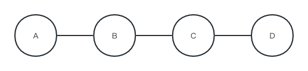

#### 线性表

线性表(Linear-list)：零个或多个数据元素的有限序列
- 线性表的顺序存储：用一段连续的存储单元依次存储线性表的数据元素。（通常使用一维数组实现顺序存储结构）
- 线性表的链式存储：除了存储本身的信息之外，还需存储一个指示后继的信息

线性表特点：
- 存在唯一的一个被称为"第一个"的元素
- 存在唯一的一个被称为"最后一个"的元素
- 除了第一个元素外，序列中的每个元素均只有一个直接前驱
- 除了最后一个元素外，序列中的每个元素均只有一个直接后继

#### 线性表的存储结构

- 顺序存储/连续存储: 计算机中的顺序存储是指在内存中用一块地址连续的空间依次存放数据元素；其特点是表中相邻的数据元素在内存中存储位置也相邻
  

  - 顺序表
  - 有序顺序表

- 链式存储/离散存储：假如我们现在要存放一些物品，但是没有足够大的空间将所有的物品一次性放下（电脑中使用链式存储不是因为内存不够先事先说明一下...，具体原因后续会说到），同时设定我们因为脑容量很小，为了节省空间，只能记住一件物品位置。此时我们很机智的找到了解决方案：存放物品时每放置一件物品就在物品上贴一个小纸条，标明下一件物品放在那里，只记住第一件物品的位置，寻找的时候从第一件物品开始寻找，通过小纸条我们可以找到所有的物品，这就是链式存储。链表实现的时候不再像线性表一样只存储数据即可，还有下一个数据元素的地址，因此先定义一个节点类(Node)，记录物品信息和下一件物品的位置，我们把物品本身叫做数据域，存储下一件物品地址信息的小纸条称为引用域。链表结构示意图如下：

  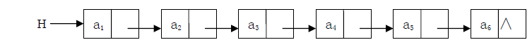
  - 单链表：指针实现
  - 双链表：指针实现
  - 循环链表：指针实现
  - 静态链表：借助数组实现

> 线性结构/线性表是一种逻辑结构，而顺序存储/顺序表以及链式存储/链表则是一种存储结构

> 顺序存储和链式存储使用场景：如果频繁使用查找，很少进行插入和删除，易采用顺序存储。如果需要频繁插入和删除，易采用链式存储

#### 顺序表

顺序表： 把线性表的结点按逻辑顺序依次存放在一组地址连续的存储单元⾥。⽤用这种⽅方法存储的线性表简称顺序表； 顺序表的基本操作，在顺序存储结构中,很容易实现线性表的⼀些操作:初始化、赋值、查找、修改、插⼊入、删除、求长度等

抽象出顺序表的一些重要操作：
  - 初始化
  - 赋值
  - 查找
  - 修改
  - 插⼊
  - 删除
  - 求长度等

顺序表代码示例：
```php
<?php
class Linear {

    private $item;

    private $count;

    /**
     * 初始化
     *
     * Linear constructor.
     */
    public function __construct()
    {
        $this->item = [];
        $this->count = count($this->item);
    }

    /**
     * 输出全部元素
     *
     * @return string
     */
    public function getAll()
    {
        for ($i = 0; $i < $this->count; $i++) {
            echo $this->item[$i] . PHP_EOL;
        }
        return PHP_EOL;
    }

    /**
     * 指定位置新增元素
     *
     * @param $index
     * @param $item
     * @return bool
     */
    public function add($index, $item)
    {
        if ($index < 0 && $index > $this->count) {
            return false;
        }
        //将指定位置和后面的元素后移一位
        for ($i = $this->count; $i > $index; $i--) {
            $this->item[$i] = $this->item[$i - 1];
        }
        $this->item[$index] = $item;
        $this->count++;
        return true;
    }

    /**
     * 更新指定位置的元素
     *
     * @param $index
     * @param $item
     * @return bool
     */
    public function update($index, $item)
    {
        if ($index < 0 && $index > $this->count) {
            return false;
        }
        $this->item[$index] = $item;
        return true;
    }

    /**
     * 删除指定位置的元素
     *
     * @param $index
     * @return bool|mixed
     */
    public function delete($index)
    {
        if ($index < 0 && $index > $this->count) {
            return false;
        }
        $value = $this->item[$index];
        //将指定位置后面的元素前移一位
        for ($i = $index; $i < $this->count - 1; $i++) {
            $this->item[$i] = $this->item[$i + 1];
        }
        $this->count--;
        return $value;
    }

    /**
     * 获取长度
     *
     * @return int
     */
    public function count()
    {
        return $this->count;
    }

    /**
     * 清空顺序表
     */
    public function clear()
    {
        $this->item = [];
        $this->count = count($this->item);
    }
}

//测试
$linear = new Linear();
echo '添加：' . PHP_EOL;
$linear->add(0, 'a');
$linear->add(1, 'b');
$linear->add(1, 'c');
$linear->getAll();
echo '更新：' . PHP_EOL;
$linear->update(1, 'd');
$linear->getAll();
echo '删除' . PHP_EOL;
$linear->delete(1);
$linear->getAll();
echo '清空' . PHP_EOL;
echo $linear->count() . PHP_EOL;
$linear->clear();
echo $linear->count() . PHP_EOL;
```

#### 链表

链表：是一种物理存储结构上非连续、非顺序的存储结构，数据元素的逻辑顺序是通过链表中的指针链接次序实现的

从内存结构看，链表的内存结构是不连续的内存空间，是将一组零散的内存块串联起来，从而进行数据存储的数据结构

链表中的每一个内存块被称为节点Node。节点除了存储数据外，还需记录链上下一个节点的地址，即后继指针next.

实际中要实现的链表的结构非常多样，比如：
- 单向，双向
- 带头，不带头
- 循环，非循环

##### 单链表

特点：
- 每个节点只包含一个指针，即后继指针
- 单链表有首节点和尾节点； 用首节点地址表示整条链表，尾节点的后继指针指向空地址NULL
- 性能： 插入和删除节点的时间复杂度为O(1), 查找的时间复杂度为O(n)

带头单链表：

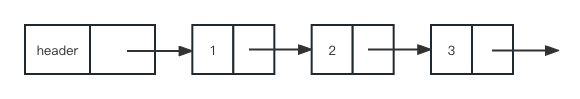

##### 双链表

特点：
- 节点除了存储数据外，还有两个指针分别指向前一个节点地址（前驱指针prev）和下一个节点地址（后继指针next）
- 首节点的前驱指针prev和尾节点的后继指针均指向空地址
- 性能：和单链表相比，存储相同的数据，需要消耗更多的存储空间。插入、删除操作比单链表效率更高O(1)级别。以删除操作为例，删除操作分为2种情况：给定数据值删除对应节点和给定节点地址删除节点。对于前一种情况，单链表和双向链表都需要从头到尾进行遍历从而找到对应节点进行删除，时间复杂度为O(n)。对于第二种情况，要进行删除操作必须找到前驱节点，单链表需要从头到尾进行遍历直到p->next = q，时间复杂度为O(n)，而双向链表可以直接找到前驱节点，时间复杂度为O(1)

双链表：

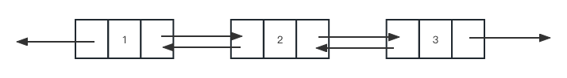


##### 双向链表实现

前面已经说到各个链表的特点，这里用代码的方式实现双向链表

```php
<?php

/**
 * 节点类
 *
 * Class Node
 */
class Node
{
    /** @var 数据 */
    public $data;

    /** @var 前驱 */
    public $prev;

    /** @var 后继 */
    public $next;

    public function __construct($data)
    {
        $this->data = $data;
    }
}

/**
 * 双向链表类
 *
 * Class DoubleForLinklist
 */
class DoubleForLinklist
{
    /** @var 首节点 */
    private $head;

    /** @var 尾节点 */
    private $tail;

    /** @var 链表长度 */
    private $len;

    /**
     * 初始化链表
     *
     * DoubleForLinklist constructor.
     */
    public function __construct()
    {
    }

    /**
     * 获取单链表长度
     */
    public function getLen(): int
    {
        return $this->len;
    }

    /**
     * 获取全部节点
     *
     * @return string
     */
    public function getAll(): string
    {
        $str = "";
        //获取首节点
        $node = $this->head;

        //计数索引
        $countIndex = 0;
        //从首节点遍历所有节点
        while ($node instanceof Node) {
            $str .= "{$countIndex}: {$node->data}" . PHP_EOL;
            $node = $node->next;
            $countIndex++;
        }
        return $str;
    }

    /**
     * 查找节点（这里根据索引获取，也可以用值获取）
     *
     * @param int $index    索引
     * @return 后继|首节点|null
     */
    public function get(int $index)
    {
        //计数
        $countIndex = 0;
        //头节点
        $node = $this->head;
        //从头节点循环获取指定索引对应的结点
        while ($node instanceof Node) {
            if ($countIndex == $index) {
                return $node;
            }
            $node = $node->next;
            $countIndex++;
        }
        return null;
    }

    /**
     * 添加节点
     *
     * @param $item 元素
     * @param null $index 索引
     * @return bool
     * @throws Exception
     */
    public function add($item, $index = null)
    {
        //检查边界
        $this->_checkIndex($index);
        //创建节点
        $node = new Node($item);
        if ($index === null) {
            //索引为null，表示从尾部添加
            if ($this->tail instanceof Node) {
                //链表尾节点是一个节点，说明链表中已经存在节点
                $node->prev = $this->tail;  //节点前驱 == 链表当前尾节点
                $this->tail->next = $node;  //尾节点的后继指针 == 当前节点
                $this->tail = $node;        //此时链表尾节点 == 当前节点
            } else {
                //链表尾节点不是一个节点，说明链表中没有元素，这时首节点和尾节点相同
                $this->head = $node;
                $this->tail = $node;
            }
        } else {
            //从指定索引添加
            //获取旧的节点
            $oldNode = $this->get($index);
            //当旧节点是Node的实例时替换旧节点
            if ($oldNode instanceof Node) {
                if ($oldNode->prev instanceof Node) {
                    //当旧节点的前驱是一个节点时，旧节点的前驱的后继应该更换为当前节点
                    $oldNode->prev->next = $node;
                }
                $node->next = $oldNode; //当前节点的后继指针 为 旧节点
                $node->prev = $oldNode->prev;   //当前节点的前驱 为 旧节点的前驱
                $oldNode->prev = $node; //旧节点的前驱 为 当前节点
            }

            //判断是否头节点
            if ($node->prev === null) {
                $this->head = $node;
            }

            //判断是否尾节点
            if ($node->next === null) {
                $this->tail = $node;
            }
        }
        $this->len++;
        return true;
    }

    /**
     * 修改节点
     *
     * @param $index
     * @param $item
     * @return bool
     * @throws Exception
     */
    public function update($index, $item)
    {
        $node = $this->get($index);
        if (!($node instanceof Node)) {
            throw new \Exception("节点不存在");
        }
        $node->data = $item;
        return true;
    }

    /**
     * 删除节点
     *
     * @param $index
     * @return bool
     * @throws Exception
     */
    public function delete($index)
    {
        $this->_checkIndex($index);
        $node = $this->get($index);
        //存在前驱
        if ($node->prev instanceof Node) {
            if ($node->next instanceof Node) {
                //当该节点的后继还是节点的情况，该节点的前驱节点的后继变为该节点的后继
                $node->prev->next = $node->next;
            } else {
                //当该节点的后继不是是节点的情况说明当前是尾节点，值为null
                $node->prev->next = null;
            }
        }

        //存在后继
        if ($node->next instanceof Node) {
            if ($node->prev instanceof null) {
                //当该节的前驱还是节点的情况, 该节点的后继节点的前驱变为该节点的前驱
                $node->next->prev = $node->prev;
            } else {
                //当该节的前驱不是节点的情况说明当前是首节点，值为null
                $node->next->prev = null;
            }

        }
        unset($node);
        $this->len--;
        return true;
    }

    /**
     * 获取节点索引值
     */
    public function getIndex($item)
    {
        $node = $this->head;
        $countIndex = 0;
        while ($node instanceof Node) {
            if ($node->data == $item) {
                return $countIndex;
            }
            $node = $node->next;
            $countIndex++;
        }
        //未找到
        return -1;
    }

    /**
     * 检查索引是否越界
     *
     * @param int $index
     * @throws Exception
     */
    private function _checkIndex($index)
    {
        if ($index && $index >= $this->len) {
            throw new \Exception("index越界");
        }
    }
}

//tests
try{
    $linklist = new DoubleForLinklist();
    $linklist->add('A');                    //末尾插入元素
    $linklist->add('B');                    //末尾插入元素
    $linklist->add('C');                    //末尾插入元素
    $linklist->add('D', 0);          //更换首节点
    $linklist->add('E', 2);          //中间插入节点
    var_dump($linklist->get(2));                 //查看指定索引节点

    var_dump($linklist->getAll());               //查看全部节点
    $linklist->delete(1);                  //删除接节点
    var_dump($linklist->getAll());

    $linklist->update(1, "EE");      //更改指定索引位置的内容
    var_dump($linklist->getAll());

    echo "链表长度:" . $linklist->getLen() . PHP_EOL;                         //获取链表长度

    echo "获取指定内容索引：" . $linklist->getIndex("EE") . PHP_EOL;

} catch (\Exception $e) {
    echo "code：" . $e->getCode() . PHP_EOL;
    echo "msg: " .  $e->getMessage() . PHP_EOL;
    echo "line: " . $e->getLine() . PHP_EOL;
    echo "trace: " . $e->getTraceAsString() . PHP_EOL;
}
```

##### 循环链表

特点：
- 单向循环链表：除了尾节点的后继指针指向首节点的地址外均与单链表一致
- 双向循环链表：首节点的前驱指针指向尾节点，尾节点的后继指针指向首节点
- 适用于存储有循环特点的数据，比如约瑟夫问题

循环单链表：

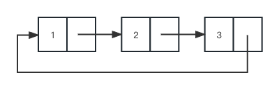

带头双向循环链表：

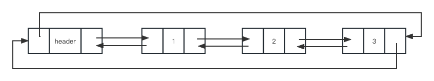

##### 静态链表

静态链表： 分配一整片连续的内存空间，各个结点集中安置，逻辑结构上相邻的数据元素，存储在指定的一块内存空间中，数据元素只允许在这块内存空间中随机存放，这样的存储结构生成的链表称为静态链表。也就是说静态链表是用数组来实现链式存储结构，静态链表实际上就是一个结构体数组

#### 数组

数组(Array): 数组是一种线性数据结构。它用一组连续的内存空间，来存储一组具有相同类型的数据。

特点：
- 随机访问性强，查找速度快
- 插入和删除效率低: 当插入一个元素的时候，那么后续所有元素都需要向后挪一位; 删除则后续所有元素向前移一位；
- 内存空间要求高，必须有足够的连续内容空间，可能浪费内存
- 数组大小固定，不能动态扩展

#### 栈

栈(Stack): 先进后出(LIFO, Last In First Out)，先进队的数据最后才出来。在英文的意思里，stack 可以作为一叠的意思，这个排列是垂直的，你将一张纸放在另外一张纸上面，先放的纸肯定是最后才会被拿走，因为上面有一张纸挡住了它;


栈可以分为：
- 顺序栈：采用顺序存储的栈成为顺序栈
- 链式栈：采用链式存储的栈成为顺序栈

一些概念：
- 空栈：不含元素的空表
- 入栈：插入元素的操作
- 出栈：删除栈顶元素的操作
- 栈顶：表尾端
- 栈底：表头端

可以使用数组或链表来实现； 这里选用数组的方式实现：
```php
<?php
/**
 * 栈(数组方式)
 *
 * Class Stack
 */
class Stack
{
    /** @var int 容量 */
    private $cap;

    /** @var array 栈 */
    private $stack;

    /** @var 最新元素索引 */
    private $top = -1;

    /**
     * 初始化
     *
     * Stack constructor.
     */
    public function __construct(int $cap)
    {
        $this->cap = $cap;
        $this->stack = [];
    }

    /**
     * 入栈
     */
    public function push($item)
    {
        if ($this->top >= $this->cap) {
            throw new \Exception("stack is full.");
        }
        $this->top++;
        $this->stack[$this->top] = $item;
        return true;
    }

    /**
     * 出栈
     */
    public function pop()
    {
        if ($this->top < 0) {
            throw new \Exception("stack is empty.");
        }
        $item = $this->stack[$this->top];
        unset($this->stack[$this->top]);
        $this->top--;
        return $item;
    }

    /**
     * 获取
     */
    public function getAllByStr()
    {
        if ($this->top < 0) {
            throw new \Exception("stack is empty.");
        }
        $str = '';
        for ($i = 0; $i < $this->cap; $i++) {
            $str .= $this->stack[$i] . PHP_EOL;
        }
        return $str;
    }
}

//test
try {
    $stack = new Stack(5);
    $stack->push('A');
    $stack->push('B');
    $stack->push('C');
    $stack->push('D');
    $stack->push('E');
    //$stack->push('F');  //超出容量

    var_dump($stack->getAllByStr());

    $stack->pop();
    $stack->pop();
    $stack->pop();
    $stack->pop();
//    $stack->pop();

    var_dump($stack->getAllByStr());
} catch (\Exception $e) {
    echo "code：" . $e->getCode() . PHP_EOL;
    echo "msg: " .  $e->getMessage() . PHP_EOL;
    echo "line: " . $e->getLine() . PHP_EOL;
    echo "trace: " . $e->getTraceAsString() . PHP_EOL;
}
```

#### 队列

队列(Queue): 先进先出(FIFO, First-In-First-Out)，先进队的数据先出来。在英文的意思里，queue 和现实世界的排队意思一样，这个排列是水平的，先排先得。

队列：
- 普通队列
- 双端队列
- 阻塞队列
- 并发队列
- 阻塞并发队列


队列可以用数组实现也可以用链表实现， 这里用数组实现：
```php
<?php

/**
 * 队列(数组方式)
 *
 * Class Queue
 */
class Queue
{
    /** @var array 队列 */
    private $queue;

    /**
     * 初始化
     *
     * Stack constructor.
     */
    public function __construct()
    {
        $this->queue = [];
    }

    /**
     * 队列尾部添加元素
     */
    public function enqueue($item)
    {
        $this->queue[$this->getLen()] = $item;
        return true;
    }

    /**
     * 队列头部取出元素
     */
    public function dequeue()
    {
        $this->isEmpty();

        $item = $this->queue[0];
        unset($this->queue[0]);
        $this->queue = array_values($this->queue);
        return $item;
    }

    /**
     * 获取长度
     *
     * @return int
     */
    public function getLen()
    {
        return count($this->queue);
    }

    /**
     * 获取
     */
    public function getAllByStr()
    {
        $this->isEmpty();

        $str = '';
        for ($i = 0; $i < $this->getLen(); $i++) {
            $str .= $this->queue[$i] . PHP_EOL;
        }
        return $str;
    }

    /**
     * 判断是否为空
     *
     * @throws Exception
     */
    public function isEmpty()
    {
        if (empty($this->queue)) {
            throw new \Exception('queue is empty.');
        }
    }
}


//test
try {
    $queue = new Queue();
    $queue->enqueue('A');
    $queue->enqueue('B');
    $queue->enqueue('C');
    $queue->enqueue('D');
    $queue->enqueue('E');

    var_dump($queue->getAllByStr());

    $queue->dequeue();
    $queue->dequeue();
    $queue->dequeue();
    $queue->dequeue();

    var_dump($queue->getAllByStr());
} catch (\Exception $e) {
    echo "code：" . $e->getCode() . PHP_EOL;
    echo "msg: " .  $e->getMessage() . PHP_EOL;
    echo "line: " . $e->getLine() . PHP_EOL;
    echo "trace: " . $e->getTraceAsString() . PHP_EOL;
}
```

### 树形结构(树)

#### 概念

树形结构: 如同树的树枝一样，一根树枝上有多个分支，所以为一对多的关系

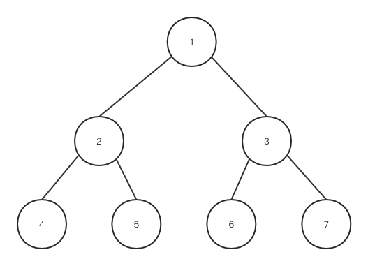

一些概念：
- 结点(node)：表示树中的元素，包括数据项及若干指向其子树的分支
- 结点的度(degree)：结点拥有的子树数
- 叶子(leaf)——度为0的结点
- 孩子(child)——结点子树的根称为该结点的孩子
- 双亲(parents)——孩子结点的上层结点叫该结点的双亲
- 兄弟(sibling)——同一双亲的孩子
- 叶结点/终端结点：度为0的结点
- 树的度：树内各结点的度的最大值
- 结点的层次(level)——从根结点算起，根为第一层，它的孩子为第二层……
- 深度(depth)——树中结点的最大层次数
- 森林(forest)——m(m>0)棵互不相交的树的集合

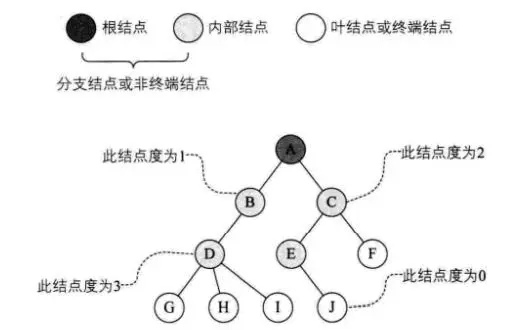

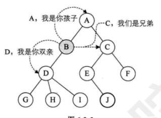

树的深度/高度：


#### 二叉树

二叉树(Binary Tree)是n(n>=0)个结点的有限集合，该集合或者为空集(称为空二叉树)，或者由一个根结点和两颗互不相交的、分别称为根结点左子树和右子树的二叉树组成

特点：
- 每个结点最多有2颗子树，所以二叉树中不存在度大于2的结点
- 左子树和右子树是有顺序的，次序不能任意颠倒

二叉树具有五种基本形态：
1. 空二叉树
2. 只有一个根结点
3. 根结点只有左子树
4. 根结点只有右子树
5. 根结点既有左子树也有右子树

#### 特殊二叉树

- 斜树：所有结点都只有左子树或者右子树的二叉树；前者成为左斜树，后者成为右斜树
- 满二叉树：在一颗二叉树中，所有分支结点都存在左子树和右子树，并且所有叶子都在同一层上，这样的二叉树成为满二叉树
- 完全二叉树：是指除了最后一层之外，其他每一层的每个节点都是同时含有左右子树。当最后一层的每个节点也都含有左右子树的时候，则为满二叉树，同时也是完全二叉树。如果最后一层不满的时候，非满结点（即没有满足同时拥有左右子树的结点）的子树全部集中在左子树的时候，那也是一个完全二叉树;

满二叉树：
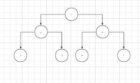

完全二叉树：
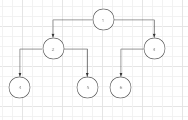

非完全二叉树：
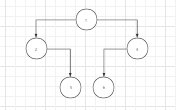

非完全二叉树：
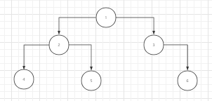


#### 二叉树特性

1. 在二叉树的第 i 层上至多有 2^(i-1) 个结点
2. 深度为 k 的二叉树至多有 2^k-1 个结点(k>1)
3. 对任何一棵二叉树T，如果其终端结点数为 n0，度为 2 的结点数为 n2，则 n0=n2+1
4. 具有 n 个结点的完全二叉树的深度为 ㏒₂n 向下取整再加 1
5. 如果一个有 n 个结点的完全二叉树从上到下，从左到右依次编号，则对任意结点有
    - 若 i=1，则结点i是二叉树的根，无双亲，如果i>1,则其双亲是i/2向下取整。
    - 如果 2i>n，则结点i无左孩子，否则其左孩子是结点2i。
    - 如果 2i+1>n，则结点i无右孩子，否则其右孩子是结点2i+1.

#### 二叉树的存储方式

##### 二叉树顺序存储结构

> 实现方式，按满二叉树的结点层次编号，依次存放二叉树中的数据元素； 

其中数组下标要体现结点之间的逻辑关系：

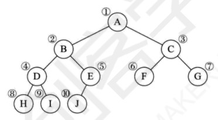

上面的二叉树对应到数组中，如下：

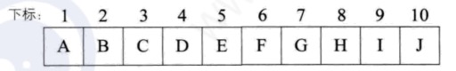

> 缺点： 浪费空间，适用于存满二叉树和完全二叉树


##### 二叉链表

> 二叉树每个结点最多有两个孩子，所以为它设计一个数据域和两个指针域

如图：

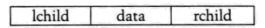

该二叉树的结构示意图，如：


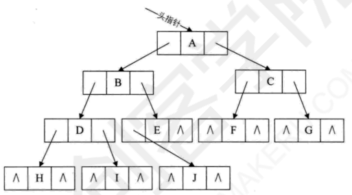


#### 遍历二叉树

二叉树的遍历是指从各个结点出发，按照某种次序依次访问二叉树中所有结点，使得每个结点被访问一次且仅被访问一次

- 广度优先遍历
    - 层序遍历
- 深度优先遍历
    - 前序(先序)遍历
    - 中序遍历
    - 后序遍历

##### 建立二叉树

遍历之前需要先建立二叉树，结构如图:

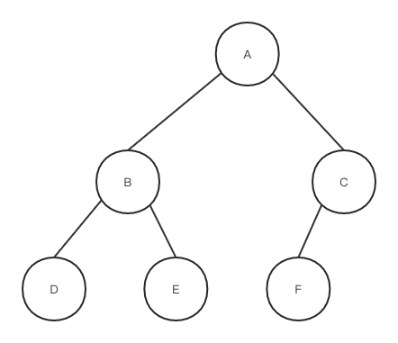

代码如下：
```php
class Node
{
    public $data;

    public $childLeft;

    public $childRight;

    public function __construct($data)
    {
        $this->data = $data;
        $this->childLeft = null;
        $this->childRight = null;
    }
}
//创建二叉树
$a = new Node("A");
$b = new Node("B");
$c = new Node("C");
$d = new Node("D");
$e = new Node("E");
$f = new Node("F");

$a->childLeft = $b;
$a->childRight = $c;
$b->childLeft = $d;
$b->childRight = $e;
$c->childLeft = $f;
```

##### 前序遍历

先访问根结点，然后前序遍历左子树，再前序遍历右子树

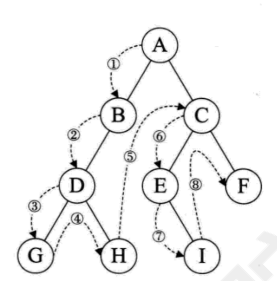

##### 中序遍历

先中序遍历根结点的左子树，然后是访问根结点，最后中序遍历右子树

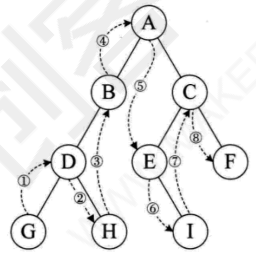

##### 后序遍历

从左到右先叶子后结点的方式遍历访问左右子树，最后访问根结点

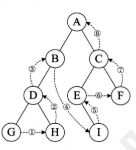

##### 层序遍历

从树的第一层，也就是根结点开始访问，从上而下逐层遍历，在同一层中，按从左到有的顺序对结点逐个访问

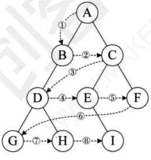

##### 上面几种遍历代码示例

```php
<?php
class Node
{
    public $data;

    public $childLeft;

    public $childRight;

    public function __construct($data)
    {
        $this->data = $data;
        $this->childLeft = null;
        $this->childRight = null;
    }
}

class Ergodic
{
    /**
     * 前序遍历：先访问根结点，然后前序遍历左子树，再前序遍历右子树
     */
    public function preOrder($tree)
    {
        if ($tree instanceof Node) {
            //先访问根结点
            echo $tree->data . ' ';
            //前序遍历左子树
            $this->preOrder($tree->childLeft);
            //前序遍历右子树
            $this->preOrder($tree->childRight);
        }
    }

    /**
     * 中序遍历：先中序遍历根结点的左子树，然后是访问根结点，最后中序遍历右子树
     */
    public function midOrder($tree)
    {
        if ($tree instanceof Node) {
            //先中序遍历根结点的左子树
            $this->midOrder($tree->childLeft);
            //访问根结点
            echo $tree->data . " ";
            //中序遍历右子树
            $this->midOrder($tree->childRight);

        }
    }

    /**
     * 后序遍历：从左到右先叶子后结点的方式遍历访问左右子树，最后访问根结点
     */
    public function endOrder($tree)
    {
        if ($tree instanceof Node) {
            //后序遍历左子树
            $this->endOrder($tree->childLeft);
            //后序遍历右子树
            $this->endOrder($tree->childRight);
            //最后访问根结点
            echo $tree->data . " ";
        }
    }

    /**
     * 层序遍历：从树的第一层，也就是根结点开始访问，从上而下逐层遍历，在同一层中，按从左到有的顺序对结点逐个访问
     */
    public function levelOrder($tree)
    {
        $queue = [];
        //向队列尾部添加元素
        array_push($queue, $tree);
        while (!empty($queue)) {
            //从队列头部取出元素
            $node = array_shift($queue);
            echo $node->data . " ";
            if ($node->childLeft instanceof Node) {
                array_push($queue, $node->childLeft);
            }

            if ($node->childRight instanceof Node) {
                array_push($queue, $node->childRight);
            }
        }
    }
}

//创建二叉树
$a = new Node("A");
$b = new Node("B");
$c = new Node("C");
$d = new Node("D");
$e = new Node("E");
$f = new Node("F");

$a->childLeft = $b;
$a->childRight = $c;
$b->childLeft = $d;
$b->childRight = $e;
$c->childLeft = $f;

$ergodic = new Ergodic();
$ergodic->preOrder($a); //结果：A B D E C F
echo PHP_EOL;
$ergodic->midOrder($a); //结果：D B E A F C
echo PHP_EOL;
$ergodic->endOrder($a); //结果：D E B F C A
echo PHP_EOL;
$ergodic->levelOrder($a); //结果：A B C D E F
echo PHP_EOL;
```

#### 树，森林与二叉树转化

##### 树转化为二叉树

树转换为二义树的规则:每个结点左指针指向它的第一个孩子，右指针指向它在树中的相邻右兄弟，这个规则又称“左孩子右兄弟”。由于根结点没有兄弟，所以对应的二叉树没有右子树。

步骤：
1. 加线。在苏欧欧兄弟节点之间加一条连线
2. 去线。对树中每个结点，只保留它与第一个孩子结点的连线，删除它与其他孩子结点之间的连线
3. 层次调整。以树的根结点为轴心，将整颗树顺时针旋转一定的角度，使之结构层次分明。注意第一个孩子是二叉树结点的左孩子，兄弟转换过来的孩子是结点的右孩子

图示例：

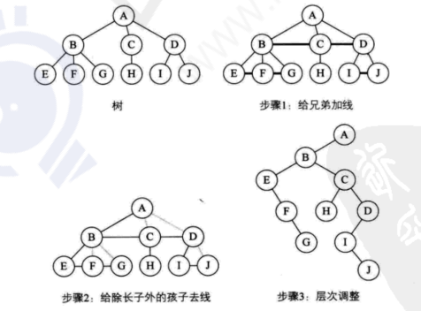

##### 森林转换为二叉树
森林有若干颗数组成，所以完全可以理解为，森林中的每一颗树都是兄弟，可以按照兄弟的处理办法来操作

步骤：
1. 把每个数转换为二叉树
2. 第一颗二叉树不动， 从第二颗二叉树开始，依次把后一颗二叉树作为根结点作为前一颗二叉树的根结点的右孩子，用线连接起来。当所有的二叉树连接起来后就得到了由森林转换来的二叉树

图示：


##### 二叉树转换为树

二叉树转换为树就是树转换为二叉树的逆过程

1. 加线。若某结点的左孩子结点存在，则将这个左孩子的右孩子结点、右孩子的右孩子结点等依次类推的右孩子结点都作为此结点的孩子。将该结点与这些右孩子结点用线连接起来
2. 去线。删除原二叉树中所有结点与其右孩子结点的连线
3. 层次调整。使之结构层次分明

图示：

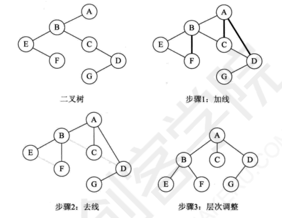

##### 二叉树转换为森林

首先如何判断一颗二叉树能否转换成森林或树，标准很简单，那就是只要看这颗二叉树的根结点有没有右孩子，有就是森林，没有就就是一颗树

转换步骤：
1. 从根结点开始，若右孩子存在，则把与右孩子结点的连线删除，再查看分离后的二叉树，若右孩子存在，则连线删除，直到所有右孩子连线都删除为止，得到分离的二叉树
2. 再将每颗分离的二叉树转换为树即可

图示：

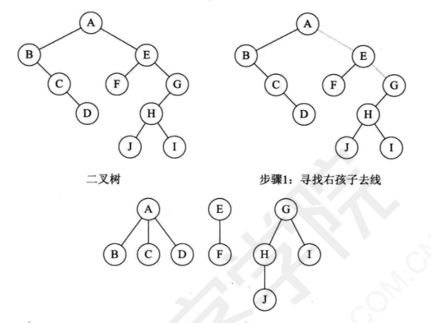

##### 树与森林的遍历

树的遍历：
1. 一种是先根遍历树，即先访问树的根结点，然后依次先根遍历根的每棵子树
2. 另一种是后根遍历，即先依次后根遍历每棵子树，然后再访问根结点

森林的遍历也分为两种方式:
1. 前序遍历:先访问森林中第一棵树的根结点，然后再依次先根遍历根的每棵子树，再依次用同样方式遍历除去第一棵树的剩余树构成的森林
2. 后序遍历:是先访问森林中第一棵树，后根遍历的方式遍历每棵子树，然后再访问根结点，再依次同样方式遍历除去第一棵树的剩余树构成的森林

#### 哈夫曼树和应用

##### 概念

- 路径长度：哈夫曼说，从树中一个结点到另一个结点之间的分支构成两个结点之间的路径，路径上的分支数目称作路径长度
- 路径长度之和：树的路径长度就是从树根到每一节点的路径长度之和
- 权：在许多应用中，树中结点常常被赋予一个表示某种意义的数值，称为该结点的权
- 带权路径长度(WPL)： 从树的根到任意结点的路径长度(经过的边数)与该结点上权值的乘积，称为该结点的带权路径长度
- 哈夫曼树/最优二叉树：在含有n个带权叶结点的二叉树中，其中带权路径长度(WPL)最小的二叉树称为哈夫曼树，也称最优二叉树

示例：

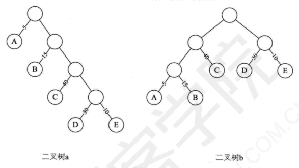

计算WPL：

a: `WPL = 5 * 1 + 15 * 2 + 40 * 3 + 30 * 4 + 10 * 4 = 315`

b: `WPL = 5 * 3 + 15 * 3 + 40 * 2 + 30 * 2 + 10 * 2 = 220` 

##### 哈夫曼树的构造

注意，上面只是计算出带权路径长度，并不是哈夫曼树，那怎么构造哈夫曼树呢， 步骤如下：
1. 根据给定的n个权值{W1, W2, ··· ,Wn}构成n棵二叉树的集合 F={T1, T2,···, Tn}, 其中每棵二叉树Ti中只有一个带权为 Wi根结点，其左右子树均为空
2. 在F中选取两棵根结点的权值最小的树作为左右子树构造一棵新的二叉树，且置新的二叉树的根结点的权值为其左右子树上根结点的权值之和。
3. 在F中删除这两棵树，同时将新得到的二叉树加入F中。
4. 重复 2和3 步骤，直到 F 只含一棵树为止。这棵树便是赫夫曼树。

图示：

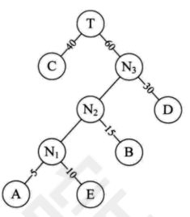

计算WPL:

`WPL = 40 * 1 + 30 * 2 + 15 * 3 + 10 * 4 + 5 * 4 = 205`

计算出来的WPL值为205和上面的WPL值220相比少了15。 显然此时构造出来的二叉树才是最优的哈夫曼树

##### 哈夫曼编码

哈夫曼当前研究这种最优树的目的是为了解决当年远距离通信(主要是电报)的数据传输的最优化问题

哈夫曼编码是一种被广泛应用而且非常有效的数据压缩编码


比如我们有一段文字内容为“BADCADFEED”要网络传输给别人，显然用二进制为数字 (0 和 1) 来表示是很自然的想法。我们现在这段文字只有六个字母 ABCDEF， 那么我们可以用相应的二进制数据表示：

|字母|A|B|C|D|E|F|
|-|-|-|-|-|-|-|
|二进制字符|000|001|010|011|100|101|

这样真正传输的数据就是编码后的“001000011010000011101100100011”，对方接收时可以按照 3 位一分来译码。如果一篇文章很长，这样的二进制串也将非常的可怕。而且事实上，不管是英文、中文或是其他语言，字母或汉字的出现频率是不相同的，比如英语中的几个元音字母“a e i o u”，中文中的“的了有在”等汉字都是频率极高。

假设六个字母的频率为 A 27，B 8，C 15，D 15，E 30，F 5，合起来正好是100%。那就意味着，我们完全可以重新按照赫夫曼树来规划它们。
图 6-12-9 左图为构造赫夫曼树的过程的权值显示。右图为将权值左分支改为 0右分支改为 1 后的赫夫曼树

下面左图为构造哈夫曼树的过程的权值显示。右图为将权值左分支改为0,有分支改为1后哈夫曼树

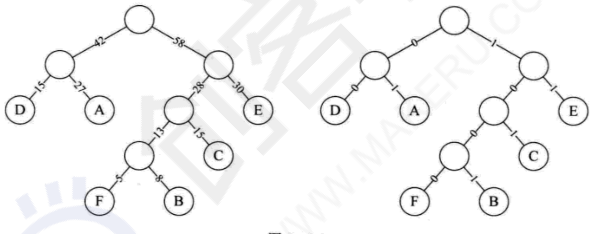

此时，我们对这6个字母用其从树根到叶子所经过路径的0或1来编码：

|字母|A|B|C|D|E|F|
|-|-|-|-|-|-|-|
|二进制字符|01|1001|101|00|11|1000|

我们将文字内容为“BADCADFEED”再次编码，对比可以看到结果串变小了
- 原编码二进制串: 001000011010000011101100100011    (共 30 个字符)
- 新编码二进制串: 1001010010101001000111100         (共 25 个字符)

也就是说，我们的数据被压缩了，节约了大约17%的存储或传输成本。随着字符的增加和多字符权重的不同，这种压缩会更加显出其优势

### 图形结构(图)

在线性表中，数据元素之间是被串起来的，仅有线性关系，每个数据元素只有一个直接前驱和一个直接后继。在树形结构中，数据元素之间有着明显的层次关系，并且每一层上的数据元素可能和下一层中多个元素相关，但只能和上一层中一个元素相关。图是一种较线性表和树更加复杂的数据结构。在图形结构中，结点之间的关系可以是任意的，图中任意两个数据元素之间都可能相关。

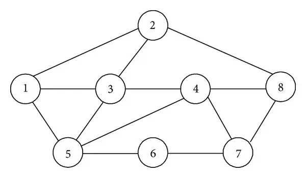


图(Graph)是由顶点的有穷非空集合V(G)和顶点之间边的集合E(G)组成，通常表示为: `G=(V, E)`，其中，G表示个图，V是图G中顶点的集合，E是图G中边的集合。若`V={v1,v2,...,vn}`，则用`∣V∣`表示图G中顶点的个数，也称图G的阶，`E={(u,v)∣u ∈ V,v ∈ V}`，用∣E∣表示图G中边的条数。

> 线性表中我们把数据元素叫元素，树中将数据元素叫结点，在图中数据元素，我们则称之为顶点(Vertex)

> 注意:线性表可以是空表，树可以是空树，但图不可以是空图。就是说，图中不能一个顶点也没有，图的顶点集V一定非空，但边集E可以为空，此时图中只有顶点而没有边。

#### 各种定义

- 无向图

无向边：若顶点v<sub>i</sub>到v<sub>j</sub>之间的边没有方向，则称这条边为无向边(Edge);用无序偶对(v<sub>i</sub>, v<sub>j</sub>)来表示。

无向图(Undirected graphs)：如果图中任意两个顶点之间的边都是无向边，则称该图为无向图。

图示：

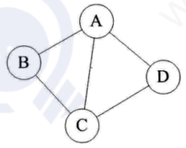

上面的无向图G<sub>1</sub>来说，G<sub>1</sub>=(V<sub>1</sub>, {E<sub>1</sub>}), 其中顶点集合V<sub>1</sub>={A,B,C,D}; 边集合E<sub>1</sub>={(A,B), (B,C), (C,D), (D,A), (A,C)}

##### 有向图

有向边： 若从顶点v<sub>i</sub>到v<sub>j</sub>的边有方向，则称这条边为有向边，也称为弧(Arc)； 用有序偶<v<sub>i</sub>,  v<sub>j</sub>>来表示，v<sub>i</sub>称为弧尾， v<sub>j</sub>称为弧头。

有向图： 如果图中任意俩个顶点之间的边都是有向边，则称改图为有向图(Directed graphs)

图示：

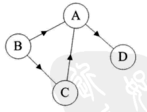

连接顶点A到D的有向边就是弧，A是弧尾，D是弧头，<A, D>表示弧，注意不能写成<D, A>

对于上面的有向图G<sub>2</sub>来说， G<sub>2</sub>=(V<sub>2</sub>,{E<sub>2</sub>}), 其中顶点集合V<sub>2</sub>={A,B,C,D};弧集合E<sub>2</sub>={<A,D>, <B,A>, <C,A>, <B,C>}

##### 简单图

简单图：若不存在订单到其自身的边，且同一条边不重复出现，则称这样的图为简单图

##### 无向完全图

在无向图中，如果任意两个顶点之间都存在边，则称该图为无向完全图

图示：

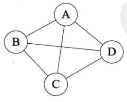

##### 有向完全图

在有向图中，如果任意两个顶点之间都存在方向互为相反的两条弧，则称该图为有向完全图

图示：

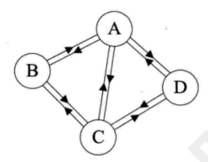

##### 稠密图、稀疏图

有很少条边或弧的图标称为稀疏图，反之称为稠密图；这里的稀疏和稠密是相对的；

##### 权和网

权(Weight)： 在一个图中边或弧具有与它相关的数字，这种与图的边或弧相关的数叫做权

网(Network)： 这种带权的图通常称为网;

图示：

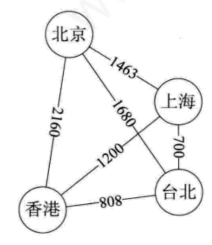

##### 子图

假设有两个图`G=(V,{E})`和 G<sup>'</sup>=(V<sup>'</sup>, {E<sup>'</sup>}) ,如果 V<sup>'</sup> 是V的子集，且 E<sup>'</sup> 是E的子集，则称G<sup>'</sup>是G的子图。若有满足 V(G<sup>'</sup>) = V(G) 的子图G<sup>'</sup>, 则称其为G的生成子图。

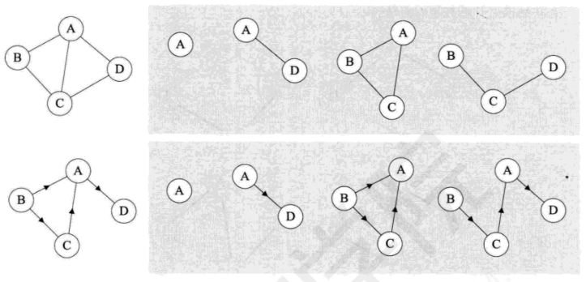

##### 顶点与边间关系

- 对于无向图`G=(V,{E})`，如果边 (v,v<sup>'</sup>) ∈ E , 这称顶点v和v<sup>'</sup>互为邻接点, 即v和v<sup>'</sup>相邻接；边(v, v<sup>'</sup>)依附于顶点v和v<sup>'</sup>。顶点v的度是和v相关联的边的数目，记为TD(v);

- 对于有向图`G=(V,{E})`， 如果弧 <v,v<sup>'</sup>> ∈ E, 则称顶点v邻接到顶点v<sup>'</sup>, 顶点v<sup>'</sup>邻接自顶点v。弧 <v, v<sup>'</sup>> 和顶点v, v<sup>'</sup>相关联。以顶点v为头的弧数目称为v的入度(InDegree), 记为ID(v)； 以v为尾的弧数目称为v的出度(OutDegree), 记为OD(v)；顶点v的度为`TD(v) = ID(v) + OD(v)`

##### 连通图、连通分量

- 连通图和非连通图：在无向图中，若从顶点v到顶点w有路径存在，则称v和w是连通的。若图G中任意两个顶点都是连通的，则称图G为连通图，否则称为非连通图

连通图：

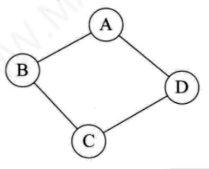

- 连通分量：无向图中的极大连通子图称为连通分量
    - 要是子图
    - 子图要连通的
    - 连通子图含有极大定点数
    - 具有极大顶点数的连通子图包含依附于这些顶点的所有边

图示：

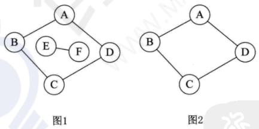

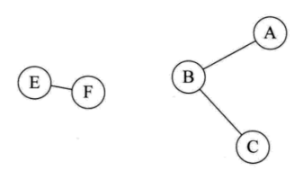

图1 是一个无向非连通图。但是它有两个连通分量，即图2和图3; 而图4，尽管是图1的子图，但是它却不满足连通子图的极大顶点数(图2满足)。因此它不是图1的无向图的连通分量。

##### 强连通图、强连通分量

强连通: 在有向图中，若从顶点v到顶点w和从顶点w到项点v之间都有路径,则称这两个顶点是强连通的。

强连通图: 若图中任何一对顶点都是强连通的，则称此图为强连通图。

强连通分量: 有向图中的极大强连通子图称为有向图的强连通分量

> 注意： 强连通图、强连通分量只是针对有向图而言

图G<sub>1</sub>的强连通分量如下图所示：

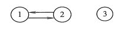

##### 生成树、生成森林

生成树： 连通图的生成树是一个极小的连通子图，它含有图中全部的n个顶点，但只有足以构成一棵树的n-1条边；对生成树而言，若砍去它的一条边，则会变成非连通图，若加上一条边则会形成一个回路. 在非连通图中，连通分量的生成树构成了非连通图的生成森林

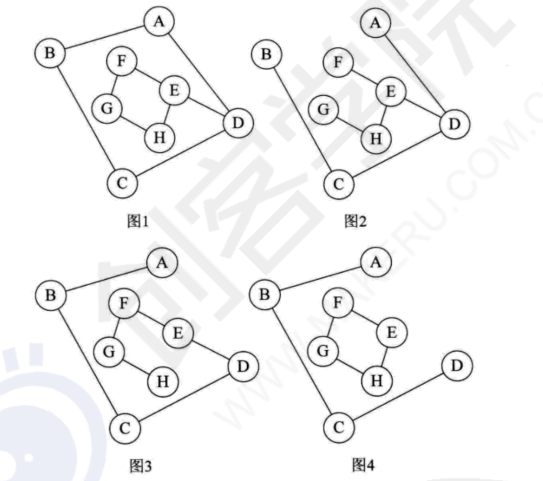

- 图1是一个普通图，但不是生成树
- 当去掉2条构成循环的边后，如图2，图3，随便加哪两定点的边都将构成环
- 图4不是连通图

##### 路径、路径长度、回路

顶点v<sub>p</sub>到顶点v<sub>q</sub>之间的一条路径是指顶点序列v<sub>p</sub>, v<sub>i1</sub>, v<sub>i2</sub>, ..., v<sub>im</sub>, v<sub>q</sub>，当然关联的边也可以理解为路径的构成要素。路径上边的数目称为路径长度。第一个顶点和最后一个顶点相同的路径称为回路或环。若一个图有n个顶点，并且有大于n−1条边，则此图一定有环

##### 简单路径、简单回路

在路径序列中，顶点不重复出现的路径称为简单路径。除第一个顶点和最后一个顶点外，其余顶点不重复出现的回路称为简单回路。

##### 距离

从顶点u出发到顶点v的最短路径若存在，则此路径的长度称为从u到v的距离。若从u到v根本不存在路径，则记该距离为无穷(∞)。

##### 有向树

一个顶点的入度为0、其余顶点的入度均为1的有向图，称为有向树。

### 排序

#### 冒泡排序

冒泡排序 (Bubble Sort)一种交换排序，它的基本思想是: 两两比较相邻记录的关键字，如果反序则交换，直到没有反序的记录为止

一张图说明：

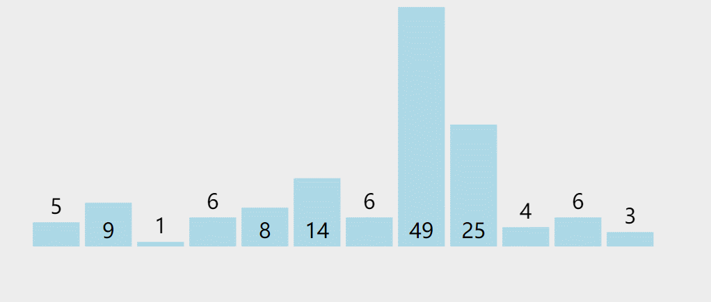

代码：
```php
<?php

/**
 * 冒泡排序
 *
 * @param array $data
 * @return array
 */
function bubbling(array &$data)
{
    $n = count($data);
    //进行n-1轮迭代
    for ($i = $n - 1; $i > 0; $i--) {
        //标记在一轮中有没有进行过交换
        $flag = false;
        for ($j = 0; $j < $i; $j++) {
            //比较前后元素的大小，如果前面元素小于后面元素那么交换两个的值
            if ($data[$j] > $data[$j+1]) {
                $tmp = $data[$j];
                $data[$j] = $data[$j+1];
                $data[$j+1] = $tmp;
                //这一轮中发生过交换，标记记为true
                $flag = true;
            }
        }
        //如果这一轮中没有进行过交换，说明已经没有需要排序的项
        if (!$flag) {
            return true;
        }
    }
}

$data = [5, 9, 1, 6, 8, 14, 6, 49, 25, 4, 6, 3];
//$data = [2, 1, 3, 4, 5, 6, 7];
bubbling($data);
print_r($data);
```

> 时间复杂度：O(n<sup>2</sup>)


#### 选择排序

简单选择排序法(simple Selection Sort) 就是通过 n-i 次关键字间的比较，从n-i+1 个记录中选出关键字最小的记录，并和第i(1<i<n)个记录交换之.

通过选择最小的元素，每轮迭代只需交换一次。虽然交换次数比冒泡少很多，但效率和冒泡排序一样的糟糕。

一图说明：


代码：
```php
<?php
/**
 * 选择排序
 *
 * @param array $data
 */
function select(array &$data)
{
    $n = count($data);
    //进行n-1轮迭代
    for ($i = 0; $i <= $n - 1; $i++) {
        //记录最小数和下标
        $min = $data[$i];
        $minIndex = $i;
        for ($j = $i + 1; $j < $n; $j++) {
            //判断下一个元素是否最小数
            if ($data[$j] < $min) {
                //记录最小数和下标
                $min = $data[$j];
                $minIndex = $j;
            }
        }

        //一轮结束，判断是否有新的最小数，有则交换最小数
        if ($i != $minIndex) {
            $data[$minIndex] = $data[$i];
            $data[$i] = $min;
        }
    }
}

$data = [5, 9, 1, 6, 8, 14, 6, 49, 25, 4, 6, 3];
//$data = [2, 1, 3, 4, 5, 6, 7];
select($data);
print_r($data);
```

> 时间复杂度： O(n<sup>2</sup>)

#### 归并排序

归并排序是一种分治策略的排序算法。它是一种比较特殊的排序算法，通过递归地先使每个子序列有序，再将两个有序的序列进行合并成一个有序的序列。

一图说明：

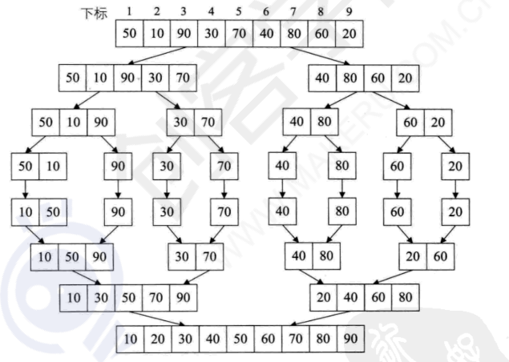

代码：
```php
<?php
/**
 * 归并排序
 *
 * @param array $data
 * @return array
 */
function mergeSort(array $data)
{
    $n = count($data);
    if ($n <= 1) {
        //已经排序完毕直接返回
        return $data;
    }
    //计算中间索引
    $midIndex = floor($n / 2);
    //分割左右数组
    $left = array_slice($data, 0, $midIndex);
    $right = array_slice($data, $midIndex, $n);
    //切分归并
    return merge(mergeSort($left), mergeSort($right));
}

function merge($left, $right)
{
    //结果存放数组
    $result = [];
    while (count($left) > 0 && count($right) > 0) {
        //比较两边第一个元素，小的放入元素放入结果数组
        if ($left[0] < $right[0]) {
            $result[] = array_shift($left);
        } else {
            $result[] =  array_shift($right);
        }
    }

    //如果左边数组还有剩余追加到结果数组
    if (count($left) > 0) {
        $result  = array_merge($result, $left);
    }

    //如果右边数组还有剩余追加到结果数组
    if (count($right) > 0) {
        $result  = array_merge($result, $right);
    }

    return $result;
}

//test
$data = [50, 10, 90, 30, 70, 40, 80, 60, 20];
var_dump(mergeSort($data));
```

> 时间复杂度：O(nlogn)，这个时间复杂度是稳定的，不随需要排序的序列不同而产生波动

#### 堆排序

堆(Heap): 堆是具有以下特性的完全二叉树;
- 最小堆(大顶堆)：每个结点的值都小于或等于其左右孩子结点的值
- 最大堆(小顶堆)：每个结点的值都大于或等于其左右孩子结点的值

> 注意：这里的堆并不是堆栈的那个堆

堆排序(Heap Sort): 就是利用堆(假设利用大顶堆) 进行排序的方法。它的基本思想是，将待排序的序列构造成一个大顶堆。此时，整个序列的最大值就是堆顶的根结点。将它移走(其实就是将其与堆数组的末尾元素交换，此时末尾元素就是最大值)，然后将剩余的 n-1 个序列重新构造成一个堆，这样就会得到 n 个元素中的次小值。如此反复执行，便能得到一个有序序列了。

需要用到的完全二叉树特性， 详细见[二叉树特性](/note/DataStructureAndAlgorithms?id=二叉树特性)：
- 如果一个有 n 个结点的完全二叉树从上到下，从左到右依次编号，则对任意结点有
    - 若 i=1，则结点i是二叉树的根，无双亲，如果i>1,则其双亲是i/2向下取整。
    - 如果 2i>n，则结点i无左孩子，否则其左孩子是结点2i。
    - 如果 2i+1>n，则结点i无右孩子，否则其右孩子是结点2i+1.

算法步骤：
- 创建堆(堆排序求升序用大顶堆，求降序用小顶堆)
- 把堆首和堆尾互换
- 

代码：
```php

```

> 时间复杂度： 平均情况O(nlog2n), 不稳定排序


#### 快速排序

快速排序 (Quick Sort) 的基本思想是: 通过一趟排序将待排记录分割成独立的两部分，其中一部分记录的关键字均比另一部分记录的关键字小，则可分别对这两部分记录继续进行排序，以达到整个序列有序的目的。

以图说明：

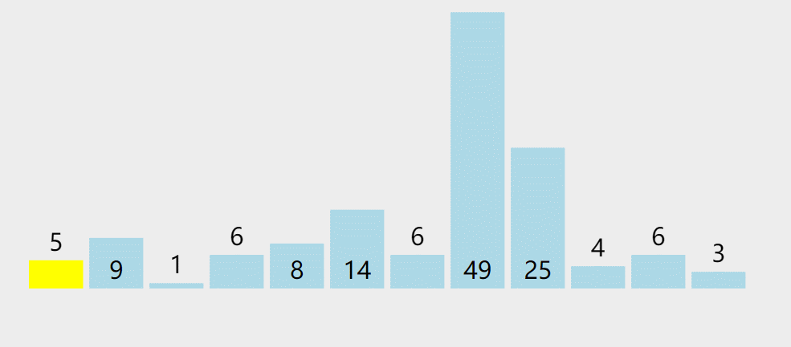

步骤如下：
- 先从数列中取出一个数作为基准数。一般取第一个数。
- 分区过程，将比这个数大的数全放到它的右边，小于或等于它的数全放到它的左边。
- 再对左右区间重复第二步，直到各区间只有一个数。

代码：
```php
<?php
/**
 * 快速排序
 *
 * @param array $data
 */
function quick(array $data)
{
    $n = count($data);
    if ($n <= 1) {
        return $data;
    }

    //计算中间索引
    $midIndex = floor($n / 2);
    //中间值
    $mid = $data[$midIndex];
    $left = [];
    $right = [];
    for ($i = 0; $i < $n; $i++) {
        //跳过中间索引
        if ($midIndex == $i) {
            continue;
        }

        //小于等于中间值的放到左侧
        if ($data[$i] <= $mid) {
            $left[] = $data[$i];
        }

        //大于中间值的放到右侧
        if ($data[$i] > $mid) {
            $right[] = $data[$i];
        }
    }
    //递归
    return array_merge(quick($left), [$mid], quick($right));
}

$data = [5, 9, 1, 6, 8, 14, 6, 49, 25, 4, 6, 3];
var_dump(quick($data));
```

> 时间复杂度：平均`O(nlogn)`

### 查找

#### 有序表查找

##### 二分查找/折半查找

折半查找(Binary Search) 技术，又称为二分查找。折半查找的基本思想是:在有序表中，取中间记录作为比较对象，若给定值与中间记录的关键字相等，则查找成功，若给定值小于中间记录的关键字，则在中间记录的左半区继续查找，若给定值大于中间记录的关键字，则在中间记录的右半区继续查找。不断重复上述过程，直到查找成功，或所有查找区域无记录，查找失败为止

实现思路，简单来说就是：以数组中某个值为界，再递归进行查找，直到结束

代码：
```php
<?php
/**
 * 折半查找/二分查找
 */
function binary(array $data, int $low, int $high, int $key)
{
    if ($low >  $high) {
        return -1;
    }
    //中间值索引
    $mid = intval(($low + $high) / 2);
    if ($key < $data[$mid]) {
        //大于查找值
        return binary($data, $low, $mid - 1, $key);
    } else if ($key > $data[$mid]) {
        //小于查找值
        return binary($data, $mid + 1, $high, $key);
    } else {
        //找到查找值
        return $mid;
    }
}

//test
//二分查找要求线性表必须采用顺序存储结构
//$data = [50, 10, 90, 30, 70, 40, 80, 60, 20]; //错误结构
$data = [10, 20, 30, 40, 50, 60, 70, 80, 90];
var_dump(binary($data, 0, count($data), 70));
```

> 时间复杂度：O(logn) ，每次查找缩小一半的查找范围

##### 插值查找

插值查找，有序表的一种查找方式。插值查找是根据查找关键字与查找表中最大最小记录关键字比较后的查找方法。插值查找基于二分查找，将查找点的选择改进为自适应选择，提高查找效率。

打个比方，在英文词典里查`apple`, 下意识里翻开的是靠前面的书页，如果查找`zoo`那么会下意识的在考后的书页查找。

核心点在于插值的计算公式：

```
mid = low + (key - a[low]) / (a[high] - a[low]) * (high - low)
```

代码：
```php
<?php
/**
 * 插值查找
 */
function interpolation(array $data, int $low, int $high, int $key)
{
    if ($low >  $high) {
        return -1;
    }
    //中间值索引
    $mid = intval($low + ($key - $data[$low]) / ($data[$high] - $data[$low]) * ($high - $low));
    if ($key < $data[$mid]) {
        //大于查找值
        return interpolation($data, $low, $mid - 1, $key);
    } else if ($key > $data[$mid]) {
        //小于查找值
        return interpolation($data, $mid + 1, $high, $key);
    } else {
        //找到查找值
        return $mid;
    }
}

//test
$data = [10, 20, 30, 40, 50, 60, 70, 80, 90, 91, 101, 110, 129];
var_dump(interpolation($data, 0, count($data) - 1, 11));
```

> 时间复杂度：O(logn); 对于有序表比较长，而关键字分布有比较均匀的查找表来说，插值查找算法的平均性能比二分查找好的多

##### 斐波拉契查找

斐波拉契查找(Fibonacci Search): 利用黄金分割原理来实现； 核心公式为`F(n) = F(n-1) + F(n-2)`即从第三项开始，每一项可以分割为前一项和前两项之和，而前一项与当前项的比值接近0.618，该比例称为黄金分割比例，斐波那契查找算法的核心思想就是将数组按照黄金分割比例进行查找划分

代码：
```php
<?php

/**
 * 斐波那契查找
 */
function fibonacciSearch(array $data, $key)
{
    $n = count($data);
    //定义最低下标记录首位
    $low = 0;
    //定义最高下标记录末位
    $high = $n - 1;

    $k = 0;
    //计算n位于斐波那契数列的位置
    while ($n > fibonacci($k) - 1) {
        $k++;
    }

    //将不满的数值的补全
    for ($j = $n; $j < fibonacci($k) - 1; $j++) {
        $data[$j] = $data[$n - 1];
    }

    //查找
    while ($low <= $high) {
        //echo "---" . PHP_EOL;
        //计算当前分隔的下标
        $mid = $low + fibonacci($k - 1) - 1;
        //echo '$k = ' . $k . PHP_EOL;
        if ($key < $data[$mid]) {
            //echo "$key < $data[$mid]" . PHP_EOL;
            $high = $mid - 1;
            $k = $k - 1;
            //echo '$high 和 $k 和 $mid' . " $high, $k, $mid" . PHP_EOL;
        } else if ($key > $data[$mid]) {
            //echo "$key > $data[$mid]" . PHP_EOL;
            $low = $mid + 1;
            $k = $k - 2;
            //echo '$high 和 $k 和 $mid' . " $high, $k, $mid" . PHP_EOL;
        } else {
            if ($mid <= $n) {
                //找到元素位置
                return $mid;
            } else {
                //说明是补全的数值，补全的数值和n相同，那么直接返回n
                return $n;
            }
        }
    }
}

/**
 * 构建斐波那契数列
 */
function fibonacci($i)
{
    if ($i < 2) {
        $value = $i == 0 ? 0 : 1;
    } else {
        $value = fibonacci($i - 1) + fibonacci($i - 2);
    }
    return $value;
}

//test
$data = [0, 1, 16, 24, 35, 47, 59, 62, 73, 88, 99];
var_dump(fibonacciSearch($data, 73));
```

> 时间复杂度：O(logn)

#### 树表查找

##### 二叉排序树

二叉排序树(Binary Sort Tree), 又称为二叉查找树。它或者是一颗空树忙或者是具有下列性质的二叉树。
- 若它的左子树不空，则左子树上所有结点的值均小于它的根结构的值
- 若它的右子树不空，则右子树上所有结点的值均大于它的根结点的值
- 它的左、右子树也分别为二叉排序树

构造一颗二叉排序树的目的，其实并不是为了排序，而是为了提高查找和插入删除关键字的速度

查找过程：当二叉排序树不为空时，首先将给定值和根结点进行比较，若相等，则查找成功；若小于根结点，则在左子树上继续查找；若大于根结点，则在右子树上继续查找。

代码：
```php
<?php
/**
 * 二叉排序树/二叉查找树
 */

/**
 * 结点
 *
 * Class Node
 */
class Node
{
    public $left = null;
    public $right = null;
    public $data;
    public function __construct($data)
    {
        $this->data = $data;
    }
}

/**
 * Class SearchTree
 */
class SearchTree
{
    /**
     * 添加
     *
     * @param Node $tree
     * @param $value
     * @return bool|void
     */
    public function add(Node $tree, $value)
    {
        if (is_null($tree)) {
            return false;
        }

        $newNode = new Node($value);
        while ($tree != null) {
            if ($newNode->data < $tree->data) {
                //插入值比根结点值小
                if ($tree->left === null) {
                    //左子树为空， 可以插入
                    $tree->left = $newNode;
                    return true;
                }
                //左子树有结点，不能直接插入，把该节点设置根结点继续判断
                $tree = $tree->left;
            } else {
                //插入值大于等于根结点值
                if ($tree->right === null) {
                    //右子树为空， 可以插入
                    $tree->right = $newNode;
                    return true;
                }
                //右子树有结点，不能直接插入，把该节点设置根结点继续判断
                $tree = $tree->right;
            }
        }
        return true;
    }

    /**
     * 删除
     *
     * 1. 当删除的结点没有子结点时，只需要将父结点中指向删除结点的指针设为null
     * 2. 当删除的结点只有一个结点时，只需要更新父结点中指向删除结点的指针指向要删除结点的子节点
     * 3. 当删除的结点有两个节点时：需要找到这个结点的右子树中最小结点，把它替换到要删除的结点上，然后再删除这个最小结点
     *  3.1: 为什么是右子树的最小结点，因为右子树的最小结点满足左子树上所有结点值均小于它，而右子树上所有结点值均大于它； 符合二叉排序树的性质
     *  3.2: 反之，找右子树的最大结点
     *
     *
     * @param Node $tree
     * @param $value
     * @param null $flag    标记是进入左子树还是右子树
     * @return bool
     */
    public function delete(Node &$tree, $value, $flag = null)
    {
        if (is_null($tree)) {
            return false;
        }
        if ($value > $tree->data) {
            //进入右子树查找
            $this->delete($tree->right, $value, 'right');
        } else if ($value < $tree->data) {
            //进入左子树查找
            $this->delete($tree->left, $value, 'left');
        } else {
            //找到并删除
            if ($tree->left === null) {
                //左子树为空时，只需要重新接它的右子树
                $tree = $tree->right;
            } else if ($tree->right === null) {
                //右子树为空时，只需要重新接它的左子树
                $tree = $tree->left;
            } else {
                //左右子树不为空，找到右子树的最左结点(即右子树的最小结点)
                if ($flag == 'left') {
                    //找到左子树的最右结点(即左子树的最大结点)
                    $delNode = $tree->right;
                    while (!is_null($delNode->right)) {
                        $delNode = $delNode->right;
                    }
                    //删除已经替换的结点
                    $tree->right = null;
                } else if ($flag == 'right') {
                    //找到右子树的最左结点(即右子树的最小结点)
                    $delNode = $tree->left;
                    while (!is_null($delNode->left)) {
                        $delNode = $delNode->left;
                    }
                    //删除已经替换的结点
                    $tree->left = null;
                } else {
                    return false;
                }
                $tree->data = $delNode->data;
            }
        }
        return true;
    }
}
```

构建二叉排序树：
```php
//test
$tree = New Node(62);

$sn = New SearchTree();
$sn->add($tree,58);
$sn->add($tree, 88);
$sn->add($tree, 47);
$sn->add($tree, 73);
$sn->add($tree, 99);
$sn->add($tree, 35);
$sn->add($tree, 51);
$sn->add($tree, 93);
$sn->add($tree, 37);

print_r($tree);    //打印对象查看结构是否正确
/*
结果如下：
Node Object
(
    [left] => Node Object
        (
            [left] => Node Object
                (
                    [left] => Node Object
                        (
                            [left] =>
                            [right] => Node Object
                                (
                                    [left] =>
                                    [right] =>
                                    [data] => 37
                                )

                            [data] => 35
                        )

                    [right] => Node Object
                        (
                            [left] =>
                            [right] =>
                            [data] => 51
                        )

                    [data] => 47
                )

            [right] =>
            [data] => 58
        )

    [right] => Node Object
        (
            [left] => Node Object
                (
                    [left] =>
                    [right] =>
                    [data] => 73
                )

            [right] => Node Object
                (
                    [left] => Node Object
                        (
                            [left] =>
                            [right] =>
                            [data] => 93
                        )

                    [right] =>
                    [data] => 99
                )

            [data] => 88
        )

    [data] => 62
)
*/
```

对应图：

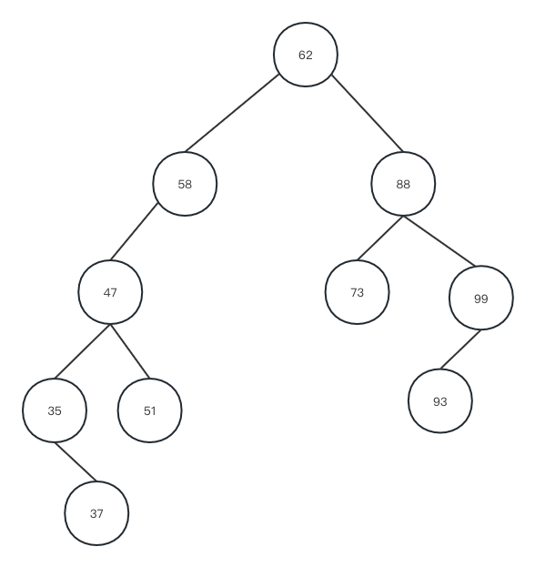


删除值为88的元素：
```php
//删除元素
$sn->delete($tree, 47);
// $sn->delete($tree, 88);

//再次打印结果,查看结构
print_r($tree);

//结果：
/*
Node Object
(
    [left] => Node Object
        (
            [left] => Node Object
                (
                    [left] => Node Object
                        (
                            [left] =>
                            [right] => Node Object
                                (
                                    [left] =>
                                    [right] =>
                                    [data] => 37
                                )

                            [data] => 35
                        )

                    [right] => Node Object
                        (
                            [left] =>
                            [right] =>
                            [data] => 51
                        )

                    [data] => 47
                )

            [right] =>
            [data] => 58
        )

    [right] => Node Object
        (
            [left] =>
            [right] => Node Object
                (
                    [left] => Node Object
                        (
                            [left] =>
                            [right] =>
                            [data] => 93
                        )

                    [right] =>
                    [data] => 99
                )

            [data] => 73
        )

    [data] => 62
)
*/
```

对应图：

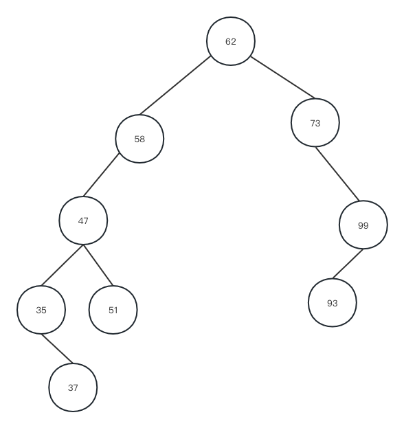


> 时间复杂度：

##### 平衡二叉树(AVL数)

##### 多路查找树(B树)

##### B+树

##### 红黑树

#### 散列表查找(哈希查找)


<!-- 
redis集合的数据结构：跳表
红黑树
b-tree
b+-tree
top k 问题（堆排序可以求）
-->