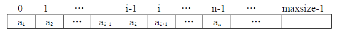
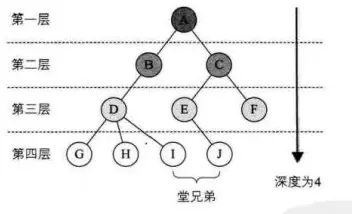
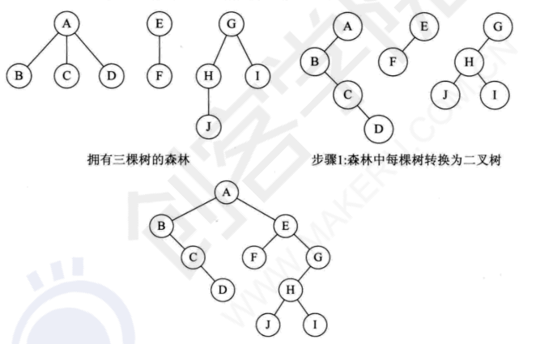
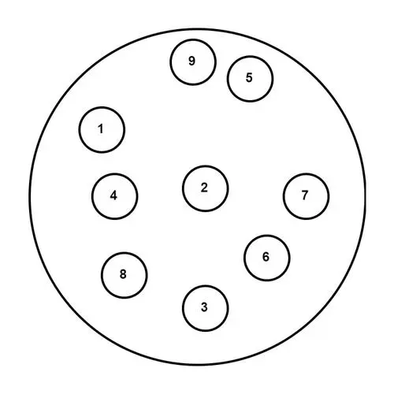

## 概念

数据结构：顾名思义就是存放数据的结构，也可以认为是存放数据的容器;比如，你要找出1000个数字中的最大值，首先你要将1000个数字记在某些卡片上，然后对卡片进行排序。

算法(Algorithm): 解决特定问题求解步骤的描述，在计算机中表现为指令的有限序列，并且每条指令表示一个或多个操作。

> 资料：《大话设计模式》， 网络上各种博客资源

## 算法复杂度

算法的复杂性体运行该算法时的计算机所需资源的多少上，计算机资源最重要的是时间和空间（即寄存器）资源，因此复杂度分为时间和空间复杂度

### 空间复杂度

空间复杂度: 是对一个算法在运行过程中临时占用存储空间大小的量度

> 通常来说，只要算法不涉及到动态分配的空间以及递归、栈所需的空间，空间复杂度通常为O(1)

### 时间复杂度

时间复杂度: 是指执行算法所需要的计算工作量

#### 大O表示法

用`O()`来体现算法时间复杂度的记法，我们称之为大O表示法

#### 大O推导方法

1. 用常数1来取代运行时间中的所有加法常数
2. 修改后的运行次数函数中，只保留最高阶项
3. 最高项出去其相乘的常数，得到的结果就是大O阶

示例说明：
```php
<?php
/**
 * 单个循环情况
 *
 * @param $n
 */
function demoOne($n)
{
    for ($i = 0; $i < $n; $i++) {   //循环次数为n
        echo "output..." . PHP_EOL; //循环体时间复杂度为O(1)
    }
}
//时间复杂度计算: O(n * 1), 即O(n)

```

```php
/**
 * 多重循环体情况
 *
 * @param $n
 */
function demoTwo($n)
{
    for ($i = 0; $i < $n; $i++) {       //循环次数为n
        for ($j = 0; $j < $n; $j++) {   //循环次数为n
            echo "output..." . PHP_EOL; //循环体次数为O(1)
        }
    }
}
//时间复杂度计算: O(n * n * 1), 即O(n^2)
```

```php
/**
 * 多个事件复杂度情况
 *
 * @param $n
 */
function demoThree($n)
{
    //该部分时间复杂度为O(n^2)
    for ($i = 0; $i < $n; $i++) {
        for ($j = 0; $j < $n; $j++) {
            echo "output..." . PHP_EOL;
        }
    }

    //该部分时间复杂度为O(n)
    for ($j = 0; $j < $n; $j++) {   //循环次数为n
        echo "output..." . PHP_EOL; //循环体次数为O(1)
    }
}
//时间复杂度计算: max(O(n^2), O(n)), 即O(n^2)
```

算法的优先级排列如下，一般排在上面的要优于排在下面的：
- 常数复杂度：O(1)
- 对数复杂度：O(logn)
- 一次方复杂度：O(n)
- 一次方乘对数复杂度：O(nlogn)
- 乘方复杂度：O(n^2), O(n^3)
- 指数复杂度：O(2^n)
- 阶乘复杂度：O(n!)
- 无限大指数复杂度：O(n^n)

## 物理结构

物理结构： 面向计算机，指的是数据的逻辑结构在计算机中的存储形式，也被称为存储结构。（实际上物理结构就是如何把数据元素存储到计算机的存储器中)； 存储器即存储数据的工具）

## 逻辑结构

### 线性结构

线性结构；如同一条线上的蚂蚱，都是一对一的相连的，所以他们的关系是一对一。线性结构是最简单、最常用的数据结构；线性表示一种典型的线性结构


#### 线性表

线性表(Linear-list)：零个或多个数据元素的有限序列
- 线性表的顺序存储：用一段连续的存储单元依次存储线性表的数据元素。（通常使用一维数组实现顺序存储结构）
- 线性表的链式存储：除了存储本身的信息之外，还需存储一个指示后继的信息

线性表特点：
- 存在唯一的一个被称为"第一个"的元素
- 存在唯一的一个被称为"最后一个"的元素
- 除了第一个元素外，序列中的每个元素均只有一个直接前驱
- 除了最后一个元素外，序列中的每个元素均只有一个直接后继

#### 线性表的存储结构

- 顺序存储/连续存储: 计算机中的顺序存储是指在内存中用一块地址连续的空间依次存放数据元素；其特点是表中相邻的数据元素在内存中存储位置也相邻
  

  - 顺序表
  - 有序顺序表

- 链式存储/离散存储：假如我们现在要存放一些物品，但是没有足够大的空间将所有的物品一次性放下（电脑中使用链式存储不是因为内存不够先事先说明一下...，具体原因后续会说到），同时设定我们因为脑容量很小，为了节省空间，只能记住一件物品位置。此时我们很机智的找到了解决方案：存放物品时每放置一件物品就在物品上贴一个小纸条，标明下一件物品放在那里，只记住第一件物品的位置，寻找的时候从第一件物品开始寻找，通过小纸条我们可以找到所有的物品，这就是链式存储。链表实现的时候不再像线性表一样只存储数据即可，还有下一个数据元素的地址，因此先定义一个节点类(Node)，记录物品信息和下一件物品的位置，我们把物品本身叫做数据域，存储下一件物品地址信息的小纸条称为引用域。链表结构示意图如下：

  
  - 单链表：指针实现
  - 双链表：指针实现
  - 循环链表：指针实现
  - 静态链表：借助数组实现

> 线性结构/线性表是一种逻辑结构，而顺序存储/顺序表以及链式存储/链表则是一种存储结构

> 顺序存储和链式存储使用场景：如果频繁使用查找，很少进行插入和删除，易采用顺序存储。如果需要频繁插入和删除，易采用链式存储

#### 顺序表

顺序表： 把线性表的结点按逻辑顺序依次存放在一组地址连续的存储单元⾥。⽤用这种⽅方法存储的线性表简称顺序表； 顺序表的基本操作，在顺序存储结构中,很容易实现线性表的⼀些操作:初始化、赋值、查找、修改、插⼊入、删除、求长度等

抽象出顺序表的一些重要操作：
  - 初始化
  - 赋值
  - 查找
  - 修改
  - 插⼊
  - 删除
  - 求长度等

顺序表代码示例：
```php
<?php
class Linear {

    private $item;

    private $count;

    /**
     * 初始化
     *
     * Linear constructor.
     */
    public function __construct()
    {
        $this->item = [];
        $this->count = count($this->item);
    }

    /**
     * 输出全部元素
     *
     * @return string
     */
    public function getAll()
    {
        for ($i = 0; $i < $this->count; $i++) {
            echo $this->item[$i] . PHP_EOL;
        }
        return PHP_EOL;
    }

    /**
     * 指定位置新增元素
     *
     * @param $index
     * @param $item
     * @return bool
     */
    public function add($index, $item)
    {
        if ($index < 0 && $index > $this->count) {
            return false;
        }
        //将指定位置和后面的元素后移一位
        for ($i = $this->count; $i > $index; $i--) {
            $this->item[$i] = $this->item[$i - 1];
        }
        $this->item[$index] = $item;
        $this->count++;
        return true;
    }

    /**
     * 更新指定位置的元素
     *
     * @param $index
     * @param $item
     * @return bool
     */
    public function update($index, $item)
    {
        if ($index < 0 && $index > $this->count) {
            return false;
        }
        $this->item[$index] = $item;
        return true;
    }

    /**
     * 删除指定位置的元素
     *
     * @param $index
     * @return bool|mixed
     */
    public function delete($index)
    {
        if ($index < 0 && $index > $this->count) {
            return false;
        }
        $value = $this->item[$index];
        //将指定位置后面的元素前移一位
        for ($i = $index; $i < $this->count - 1; $i++) {
            $this->item[$i] = $this->item[$i + 1];
        }
        $this->count--;
        return $value;
    }

    /**
     * 获取长度
     *
     * @return int
     */
    public function count()
    {
        return $this->count;
    }

    /**
     * 清空顺序表
     */
    public function clear()
    {
        $this->item = [];
        $this->count = count($this->item);
    }
}

//测试
$linear = new Linear();
echo '添加：' . PHP_EOL;
$linear->add(0, 'a');
$linear->add(1, 'b');
$linear->add(1, 'c');
$linear->getAll();
echo '更新：' . PHP_EOL;
$linear->update(1, 'd');
$linear->getAll();
echo '删除' . PHP_EOL;
$linear->delete(1);
$linear->getAll();
echo '清空' . PHP_EOL;
echo $linear->count() . PHP_EOL;
$linear->clear();
echo $linear->count() . PHP_EOL;
```

#### 链表

链表：是一种物理存储结构上非连续、非顺序的存储结构，数据元素的逻辑顺序是通过链表中的指针链接次序实现的

从内存结构看，链表的内存结构是不连续的内存空间，是将一组零散的内存块串联起来，从而进行数据存储的数据结构

链表中的每一个内存块被称为节点Node。节点除了存储数据外，还需记录链上下一个节点的地址，即后继指针next.

实际中要实现的链表的结构非常多样，比如：
- 单向，双向
- 带头，不带头
- 循环，非循环

##### 单链表

特点：
- 每个节点只包含一个指针，即后继指针
- 单链表有首节点和尾节点； 用首节点地址表示整条链表，尾节点的后继指针指向空地址NULL
- 性能： 插入和删除节点的时间复杂度为O(1), 查找的时间复杂度为O(n)

带头单链表：


##### 双链表

特点：
- 节点除了存储数据外，还有两个指针分别指向前一个节点地址（前驱指针prev）和下一个节点地址（后继指针next）
- 首节点的前驱指针prev和尾节点的后继指针均指向空地址
- 性能：和单链表相比，存储相同的数据，需要消耗更多的存储空间。插入、删除操作比单链表效率更高O(1)级别。以删除操作为例，删除操作分为2种情况：给定数据值删除对应节点和给定节点地址删除节点。对于前一种情况，单链表和双向链表都需要从头到尾进行遍历从而找到对应节点进行删除，时间复杂度为O(n)。对于第二种情况，要进行删除操作必须找到前驱节点，单链表需要从头到尾进行遍历直到p->next = q，时间复杂度为O(n)，而双向链表可以直接找到前驱节点，时间复杂度为O(1)

双链表：


##### 双向链表实现

前面已经说到各个链表的特点，这里用代码的方式实现双向链表

```php
<?php

/**
 * 节点类
 *
 * Class Node
 */
class Node
{
    /** @var 数据 */
    public $data;

    /** @var 前驱 */
    public $prev;

    /** @var 后继 */
    public $next;

    public function __construct($data)
    {
        $this->data = $data;
    }
}

/**
 * 双向链表类
 *
 * Class DoubleForLinklist
 */
class DoubleForLinklist
{
    /** @var 首节点 */
    private $head;

    /** @var 尾节点 */
    private $tail;

    /** @var 链表长度 */
    private $len;

    /**
     * 初始化链表
     *
     * DoubleForLinklist constructor.
     */
    public function __construct()
    {
    }

    /**
     * 获取单链表长度
     */
    public function getLen(): int
    {
        return $this->len;
    }

    /**
     * 获取全部节点
     *
     * @return string
     */
    public function getAll(): string
    {
        $str = "";
        //获取首节点
        $node = $this->head;

        //计数索引
        $countIndex = 0;
        //从首节点遍历所有节点
        while ($node instanceof Node) {
            $str .= "{$countIndex}: {$node->data}" . PHP_EOL;
            $node = $node->next;
            $countIndex++;
        }
        return $str;
    }

    /**
     * 查找节点（这里根据索引获取，也可以用值获取）
     *
     * @param int $index    索引
     * @return 后继|首节点|null
     */
    public function get(int $index)
    {
        //计数
        $countIndex = 0;
        //头节点
        $node = $this->head;
        //从头节点循环获取指定索引对应的结点
        while ($node instanceof Node) {
            if ($countIndex == $index) {
                return $node;
            }
            $node = $node->next;
            $countIndex++;
        }
        return null;
    }

    /**
     * 添加节点
     *
     * @param $item 元素
     * @param null $index 索引
     * @return bool
     * @throws Exception
     */
    public function add($item, $index = null)
    {
        //检查边界
        $this->_checkIndex($index);
        //创建节点
        $node = new Node($item);
        if ($index === null) {
            //索引为null，表示从尾部添加
            if ($this->tail instanceof Node) {
                //链表尾节点是一个节点，说明链表中已经存在节点
                $node->prev = $this->tail;  //节点前驱 == 链表当前尾节点
                $this->tail->next = $node;  //尾节点的后继指针 == 当前节点
                $this->tail = $node;        //此时链表尾节点 == 当前节点
            } else {
                //链表尾节点不是一个节点，说明链表中没有元素，这时首节点和尾节点相同
                $this->head = $node;
                $this->tail = $node;
            }
        } else {
            //从指定索引添加
            //获取旧的节点
            $oldNode = $this->get($index);
            //当旧节点是Node的实例时替换旧节点
            if ($oldNode instanceof Node) {
                if ($oldNode->prev instanceof Node) {
                    //当旧节点的前驱是一个节点时，旧节点的前驱的后继应该更换为当前节点
                    $oldNode->prev->next = $node;
                }
                $node->next = $oldNode; //当前节点的后继指针 为 旧节点
                $node->prev = $oldNode->prev;   //当前节点的前驱 为 旧节点的前驱
                $oldNode->prev = $node; //旧节点的前驱 为 当前节点
            }

            //判断是否头节点
            if ($node->prev === null) {
                $this->head = $node;
            }

            //判断是否尾节点
            if ($node->next === null) {
                $this->tail = $node;
            }
        }
        $this->len++;
        return true;
    }

    /**
     * 修改节点
     *
     * @param $index
     * @param $item
     * @return bool
     * @throws Exception
     */
    public function update($index, $item)
    {
        $node = $this->get($index);
        if (!($node instanceof Node)) {
            throw new \Exception("节点不存在");
        }
        $node->data = $item;
        return true;
    }

    /**
     * 删除节点
     *
     * @param $index
     * @return bool
     * @throws Exception
     */
    public function delete($index)
    {
        $this->_checkIndex($index);
        $node = $this->get($index);
        //存在前驱
        if ($node->prev instanceof Node) {
            if ($node->next instanceof Node) {
                //当该节点的后继还是节点的情况，该节点的前驱节点的后继变为该节点的后继
                $node->prev->next = $node->next;
            } else {
                //当该节点的后继不是是节点的情况说明当前是尾节点，值为null
                $node->prev->next = null;
            }
        }

        //存在后继
        if ($node->next instanceof Node) {
            if ($node->prev instanceof null) {
                //当该节的前驱还是节点的情况, 该节点的后继节点的前驱变为该节点的前驱
                $node->next->prev = $node->prev;
            } else {
                //当该节的前驱不是节点的情况说明当前是首节点，值为null
                $node->next->prev = null;
            }

        }
        unset($node);
        $this->len--;
        return true;
    }

    /**
     * 获取节点索引值
     */
    public function getIndex($item)
    {
        $node = $this->head;
        $countIndex = 0;
        while ($node instanceof Node) {
            if ($node->data == $item) {
                return $countIndex;
            }
            $node = $node->next;
            $countIndex++;
        }
        //未找到
        return -1;
    }

    /**
     * 检查索引是否越界
     *
     * @param int $index
     * @throws Exception
     */
    private function _checkIndex($index)
    {
        if ($index && $index >= $this->len) {
            throw new \Exception("index越界");
        }
    }
}

//tests
try{
    $linklist = new DoubleForLinklist();
    $linklist->add('A');                    //末尾插入元素
    $linklist->add('B');                    //末尾插入元素
    $linklist->add('C');                    //末尾插入元素
    $linklist->add('D', 0);          //更换首节点
    $linklist->add('E', 2);          //中间插入节点
    var_dump($linklist->get(2));                 //查看指定索引节点

    var_dump($linklist->getAll());               //查看全部节点
    $linklist->delete(1);                  //删除接节点
    var_dump($linklist->getAll());

    $linklist->update(1, "EE");      //更改指定索引位置的内容
    var_dump($linklist->getAll());

    echo "链表长度:" . $linklist->getLen() . PHP_EOL;                         //获取链表长度

    echo "获取指定内容索引：" . $linklist->getIndex("EE") . PHP_EOL;

} catch (\Exception $e) {
    echo "code：" . $e->getCode() . PHP_EOL;
    echo "msg: " .  $e->getMessage() . PHP_EOL;
    echo "line: " . $e->getLine() . PHP_EOL;
    echo "trace: " . $e->getTraceAsString() . PHP_EOL;
}
```

##### 循环链表

特点：
- 单向循环链表：除了尾节点的后继指针指向首节点的地址外均与单链表一致
- 双向循环链表：首节点的前驱指针指向尾节点，尾节点的后继指针指向首节点
- 适用于存储有循环特点的数据，比如约瑟夫问题

循环单链表：


带头双向循环链表：


##### 静态链表

静态链表： 分配一整片连续的内存空间，各个结点集中安置，逻辑结构上相邻的数据元素，存储在指定的一块内存空间中，数据元素只允许在这块内存空间中随机存放，这样的存储结构生成的链表称为静态链表。也就是说静态链表是用数组来实现链式存储结构，静态链表实际上就是一个结构体数组

#### 数组

数组(Array): 数组是一种线性数据结构。它用一组连续的内存空间，来存储一组具有相同类型的数据。

特点：
- 随机访问性强，查找速度快
- 插入和删除效率低: 当插入一个元素的时候，那么后续所有元素都需要向后挪一位; 删除则后续所有元素向前移一位；
- 内存空间要求高，必须有足够的连续内容空间，可能浪费内存
- 数组大小固定，不能动态扩展

#### 栈

栈(Stack): 先进后出(LIFO, Last In First Out)，先进队的数据最后才出来。在英文的意思里，stack 可以作为一叠的意思，这个排列是垂直的，你将一张纸放在另外一张纸上面，先放的纸肯定是最后才会被拿走，因为上面有一张纸挡住了它;


栈可以分为：
- 顺序栈：采用顺序存储的栈成为顺序栈
- 链式栈：采用链式存储的栈成为顺序栈

一些概念：
- 空栈：不含元素的空表
- 入栈：插入元素的操作
- 出栈：删除栈顶元素的操作
- 栈顶：表尾端
- 栈底：表头端

可以使用数组或链表来实现； 这里选用数组的方式实现：
```php
<?php
/**
 * 栈(数组方式)
 *
 * Class Stack
 */
class Stack
{
    /** @var int 容量 */
    private $cap;

    /** @var array 栈 */
    private $stack;

    /** @var 最新元素索引 */
    private $top = -1;

    /**
     * 初始化
     *
     * Stack constructor.
     */
    public function __construct(int $cap)
    {
        $this->cap = $cap;
        $this->stack = [];
    }

    /**
     * 入栈
     */
    public function push($item)
    {
        if ($this->top >= $this->cap) {
            throw new \Exception("stack is full.");
        }
        $this->top++;
        $this->stack[$this->top] = $item;
        return true;
    }

    /**
     * 出栈
     */
    public function pop()
    {
        if ($this->top < 0) {
            throw new \Exception("stack is empty.");
        }
        $item = $this->stack[$this->top];
        unset($this->stack[$this->top]);
        $this->top--;
        return $item;
    }

    /**
     * 获取
     */
    public function getAllByStr()
    {
        if ($this->top < 0) {
            throw new \Exception("stack is empty.");
        }
        $str = '';
        for ($i = 0; $i < $this->cap; $i++) {
            $str .= $this->stack[$i] . PHP_EOL;
        }
        return $str;
    }
}

//test
try {
    $stack = new Stack(5);
    $stack->push('A');
    $stack->push('B');
    $stack->push('C');
    $stack->push('D');
    $stack->push('E');
    //$stack->push('F');  //超出容量

    var_dump($stack->getAllByStr());

    $stack->pop();
    $stack->pop();
    $stack->pop();
    $stack->pop();
//    $stack->pop();

    var_dump($stack->getAllByStr());
} catch (\Exception $e) {
    echo "code：" . $e->getCode() . PHP_EOL;
    echo "msg: " .  $e->getMessage() . PHP_EOL;
    echo "line: " . $e->getLine() . PHP_EOL;
    echo "trace: " . $e->getTraceAsString() . PHP_EOL;
}
```

#### 队列

队列(Queue): 先进先出(FIFO, First-In-First-Out)，先进队的数据先出来。在英文的意思里，queue 和现实世界的排队意思一样，这个排列是水平的，先排先得。

队列：
- 普通队列
- 双端队列
- 阻塞队列
- 并发队列
- 阻塞并发队列


队列可以用数组实现也可以用链表实现， 这里用数组实现：
```php
<?php

/**
 * 队列(数组方式)
 *
 * Class Queue
 */
class Queue
{
    /** @var array 队列 */
    private $queue;

    /**
     * 初始化
     *
     * Stack constructor.
     */
    public function __construct()
    {
        $this->queue = [];
    }

    /**
     * 队列尾部添加元素
     */
    public function enqueue($item)
    {
        $this->queue[$this->getLen()] = $item;
        return true;
    }

    /**
     * 队列头部取出元素
     */
    public function dequeue()
    {
        $this->isEmpty();

        $item = $this->queue[0];
        unset($this->queue[0]);
        $this->queue = array_values($this->queue);
        return $item;
    }

    /**
     * 获取长度
     *
     * @return int
     */
    public function getLen()
    {
        return count($this->queue);
    }

    /**
     * 获取
     */
    public function getAllByStr()
    {
        $this->isEmpty();

        $str = '';
        for ($i = 0; $i < $this->getLen(); $i++) {
            $str .= $this->queue[$i] . PHP_EOL;
        }
        return $str;
    }

    /**
     * 判断是否为空
     *
     * @throws Exception
     */
    public function isEmpty()
    {
        if (empty($this->queue)) {
            throw new \Exception('queue is empty.');
        }
    }
}


//test
try {
    $queue = new Queue();
    $queue->enqueue('A');
    $queue->enqueue('B');
    $queue->enqueue('C');
    $queue->enqueue('D');
    $queue->enqueue('E');

    var_dump($queue->getAllByStr());

    $queue->dequeue();
    $queue->dequeue();
    $queue->dequeue();
    $queue->dequeue();

    var_dump($queue->getAllByStr());
} catch (\Exception $e) {
    echo "code：" . $e->getCode() . PHP_EOL;
    echo "msg: " .  $e->getMessage() . PHP_EOL;
    echo "line: " . $e->getLine() . PHP_EOL;
    echo "trace: " . $e->getTraceAsString() . PHP_EOL;
}
```

### 树形结构

#### 概念

树形结构: 如同树的树枝一样，一根树枝上有多个分支，所以为一对多的关系


一些概念：
- 结点(node)：表示树中的元素，包括数据项及若干指向其子树的分支
- 结点的度(degree)：结点拥有的子树数
- 叶子(leaf)——度为0的结点
- 孩子(child)——结点子树的根称为该结点的孩子
- 双亲(parents)——孩子结点的上层结点叫该结点的双亲
- 兄弟(sibling)——同一双亲的孩子
- 叶结点/终端结点：度为0的结点
- 树的度：树内各结点的度的最大值
- 结点的层次(level)——从根结点算起，根为第一层，它的孩子为第二层……
- 深度(depth)——树中结点的最大层次数
- 森林(forest)——m(m>0)棵互不相交的树的集合


树的深度/高度：




#### 二叉树

二叉树(Binary Tree)是n(n>=0)个结点的有限集合，该集合或者为空集(称为空二叉树)，或者由一个根结点和两颗互不相交的、分别称为根结点左子树和右子树的二叉树组成

特点：
- 每个结点最多有2颗子树，所以二叉树中不存在度大于2的结点
- 左子树和右子树是有顺序的，次序不能任意颠倒

二叉树具有五种基本形态：
1. 空二叉树
2. 只有一个根结点
3. 根结点只有左子树
4. 根结点只有右子树
5. 根结点既有左子树也有右子树

#### 特殊二叉树

- 斜树：所有结点都只有左子树或者右子树的二叉树；前者成为左斜树，后者成为右斜树
- 满二叉树：在一颗二叉树中，所有分支结点都存在左子树和右子树，并且所有叶子都在同一层上，这样的二叉树成为满二叉树
- 完全二叉树：是指除了最后一层之外，其他每一层的每个节点都是同时含有左右子树。当最后一层的每个节点也都含有左右子树的时候，则为满二叉树，同时也是完全二叉树。如果最后一层不满的时候，非满结点（即没有满足同时拥有左右子树的结点）的子树全部集中在左子树的时候，那也是一个完全二叉树;

满二叉树：


完全二叉树：


非完全二叉树：


非完全二叉树：


#### 二叉树特性

1. 在二叉树的第 i 层上至多有 2^(i-1) 个结点
2. 深度为 k 的二叉树至多有 2^k-1 个结点(k>1)
3. 对任何一棵二叉树T，如果其终端结点数为 n0，度为 2 的结点数为 n2，则 n0=n2+1
4. 具有 n 个结点的完全二叉树的深度为 ㏒₂n 向下取整再加 1
5. 如果一个有 n 个结点的完全二叉树从上到下，从左到右依次编号，则对任意结点有
    - 若 i=1，则结点i是二叉树的根，无双亲，如果i>1,则其双亲是i/2向下取整。
    - 如果 2i>n，则结点i无左孩子，否则其左孩子是结点2i。
    - 如果 2i+1>n，则结点i无右孩子，否则其右孩子是结点2i+1.

#### 二叉树的存储方式

##### 二叉树顺序存储结构

> 实现方式，按满二叉树的结点层次编号，依次存放二叉树中的数据元素； 

其中数组下标要体现结点之间的逻辑关系：


上面的二叉树对应到数组中，如下：


> 缺点： 浪费空间，适用于存满二叉树和完全二叉树


##### 二叉链表

> 二叉树每个结点最多有两个孩子，所以为它设计一个数据域和两个指针域

如图：


该二叉树的结构示意图，如：


#### 遍历二叉树

二叉树的遍历是指从各个结点出发，按照某种次序依次访问二叉树中所有结点，使得每个结点被访问一次且仅被访问一次

- 广度优先遍历
    - 层序遍历
- 深度优先遍历
    - 前序(先序)遍历
    - 中序遍历
    - 后序遍历

##### 建立二叉树

遍历之前需要先建立二叉树，结构如图:


代码如下：
```php
class Node
{
    public $data;

    public $childLeft;

    public $childRight;

    public function __construct($data)
    {
        $this->data = $data;
        $this->childLeft = null;
        $this->childRight = null;
    }
}
//创建二叉树
$a = new Node("A");
$b = new Node("B");
$c = new Node("C");
$d = new Node("D");
$e = new Node("E");
$f = new Node("F");

$a->childLeft = $b;
$a->childRight = $c;
$b->childLeft = $d;
$b->childRight = $e;
$c->childLeft = $f;
```

##### 前序遍历

先访问根结点，然后前序遍历左子树，再前序遍历右子树


##### 中序遍历

先中序遍历根结点的左子树，然后是访问根结点，最后中序遍历右子树


##### 后序遍历

从左到右先叶子后结点的方式遍历访问左右子树，最后访问根结点


##### 层序遍历

从树的第一层，也就是根结点开始访问，从上而下逐层遍历，在同一层中，按从左到有的顺序对结点逐个访问


##### 上面几种遍历代码示例

```php
<?php
class Node
{
    public $data;

    public $childLeft;

    public $childRight;

    public function __construct($data)
    {
        $this->data = $data;
        $this->childLeft = null;
        $this->childRight = null;
    }
}

class Ergodic
{
    /**
     * 前序遍历：先访问根结点，然后前序遍历左子树，再前序遍历右子树
     */
    public function preOrder($tree)
    {
        if ($tree instanceof Node) {
            //先访问根结点
            echo $tree->data . ' ';
            //前序遍历左子树
            $this->preOrder($tree->childLeft);
            //前序遍历右子树
            $this->preOrder($tree->childRight);
        }
    }

    /**
     * 中序遍历：先中序遍历根结点的左子树，然后是访问根结点，最后中序遍历右子树
     */
    public function midOrder($tree)
    {
        if ($tree instanceof Node) {
            //先中序遍历根结点的左子树
            $this->midOrder($tree->childLeft);
            //访问根结点
            echo $tree->data . " ";
            //中序遍历右子树
            $this->midOrder($tree->childRight);

        }
    }

    /**
     * 后序遍历：从左到右先叶子后结点的方式遍历访问左右子树，最后访问根结点
     */
    public function endOrder($tree)
    {
        if ($tree instanceof Node) {
            //后序遍历左子树
            $this->endOrder($tree->childLeft);
            //后序遍历右子树
            $this->endOrder($tree->childRight);
            //最后访问根结点
            echo $tree->data . " ";
        }
    }

    /**
     * 层序遍历：从树的第一层，也就是根结点开始访问，从上而下逐层遍历，在同一层中，按从左到有的顺序对结点逐个访问
     */
    public function levelOrder($tree)
    {
        $queue = [];
        //向队列尾部添加元素
        array_push($queue, $tree);
        while (!empty($queue)) {
            //从队列头部取出元素
            $node = array_shift($queue);
            echo $node->data . " ";
            if ($node->childLeft instanceof Node) {
                array_push($queue, $node->childLeft);
            }

            if ($node->childRight instanceof Node) {
                array_push($queue, $node->childRight);
            }
        }
    }
}

//创建二叉树
$a = new Node("A");
$b = new Node("B");
$c = new Node("C");
$d = new Node("D");
$e = new Node("E");
$f = new Node("F");

$a->childLeft = $b;
$a->childRight = $c;
$b->childLeft = $d;
$b->childRight = $e;
$c->childLeft = $f;

$ergodic = new Ergodic();
$ergodic->preOrder($a); //结果：A B D E C F
echo PHP_EOL;
$ergodic->midOrder($a); //结果：D B E A F C
echo PHP_EOL;
$ergodic->endOrder($a); //结果：D E B F C A
echo PHP_EOL;
$ergodic->levelOrder($a); //结果：A B C D E F
echo PHP_EOL;
```

#### 树，森林与二叉树转化

##### 树转化为二叉树

树转换为二义树的规则:每个结点左指针指向它的第一个孩子，右指针指向它在树中的相邻右兄弟，这个规则又称“左孩子右兄弟”。由于根结点没有兄弟，所以对应的二叉树没有右子树。

步骤：
1. 加线。在苏欧欧兄弟节点之间加一条连线
2. 去线。对树中每个结点，只保留它与第一个孩子结点的连线，删除它与其他孩子结点之间的连线
3. 层次调整。以树的根结点为轴心，将整颗树顺时针旋转一定的角度，使之结构层次分明。注意第一个孩子是二叉树结点的左孩子，兄弟转换过来的孩子是结点的右孩子

图示例：


##### 森林转换为二叉树
森林有若干颗数组成，所以完全可以理解为，森林中的每一颗树都是兄弟，可以按照兄弟的处理办法来操作

步骤：
1. 把每个数转换为二叉树
2. 第一颗二叉树不动， 从第二颗二叉树开始，依次把后一颗二叉树作为根结点作为前一颗二叉树的根结点的右孩子，用线连接起来。当所有的二叉树连接起来后就得到了由森林转换来的二叉树

图示：



##### 二叉树转换为树

二叉树转换为树就是树转换为二叉树的逆过程

1. 加线。若某结点的左孩子结点存在，则将这个左孩子的右孩子结点、右孩子的右孩子结点等依次类推的右孩子结点都作为此结点的孩子。将该结点与这些右孩子结点用线连接起来
2. 去线。删除原二叉树中所有结点与其右孩子结点的连线
3. 层次调整。使之结构层次分明

图示：


##### 二叉树转换为森林

首先如何判断一颗二叉树能否转换成森林或树，标准很简单，那就是只要看这颗二叉树的根结点有没有右孩子，有就是森林，没有就就是一颗树

转换步骤：
1. 从根结点开始，若右孩子存在，则把与右孩子结点的连线删除，再查看分离后的二叉树，若右孩子存在，则连线删除，直到所有右孩子连线都删除为止，得到分离的二叉树
2. 再将每颗分离的二叉树转换为树即可

图示：


##### 树与森林的遍历

树的遍历：
1. 一种是先根遍历树，即先访问树的根结点，然后依次先根遍历根的每棵子树
2. 另一种是后根遍历，即先依次后根遍历每棵子树，然后再访问根结点

森林的遍历也分为两种方式:
1. 前序遍历:先访问森林中第一棵树的根结点，然后再依次先根遍历根的每棵子树，再依次用同样方式遍历除去第一棵树的剩余树构成的森林
2. 后序遍历:是先访问森林中第一棵树，后根遍历的方式遍历每棵子树，然后再访问根结点，再依次同样方式遍历除去第一棵树的剩余树构成的森林

#### 哈夫曼树和应用

##### 概念

- 路径长度：哈夫曼说，从树中一个结点到另一个结点之间的分支构成两个结点之间的路径，路径上的分支数目称作路径长度
- 路径长度之和：树的路径长度就是从树根到每一节点的路径长度之和
- 权：在许多应用中，树中结点常常被赋予一个表示某种意义的数值，称为该结点的权
- 带权路径长度(WPL)： 从树的根到任意结点的路径长度(经过的边数)与该结点上权值的乘积，称为该结点的带权路径长度
- 哈夫曼树/最优二叉树：在含有n个带权叶结点的二叉树中，其中带权路径长度(WPL)最小的二叉树称为哈夫曼树，也称最优二叉树

示例：


计算WPL：

a: `WPL = 5 * 1 + 15 * 2 + 40 * 3 + 30 * 4 + 10 * 4 = 315`

b: `WPL = 5 * 3 + 15 * 3 + 40 * 2 + 30 * 2 + 10 * 2 = 220` 

##### 哈夫曼树的构造

注意，上面只是计算出带权路径长度，并不是哈夫曼树，那怎么构造哈夫曼树呢， 步骤如下：
1. 根据给定的n个权值{W1, W2, ··· ,Wn}构成n棵二叉树的集合 F={T1, T2,···, Tn}, 其中每棵二叉树Ti中只有一个带权为 Wi根结点，其左右子树均为空
2. 在F中选取两棵根结点的权值最小的树作为左右子树构造一棵新的二叉树，且置新的二叉树的根结点的权值为其左右子树上根结点的权值之和。
3. 在F中删除这两棵树，同时将新得到的二叉树加入F中。
4. 重复 2和3 步骤，直到 F 只含一棵树为止。这棵树便是赫夫曼树。

图示：


计算WPL:

`WPL = 40 * 1 + 30 * 2 + 15 * 3 + 10 * 4 + 5 * 4 = 205`

计算出来的WPL值为205和上面的WPL值220相比少了15。 显然此时构造出来的二叉树才是最优的哈夫曼树

##### 哈夫曼编码

哈夫曼当前研究这种最优树的目的是为了解决当年远距离通信(主要是电报)的数据传输的最优化问题

哈夫曼编码是一种被广泛应用而且非常有效的数据压缩编码


比如我们有一段文字内容为“BADCADFEED”要网络传输给别人，显然用二进制为数字 (0 和 1) 来表示是很自然的想法。我们现在这段文字只有六个字母 ABCDEF， 那么我们可以用相应的二进制数据表示：

|字母|A|B|C|D|E|F|
|-|-|-|-|-|-|-|
|二进制字符|000|001|010|011|100|101|

这样真正传输的数据就是编码后的“001000011010000011101100100011”，对方接收时可以按照 3 位一分来译码。如果一篇文章很长，这样的二进制串也将非常的可怕。而且事实上，不管是英文、中文或是其他语言，字母或汉字的出现频率是不相同的，比如英语中的几个元音字母“a e i o u”，中文中的“的了有在”等汉字都是频率极高。

假设六个字母的频率为 A 27，B 8，C 15，D 15，E 30，F 5，合起来正好是100%。那就意味着，我们完全可以重新按照赫夫曼树来规划它们。
图 6-12-9 左图为构造赫夫曼树的过程的权值显示。右图为将权值左分支改为 0右分支改为 1 后的赫夫曼树

下面左图为构造哈夫曼树的过程的权值显示。右图为将权值左分支改为0,有分支改为1后哈夫曼树


此时，我们对这6个字母用其从树根到叶子所经过路径的0或1来编码：

|字母|A|B|C|D|E|F|
|-|-|-|-|-|-|-|
|二进制字符|01|1001|101|00|11|1000|

我们将文字内容为“BADCADFEED”再次编码，对比可以看到结果串变小了
- 原编码二进制串: 00100001101000010110010001   (共 30 个字符)
- 新编码二进制串: 1001010010101001000111100    (共 25 个字符)

也就是说，我们的数据被压缩了，节约了大约17%的存储或传输成本。随着字符的增加和多字符权重的不同，这种压缩会更加显出其优势

### 图形结构

图形结构：图形结构其实和运筹学中的图是一样的，都是一堆多的关系。


### 集合结构

集合结构: 集合结构中，元素之间没有任何关系，它们仅仅是属于一个集合




<!-- redis集合的数据结构：跳表 -->