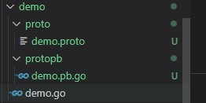

# Golang

## 类型转换

> 在必要以及可行的情况下，一个类型的值可以被转换成另一种类型的值。由于Go语言不存在隐式类型转换，因此所有的类型转换都必须显式的声明：

### 方法一

> 语法： type_name(expression)
> type_name: 类型
> expression: 表达式

实例：
```go
var a int8 = 10
var b int16 = 20
var c int

c = int(int16(a) + b)                       //不进行类型转换直接相加会报错
fmt.Printf("值：%v; 类型： %T\n", c, c)     //结果： 值：30; 类型： int
```

### 方法二（fmt.Sprintf()）

示例：
```go
//把以下转换成string类型
var i int = 10
var f float64 = 10.123
var c byte = 'a'

//int转换string用%d
stri := fmt.Sprintf("%d", i)
fmt.Printf("值：%v; 类型： %T\n", stri, stri) //值：10; 类型： string

//浮点型转换string用%f
strf := fmt.Sprintf("%f", f)
fmt.Printf("值：%v; 类型： %T\n", strf, strf) //值：10.123000; 类型： string

//byte转换string用%c
strc := fmt.Sprintf("%c", c)
fmt.Printf("值：%v; 类型： %T\n", strc, strc) //值：a; 类型： string
```

### 方法三（strconv）

> strconv包实现了基本数据类型和其字符串表示的相互转换

示例：
```go
// 方法：FormatInt
// 参数一：要转换的值
// 参数二：传值int类型的进制
stri := strconv.FormatInt(int64(i), 10)
fmt.Printf("值：%v; 类型： %T\n", stri, stri) //值：10; 类型： string

// 方法：FormatFloat
// 参数一：要转换的值
// 参数二：格式化类型
// 		'b' (-ddddp±ddd, 一个二进制指数),
// 		'e' (-d.dddde±dd, 一个十进制指数),
// 		'E' (-d.ddddE±dd, 一个十进制指数),
// 		'f' (-ddd.dddd, 非指数),
// 		'g' (指数很大时用‘e’，否则为'f'),
// 		'G' (指数很大时用‘E’，否则为'f'),
// 		'x' (-0xd.ddddp±ddd, 一个十六进制分数和二进制指数), or
// 		'X' (-0Xd.ddddP±ddd, 一个十六进制分数和二进制指数).
// 参数三：保留的小数点，-1不对小数点格式化
// 参数四：格式化的类型
strf := strconv.FormatFloat(f, 'f', 2, 64)
fmt.Printf("值：%v; 类型： %T\n", strf, strf) //值：10.12; 类型： string
```

> 更多strconv用法：http://word.topgoer.com/pkg/strconv.htm

## 切片

> Go 数组的长度不可改变，在特定场景中这样的集合就不太适用，Go 中提供了一种灵活，功能强悍的内置类型切片("动态数组")，与数组相比切片的长度是不固定的，可以追加元素，在追加时可能使切片的容量增大。

### 声明切片

#### 直接声明

> 声明切片(指定长度时为数组，不指定长度即为切片)

示例：
```go
//声明空切片
var slice []int
fmt.Printf("值：%v; 类型：%T; 长度: %v\n", slice, slice, len(slice)) //值：[]; 类型：[]int; 长度: 0

//声明一个带默认值的切片
var slice1 = []int{1, 2, 3}
fmt.Printf("值：%v; 类型：%T; 长度: %v\n", slice1, slice1, len(slice1)) //值：[1 2 3]; 类型：[]int; 长度: 3

//声明带默认值并且指定索引的切片
var slice2 = []int{1: 1, 4: 1, 5: 1}
fmt.Printf("值：%v; 类型：%T; 长度: %v\n", slice2, slice2, len(slice2)) //值：[0 1 0 0 1 1]; 类型：[]int; 长度: 6
```

#### 使用make构造切片

语法如下:

> make( []Type, size, cap )
> 其中 Type 是指切片的元素类型，size 指的是为这个类型分配多少个元素，cap 为预分配的元素数量，这个值设定后不影响 size，只是能提前分配空间，降低多次分配空间造成的性能问题

示例：
```go
a := make([]int, 2)
b := make([]int, 2, 10)

fmt.Println(a, b)
fmt.Println(len(a), len(b))
```

> 使用 make() 函数生成的切片一定发生了内存分配操作，但给定开始与结束位置（包括切片复位）的切片只是将新的切片结构指向已经分配好的内存区域，设定开始与结束位置，不会发生内存分配操作。

#### 基于数组定义切片

示例：
```go
a := [5]int{1, 2, 3, 4, 5}
b := a[:]                                         //获取数组里面所有值
fmt.Printf("值：%v; 类型：%T; 长度: %v\n", b, b, len(b)) //值：[1 2 3 4 5]; 类型：[]int; 长度: 5
c := a[1:4]                                       //获取数组中部分值
fmt.Printf("值：%v; 类型：%T; 长度: %v\n", c, c, len(c)) //值：[2 3 4]; 类型：[]int; 长度: 3
```

### append()

#### 追加元素
```go
//声明切片
var sliceA []int
fmt.Printf("值：%v; 类型：%T; 长度: %v\n", sliceA, sliceA, len(sliceA)) //值：[]; 类型：[]int; 长度: 0

//追加元素
sliceA = append(sliceA, 1, 2, 3)
fmt.Printf("值：%v; 类型：%T; 长度: %v\n", sliceA, sliceA, len(sliceA)) //值：[1 2 3]; 类型：[]int; 长度: 3
```

#### 合并切片
示例：
```go
sliceA := []int{1, 2}
sliceB := []int{3, 4}
sliceA = append(sliceA, sliceB...)      //sliceB...(其中...为固定语法)
fmt.Printf("值：%v; 类型：%T; 长度: %v\n", sliceA, sliceA, len(sliceA)) //值：[1 2 3 4]; 类型：[]int; 长度: 4
```

#### 扩容策略

> 切片在扩容时，容量的扩展规律是按容量的 2 倍数进行扩充，例如 1、2、4、8、16……

实例：
```go
sliceD := []int{}
for i := 1; i <= 10; i++ {
    sliceD = append(sliceD, i)
    fmt.Printf("值：%v; 类型：%T; 长度: %v; 容量：%v\n", sliceD, sliceD, len(sliceD), cap(sliceD))
}
```

执行结果：
```
值：[1]; 类型：[]int; 长度: 1; 容量：1
值：[1 2]; 类型：[]int; 长度: 2; 容量：2
值：[1 2 3]; 类型：[]int; 长度: 3; 容量：4
值：[1 2 3 4]; 类型：[]int; 长度: 4; 容量：4
值：[1 2 3 4 5]; 类型：[]int; 长度: 5; 容量：8
值：[1 2 3 4 5 6]; 类型：[]int; 长度: 6; 容量：8
值：[1 2 3 4 5 6 7]; 类型：[]int; 长度: 7; 容量：8
值：[1 2 3 4 5 6 7 8]; 类型：[]int; 长度: 8; 容量：8
值：[1 2 3 4 5 6 7 8 9]; 类型：[]int; 长度: 9; 容量：16
值：[1 2 3 4 5 6 7 8 9 10]; 类型：[]int; 长度: 10; 容量：16
```

### copy()

> Go语言的内置函数 copy() 可以将一个数组切片复制到另一个数组切片中，如果加入的两个数组切片不一样大，就会按照其中较小的那个数组切片的元素个数进行复制。

为什么使用copy复制而不是直接赋值的原因，看下方示例：
```go
sliceA := []int{1, 2, 3, 4}
sliceB := sliceA
sliceB[0] = 5
fmt.Printf("值：%v; \n", sliceA) //值：[5 2 3 4];
fmt.Printf("值：%v; \n", sliceB) //值：[5 2 3 4];
```

切片是引用传递，当赋值后的值被修改后源数据也会变化，上例子中sliceA赋值给了sliceB，修改sliceB[0]后可以看到sliceA也发生了变化

现在来试试copy() :
```go
sliceA := []int{1, 2, 3, 4}
//创建切片
sliceB := make([]int, 4, 4)
//copy
copy(sliceB, sliceA)
//修改0索引的值
sliceB[0] = 11
fmt.Printf("值：%v; \n", sliceA) //值：[1 2 3 4];
fmt.Printf("值：%v; \n", sliceB) //值：[11 2 3 4];
```

可以看到修改sliceB[0]后可以看到sliceA没有发生变化

### 切片中删除元素

> Go语言并没有对删除切片元素提供专用的语法或者接口，需要使用切片本身的特性来删除元素，根据要删除元素的位置有三种情况，分别是从开头位置删除、从中间位置删除和从尾部删除，其中删除切片尾部的元素速度最快。

例子：
```go
//删除值为4的元素（通过获取4前面和4后面的元素合并实现）
sliceA := []int{1, 2, 3, 4, 5, 6, 7, 8}
sliceB := append(sliceA[:3], sliceA[4:]...)
fmt.Printf("值：%v; \n", sliceB) //值：[1 2 3 5 6 7 8];
```

## Map

> Go语言中 map 是一种特殊的数据结构，一种元素对（pair）的无序集合，pair 对应一个 key（索引）和一个 value（值），所以这个结构也称为关联数组或字典，这是一种能够快速寻找值的理想结构，给定 key，就可以迅速找到对应的 value; map 是引用类型。

```
var mapname map[keytype]valuetype
```
- mapname 为 map 的变量名。
- keytype 为键类型。
- valuetype 是键对应的值类型。


### 创建map类型数据

#### 直接声明

```go
//goods := map[string]string{
var goods = map[string]string{
    "title": "蓝牙耳机",
    "price": "500",
    "color": "red",
}
fmt.Printf("值：%v; \n", goods)          //获取全部： 值：map[color:red price:500 title:蓝牙耳机];
fmt.Printf("值：%v; \n", goods["title"]) //获取指定元素：值：蓝牙耳机;
```

#### 通过make创建map类型数据
```go
var goods = make(map[string]string)
goods["title"] = "蓝牙耳机"
goods["price"] = "500"
goods["color"] = "red"
fmt.Printf("值：%v; \n", goods)          //获取全部： 值：map[color:red price:500 title:蓝牙耳机];
fmt.Printf("值：%v; \n", goods["title"]) //获取指定元素：值：蓝牙耳机;
```

#### 定义map类型的切片

```go
//定义map类型的切片
var goods = make([]map[string]string, 3)
if goods[0] == nil {
    goods[0] = map[string]string{
        "title": "蓝牙耳机",
        "price": "500",
        "color": "red",
    }
}

if goods[1] == nil {
    goods[1] = map[string]string{
        "title": "有线耳机",
        "price": "200",
        "color": "blue",
    }
}

fmt.Printf("%v \n", goods) //结果： [map[color:red price:500 title:蓝牙耳机] map[color:blue price:200 title:有线耳机] map[]]
```

#### map类型的值可以是切片

```go
var goods = make(map[string][]string)
goods["tags"] = []string{
    "小吃",
    "便宜",
    "靓丽",
}

fmt.Printf("%v \n", goods)         //结果：map[tags:[小吃 便宜 靓丽]]
fmt.Printf("%v \n", goods["tags"]) //结果：[小吃 便宜 靓丽]
```

### 操作Map

#### 
> 通过for range遍历
```go
var goods = map[string]string{
    "title": "蓝牙耳机",
    "price": "500",
    "color": "red",
}
for v, k := range goods {
    fmt.Printf("key：%v; value:%v \n", k, v)
}

//结果：
//key：500; value:price
//key：red; value:color
```

#### 判断元素是否存在

```go
var goods = map[string]string{
    "title": "蓝牙耳机",
    "price": "500",
    "color": "red",
}
_, ok := goods["desc"]
fmt.Printf("%v\n", ok) //false
```

当ok返回false时表示不存在

#### 删除元素

> delete(map, 键): 其中 map 为要删除的 map 实例，键为要删除的 map 中键值对的键

```go
var goods = map[string]string{
    "title": "蓝牙耳机",
    "price": "500",
    "color": "red",
}
delete(goods, "color")
fmt.Printf("%v \n", goods)  //结果：map[price:500 title:蓝牙耳机]
```

## 结构体

> Go 语言通过用自定义的方式形成新的类型，结构体是类型中带有成员的复合类型。Go 语言使用结构体和结构体成员来描述真实世界的实体和实体对应的各种属性
> 结构体属于值传递

> 结构体成员是由一系列的成员变量构成，这些成员变量也被称为“字段”。字段有以下特性：
- 字段拥有自己的类型和值。
- 字段名必须唯一。
- 字段的类型也可以是结构体，甚至是字段所在结构体的类型。

> 关于go的面向对象
- Go支持面向对象(OOP)，并不是纯粹的面向对象语言；
- Go没有类的概念，结构体(struct)相当于其它编程语言的类(class)；
- Go面向对象编程非常简洁，通过接口(interface)关联，耦合性低，也非常灵活；


### 定义结构体

使用type struct来定义
```go
//定义一个结构体
type Goods struct {
	Name  string
	Price int
	Spec  string
}
```

### 实例化结构体

> 注意以下方式实例出来的类型

#### 基本方式

```go
var goods Goods
goods.Name = "蓝牙耳机"
goods.Price = 500
goods.Spec = "红色"

fmt.Printf("值：%v； 类型：%T;\n", goods, goods) //值：{蓝牙耳机 500 红色}； 类型：main.Goods;
```

或：
```go
var goods = Goods{
    Name:  "蓝牙耳机",
    Price: 500,
    Spec:  "红色",
}
fmt.Printf("值：%v； 类型：%T;\n", goods, goods) //值：{蓝牙耳机 500 红色}； 类型：main.Goods;
```

#### 创建指针类型结构体

```go
var goods = new(Goods)
goods.Name = "蓝牙耳机"
goods.Price = 500
goods.Spec = "红色"
fmt.Printf("值：%v； 类型：%T;\n", goods, goods) //值：&{蓝牙耳机 500 红色}； 类型：*main.Goods;
```

#### 取地址实例化

```go
var goods = &Goods{}
goods.Name = "蓝牙耳机"
goods.Price = 500
goods.Spec = "红色"
fmt.Printf("值：%v； 类型：%T;\n", goods, goods) //值：&{蓝牙耳机 500 红色}； 类型：*main.Goods;
```

或：
```go
var goods = &Goods{
    Name:  "蓝牙耳机",
    Price: 500,
    Spec:  "红色",
}
fmt.Printf("值：%v； 类型：%T;\n", goods, goods) //值：&{蓝牙耳机 500 红色}； 类型：*main.Goods;
```

### 结构体方法

> 结构体方法通过在函数名前面声明，如下：

```go
package main

import "fmt"

//定义一个结构体
type Goods struct {
	Name  string
	Price int
	Spec  string
}

//获取goods信息
//结构体方法
func (g Goods) GetGoodsInfo() {
	fmt.Printf("值：%v； 类型：%T;\n", g, g)
}

//修改goods信息
//结构体方法,这里声明指针类型,否则修改不会成功
func (g *Goods) SetGoodsInfo(name string, price int) {
	g.Name = name
	g.Price = price
}

func main() {
	var goods = Goods{
		Name:  "蓝牙耳机",
		Price: 500,
		Spec:  "白色",
	}
	//调用结构体方法
	goods.GetGoodsInfo() //值：{蓝牙耳机 500 白色}； 类型：main.Goods;
	//调用修改
	goods.SetGoodsInfo("有线耳机", 200)
	//查看修改结果
	goods.GetGoodsInfo() //值：{有线耳机 200 白色}； 类型：main.Goods;
}
```

> 注意：结构体方法首字母大写表示公有，小写表示私有

### 结构体嵌套（继承）

> 结构体的字段类型可以是：基本数据类型、切片、Map以及结构体

#### 嵌套

```go
//定义一个结构体
type Goods struct {
	Name string
	Num  int
	Sku  Sku //表示Goods结构体嵌套Sku结构体
}

type Sku struct {
	Spec  string
	Price int
}
```

给Goods结构体中的Sku结构体设置值
```go
var goods Goods
goods.Name = "蓝牙耳机"
goods.Num = 100
//给Sku结构体设置值
goods.Sku.Spec = "红色降噪"
goods.Sku.Price = 500
fmt.Printf("值：%v； 类型：%T;\n", goods, goods) //值：{蓝牙耳机 100 {红色降噪 500}}； 类型：main.Goods;
```

#### 继承

> 通过嵌套的方式实现继承， 如下

```go
package main

import "fmt"

//大类别商品：存放公共属性
type Goods struct {
	Name  string
	Price int
}

//商品下的手机类别: 存放特有属性，颜色重量等，将Goods结构体嵌套进来实现继承，相当于Phone也拥有了商品的属性
type Phone struct {
	Color  string
	Weight string
	Goods  //继承Goods
}

//获取goods信息
//Goods的结构体方法
func (g Goods) GetGoodsInfo() {
	fmt.Printf("值：%v； 类型：%T;\n", g, g)
}

//获取phon信息
//Phone的结构体方法
func (p Phone) GetPhoneInfo() {
	fmt.Printf("值：%v； 类型：%T;\n", p, p)
}

func main() {
	//初始化Phone
	phone := Phone{
		Color:  "red",
		Weight: "1kg",
		Goods: Goods{
			Name:  "iphone 18",
			Price: 10000,
		},
	}
	//调用继承的Goods结构方法
	phone.GetGoodsInfo() //值：{iphone 18 10000}； 类型：main.Goods;
	//调用自己的方法
	phone.GetPhoneInfo() //值：{red 1kg {iphone 18 10000}}； 类型：main.Phone;
}
```

可以看到实现了继承，实例出来的`phone`可以调用父类的方法

## 接口

### 简介

> 在golang中接口(interface)是一种类型，一种抽象的类型。接口(interface)是一组函数method的集合，golang中的接口不能包含任何变量。

> golang中的接口也是一种数据类型，不需要显示实现。只需要一个变量含有接口类型中的所有方法，那么这个变量就实现了这个接口

### 定义和实现

定义格式如下：
```go
type 接口类型名 interface{
    方法名1( 参数列表1 ) 返回值列表1
    方法名2( 参数列表2 ) 返回值列表2
    …
}
```

示例：
```go
//定义商品接口
type GoodsInterface interface {
	GetPrice() int
	ShelfGoods(status int) bool
}
```

接口被实现的条件：
- 接口的方法与实现接口的类型方法格式一致
- 接口中所有方法均被实现

```go
package main

import "fmt"

//定义商品接口
type GoodsInterface interface {
	GetPrice() int
	ShelfGoods(status int) bool
}

//定义优惠券结构体
type Coupon struct {
	Price  int
	status int
}

//实现商品接口中的GetPrice方法
func (this *Coupon) GetPrice() int {
	return this.Price
}

//实现商品接口中的ShelfGoods方法
func (this *Coupon) ShelfGoods(status int) bool {
	this.status = status
	return true
}

func main() {
	coupon := &Coupon{
		Price:  100,
		status: 0,
	}
	//创建GoodsInterface类型的变量
	var goods GoodsInterface
	//表示优惠券实现了商品接口
	goods = coupon
	//调用GetPrice
	fmt.Println(goods.GetPrice())	//结果：100
}
```

### 空接口

> 空接口是接口类型的特殊形式，空接口没有任何方法，因此任何类型都无须实现空接口。从实现的角度看，任何值都满足这个接口的需求。因此空接口类型可以保存任何值，也可以从空接口中取出原值。

> 空接口赋值：空接口类型可以保存任何值

```go
//定义空接口
type A interface{}

func main() {
	var a A
	var str = "hello go"
	a = str
	fmt.Printf("类型：%T 值：%v\n", a, a) //类型：string 值：hello go

	var num = 10
	a = num
	fmt.Printf("类型：%T 值：%v\n", a, a) //类型：int 值：10
}
```

> 空接口作为函数参数： 表示这个函数可以接收任意参数

```go
//接收任意参数类型
func GetInfo(a interface{}) {
	fmt.Printf("类型：%T 值：%v\n", a, a)
}

func main() {
	GetInfo("hello go") //传入string类型参数
	GetInfo(10)         //传入int类型参数
	GetInfo(true)       //传入bool类型参数
	slice := []int{1, 2, 3}
	GetInfo(slice) //传入切片类型参数
}
```

结果：
```
类型：string 值：hello go
类型：int 值：10
类型：bool 值：true
类型：[]int 值：[1 2 3]
```

> map值为空接口（切片同理）

```go
func main() {
	var mapList = make(map[string]interface{})
	mapList["name"] = "蓝牙耳机"
	mapList["price"] = 1000
	mapList["status"] = false
	fmt.Printf("类型：%T 值：%v\n", mapList, mapList) 
	//结果： 类型：map[string]interface {} 值：map[name:蓝牙耳机 price:1000 status:false]
}
```

### 类型断言

> 类型断言（Type Assertion）是一个使用在接口值上的操作，用于检查接口类型变量所持有的值是否实现了期望的接口或者具体的类型。

语法：
```go
x.(T)
```
- x: 表示interface{}的变量
- T: 表示断言x可能的类型

示例：当获取空接口不知道什么类型的时候可以使用
```go
func main() {
	//定义一个空间赋值
	var a interface{}
	a = "hello go"
	//断言是否string类型，如果是ok返回true,v表示类型
	v, ok := a.(string)
	fmt.Printf("类型：%T 断言结果：%v\n", v, ok)	//类型：string 断言结果：true

}
```

> 结合`switch`使用

```go
func GetType(x interface{}) {
	switch x.(type) {
	case int:
		fmt.Println("断言结果：int")
	case string:
		fmt.Println("断言结果：string")
	case bool:
		fmt.Println("断言结果：bool")
	default:
		fmt.Println("断言结果：无")
	}
}

func main() {
	//定义一个空间赋值
	var x interface{}
	GetType(x)
	x = "hello go"
	GetType(x)
	x = 10
	GetType(x)
	x = false
	GetType(x)
}
```

结果：
```
断言结果：无
断言结果：string
断言结果：int
断言结果：bool
```

### 接口的嵌套组合

> 一个接口可以包含一个或多个其他的接口，这相当于直接将这些内嵌接口的方法列举在外层接口中一样。只要接口的所有方法被实现，则这个接口中的所有嵌套接口的方法均可以被调用。


```go
package main

import "fmt"

//定义接口A
type Ainterface interface {
	SetName(string)
}

//定义接口B
type Binterface interface {
	GetName() string
}

type AnimalInterface interface {
	//嵌套接口A和B
	Ainterface
	Binterface
}

type Dog struct {
	Name string
}
type Cat struct {
	Name string
}

func (this *Dog) GetName() string {
	return this.Name
}

func (this *Dog) SetName(name string) {
	this.Name = name
}

func (this *Cat) GetName() string {
	return this.Name
}

func (this *Cat) SetName(name string) {
	this.Name = name
}

func main() {
	var animaler AnimalInterface
	//dog实现接口
	animaler = &Dog{
		Name: "狗狗A",
	}
	fmt.Println(animaler.GetName())	//狗狗A
	//cat实现接口
	animaler = &Cat{
		Name: "猫猫A",
	}
	fmt.Println(animaler.GetName())	//猫猫A
}
```

### 获取切片或者结构体赋值给空接口后的值

> 如果把切片或者结构体直接赋值给空接口，那么是无法直接获取切片或结构体里面的值

> 要访问需要结合类型断言，示例如下：

```go
package main

import "fmt"

type Goods struct {
	Id    int
	Name  string
	Price int
}

func main() {
	//定义map,值为空接口类型
	var orderInfo = make(map[string]interface{})
	orderInfo["sn"] = "sn123456"
	orderInfo["num"] = 5
	orderInfo["goodsIds"] = []int{1, 2}

	//定义orderInfo["goodsIds"]的值为切片，然后访问切片中的值

	//不可以访问：异常： invalid operation: cannot index GoodsInfo["spec"] (map index expression of type interface{})
	//fmt.Println(orderInfo["goodsIds"][0])

	//正确的获取方式： 通过断言获取类型在读取
	ids, _ := orderInfo["goodsIds"].([]int)
	fmt.Println(ids[1]) //2

	//实例结构体，并将结构体加入到map
	var goods = &Goods{
		Id:    1,
		Name:  "蓝牙耳机",
		Price: 500,
	}
	orderInfo["goods"] = goods

	//不可以访问； 异常：orderInfo["goods"].Name undefined (type interface{} has no field or method Name)
	//fmt.Println(orderInfo["goods"].Name)

	//正确的获取方式： 通过断言获取类型在读取
	goodsNew, _ := orderInfo["goods"].(Goods)
	fmt.Println(goodsNew.Name) //蓝牙耳机
}
```

## goroutine和channel

### 先了解几个概念

#### 进程：程序在操作系统中的一次执行过程，系统进行资源分配和调度的一个独立单位；一个进程可以创建和撤销多个线程，同一个进程中的多个线程之间可以并发执行。

#### 线程：线程是进程的一个执行实体，是 CPU 调度和分派的基本单位，它是比进程更小的能独立运行的基本单位；一个线程上可以跑多个协程，协程是轻量级的线程

#### 协程：独立的栈空间，共享堆空间，调度由用户自己控制，本质上有点类似于用户级线程，这些用户级线程的调度也是自己实现的

#### 并发：多线程程序在单核心的 cpu 上运行，称为并发

#### 并行：多线程程序在多核心的 cpu 上运行，称为并行

并发与并行并不相同，并发主要由切换时间片来实现“同时”运行，并行则是直接利用多核实现多线程的运行，Go程序可以设置使用核心数，以发挥多核计算机的能力

### goroutine

#### 简介

> 是一种非常轻量级的实现，可在单个进程里执行成千上万的并发任务，它是Go语言并发设计的核心; 说到底 goroutine 其实就是线程，但是它比线程更小，十几个 goroutine 可能体现在底层就是五六个线程，而且Go语言内部也实现了 goroutine 之间的内存共享。

`goroutine`用法: 使用`go`关键词在方法前调用方法体
```go
// 调用方法
go 函数名(参数)

// 调用匿名方法并执行
go func( 参数列表 ){
    //函数体
}( 调用参数列表 )
```

#### 等待goroutine执行

在执行完主程序后程序将停止，这样会导致还没有执行完的goroutine中断，示例如下：

```go
package main

import (
	"fmt"
	"time"
)

func main() {
	go test()
	for i := 0; i <= 5; i++ {
		fmt.Println("main runtime: ", i)
		time.Sleep(time.Millisecond)
	}
	fmt.Println("主程序退出..")
}

func test() {
	for i := 0; i <= 5; i++ {
		fmt.Println("test runtime: ", i)
		time.Sleep(time.Millisecond * 50)
	}
	fmt.Println("test协程执行完毕...")
}
```

执行结果：
```
main runtime:  0
test runtime:  0
main runtime:  1
main runtime:  2
main runtime:  3
test runtime:  1
main runtime:  4
main runtime:  5
主程序退出..
```

根据上面程序输出的结果可以看到test还没有执行完毕，但是主程序已经执行完毕导致test无法执行剩下的程序；通常我们可以通过`sleep`推迟主程序关闭时间来达到等待协程执行完毕的目的，但是这个并不准确；下面我们将通过`sync.WaitGrop`来实现主程序等待`goroutine`执行完毕后在关闭

> 关于`sync.WaitGrop`:解决协程同步和通讯

> sync.WaitGroup只有3个方法：

- Add()：添加计数中
- Done()：是Add(-1)的别名，用途是减掉一个计数
- Wait()：计数不为0时阻塞的运行

示例代码：
```go
package main

import (
	"fmt"
	"sync"
	"time"
)

var wg sync.WaitGroup

func main() {
	//协程计数器+1
	wg.Add(1)
	go test()
	for i := 0; i <= 5; i++ {
		fmt.Println("main runtime: ", i)
		time.Sleep(time.Millisecond)
	}
	//等待协程执行完毕
	wg.Wait()
	fmt.Println("主程序退出..")
}

func test() {
	for i := 0; i <= 5; i++ {
		fmt.Println("test runtime: ", i)
		time.Sleep(time.Millisecond * 50)
	}
	//标记执行完毕； 协程计数器-1
	wg.Done()
	fmt.Println("test协程执行完毕...")
}
```

执行结果：
```
main runtime:  0
test runtime:  0
main runtime:  1
main runtime:  2
main runtime:  3
test runtime:  1
main runtime:  4
main runtime:  5
test runtime:  2
test runtime:  3
test runtime:  4
test runtime:  5
test协程执行完毕...
主程序退出..
```

### channel

#### 简介

> channel 是Go语言在语言级别提供的 goroutine 间的通信方式。我们可以使用 channel 在两个或多个 goroutine 之间传递消息

> go语言中的管道(channel)是一种特殊的类型。管道像一个传送带或者队列，总是遵循先入先出的规则，保证收发数据的顺讯。channel是引用类型

#### 声明和创建

声明`channel`：
```go
var ch1 chan int	//声明一个传递整型的管道
var ch2 chan bool	//声明一个传递布尔型的管道
var ch3 chan []int	//声明一个传递int切片的管道
```

创建`channel`
```go
ch := make(名称 类型, 容量)
```

#### 发送（将数据放在管道内）
```go
ch <- 值	//将值发送到管道中
```

#### 接收（从管道内取值）

```go
x := <- ch	//从管道中接收值并赋值给x
<- ch	//从管道中接收值，忽略结果
```

#### 基础示例

示例一：channel基础操作
```go
package main

import "fmt"

func main() {
	//创建channel
	ch := make(chan int, 4)

	//channel里面存储数据
	ch <- 1
	ch <- 2
	ch <- 3

	//打印管道的长度和容量
	fmt.Printf("值：%v 容量： %v 长度： %v \n", ch, cap(ch), len(ch)) //值：0xc000122080 容量： 4 长度： 3

	//获取channel的内容
	x := <-ch      //取出1
	fmt.Println(x) //结果：1

	<-ch //取出2，但是未赋值

	y := <-ch
	fmt.Println(y) //结果：3

	//管道的类型（引用数据类型）
	ch1 := ch      //将ch赋值给ch1
	ch1 <- 4       //存储到ch1, 如果ch的值发生了变化，则说明是引用类型
	z := <-ch      //取出ch的值
	fmt.Println(z) //结果：4； 可以看到设置了ch1的值导致ch的值也发生了变化

	//管道阻塞
	//存储的值超过容量后 报错：fatal error: all goroutines are asleep - deadlock!
	ch2 := make(chan int, 1)
	ch2 <- 5
	//ch2 <- 6

	//如果管道数据已经全部取出，再取； 报错：fatal error: all goroutines are asleep - deadlock!
	ch3 := make(chan int, 1)
	ch3 <- 7

	<-ch3
	//<-ch3
}
```

示例二：

for range遍历管道时如果管道没有关闭会报错：fatal error: all goroutines are asleep - deadlock!

for循环遍历则正常

```go
package main

import "fmt"

func main() {
	//创建channel
	ch := make(chan int, 4)

	//channel里面存储数据
	ch <- 1
	ch <- 2
	ch <- 3

	//关闭管道，如果不关闭会报错：报错：fatal error: all goroutines are asleep - deadlock!
	close(ch)

	//for range遍历管道
	for v := range ch {
		fmt.Println(v)
	}
}
```

#### 示例：并行打印素数

素数： 质数又称素数。一个大于1的自然数，除了1和它自身外，不能被其他自然数整除的数叫做质数

下面这个例子用16个协程并行处理`1000000`的素数，经测试执行11秒左右，不用并行处理的时长在80秒左右
```go
package main

import (
	"fmt"
	"sync"
	"time"
)

var wg sync.WaitGroup

func main() {

	startTime := time.Now().UnixMilli()

	intChan := make(chan int, 1000)   //需要判断的值的范围
	primeChan := make(chan int, 1000) //存放素数
	exitChan := make(chan bool, 16)   //存放primeChan的关闭条件

	wg.Add(1)
	//向intChan中存放数据
	go putNum(intChan, 1000000)

	//开启16个协程来获取素数
	for i := 0; i < 16; i++ {
		wg.Add(1)
		go primeNum(intChan, primeChan, exitChan)
	}

	wg.Add(1)
	//打印素数
	go printPrime(primeChan)

	wg.Add(1)
	go func() {
		//读取完成标识，如果未读取完会等待读取
		for i := 0; i < 16; i++ {
			<-exitChan
		}
		close(primeChan)
		wg.Done()
	}()

	//等待协程执行完毕
	wg.Wait()
	fmt.Println("执行结束, 执行时长：", time.Now().UnixMilli()-startTime)
}

//打印素数
func printPrime(primeChan chan int) {
	for num := range primeChan {
		fmt.Println("素数：", num)
	}
	wg.Done()
}

//向intChan中存放数据
func putNum(intChan chan int, num int) {
	for i := 0; i < num; i++ {
		intChan <- i
	}
	close(intChan)
	wg.Done()
}

//获取素数存放到primeChan
func primeNum(intChan chan int, primeChan chan int, exitChan chan bool) {
	for num := range intChan {
		flag := true
		for i := 2; i < num; i++ {
			//获取素数
			if num%i == 0 {
				flag = false
				break
			}
		}
		if flag {
			primeChan <- num
		}
	}
	//记录执行完成标识
	exitChan <- true
	wg.Done()
}
```

#### 单向管道

声明：
```
var 通道实例 chan<- 元素类型    // 只能写入数据的通道
var 通道实例 <-chan 元素类型    // 只能读取数据的通道
```

我们在将一个 channel 变量传递到一个函数时，可以通过将其指定为单向 channel 变量，从而限制该函数中可以对此 channel 的操作，比如只能往这个 channel 中写入数据，或者只能从这个 channel 读取数据


示例一：
```go
//创建只写管道
chWrite := make(chan<- int, 2)
chWrite <- 1
chWrite <- 2
//<-chWrite //只能写入; 报错：Invalid operation: <-chWrite (receive from the send-only type chan<- int)
//创建只读管道
chRead := make(<-chan int, 2)
//chRead <- 1 //不能写入：报错：Invalid operation: chRead <- 1 (send to the receive-only type <-chan int
```

示例二：
```go
//限制函数只能对chan进行写入操作
func Set(ch chan<- int) {
	//todo
}

//限制函数只能对chan进行读取操作
func Get(ch <-chan int) {
	//todo
}
```


#### select多路复用

> select的使用类似switch语句，它有一系列case分支和一个默认分支。每个case会对应一个管道的通信(接收或发送)过程。select会一直等待，知道某个case的通信操作完成时，就会执行case分支对应的语句


语法：
```go
select{
	case <-管道:
		...
	case 数据 := <-管道:
		...
	case 管道 <- 数据
		...
	default:
		...
}
```


> 注意：当多个channel都具备了读写能力的时候，也就是说多个case都可以执行的条件下，select会执行哪一个？答案是随机执行一个

> 注意：如果select中没有任何的channel准备好，那么当前的select所在的协程会陷入阻塞，直到有一个case满足条件，通常在实践中不想一直阻塞的话，为了避免这种情况可以加上default分支，或者加入一个超时定时器


## go mod常用命令

### 什么是go mod

```
模块是相关Go包的集合。modules是源代码交换和版本控制的单元。
go命令直接支持使用modules，包括记录和解析对其他模块的依赖性。modules替换旧的基于GOPATH的方法来指定在给定构建中使用哪些源文件。
```
### init

> go mod init

生成 go.mod 文件，此命令会在当前目录中初始化和创建一个新的go.mod文件，手动创建go.mod文件再包含一些module声明也等同该命令，而go mod init命令便是帮我们简便操作，可以帮助我们自动创建。

### download

> go mod download

下载 go.mod 文件中指明的所有依赖，使用此命令来下载指定的模块，模块的格式可以根据主模块依赖的形式或者path@version形式指定。

### tidy

> go mod tidy

整理现有的依赖，使用此命令来下载指定的模块，并删除已经不用的模块

### graph

> go mod graph

查看现有的依赖结构，生成项目所有依赖的报告，但可读性太差，图形化更方便。

### edit

> go mod edit

编辑 go.mod 文件，之后通过 download 或 edit 进行下载

### vendor

> go mod vendor

导出项目所有的依赖到vendor目录，从mod中拷贝到项目的vendor目录下，IDE可以识别这样的目录。

### verify

> go mod verify

校验一个模块是否被篡改过，查询某个常见的模块出错是否已被篡改

### why

> go mod why

查看为什么需要依赖某模块，查询某个不常见的模块是否是哪个模块的引用

## Zap

### 简介

Zap是非常快的、结构化的，分日志级别的Go日志库

Zap提供了两种类型的日志记录器—Sugared Logger和Logger

在性能很好但不是很关键的上下文中，使用SugaredLogger。它比其他结构化日志记录包快4-10倍，并且支持结构化和printf风格的日志记录。

在每一微秒和每一次内存分配都很重要的上下文中，使用Logger。它甚至比SugaredLogger更快，内存分配次数也更少，但它只支持强类型的结构化日志记录。

### 使用

#### 安装

```
go get -u go.uber.org/zap
```

#### 打印日志

通过zap.NewProduction()、zap.NewDevelopment()、zap.NewExample()创建一个Logger

然后通过Debug()、Info()、Error()、Warn()来打印日志

> zap.NewProduction()
```go
logger, _ := zap.NewProduction()
logger.Info("info---")

//结果：{"level":"info","ts":1657854511.705913,"caller":"core/zap.go:9","msg":"info---"}
```

> zap.NewDevelopment()
```go
logger, _ := zap.NewDevelopment()
logger.Info("info---")

//结果：2022-07-15T11:09:17.586+0800    INFO    core/zap.go:10  info---
```

> zap.NewExample()
```go
logger := zap.NewExample()
logger.Info("info---")

// {"level":"info","msg":"info---"}
```

> 构造新的字段打印
```go
logger, _ := zap.NewProduction()
logger.Info("info---", zap.String("client", "app"), zap.String("loggerId", "1"))

//结果：{"level":"info","ts":1657856193.171507,"caller":"core/zap.go:16","msg":"info---","client":"app","loggerId":"1"}
```

#### 日志打印到文件

要将日志写入到文件需要使用`zap.New()`来构造一个`logger`

> func New(core zapcore.Core, options ...Option) *Logger
- 参数： zapcore.Core用来构建配置（详细参数如下）
- 参数：...Option设置其他配置，比如 zap.AddCaller(): 输出文件名和行号

> func NewCore(enc Encoder, ws WriteSyncer, enab LevelEnabler) Core
- 参数 Encoder： 编码器，可自定义时间格式，是否显示行号，以及字段名字等等
- 参数 WriteSyncer：指定日志将写到哪里去。我们使用zapcore.AddSync()函数并且将打开的文件句柄传进去
- 参数 LevelEnabler： 日志等级

> 示例：
```go
func Zap(logFile string) *zap.SugaredLogger {
	//创建core,设置基本参数
	coreInfo := CoreInfo(logFile)   //会打印除debug的其他日志
	coreDebug := CoreDebug(logFile) //全量日志
	coreWarn := CoreWarn(logFile)   //会打印err和warn
	coreError := CoreError(logFile) //错误日志
	//合并core
	core := zapcore.NewTee(coreInfo, coreDebug, coreWarn, coreError)
	//zap.AddCaller(): 输出文件名和行号
	logger := zap.New(core, zap.AddCaller(), zap.WithCaller(true)).Sugar()
	return logger
}

func CoreDebug(logFile string) zapcore.Core {
	writerSyncer := zapcore.AddSync(logFile)
	return zapcore.NewCore(zapcore.NewJSONEncoder(CustomEncodeConfig()), writerSyncer, zapcore.DebugLevel)
}

func CoreError(logFile string) zapcore.Core {
	writerSyncer := zapcore.AddSync(logFile)
	return zapcore.NewCore(zapcore.NewJSONEncoder(CustomEncodeConfig()), writerSyncer, zapcore.ErrorLevel)
}

//自定义日志输出格式
func CustomEncodeConfig() zapcore.EncoderConfig {
	return zapcore.EncoderConfig{
		TimeKey:        "ts",
		LevelKey:       "level",
		NameKey:        "logger",
		CallerKey:      "caller",
		FunctionKey:    zapcore.OmitKey,
		MessageKey:     "msg",
		StacktraceKey:  "stacktrace",
		LineEnding:     zapcore.DefaultLineEnding,
		EncodeLevel:    zapcore.LowercaseLevelEncoder,
		EncodeTime:     zapcore.ISO8601TimeEncoder,
		EncodeDuration: zapcore.SecondsDurationEncoder,
		//EncodeCaller:   zapcore.FullCallerEncoder,
		EncodeCaller: zapcore.ShortCallerEncoder,
	}
}
```

执行打印：
```go
Zap().Error("错误信息")
```

`error.log`文件：
```
{"level":"error","ts":"2022-08-04T18:26:35.358+0800","caller":"command/test.go:26","msg":"错误信息"}
```


## gorm

> gorm框架是go的一个数据库连接及交互框架，一般用于连接关系型数据库

### 概览
- 全功能 ORM (无限接近)
- 关联 (Has One, Has Many, Belongs To, Many To Many, 多态)
- 钩子 (在创建/保存/更新/删除/查找之前或之后)
- 预加载
- 事务
- 复合主键
- SQL 生成器
- 数据库自动迁移
- 自定义日志
- 可扩展性, 可基于 GORM 回调编写插件
- 所有功能都被测试覆盖
- 开发者友好

### gorm文档地址

> https://v1.gorm.io/zh_CN/docs/index.html


## 优雅的实现重启服务

###  怎样算优雅

- 不关闭现有连接（正在运行中的程序）
- 新的进程启动并替代旧进程
- 新的进程接管新的连接
- 连接要随时响应用户的请求，当用户仍在请求旧进程时要保持连接，新用户应请求新进程，不可以出现拒绝请求的情况

### 流程

1. 替换可执行文件或修改配置文件
2. 发送信号量 SIGHUP
3. 拒绝新连接请求旧进程，但要保证已有连接正常
4. 启动新的子进程
5. 新的子进程开始 Accet
6. 系统将新的请求转交新的子进程
7. 旧进程处理完所有旧连接后正常结束

### 信号

> 信号是事件发生时对进程的通知机制。有时也称之为软件中断。信号与硬件中断的相似之处在于打断了程序执行的正常流程，大多数情况下，无法预测信号到达的精确时间。

> 因为一个具有合适权限的进程可以向另一个进程发送信号，这可以称为进程间的一种同步技术。当然，进程也可以向自身发送信号。然而，发往进程的诸多信号，通常都是源于内核。引发内核为进程产生信号的各类事件如下。

- 硬件发生异常，即硬件检测到一个错误条件并通知内核，随即再由内核发送相应信号给相关进程。比如执行一条异常的机器语言指令（除 0，引用无法访问的内存区域）。
- 用户键入了能够产生信号的终端特殊字符。如中断字符（通常是 Control-C）、暂停字符（通常是 Control-Z）。
- 发生了软件事件。如调整了终端窗口大小，定时器到期等。

> 针对每个信号，都定义了一个唯一的（小）整数，从 1 开始顺序展开。系统会用相应常量表示。Linux 中，1-31 为标准信号；32-64 为实时信号（通过 kill -l 可以查看）。

> 信号达到后，进程视具体信号执行如下默认操作之一。

- 忽略信号，也就是内核将信号丢弃，信号对进程不产生任何影响。
- 终止（杀死）进程。
- 产生 coredump 文件，同时进程终止。
- 暂停（Stop）进程的执行。
- 恢复进程执行。

当然，对于有些信号，程序是可以改变默认行为的，这也就是 os/signal 包的用途


> 因此在终端执行特定的组合键可以使系统发送特定的信号给此进程，完成一系列的动作时:

- 我们执行的`ctrl + c`关闭gin服务端，会强制进程结束，导致正在访问的用户等出现问题
- 常见的 kill -9 pid 会发送 SIGKILL 信号给进程，也是类似的结果


### 使用endless包实现

安装：

> go get -u github.com/fvbock/endless

示例：
```go
package main

import (
	"fmt"
	"github.com/gin-gonic/gin"
	"log"
	"syscall"
	"time"

	"github.com/fvbock/endless"
)

func main() {
	//引入gin
	routers := gin.Default()
	//创建路由
	routers.GET("/ping", func(c *gin.Context) {
		c.JSON(200, gin.H{
			"code": 200,
			"msg":  "内容",	//一会儿从新build后修改："msg":  "内容11111",
		})
	})
	//设置端口
	address := fmt.Sprintf(":%d", 8889)
	//获取endless实例
	srv := endless.NewServer(address, routers)
	//参数配置
	srv.ReadHeaderTimeout = 10 * time.Second
	srv.WriteTimeout = 10 * time.Second
	srv.MaxHeaderBytes = 1 << 14 //左移：相当于1*2^14； 16k左右
	//启动前打印pid
	srv.BeforeBegin = func(add string) {
		log.Printf("pid %d", syscall.Getpid())
	}
	//启动服务
	err := srv.ListenAndServe()
	if err != nil {
		log.Printf("Server err: %v", err)
	}
}
```


验证：
```
//编译
go build main.go

//运行
./main.go

//访问接口
curl 127.0.0.1:8889/ping	

//输出结果
{"code":200,"msg":"内容"}

//代码中修改输出： 内容 > 内容1111

//重新编译
go build main.go

//使用已经打印出来的pid重载
kill -1 14384

//访问接口
curl 127.0.0.1:8889/ping

//输出结果(可以看到更改的代码已经生效)
{"code":200,"msg":"内容1111"}
```

## websocket

websocket的概念： 略

golang中使用websocket的简易流程：
- 升级http连接
- 接收消息
- 发送信息

### 升级http连接

> 使用`gorilla/websocket`包升级http到websocket

```go
func Server(w http.ResponseWriter, r *http.Request) {
	//初始化
	upgrader := websocket.Upgrader{
		ReadBufferSize:  4096,
		WriteBufferSize: 4096,
		CheckOrigin: func(r *http.Request) bool {
			//无论哪个主机尝试连接到我们的端点，都简单地返回 true
			return true
		},
	}

	//升级连接
	ws, err := upgrader.Upgrade(w, r, nil)
	if err != nil {
		//错误处理	
	}
}
```

参数说明：

> socket会带有两个缓冲区，一个用于发送，一个用于接收。因为这是个先进先出的结构，有时候也叫它们发送、接收队列。

ReadBufferSize: 接收缓冲区大小； 单位字节

WriteBufferSize: 发送缓存区大小; 单位字节

> Origin控制 

CheckOrigin: 浏览器允许Javascript应用程序打开连接到任意主机的Websocket。需要由服务端负责根据浏览器请求中的Origin头部来执行一个origin策略。Upgrader调用CheckOrigin域所指定的函数来检查origin。如果CheckOrigin函数返回false，Upgrade方法将会握手失败并响应HTTP403状态。如果CheckOrigin字段是nil，Upgrarder将使用一个缺省的安全的策略：当请求头部出现了Origin但值不等于Host头，将会握手失败。

### 接收消息

```go
func (this *Client) recvMessage(wsConn *websocket.Conn) {
	for {
		_, message, err := wsConn.ReadMessage()
		if err != nil {
			//错误处理
		}

		//转发读取的channel消息
		this.sendChan <- message
	}
}
```

### 发送消息

```go
func (this *Client) sendMessage(wsConn *websocket.Conn) {
	for {
		//接收读取的channel消息并发送
		buf := <-this.sendChan
		err := wsConn.WriteMessage(websocket.BinaryMessage, buf)
		if err != nil {
			//错误处理
		}
	}
}
```
`WriteMessage`的第一个参数`messageType`：
- TextMessage: 表示文本数据消息
- BinaryMessage: 表示二进制数据消息

## 表单验证Validate库

### 安装

```
go get github.com/go-playground/validator/v10
```

### 官方示例代码

```go
package main

import (
	"fmt"

	"github.com/go-playground/validator/v10"
)

// User contains user information
type User struct {
	FirstName      string     `validate:"required"`
	LastName       string     `validate:"required"`
	Age            uint8      `validate:"gte=0,lte=130"`
	Email          string     `validate:"required,email"`
	FavouriteColor string     `validate:"iscolor"`                // alias for 'hexcolor|rgb|rgba|hsl|hsla'
	Addresses      []*Address `validate:"required,dive,required"` // a person can have a home and cottage...
}

// Address houses a users address information
type Address struct {
	Street string `validate:"required"`
	City   string `validate:"required"`
	Planet string `validate:"required"`
	Phone  string `validate:"required"`
}

// use a single instance of Validate, it caches struct info
var validate *validator.Validate

func main() {

	validate = validator.New()

	validateStruct()
	validateVariable()
}

func validateStruct() {

	address := &Address{
		Street: "Eavesdown Docks",
		Planet: "Persphone",
		Phone:  "none",
	}

	user := &User{
		FirstName:      "Badger",
		LastName:       "Smith",
		Age:            135,
		Email:          "Badger.Smith@gmail.com",
		FavouriteColor: "#000-",
		Addresses:      []*Address{address},
	}

	// returns nil or ValidationErrors ( []FieldError )
	err := validate.Struct(user)
	if err != nil {

		// this check is only needed when your code could produce
		// an invalid value for validation such as interface with nil
		// value most including myself do not usually have code like this.
		if _, ok := err.(*validator.InvalidValidationError); ok {
			fmt.Println(err)
			return
		}

		for _, err := range err.(validator.ValidationErrors) {

			fmt.Println(err.Namespace())
			fmt.Println(err.Field())
			fmt.Println(err.StructNamespace())
			fmt.Println(err.StructField())
			fmt.Println(err.Tag())
			fmt.Println(err.ActualTag())
			fmt.Println(err.Kind())
			fmt.Println(err.Type())
			fmt.Println(err.Value())
			fmt.Println(err.Param())
			fmt.Println()
		}

		// from here you can create your own error messages in whatever language you wish
		return
	}

	// save user to database
}

func validateVariable() {

	myEmail := "joeybloggs.gmail.com"

	errs := validate.Var(myEmail, "required,email")

	if errs != nil {
		fmt.Println(errs) // output: Key: "" Error:Field validation for "" failed on the "email" tag
		return
	}

	// email ok, move on
}
```

### 常用的约束和tag

#### 字符串约束
- excludesall：不包含参数中任意的 UNICODE 字符，例如excludesall=ab；
- excludesrune：不包含参数表示的 rune 字符，excludesrune=asong；
- startswith：以参数子串为前缀，例如startswith=hi；
- endswith：以参数子串为后缀，例如endswith=bye。
- contains=：包含参数子串，例如contains=email；
- containsany：包含参数中任意的 UNICODE 字符，例如containsany=ab；
- containsrune：包含参数表示的 rune 字符，例如`containsrune=asong；
- excludes：不包含参数子串，例如excludes=email；

#### 范围约束

范围约束的字段类型分为三种：

- 对于数值，我们则可以约束其值
- 对于切片、数组和map，我们则可以约束其长度
- 对于字符串，我们则可以约束其长度

#### 常用tag介绍：

- ne：不等于参数值，例如ne=5；
- gt：大于参数值，例如gt=5；
- gte：大于等于参数值，例如gte=50；
- lt：小于参数值，例如lt=50；
- lte：小于等于参数值，例如lte=50；
- oneof：只能是列举出的值其中一个，这些值必须是数值或字符串，以空格分隔，如果字符串中有空格，将字符串用单引号包围，例如oneof=male female。
- eq：等于参数值，注意与len不同。对于字符串，eq约束字符串本身的值，而len约束字符串长度。例如eq=10；
- len：等于参数值，例如len=10；
- max：小于等于参数值，例如max=10；
- min：大于等于参数值，例如min=10

#### Fields约束
- eqfield：定义字段间的相等约束，用于约束同一结构体中的字段。例如：eqfield=Password
- eqcsfield：约束统一结构体中字段等于另一个字段（相对），确认密码时可以使用，例如：eqfiel=ConfirmPassword
- nefield：用来约束两个字段是否相同，确认两种颜色是否一致时可以使用，例如：nefield=Color1
- necsfield：约束两个字段是否相同（相对）

#### 常用约束
- unique：指定唯一性约束，不同类型处理不同：
	- 对于map，unique约束没有重复的值
	- 对于数组和切片，unique没有重复的值
	- 对于元素类型为结构体的碎片，unique约束结构体对象的某个字段不重复，使用unique=field指定字段名
- email：使用email来限制字段必须是邮件形式，直接写eamil即可，无需加任何指定。
- omitempty：字段未设置，则忽略
- -：跳过该字段，不检验；
- |：使用多个约束，只需要满足其中一个，例如rgb|rgba；
- required：字段必须设置，不能为默认值；

## protobuf

### 什么是protobuf

> Protocol Buffers 是一种轻便高效的结构化数据存储格式，可以用于结构化数据串行化，或者说序列化。它很适合做数据存储或 RPC 数据交换格式。可用于通讯协议、数据存储等领域的语言无关、平台无关、可扩展的序列化结构数据格式

优势：

- 序列化后体积相比json和xml更小，适合网络传输

- 支持跨平台多语言

- 消息格式升级和兼容性很好

- 序列化反序列化速度很快，快于json的处理速度

劣势：

- 二进制格式导致可读性差

### 安装

安装不做详细说明，粗略说明一下

安装protobuf

> 下载地址：https://github.com/protocolbuffers/protobuf/releases

根据自己的系统下载自己的版本安装即可

注意配置环境变量

检查是否安装完成
```
protoc --version
libprotoc 3.21.5
```

安装protobuf编译插件protoc-gen-go;由于protoc-gen-go是Go写的，所以安装它变得很简单,通过下面命令直接安装

> go install github.com/golang/protobuf/protoc-gen-go@latest


### 简单语法

```proto
//指定版本信息，默认是proto2
syntax = "proto3";

//分好前面表示.proto文件所在路径； 分号后面表示生成go文件的包名
option go_package = "../protopb;demo";

//message定义一种消息类型，关键字message定义结构，在结构中可以嵌套定义结构，message定义的内容可生成一个结构体
message Demo{
    //类型 名称 标号(按顺序增加)
    string Str = 1;
    
    int64 Num = 2;

    repeated string Arr = 3;
}
```

支持的数据类型以及和其他语言的对照：


### protobuf生成go文件


```
# 将./目录下的所有.proto文件生成go文件
protoc --go_out=./ *.proto

# 将./t目录下的所有demo.proto文件生成go文件
protoc --go_out=./ demo.proto
```

执行后如下：



生成的go文件可以很明确看到在proto文件中定义的内容被转换成了结构体，其他方法 会在后面继续说明

### 序列化和反序列化

> 序列化`proto.Marshal`

> 反序列化`proto.Unmarshal`

示例：
```go
package main

import (
	"fmt"
	demo "taogin/demo/protopb"

	"github.com/golang/protobuf/proto"
)

func main() {
	//使用生成go文件中的结构体赋值
	d := &demo.Demo{
		Str: "字符串",
		Num: 100,
		Arr: []string{"arr1", "arr2"},
	}

	//序列化
	data, _ := proto.Marshal(d)
	fmt.Println(data)
	//结果： [10 9 229 173 151 231 172 166 228 184 178 16 100 26 4 97 114 114 49 26 4 97 114 114 50

	//反序列化
	d1 := &demo.Demo{}
	proto.Unmarshal(data, d1)
	fmt.Println(d1)
	//结果：Str:"字符串" Num:100 Arr:"arr1" Arr:"arr2"
}
```

//## 用Go写个docker

//### namespace

linux对线程提供了六种隔离机制

// todo

//### 报错syscall.CLONE_NEWUTS，需要设置linux环境才能加载正确

//### 用代码实践

//### Cgroup

//#### 挂载hierarchy


## grpcui

> grpcui通过web的方式对grpc进行调试，类似于postman对http接口的调试

> 项目地址： `github.com/fullstorydev/grpcui`

### 安装

安装命令：
```
go install github.com/fullstorydev/grpcui/cmd/grpcui
```

验证是否安装成功：
```
grpcui -help
```

返回：
```
Usage:
        grpcui [flags] [address]

Starts a web server that hosts a web UI for sending RPCs to the given address.

The address will typically be in the form "host:port" where host can be an IP
address or a hostname and port is a numeric port or service name. If an IPv6
address is given, it must be surrounded by brackets, like "[2001:db8::1]". For
Unix variants, if a -unix=true flag is present, then the address must be the
path to the domain socket.

Most flags control how the connection to the gRPC server is established. The
web server will always bind only to localhost, without TLS, so only the port
can be controlled via command-line flags.

Available flags:
  -H value
        Additional headers in 'name: value' format. May specify more than one
        via multiple flags. These headers will also be included in reflection
        requests to a server. These headers are not shown in the gRPC UI form.
        If the user enters conflicting metadata, the user-entered value will be
        ignored and only the values present on the command-line will be used.
  -also-serve value
        Indicates the name of an additional file or folder that the gRPC UI web
        server can serve. This can be useful for serving other assets, like
        images, when a custom CSS is used via -extra-css flags. Multiple assets
        can be added to the server by specifying multiple -also-serve flags. The
        named file will be available at a URI of "/<base-name>", where
        <base-name> is the name of the file, excluding its path. If the given
        name is a folder, the folder's contents are available at URIs that are
        under "/<base-name>/". It is an error to specify multiple files or
        folders that have the same base name.
  -authority string
        The authoritative name of the remote server. This value is passed as the
        value of the ":authority" pseudo-header in the HTTP/2 protocol. When TLS
        is used, this will also be used as the server name when verifying the
        server's certificate. It defaults to the address that is provided in the
        positional arguments.
  -base-path string
        The path on which the web UI is exposed.
        Defaults to slash ("/"), which is the root of the server.
        Example: "/debug/grpcui". (default "/")
  -bind string
        The address on which the web UI is exposed. (default "127.0.0.1")
  -cacert string
        File containing trusted root certificates for verifying the server.
        Ignored if -insecure is specified.
  -cert string
        File containing client certificate (public key), to present to the
        server. Not valid with -plaintext option. Must also provide -key option.
  -connect-fail-fast
        If true, non-temporary errors (such as "connection refused" during
        initial connection will cause the program to immediately abort. This
        is the default and is appropriate for interactive uses of grpcui. But
        long-lived server use (like as a sidecar to a gRPC server) will prefer
        to set this to false for more robust startup. (default true)
  -connect-timeout float
        The maximum time, in seconds, to wait for connection to be established.
        Defaults to 10 seconds.
  -debug-client
        When true, the client JS code in the gRPCui web form will log extra
        debug info to the console.
  -default-header value
        Additional headers to add to metadata in the gRPCui web form. Each value
        should be in 'name: value' format. May specify more than one via multiple
        flags. These headers are just defaults in the UI and maybe changed or
        removed by the user that is interacting with the form.
  -examples string
        Load examples from the given JSON file. The examples are shown in the UI
        which lets users pick pre-defined RPC and request data, like a recipe.
        This can be templates for common requests or could even represent a test
        suite as a sequence of RPCs. This is similar to the "collections" feature
        in postman. The format of this file is the same as used when saving
        history from the gRPC UI "History" tab.
  -expand-headers
        If set, headers may use '${NAME}' syntax to reference environment
        variables. These will be expanded to the actual environment variable
        value before sending to the server. For example, if there is an
        environment variable defined like FOO=bar, then a header of
        'key: ${FOO}' would expand to 'key: bar'. This applies to -H,
        -rpc-header, -reflect-header, and -default-header options. No other
        expansion/escaping is performed. This can be used to supply
        credentials/secrets without having to put them in command-line arguments.
  -extra-css value
        Indicates the name of a CSS file to load from the web form. This allows
        injecting custom styles into the page, to customize the look. Multiple
        files can be added by specifying multiple -extra-css flags.
  -extra-js value
        Indicates the name of a JavaScript file to load from the web form. This
        allows injecting custom behavior into the page. Multiple files can be
        added by specifying multiple -extra-js flags.
  -help
        Print usage instructions and exit.
  -import-path value
        The path to a directory from which proto sources can be imported,
        for use with -proto flags. Multiple import paths can be configured by
        specifying multiple -import-path flags. Paths will be searched in the
        order given. If no import paths are given, all files (including all
        imports) must be provided as -proto flags, and grpcui will attempt to
        resolve all import statements from the set of file names given.
  -insecure
        Skip server certificate and domain verification. (NOT SECURE!) Not
        valid with -plaintext option.
  -keepalive-time float
        If present, the maximum idle time in seconds, after which a keepalive
        probe is sent. If the connection remains idle and no keepalive response
        is received for this same period then the connection is closed and the
        operation fails.
  -key string
        File containing client private key, to present to the server. Not valid
        with -plaintext option. Must also provide -cert option.
  -max-msg-sz int
        The maximum encoded size of a message that grpcui will accept. If not
        specified, defaults to 4mb.
  -max-time float
        The maximum total time a single RPC invocation is allowed to take, in
        seconds.
  -method value
        The methods to expose through the web UI. If no -service and no -method
        flags are given, the web UI will expose *all* services and methods found
        (either via server reflection or in the given proto source or protoset
        files). If present, the methods exposed in the web UI include all
        methods for services named in a -service flag plus all methods named in
        a -method flag. Method names must be fully-qualified and may either use
        a dot (".") or a slash ("/") to separate the fully-qualified service
        name from the method's name.
  -open-browser
        When true, grpcui will try to open a browser pointed at the UI's URL.
        This defaults to true when grpcui is used in an interactive mode; e.g.
        when the tool detects that stdin is a terminal/tty. Otherwise, this
        defaults to false.
  -plaintext
        Use plain-text HTTP/2 when connecting to server (no TLS).
  -port int
        The port on which the web UI is exposed.
  -preserve-header value
        Header names (no values) for request headers that should be preserved
        when making requests to the gRPC server. May specify more than one via
        multiple flags. In addition to the headers given in -H and -rpc-header
        flags and metadata defined in the gRPC UI form, the gRPC server will also
        get any of the named headers that the gRPC UI web server receives as HTTP
        request headers. This can be useful if gRPC UI is behind an
        authenticating proxy, for example, that adds JWTs to HTTP requests.
        Having gRPC UI preserve these headers means that the JWTs will also be
        sent to backend gRPC servers. These headers are only sent when RPCs are
        invoked and are not included for reflection requests.
  -proto value
        The name of a proto source file. Source files given will be used to
        determine the RPC schema instead of querying for it from the remote
        server via the gRPC reflection API. May specify more than one via
        multiple -proto flags. Imports will be resolved using the given
        -import-path flags. Multiple proto files can be specified by specifying
        multiple -proto flags. It is an error to use both -protoset and -proto
        flags.
  -protoset value
        The name of a file containing an encoded FileDescriptorSet. This file's
        contents will be used to determine the RPC schema instead of querying
        for it from the remote server via the gRPC reflection API. May specify
        more than one via multiple -protoset flags. It is an error to use both
        -protoset and -proto flags.
  -reflect-header value
        Additional reflection headers in 'name: value' format. May specify more
        than one via multiple flags. These headers will only be used during
        reflection requests and will be excluded when invoking the requested RPC
        method.
  -rpc-header value
        Additional RPC headers in 'name: value' format. May specify more than
        one via multiple flags. These headers will *only* be used when invoking
        the requested RPC method. They are excluded from reflection requests.
        These headers are not shown in the gRPC UI form. If the user enters
        conflicting metadata, the user-entered value will be ignored and only
        the values present on the command-line will be used.
  -servername string
        Override server name when validating TLS certificate. This flag is
        ignored if -plaintext or -insecure is used.
        NOTE: Prefer -authority. This flag may be removed in the future. It is
        an error to use both -authority and -servername (though this will be
        permitted if they are both set to the same value, to increase backwards
        compatibility with earlier releases that allowed both to be set).
  -service value
        The services to expose through the web UI. If no -service and no -method
        flags are given, the web UI will expose *all* services and methods found
        (either via server reflection or in the given proto source or protoset
        files). If present, the methods exposed in the web UI include all
        methods for services named in a -service flag plus all methods named in
        a -method flag. Service names must be fully-qualified.
  -unix
        Indicates that the server address is the path to a Unix domain socket.
  -use-reflection
        When true, server reflection will be used to determine the RPC schema.
        Defaults to true unless a -proto or -protoset option is provided. If
        -use-reflection is used in combination with a -proto or -protoset flag,
        the provided descriptor sources will be used in addition to server
        reflection to resolve messages and extensions.
  -v    Enable verbose output.
  -version
        Print version.
  -vv
        Enable *very* verbose output.
  -vvv
        Enable the most verbose output, which includes traces of all HTTP
        requests and responses.
```

### 使用

> grpcui -plaintext host:rpc服务端口

```
grpcui -plaintext localhost:9002
```


