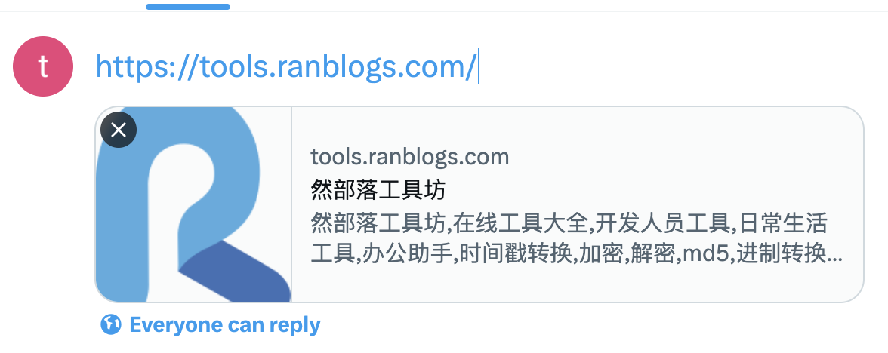

## meta标签

定义文档的字符编码类型， 如`UTF-8`

```html
<meta charset="UTF-8">
```

### http-equiv

定义 `HTTP` 头部信息, 常用可选值有`content-type`，`default-style`，`refresh`

```html
<meta http-equiv="头参数名" content="头参数值">
```

示例1：`X-UA-Compatible`用于告知浏览器以何种版本来渲染页面
```html
<meta http-equiv="X-UA-Compatible" content="ie=edge">
<!--  定义ie浏览器使用最新版本渲染页面-->
```

示例2：`content-Type`用于设定网页字符集（HTML5建议使用charset属性来定义）
```html
<meta http-equiv="content-Type" content="text/html;charset=utf-8">
```

示例3：这将告诉浏览器不要对页面的响应进行转换，保持内容的原始状态。这对于确保动态内容的完整性非常有用。
```html
<meta http-equiv="Cache-Control" content="no-transform" />
```

### name

`name`属性主要用于描述网页，比如网页的关键词，叙述等，以便于搜索引擎查找和搜索引擎优化

- keywords: 用于告诉搜索引擎你的网页的关键字，多个关键字之间用逗号隔开
  - 示例：
  ```html
  <meta name="keywords" content="wiki,vue,html,css,vite,js,ts"/>
  ```
- description: 网站内容的简介描述，大致主题
  - 示例：
  ```html
  <meta name="description" content="专注于互联网技术学习与分享">
  ```
- viewport: 网页的显示视口的设置（如视口大小，缩放设置）
  - 示例
  ```html
  <meta name="viewport" content="width=device-width, initial-scale=1.0,maximum-scale=1.0, user-scalable=no"/>
  ```
  其中`content`属性介绍
  - width：viewport的宽度
  - height ：viewport 的高度
  - user-scalable：是否允许缩放(yes,no)
  - initial-scale：初始化缩放比例（范围为0到10）
  - minimum-scale：允许缩放的最小比例
  - maximum-scale：允许缩放的最大比例
- robots: 用来告诉搜索机器人哪些页面需要索引，哪些页面不需要索引。
  - 示例：
  ```html
  <meta name="robots" content="all"/>
  ```
  - all ：文件将被检索，且页面上的链接可以被查询；
  - none ：文件将不被检索，且页面上的链接不可以被查询；
  - index ：文件将被检索；
  - follow ：页面上的链接可以被查询；
  - noindex ：文件将不被检索，但页面上的链接可以被查询；
  - nofollow ：文件将被检索，但页面上的链接不可以被查询；
- renderer：它为双核浏览器准备，用于指定双核浏览器默认以何种方式渲染页面
  - 示例：例如，在360浏览器中，可以使用以下代码指定使用webkit内核进行渲染
  ```html
  <meta name="renderer" content="webkit">
  ```

### content

定义与 `http-equiv` 或 `name` 属性相关的元信息

### property和Open Graph Protocol

#### 概念

`property`是用于指定元数据的名称和值

`Open Graph Protocol`: `og`是一种新的HTTP头部标记，即`Open Graph Protocol`，这种协议可以让网页成为一个“富媒体对象”

用了`Meta Property=og`标签，就是你同意了网页内容可以被其他社会化网站引用等，目前这种协议被SNS网站如Fackbook、renren采用。

SNS已经成为网络上的一大热门应用，优质的内容通过分享在好友间迅速传播。为了提高站外内容的传播效率，2010年F8会议上Facebook公布 了一套开放内容协议(Open Graph Protocol)，任何网页只要遵守该协议，SNS就能从页面上提取最有效的信息并呈现给用户。

#### 必须属性

- og:title- 对象的标题
- og:description- 对象的描述
- og:image- 一个图像 URL
- og:url- 对象的规范 URL，将用作图表中的永久 ID

> 更多`ogp`信息：https://ogp.me/

#### 实例: 将web中某页面分享到facebook，并以卡片形式显示

`<head>`标签中添加以下内容:
```html
<!-- og:locale: 标记这些标记的区域设置 -->
<meta property="og:locale" content="zh_CN">
<!-- og:title: 标题 -->
<meta property="og:title" content="然部落工具坊">
<!-- og:site_name: 名称 -->
<meta property="og:site_name" content="然部落工具坊">
<!-- og:description: 描述 -->
<meta property="og:description" content="然部落工具坊,在线工具大全,开发人员工具,日常生活工具,办公助手,时间戳转换,加密,解密,md5,进制转换,二维码,正则表达式,json格式化,照片处理,字数统计">
<!-- og:type: 对象的类型，例如，video.movie www.example.com根据您指定的类型，可能还需要其他属性 -->
<meta property="og:type" content="website">
<!-- og:image: 一个图像 URL -->
<meta property="og:image" content="https://oss.oss-cn-shenzhen.aliyuncs.com/toools-web/logo.png">
<!-- og:url: 对象的规范URL，将用作图形中的永久ID -->
<meta property="og:url" content="https://tools.ranblogs.com/">
```

在`twitter`中效果：



## link标签

- href：指明外部资源文件的路径，即告诉浏览器外部资源的位置
- hreflang：说明外部资源使用的语言
- media：说明外部资源用于哪种设备
- rel：必填，表明当前文档和外部资源的关系
- sizes：指定图标的大小，只对属性rel="icon"生效
- type：说明外部资源的 MIME 类型，如text/css、image/x-icon

### rel

- rel核心属性的参数值如下，也可参考 MDN。
- alternate：链接到文档的替代版本
  - 应用：alternate可用于主题样式切换，将css作为预备样式，通过对link使用disabled进行切换。缺点是只能局限在当前页的css切换，很难做到多页的css切换。
- archives：链接到文档集或历史数据
- author：提供指向文档作者的链接
- bookmark：定义文档在收藏夹中显示的书签图标
- canonical：指明网站的规范版本
- dns-prefetch：指定浏览器预先执行目标资源的DNS解析
- external：链接到外部，即告知搜索引擎，此链接不是本站链接
- first：链接到集合中的首个文档
- help：链接帮助信息
- icon：定义网站或网页在浏览器标题栏中的图标
- license：链接到文档的版权信息
- last：链接到集合中的末个文档
- nofollow：指定文档不被搜索引擎跟踪，即某些页面不被爬虫抓取
- next：记录文档的下一页（浏览器可以提前加载此页）
- noreferrer：可以阻止浏览器发送访问来源信息
- preload：对资源进行预加载
- pingback：提供处理当前文档的pingback服务器地址
- prefetch：对资源进行预加载并缓存，通常preload用于加载当前页面的资源，而prefetch用于加载将来页面可能需要的资源
- preconnect：预先连接到目标资源的地址
- prev：记录文档的下一页
- shortcut icon: 设置网站小图标
- search：链接到文档的搜索工具
- stylesheet：指定作为样式表的外部资源
- sidebar：指定浏览器边栏中显示的文档
- tag：指定当前文档使用的标签、关键词
- up：指向一个文档，此文档提供此网页的上下文关系