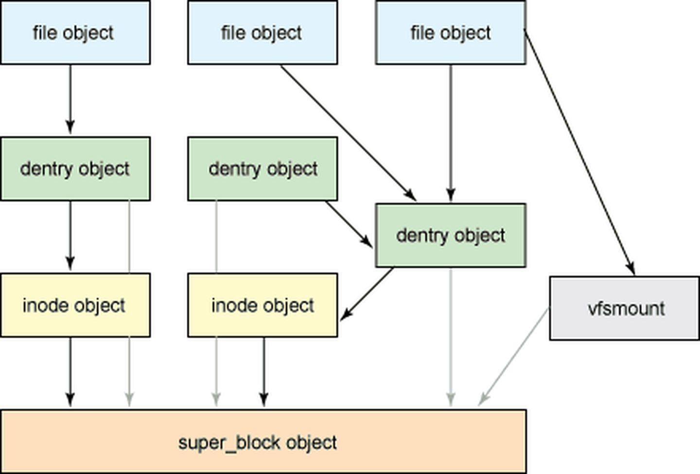
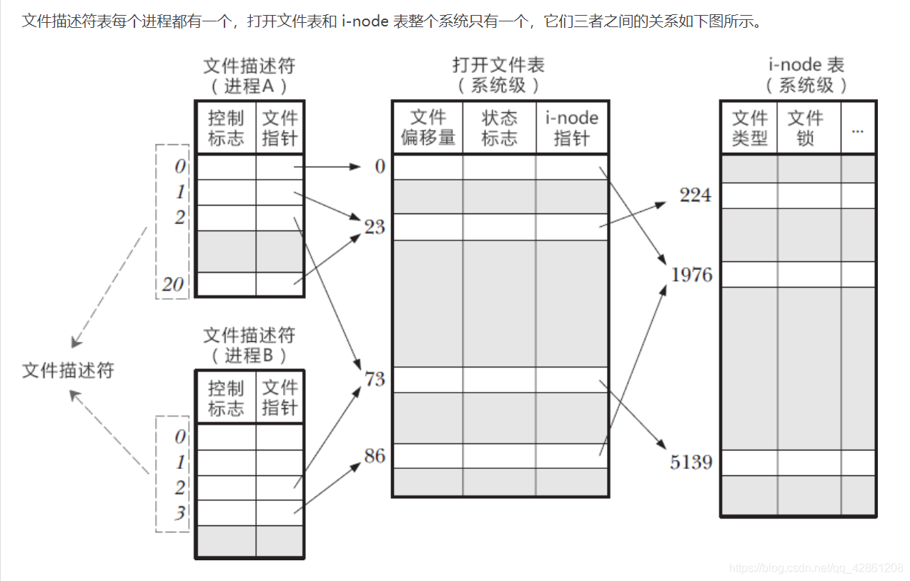

## VFS(虚拟文件系统 Virtual File System)

在linux系统中，"一切皆文件"; 也就是说，你能想到的计算机中的任何东西，在linux中都可以映射成文件，比如线程、硬件等等; 既然一切皆文件，那么操作系统中的信息交流就是通过文件的交流完成的. 

### 定义

VFS，全称Virtual File System，也叫虚拟文件系统。是一个倒置的树状结构。其中根目录是整个树的根; 虚拟文件系统是操作系统内核（kernel）的一个功能; 它的作用就是将所有计算机中的实体抽象成一个文件，每一个目录就映射着计算机的某个区域。

抽象成文件有什么好处呢？

比如要给计算机换一个新硬盘，由于旧硬盘在Linux中已经被抽象成一个目录，那么只要不改动这个目录，底层换硬盘对整个操作系统的运行没有影响。

换句话说，VFS可以将硬件与软件解耦。

### 原理

VFS之所以能够衔接各种各样的文件系统，是因为它抽象了一个通用的文件系统模型，定义了通用文件系统都支持的、概念上的接口。新的文件系统只要支持并实现这些接口，并注册到Linux内核中，即可安装和使用。

例子：linux写一个文件
```shell
int ret = write(fd, buf, len)
```

调用了write()系统调用，它的过程简要如下：
 - 首先，勾起VFS通用系统调用sys_write()处理。
 - 接着，sys_write()根据fd找到所在的文件系统提供的写操作函数，比如op_write()。
 - 最后，调用op_write()实际的把数据写入到文件中。

### 常见的文件系统类型

> df -T: 查看文件系统类型

#### 硬件的文件系统

- ext: 全称Linux extended file system, extfs，即Linux扩展文件系统，Ext2就代表第二代文件扩展系统，Ext3/Ext4以此类推，它们都是Ext2的升级版，只不过为了快速恢复文件系统，减少一致性检查的时间，增加了日志功能，所以Ext2被称为索引式文件系统 ，而Ext3/Ext4被称为日志式文件系统

- xfs: 从centos7开始，默认的文件系统从ext4变成了XFS; xfs是一个全64-bit的文件系统，可以支持上百万T字节的存储空间。对于特大文件及小尺寸文件的支持都表现很出众，支持特大数量的目录。最大可支持的文件大小为263=9x1018=9exabytes，最大文件系统尺寸为18exabytes; 

  xfs支持大文件和大分区。读写文件速度快。

#### 网络文件系统

- nfs: 基于TCP/IP传输的网络文件系统协议
- tfs: 淘宝内部使用的专门用来存放淘宝的图片和文件的文件系统，分布式
- gfs: google存放搜索数据存放的文件系统。分布式
- hdfs: hadoop文件系统

#### 交换分区的文件系统

- swap: 类似于Windows的虚拟内存，就是当内存不足的时候，把一部分硬盘空间虚拟成内存使用,从而解决内存容量不足的情况

### 内部结构和四种对象类型

VFS层通过定义一个清晰的VFS接口，以将文件系统的通用操作和具体实现分开。多个VFS接口的实现可以共存在同一台机器上，它允许访问已装在本地的多个类型的文件系统。

VFS提供了在网络上唯一标识一个文件的机制。VFS基于称为vnode的文件表示结构，该结构包括一个数值标识符以表示位于整个网络范围内的唯一文件。该网络范围的唯一性用来支持网络文件系统。内核中为每个活动节点（文件或目录）保存一个vnode结构。

VFS根据文件系统类型调用特定文件类型操作以处理本地请求，通过调用NFS协议程序来处理远程请求。文件句柄可以从相应的vnode中构造，并作为参数传递给程序。它的下一层实现文件系统类型或远程文件系统协议



#### 超级块

表示整个文件系统; 用于存储文件系统的元信息，由super_block结构体表示，定义在<linux/fs.h>中，元信息里面包含文件系统的基本属性信息

比如：
- 索引节点信息
- 挂载的标志
- 操作方法 s_op
  - 分配inode
  - 销毁inode
  - 读写inode
  - 文件同步
  - 等等
- 安装权限
- 文件系统类型、大小、区块数
- 等等等等

当VFS需要对超级块进行操作时，首先要在超级块的操作方法 s_op 中，找到对应的操作方法后再执行

#### 索引节点

表示一个单独的文件; 索引节点对象包含Linux内核在操作文件、目录时，所需要的全部信息，这些信息由inode结构体来描述，定义在<linux/fs.h>中，主要包含：
- 超级块相关信息
- 目录相关信息
- 文件大小、访问时间、权限相关信息
- 引用计数
- 等等

#### 目录项

表示一个单独的目录项(目录条目); 前面提到VFS把目录当做文件对待，比如/usr/bin/vim，usr、bin和vim都是文件，不过vim是一个普通文件，usr和bin都是目录文件，都是由索引节点对象标识。

由于VFS会经常的执行目录相关的操作，比如切换到某个目录、路径名的查找等等，为了提高这个过程的效率，VFS引入了目录项的概念。一个路径的组成部分，不管是目录还是普通文件，都是一个目录项对象。/、usr、bin、vim都对应一个目录项对象。不过目录项对象没有对应的磁盘数据结构，是VFS在遍历路径的过程中，将它们逐个解析成目录项对象。

目录项由dentry结构体标识，定义在<linux/dcache.h>中，主要包含：
- 父目录项对象地址
- 子目录项链表
- 目录关联的索引节点对象
- 目录项操作指针
- 等等

目录项有三种状态：
- 被使用：该目录项指向一个有效的索引节点，并有一个或多个使用者，不能被丢弃。
- 未被使用：也对应一个有效的索引节点，但VFS还未使用，被保留在缓存中。如果要回收内存的话，可以撤销未使用的目录项。
- 负状态：没有对应有效的索引节点，因为索引节点被删除了，或者路径不正确，但是目录项仍被保留了。

将整个文件系统的目录结构解析成目录项，是一件费力的工作，为了节省VFS操作目录项的成本，内核会将目录项缓存起来。

#### 文件

表示一个打开的文件; 文件对象是进程打开的文件在内存中的实例。Linux用户程序可以通过open()系统调用来打开一个文件，通过close()系统调用来关闭一个文件。由于多个进程可以同时打开和操作同一个文件，所以同一个文件，在内存中也存在多个对应的文件对象，但对应的索引节点和目录项是唯一的。

文件对象由file结构体表示，定义在<linux/fs.h>中，主要包含：
- 文件操作方法
- 文件对象的引用计数
- 文件指针的偏移
- 打开文件时的读写标识
- 等等等等

类似于目录项，文件对象也没有实际的磁盘数据，只有当进程打开文件时，才会在内存中产生一个文件对象。

每个进程都有自己打开的一组文件，由file_struct结构体标识，该结构体由进程描述符中的files字段指向。主要包括：

- fdt
- fd_array[NR_OPEN_DEFAULT]
- 引用计数
- 等

fd_array数组指针指向已打开的文件对象，如果打开的文件对象个数 > NR_OPEN_DEFAULT，内核会分配一个新数组，并将 fdt 指向该数组。

除此之外，内核还为所有打开文件维持一张文件表，包括：
- 文件状态标志
- 文件偏移量
- 等

## 文件描述符

在linux世界里，一切皆文件。而对文件的操作都是通过文件描述符(fd)来进行的

### 文件类型

|文件类型|描述|符号|
|-|-|-|
|普通文件|最常使用的一类文件，其特点是不包含有文件系统信息的结构信息。这种类型的文件是按照其内部结构又可分为纯文本文件(ASCII)、二进制文件(binary)、数据格式的文件(data)、各种压缩文件|REG (-)|
|目录文件|用于存放文件名以及其相关信息的文件，是内核组织文件系统的基本节点|DIR (d)|
|块设备|存储数据以供系统存取的接口设备，简单而言就是硬盘|BLK (b)|
|字符设备|串行端口的接口设备，例如键盘、鼠标等等|CHR （c)|
|套接字|这类文件通常用在网络数据连接。可以启动一个程序来监听客户端的要求，客户端就可以通过套接字来进行数据通信|SOCK(s)|
|管道|一种很特殊的文件，主要用于不同进程的信息传递|FIFO （p)|
|链接|一种特殊文件，指向一个真实存在的文件链接，类似于Windows下的快捷方式，链接文件的不同，又可分为硬链接和软链接|LNK (l)|


通过`ls -ahl`列出文件列表可以查看到文件类型, 下面例子中第一列的`d`, `-`即文件类型
```
drwx------ 10 root root  4096 Apr 24 14:49 .
drwxr-xr-x 20 root root  4096 May 18  2021 ..
-rw-------  1 root root 33653 Apr 24 14:49 .bash_history
-rw-r--r--  1 root root  3209 Nov 18 11:55 .bashrc
```

### 文件描述符

一般指的是Linux中一个进程访问文件的唯一标识; 每个文件描述符出现必然对应一个`文件`, 不同的文件描述符可能对应同一个文件;

现在我们通过`lsof -p $$`查看一下`bash`的文件描述符; `$$`表示本身的即当前进程的`PID`: 
```
COMMAND     PID USER   FD   TYPE DEVICE SIZE/OFF   NODE NAME
bash    3484805 root  cwd    DIR  252,1     4096 393218 /root
bash    3484805 root  rtd    DIR  252,1     4096      2 /
bash    3484805 root  txt    REG  252,1  1183448 786613 /usr/bin/bash
bash    3484805 root  mem    REG  252,1    51832 790211 /usr/lib/x86_64-linux-gnu/libnss_files-2.31.so
bash    3484805 root  mem    REG  252,1  5699248 790271 /usr/lib/locale/locale-archive
bash    3484805 root  mem    REG  252,1  2029224 790188 /usr/lib/x86_64-linux-gnu/libc-2.31.so
bash    3484805 root  mem    REG  252,1    18816 790203 /usr/lib/x86_64-linux-gnu/libdl-2.31.so
bash    3484805 root  mem    REG  252,1   192032 789548 /usr/lib/x86_64-linux-gnu/libtinfo.so.6.2
bash    3484805 root  mem    REG  252,1    27002 805077 /usr/lib/x86_64-linux-gnu/gconv/gconv-modules.cache
bash    3484805 root  mem    REG  252,1   191480 790184 /usr/lib/x86_64-linux-gnu/ld-2.31.so
bash    3484805 root    0u   CHR  136,1      0t0      4 /dev/pts/1
bash    3484805 root    1u   CHR  136,1      0t0      4 /dev/pts/1
bash    3484805 root    2u   CHR  136,1      0t0      4 /dev/pts/1
bash    3484805 root  255u   CHR  136,1      0t0      4 /dev/pts/1
```

上面的`FD`一列即文件描述符: 
  - cwd: 工作目录
  - rtd: 根目录
  - txt: 文本域（进程加载成功后的可执行程序的代码段）
  - mem: 内存映射文件
  - 0: 标准输入 stdin
  - 1: 标准输出 stdout
  - 2: 标准错误输出 stderror

> 注： 例子中的`0u`中的`u`表示读写权限(u:读写; r:读; w:写;)

其中`0`,`1`,`2`已被标准文件描述符占用， 下一个则是4，如果4被占用则是5，依次类推

### 存储方式

系统会为每一个进程维护一个文件描述符表，所有文件描述符都会在这个表里面创建一个索引; 然后利用文件描述符表中的指针找到文件表中的表项，再通过文件表中的指针找到i-node表的表项，而i-node表中存放着数据块在内存或磁盘中的位置

- 文件描述符表：进程级；每个进程都会有一张维护其占用的`fd`表。
- 文件表：系统级；整个系统只会有一份；每个进程在创建文件描述符后都会再这个表里面注册一下；
- i-node表：系统级; 存储文件实际元数据的地方，如文件长度等属性；

关系如下：



## collect

```
// rsz内存
// sork -k5nr; k: 按指定列排序； 5 表示第五列； n 按数值大小排序 r 倒序
ps -e -o 'pid,comm,args,pcpu,rsz,vsz,stime,user,uid'| grep php | sort -k5nr

// 获取内存占用前20的程序
ps -aux| sort -k4nr | head -20

// 获取大于300M的文件
find / -size +300M|xargs du -sh
```


<!--
linux内核中的五大子系统
1.进程调度
2.进程通信
3.内存管理
4.网络接口
5.文件系统

Pagecache
管道

linux文本处理三剑客 - grep
-->


