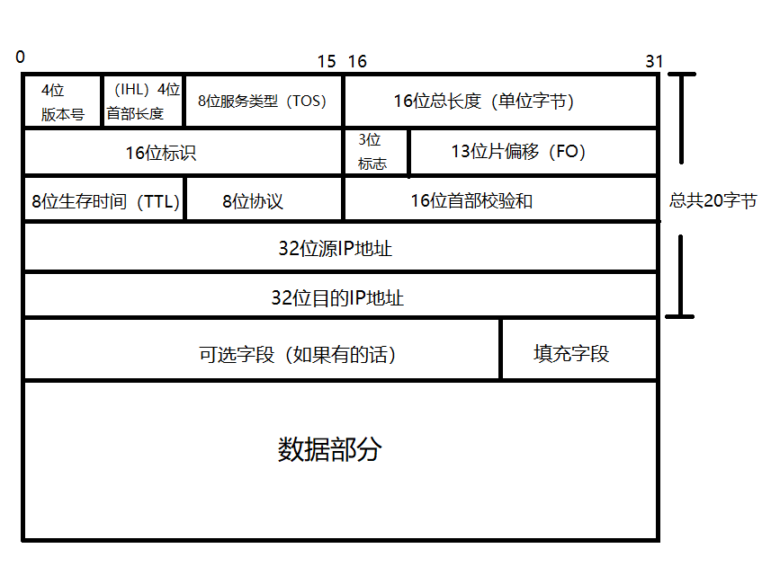

## 概述

### 什么是网络协议

网络协议： 为计算机网络中进行数据交换而建立的规则、标准或约定的集合

网络协议主要由三部分组成：
- 语义: 语义表示要做什么
- 语法: 语法表示要怎么做
- 时序: 时序表示做的顺序

## 网络层次划分

### 作用

分层最大的好处, 类似于面向接口编程, 定义好两层间的接口规范, 让双方来遵守这个规范来对接;

### OSI/RM模型

为了使不同计算机厂家生产的计算机能够相互通信，以便在更大的范围内建立计算机网络，国际标准化组织（ISO）在1978年提出了“开放系统互联参考模型”，即著名的OSI/RM模型（Open System Interconnection/Reference Model）

- 应用层(Application): 针对特定应用的协议： 比如电子邮件的`SMTP`和文件传输的`FTP`等

- 表示层(Presentation): 设备固有数据格式和网络标准数据格式的转换; 比如数据压缩、数据加密以及数据描述等

- 会话层(Session): 通信管理，负责网络中两个节点之间的建立和断开通信连接

- 传输层(Transport): 为两台中级进程之间的通信提供服务，处理数据包错误，数据包次序以及其他一些关键传输问题

- 网络层(Network): 地址管理和路由选择

- 数据链路层(Data Link): 数据链路层通常也叫做链路层。两台主机之间的数据传输，总是在一段一段的链路上传送的，这就需要使用专门链路层协议。在两个相邻节点之间传送数据时，数据链路层将网络层交下来的IP数据报组装成帧，在两个相邻节点间的链路传送帧。
  每一帧的数据可以分成：报头head和数据data两部分；
  - head 标明数据发送者、接受者、数据类型、如MAC 地址
  - data 存储了计算机之间交互的数据

  通过控制信息我们可以知道一个帧的起止比特位置，此外，也能使接收端检测出所收到的帧有无差错，如果发现差错，数据链路层能够简单的丢弃掉这个帧，以避免继续占用网络资源

- 物理层(Physical): 传输信息的介质规格, 将数据以实体呈现并传输的规格; 例如: 你个你的PC插上一张网卡, 你就提供了一个物理层
	- 信道：信息传输的通道，一条传输介质上（比如网线）上可以有多条信道
	- 单工通信: 信号只能往一个方向传输，任何时候都不能改变信号的传输方向; 比如有线电视广播，无线电广播
	- 半双工通信: 信号可以双向传输，但必须是交替进行，同一时间只能往一个方向传输；比如对讲机
	- 全双工通信: 信号可以同时双向传输; 比如手机(打电话和收听同时进行)

### TCP/IP模型

OSI的7层协议体系结构将网络结构定义得非常清楚，理论也比较完整，但相对比较复杂，不太实用。而随着互联网的发展，TCP/IP 的4层体系结构得到了广泛的应用，已经成为事实上的标准

`OSI`和`TCP/IP`协议之间的对应关系：
<table>
	<tr>
	    <td >OSI七层网络模型</td>
	    <td>TCP/IP四层概念模型</td>
	    <td>对应网络协议</td>  
	</tr >
	<tr >
	    <td>应用层</td>
	    <td rowspan="3">应用层</td>
	    <td>HTTP,TFTP,FTP,NFS,WAIS,SMTP,Telent,DNS,SNMP等</td>
	</tr>
	<tr>
	    <td>表示层</td>
	    <td>TIFF,GIT,JPEG,PICT等</td>
	</tr>
	<tr>
	    <td>会话层</td>
	    <td>RPC,SQL,NFS,NetBIOS,names,Apple Talk等/td>
	</tr>
	<tr>
	    <td>传输层</td>
	    <td>传输层</td>
       <td>TCP,UDP,TLS等</td>
	</tr>
	<tr>
       <td>网络层</td>
	    <td>网络层</td>
       <td>IP,ICMP,ARP,RARP,RIP,IPX等</td>
	</tr>
	<tr>
	    <td>数据链路层</td>
	    <td rowspan="2">网络接口层</td>
       <td>FDDI,Frame Relay,HDLC,SLIP,PPP等</td>
	</tr>
	<tr>
	    <td>物理层</td>
	    <td>EIA/TIA-232,EIA/TIA-499,V.35,802.3等</td>
	</tr>
</table>

### OSI/RM和TCP/IP模型比较

相同点: 
- OSI 参考模型与 TCP/IP 参考模型都采用了层次结构。
- 都能够提供面向连接和无连接两种通信服务机制。

不同点:
- OSI 采用的七层模型； TCP/IP 是四层结构。
- TCP/IP 参考模型没有对网络接口层进行细分，只是一些概念性的描述； OSI 参考模型对服务和协议做了明确的区分。
- OSI 先有模型，后有协议规范，适合于描述各种网络；TCP/IP 是先有协议集然后建立模型，不适用于非 TCP/IP 网络。
- TCP/IP 一开始就提出面向连接和无连接服务，而 OSI 一开始只强调面向连接服务，直到很晚才开始制定无连接的服务标准。
- OSI 参考模型虽然被看好，但将网络划分为七层，实现起来较困难；相反，TCP/IP 参考模型虽然有许多不尽人意的地方，但作为一种简化的分层结构还是比较成功的。

## 数据传输过程

### 图示

简图：


示意图：


### 封装

网络中传输的数据是一个一个的数据包，数据包需要想被各层协议处理除了本身传输数据之外，还要带上各个协议的特征值，为协议处理提供线索。为传输数据加上协议特征值的行为就是封装。与封装对应的两个行为就是打包和解包过程。

http发消息数据包打包解包图：


- 打包过程：发送数据的时候随着数据的调用方向由上而下的将经过协议的数据包装于上层协议之外，最后呈现的结果是底层协议内容在外面，上层协议的内容在里面。这就是一个打包的过程。

- 解包过程：接受数据的时候和发送数据时候经历的协议处理过程正好相反。底层协议识别自己协议包内容，将本层内容去除后将里面的内容继续向上传递。这就是一个解包的过程。

## 数据链路层

### 介绍

数据链路层通常也叫做链路层。两台主机之间的数据传输，总是在一段一段的链路上传送的，这就需要使用专门链路层协议。在两个相邻节点之间传送数据时，数据链路层将网络层交下来的IP数据报组装成帧，在两个相邻节点间的链路传送帧

链路: 从1个节点到相邻节点的一段物理线路（有线或无线），中间没有其他交换节点

数据链路: 在一条链路上传输数据时，需要有对应的通信协议来控制数据的传输

不同类型的数据链路所用的通信协议可能是不同的
- 广播信道: CSMA/CD协议（比如同轴电缆、集线器等组成的网络
- 点对点信道: 点对点信道：PPP协议（比如2个路由器之间的信道

数据链路层的3个概念（封装成帧、透明传输、差错检验），任何链路都需要

### 封装成帧

指在一段数据的前后分别添加首部和尾部，然后就构成了一个帧。为了提高帧的传输效率，希望数据部分远远大于首部和尾部之和。同时帧数据部分的长度不能超过MTU（链路层规定的帧数据部分的上限）。可以用控制字符进行帧定界

- 帧（Frame）的数据部分：就是网络层传递下来的数据包（IP数据包，Packet）

- 最大传输单元MTU（Maximum Transfer Unit）
	- 每一种数据链路层协议都规定了所能够传送的帧的数据长度上限
	- 以太网的MTU为1500个字节


封装成帧在数据传输的过程中用途很大，帧定界符的作用明显，假如说有一个数据帧在传输的过程中丢失了一部分的数据包，这个时候传输的过程中断，当恢复传输时，会从头开始发送刚刚因数据传输中断而丢失的数据帧，接收端就会接收到两个数据帧，因为使用了帧定界符，所以可以知道前面接收到的数据帧只有一个SOH定界符，不完整，所以需要丢弃。后面接收到的数据帧具有完整的两个帧定界符，可以确定数据完好无损。

### 透明传输

> 透明传输的含义： 无论数据部分是什么样的比特组合，链路都能将其正确地传输到接收方，接收方都能传输到正确的数据。

由于帧的开始和结束的标记使用专门指明的控制字符（SOH和EOT），因此，所传输的数据中的任何8比特的组合一定不允许和用作帧定界的控制字符的比特编码一样，否则就会出现帧定界的错误


解决帧定界错误的方法： 字节填充法（字符填充法）：发送端的数据链路层在数据中出现控制字符“SOH”或“EOT”的前面插入一个转义字符“ESC”(其十六进制编码是 0x1B)。若ESC也出现在数据中，那么应在ESC前面再插入一个ESC。接收端的数据链路层在将数据送往网络层之前删除插入的转义字符


### 差错检验

数据在传输过程中可能会产生差错，为了保证数据传输的可靠性，在传输数据时必须采用几种差错检测措施。在链路层广泛使用循环冗余校验CRC。

- 循环冗余校验的基本概念
	- 信息码(M)： 实际要发送的数据
	- 冗余码( R )： 附加在信息码后一起发送的，接收方用来校验收到的码字是否正确的码元。
	- 生成码( P )： 用来生成冗余码的码元，而且其二进制位数比冗余码多一位。(通信双方事先规定好的)
	- 生成多项式： 生成码的多项式表示形式。(举例说明)
	- 发送的码字： 信息码+冗余码

### CSMA/CD协议

#### 介绍

CSMA/CD(Carrier Sense Multiple Access/collision detection)，载波监听多点接入/碰撞检测，是广播型信道中采用一种随机访问技术的竞争型访问方法，具有多目标地址的特点。它通过边发送数据边监听线路的方法来尽可能减少数据碰撞与冲突。采用分布式控制方法，所有结点之间不存在控制与被控制的关系

> 注意：在该情形下碰撞不可能完全避免，CSMA/CD只能减少碰撞

- 多点接入:	表示许多计算机以多点接入的方式连接在一根总线上

- 载波监听: 指每一个站在发送数据之前先要检测一下总线上是否有其他计算机在发送数据，如果有，则暂时不要发送数据，以免发生碰撞

- 碰撞测试: 边发送边监听, 计算机边发送数据边检测信道上的信号电压变化情况，以此来判断是否有别人在发送数据。无检测到电压，即信道为'空闲'状态，可以发送数据； 若检测到极大或极小的电压，就说明有两个及以上主机的信号发生了碰撞(电磁波相遇)，此时适配器就会立即停止发送

#### 依旧发生碰撞的解决方法

一段电磁波在总线上是以有限的速率进行传播的，导致从A端传播到B端的电磁波有时延，B端总是不能立马感知到其附近有数据在传输，这时依旧会发生碰撞

##### 争用期


基础参数极其含义:
- τ      ----念"taò"，单程的"端到端"传播时延；`记住:电磁波在1km电缆的传播时延约为5μs = 5*10^(-6)s`
- δ      ----念"deltà"，单纯表示时间间隔

文字解释：
- t = 0  A端开始发送数据a，由于存在时延τ，t = τ-δ时未到达B端
- t = τ-δ  之前，B端监听到其连接的信道为"空闲"，于是在t = τ-δ时发送数据b
- t = τ-3/2δ  时，数据a和数据b发生碰撞，两者的电磁波均出现错误
- t = τ  时，数据a到达B端，B端检测出碰撞
- t = 2τ-δ  时，数据b到达A端，此时数据a还没发完，A端检测出碰撞

当t = τ时，若B端准备发送数据，则会接收到数据a的信号电压，从而立即停止发送动作。而当0<t<τ时，若B端开始准备发送数据，则B端不会检测到数据a，从而发送数据b造成碰撞。所以产生碰撞的参数δ的范围为：δ∈( 0 , τ ]。

根据上面例子得到，主机最多经过`2τ`的时长就可检测到本次发送是否发生了碰撞，因此定义`2τ`为争用期或碰撞窗口

传统以太网(10Mbps)规定`2τ`的取值为`51.2μs`,这相当于以太网的最大端到端的长度为`5km`;

##### 退避时间

定义：以太网使用 截断二进制指数退避算法 来确定碰撞后的重传时机，即检测到碰撞立即停止后，推迟(退避)一个随机的时间段，再重新准备发送数据。

- 退避的算法：
	- 基本退避时间为 2τ
	- 根据重传的次数，定义参数k，按下面的公式计算：
		```
				k = Min[重传次数,10] 
		```
		计算出k之后，再从离散的整数集合[0,1,...,(2^k-1)]之中随机取出一个数，记作r，那么此次重传应推迟/退避的时间为 r*2τ。可见当重传次数小于10次时，参数k等于重传次数本身；但当重传次数超过10次时，参数k变一直等于10，而整数集合也变为了[0,1,...,1023]
	- 当重传次数达到16次仍不能成功时(表明同时打算发送数据的站太多，以致连续发生冲突。)，则丢弃该帧，并向高层汇报。

##### 强化碰撞

当发送数据的主机一旦发现了发生碰撞，除了立即停止发送数据之外，还要继续发送32bit或48bit的人为干扰信号，以便让所有用户都知道现在已经发生了碰撞。

### PPP

> 这里只做基本了解，详情见网络

#### 介绍
PPP(Point-to-Point Protocol): 点对点协议, 为在点对点连接上传输多协议数据包提供了一个标准方法，是数据链路层封装协议的一种方法，支持同步和异步两种传输方式。（除了PPP还有HDLC等，不过HDLC只支持同步方式）

PPP优点： 
- 支持同步传输和异步传输
- 具有良好的扩展性，当需要在以太网链路上承载PPP协议时，可扩展为PPPoE
- 提供了LCP（Link Control Protocol）协议，用于各种链路层协商参数，主要用来建立、监控和铲除数据链路
- 提供了各种NCP（Network Control Protocol），用于网络层参数协商
- 提供了认证：CHAP 、PAP验证认证，保护网络安全性
- 没有重传机制，网络开销小，速度快

#### PPP协议的工作过程

- 当用户拨号接入 ISP 后，就建立了一条从用户PC机到ISP的物理连接。
- PC 机向ISP发送一系列的 LCP 分组(封装成多个 PPP 帧)，以便建立LCP连接，这些分组及其响应选择一些 PPP 参数。
- 接着进行网络层配置，NCP 给新接入的 PC机分配一个临时的 IP 地址，使 PC 机成为因特网上的一个主机。
- 通信完毕时，NCP 释放网络层连接，收回原来分配出去的 IP 地址。
- 接着，LCP 释放数据链路层连接。
- 最后释放的是物理层的连接。

## IP

### IP协议

IP协议: 网络层协议，是TCP/IP协议的核心，所有的TCP，UDP，IMCP，IGMP的数据都以IP数据格式传输。它为上层提供无状态、无连接、不可靠的服务

#### 特点

- 无状态: 指IP通信双方不同步传输数据的状态信息，因此所有IP数据报的发送，传输，接收都是相互独立的。这种服务最大缺点是无法处理乱序和重复的IP数据报。优点是简单高效，和UDP协议与HTTP协议相同，都是无状态协议
- 无连接: 指IP通信双方都不长久的维持对方的任何信息。这表示上层协议每次发送数据，都需要明确指定对方的IP地址
- 不可靠: 指IP协议不能IP数据报能准确到达接收端，只是会尽最大努力。一旦发送失败，就通知上层协议，而不会试图重发

#### IPv4头部结构




- 4位版本号（Version）：用来指定IP协议的版本，IPV4的版本号就是4，如果这个IP报文是IPV4版本，那么这个字段的值就是4，用4位来标识就是0100。IPV6的版本号则是6。

- 4位首部长度（Internet Header Length）：表明IP首部的大小，单位是4个字节，length * 4的字节数，因为这一字段共4个比特位，所以这一字段最大值为2 ^ 4 - 1即15，所以IP首部最大长度为15 * 4即60字节；在默认情况下，该字段被设置为5，所以默认IP首部20字节。

- 8位服务类型（Type Of Service）：前三位表示优先度（已经弃用），第4位表示最低延迟、第5位表示最大吞吐、第6位表示最大可靠性、第7位表示最小代价，这四位互相冲突，只能选择一个。需要根据不同情况进行选择，如果是SSH/TELNET这类远端登录，那么就应该选择最小延时，如果是FTP类型的程序，则应该选择最大吞吐量；第8位是保留位，目前没有使用，必须填0。

- 16位总长度（Total Length）：表示IP首部和后面携带的数据部分一共有多少个字节。该字段有16个比特位，因此IP数据报整体最大长度为65535个字节。

- 16位标识（ID）：唯一地标识主机发送的报文，如果一份IP报文在数据链路层被分片，那么每一片的该字段应该都是相同值。帮助对端主机在接收后进行分片重组。

- 3位标志（Flag）：第一位保留（保留的意思是现在不使用，未来如果需要的话再使用），必须填0；第二位用来指明是否可以分片，如果为0则可以分片，如果为1则不能分片，假如一个IP报文禁止分片且长度还大于了MTU（Maximum Transmission Unit最大传输单元，后面详细介绍），则该本文只能被丢弃；如果报文被分片，第三位为1表示它是分片中段的报文，即后续还有分片报文，如果第三位为0则表示这是最后一片。

- 13位片偏移（Fragment Offset）：该字段表示分片相对于原始IP报文开始处的偏移量，其实就是表示当前分片在原报文中所处的位置，第一个分片对应值为0。由于该字段总共13个比特位，因此最多可以表示2 ^ 13即8192个相对位置。单位为8字节，所以最大可以表示8192 * 8 = 65536个字节的位置。

- 8位生存时间（Time To Live）：数据报到达目的地的最大报文跳数（Hop，指网络中一个区间，IP数据包正是在网络中一个跳间被转发），一般为64，每次经过一个路由，TTL–，如果TTL == 0时还没到达目的地，那么这个报文就会被丢弃。这个字段主要是为了防止出现路由循环，数据包在一个循环中一直转发，浪费网络资源。

- 8位协议（Protocol）：表示IP的上层是什么协议，我们熟知的TCP、UDP、ICMP等都是在IP上层的。

- 16位首部校验和（Header Checksum）：使用CRC进行校验，鉴别IP首部是否收到损坏，如果损坏直接丢弃，它只校验IP头部，不校验下面的内容，因为内容部分的校验是上层传输层（TCP）需要考虑的，IP协议只要发现首部有问题就直接丢弃该报文。

- 32位源IP地址（Source Address）：表示发送端的IP。

- 32位目的IP地址（Destination Address）：表示接收端的IP。

- 选项字段（Options）：不定长，最大可以到40个字节。

### IP地址

#### 定义

IPV4中我们由32位正整数来表示IP地址，计算机内部会直接以二进制来保存IP地址，不过人并不善于记忆二进制整数，所以我们采用点分十进制来记录IP地址：即将32位IP地址每8位一组，分成4组，组间用’ . '进行分隔，再将每组转换为十进制

- 组成
IP地址由2部分组成： 网络标识(网络ID)、主机标识(主机ID)；通过子网掩码(subnet mask)可以得知网络ID、主机ID；主机所在的网段=子网掩码 & IP地址

- 分类: IP地址划分为五个级别，分别为A类、B类、C类、D类和E类（一直没有使用过），所以目前我们所能见到的IP地址只有A、B、C、D四类。划分的依据就是IP地址从第1位到第4位的比特位


	- A类地址：0.0.0.0 ~ 127.255.255.255
	- B类地址：128.0.0.0 ~ 191.255.255.255
	- C类地址：192.0.0.0 ~ 223.255.255.255
	- D类地址：224.0.0.0 ~ 239.255.255.255
	- E类地址：240.0.0.0 ~ 247.255.255.255


#### 子网掩码

随着Internet的飞速发展,这种划分方案的局限性很快显现出来,大多数组织都申请B类网络地址,导致B类地址很快就分配完了,而A类却浪费了大量地址;

例如,申请一个B类地址,理论上一个子网内能允许6万5千多个主机.A类地址的子网内的主机数更多.
- 然后世界网络架设中,不会存在一个子网内有这么多的情况.因此大量的IP地址都被浪费掉了.
- 针对这种情况提出了新的划分方案,称为CIDR(Classless Interdomain Routing):

引入一个额外的子网掩码(subnet mask)来区分网络号和主机号;
- 子网掩码也是一个32位的正整数.通常用一串"0"来结尾;
- 将IP地址和子网掩码进行"按位与"操作,得到的结果就是网络号;
- 网络号和主机号的划分与这个IP地址是A类、B类还是C类无关;

子网掩码是一个与IP相对应的长32bt的二进制串，有一串1和0组成，1对应IP地址中的网络号和子网号，0对应主机号

示例：

|11111111|11111111|11111111|00000000|
|-|-|-|-|
|255|255|255|0|

IP地址和子网掩码还有一种更简洁的表示方法，例如 140.252.20.68/24。表示IP地址为140.252.20.68，子网掩码的高24位是1，也就是255.255.255.0

### 特殊的IP地址

在IP地址中有一些并不是来标注主机的，这些地址具有特殊的意义。这些地址包括网络地址、直接广播地址、受限广播地址、本网络地址、环回地址等

#### 直接广播

直接广播（Direct Broadcast Address）：向某个网络上所有的主机发送报文。TCP/IP规定，主机号各位全部为“1”的IP地址用于广播，叫作广播地址。路由器在目标网络处将IP直接广播地址映射为物理网络的广播地址，以太网的广播地址为6个字节的全“1”二进制位，即：ff:ff:ff:ff:ff:ff 。

直接广播地址只能作为目的地址。

A类网络的直接广播地址为：Network-number.255.255.255。例如，120.255.255.255；
B类网络的直接广播地址为：Network-number.255.255。例如，139.22.255.255；
C类网络的直接广播地址为：Network-number.255。例如，203.120.16.255。

#### 环回地址

环回地址（Loopback Address）127.0.0.1---127.255.255.254 是一种特殊的 IP 地址，它允许计算机的软件组件在本地主机上进行网络通信，也称作本地回环地址。 

在计算机网络中，环回地址是一个虚拟地址，它不属于任何网络，而是指向自己的计算机。因此，当你使用环回地址发送数据时，数据会在本地计算机上循环，并不会被发送到其他计算机或网络。 

环回地址常用于调试和测试网络软件，因为它可以让你在本地计算机上模拟网络通信。此外，它也可用于在本地计算机上运行服务器软件，例如 Web 服务器或数据库服务器。 总的来说，环回地址是一个非常重要的网络概念，它在计算机网络的很多方面都有用处。

可以用环回地址来测试本机的网络配置：

测试本机网络的网络配置，能被`ping`通`127.0.0.1`说明本机的网卡和IP协议安装都没有问题

#### 受限广播地址

直接广播要求发送方必须知道信宿网络的网络号。但有些主机在启动时，往往并不知道本网络的网络号，这时候如果想要向本网络广播，只能采用受限广播地址（Limited Broadcast Address）。

受限广播地址是在本网络内部进行广播的一种广播地址。TCP/IP规定，32比特全为“1”的IP地址用于本网络内的广播。

255.255.255.255

受限广播地址只能作为目的地址。

路由器隔离受限广播，不对受限广播分组进行转发。也就是说因特网不支持全网络范围的广播。

#### 网络地址

TCP/IP协议规定，网络号各位全部为“0”时表示的是本网络。本网络地址分为两种情况：本网络特定主机地址和本网络本主机地址。

本网络特定主机地址只能作为源地址。

比如125.175.1.1的子网掩码为255.224.0.0
那么网络地址为125.160.0.0

无盘工作站启动时没有IP地址，此时采用网络号和主机号都为“0”的本网络本主机地址作为源地址。

## ARP协议

> TODO

## MAC地址

### 介绍

MAC地址(Media Access Control Address)又叫物理地址：MAC地址是链路层地址，每个网卡都有一个6字节(48bit)的MAC地址；MAC地址全球唯一，固化在网卡ROM中，由IEEE802标准规定;

网络通信都需要获取到网卡的MAC地址，如果通信方只知道对方的IP地址，此时就会发送一个ARP广播通过目标IP获取MAC地址然后完成通信;

### 组成
前三位有IEEE分发而后三位是由厂商自己分发:

|组织唯一标识符|网络唯一标识符|
|-|-|
|A4-83-E7|B2-57-C2|

MAC地址的表现形式：
- windows: A4-83-E7-B2-57-C2
- linux、mac、ios、android： A4:83:E7:B2:57:C2
- 广播地址: FF-FF-FF-FF-FF-FF

### 查询MAC地址

- windows: 使用命令`ipconfig`

- linux/mac: 使用命令`ifconfig`

示例： 其中`ether`就是MAC地址
```
en0: flags=8863<UP,BROADCAST,SMART,RUNNING,SIMPLEX,MULTICAST> mtu 1500
        ether a4:83:e7:b2:57:c2 
        inet6 fe80::481:858f:f5c1:e316%en0 prefixlen 64 secured scopeid 0xa 
        inet 192.168.4.127 netmask 0xffffff00 broadcast 192.168.4.255
        nd6 options=201<PERFORMNUD,DAD>
        media: autoselect
        status: active
```

- ARP广播获取: 见[ARP协议](#ARP协议)


<!-- --------two -->


<!-- ## ARP
## ICMP
## PING
## Traceroute
## IP选路

## UDP
## 广播与多播
## DNS
## TFTP

## TCP

## 协议分析（ftp, telnet, http, smtp/pop3, ssl, snmp, sip）
 -->

<!--  -->
<!-- 

## io模型

## http,https

## TCP/IP

#### BIO
#### NIO

非阻塞io


问题： 每次循环系统调用时可能只有个别回应，这样会有很多无意义的调用


多路复用：

```
? [异]同步IO模型
select
poll
epoll
```

#### AIO


### 应用层协议

协议： 双方约定

### 传输控制层

tcp: 面向连接的可靠传输协议

三次握手：

keepalive: 当3次握手完成后，服务器宕机或断网，客户端会依旧保持链接， 这时keepalive（心跳）会检测是否继续连接

可靠的：


资源：d

fd:

socket:

插座/套接字：

四元组：
  源：ip+port 目标：ip+port
  具备唯一性

port: 端口
  可分配的数量： 65535

## IO

什么是IO: 

### 程序的运行方式

```
cpu - 代码段中读取指令
调用: 方法的内存地址(FC)
保护模式

晶振： 
  时钟中断
IDT(中断向量表 or ?)
进程调度
```
```
进程,线程,协程
同步/异步
阻塞,非阻塞
并发,并行

``` -->