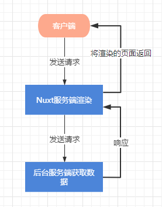
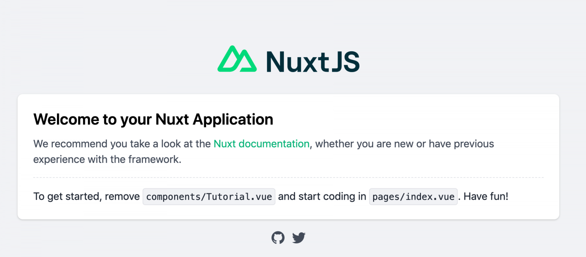

## 介绍

Nuxt.js 是一个基于 Vue.js 的通用应用框架。

采用vue开发的应用系统SEO不友好，因此可以使用Nuxt的服务端渲染(SSR)解决SEO问题

Nuxt官网地址：`https://www.nuxtjs.cn/`

Nuxt工作原理简单示意：




## 安装

以下两种安装方式选一即可（npx在npm安装的时候就默认安装了）：
```
npx create-nuxt-app <项目名>

# 或

yarn create nuxt-app <项目名>
```

安装过程会有一些选项比如: 用什么ui框架、渲染模式（ssr/spa）等，根据自己的需求选择

安装完成后进入项目启动:
```
cd <项目名>
npm run dev
```

访问`http//localhost:3000/`:




## 目录结构
```
.nuxt
assets                //用于组织未编译的静态资源如 LESS、SASS 或 JavaScript
components            //用于组织应用的 Vue.js 组件； 注意这里面的组件不能使用asyncData
layouts               //布局目录
middleware            //中间件
pages                 //用于存放页面。Nuxt读取该目录下所有的.vue文件并自动生成对应的路由配置
plugins               //用于存放插件
static                //存放应用的静态文件，该目录下的文件会映射至应用的根路径 / 下
store                 //用于组织应用的 Vuex 状态树 文件
.editorconfig         //开发工具格式配置
nuxt.config.js        //文件用于组织 Nuxt.js 应用的个性化配置，以便覆盖默认配置
package.json          //文件用于描述应用的依赖关系和对外暴露的脚本接口
```

## 配置

### 配置ip和端口, 可解决端口冲突问题


在`/package.json`中添加以下内容

```
"config": {
  "nuxt": {
    "host": "127.0.0.1",
    "port": 3002
  }
}
```

### 配置全局css

在`/nuxt.config.js`中添加要使用的css资源
```
css: [
  'element-ui/lib/theme-chalk/index.css',
  '~/assets/css/reset.css',
  '~/assets/css/common.css',
  '~/assets/css/normailze.css',
],
```

### 环境变量配置
在`/nuxt.config.js`中添加环境变量，
```
env: {
  baseUrl: process.env.BASE_URL || 'http://localhost:3001'
}
```

使用方式：

可以通过`process.env.baseUrl`获取，还可以通过`context`获取，可参考：`https://www.nuxtjs.cn/api/configuration-env`

### head配置

在`/nuxt.config.js`中修改head配置meta信息
```
head: {
  //title标签内容
  title: 'title',
  //html标签属性
  htmlAttrs: {
    lang: 'zh'
  },
  //meta标签
  meta: [
    { charset: 'utf-8' },
    { name: 'viewport', content: 'width=device-width, initial-scale=1' },
    { hid: 'description', name: 'description', content: '' },
    { name: 'format-detection', content: 'telephone=no' }
  ],
  //link标签
  link: [
    { rel: 'icon', type: 'image/x-icon', href: '/favicon.ico' }
  ]
}
```

### 模板
在`npm run dev`后会生成一个默认的html模板页面`.nuxt/views/app/template.html`,
`{{ HEAD }}`就对应head的内容，`{{ HTML_ATTRS }}`对应html标签属性head中设置的`htmlAttrs`

```
<!DOCTYPE html>
<html {{ HTML_ATTRS }}>
  <head {{ HEAD_ATTRS }}>
    {{ HEAD }}
  </head>
  <body {{ BODY_ATTRS }}>
    {{ APP }}
  </body>
</html>
```

如果不喜欢默认的模板页面可以在应用根目录创建`app.html`覆盖Nuxt的默认模板

```
<!DOCTYPE html>
<html {{ HTML_ATTRS }}>
  <head {{ HEAD_ATTRS }}>
    {{ HEAD }}
  </head>
  <body {{ BODY_ATTRS }}>
    <div>自定义内容</div>
    {{ APP }}
    <div>自定义内容</div>
  </body>
</html>
```

### 布局

#### 默认布局

可通过添加 `layouts/default.vue` 文件来扩展应用的默认布局。

> `<nuxt />`组件用于显示页面的主体内容

```
<template>
  <nuxt />
</template>
```

#### 自定义布局

1: 创建一个 博客布局 并将其保存到layouts/blog.vue:

```
<template>
  <div>
    <div>我的博客导航栏在这里</div>
    <nuxt />
  </div>
</template>
```
2: 使用布局

在pages目录下面的页面通过`layout`属性引用自定义组件布局

```
<template>
  <!-- Your template -->
</template>
<script>
  export default {
    //layout: 'blog',
    //或者
    layout(context) {
        return 'blog';
    }
  }
</script>
```

### 错误页面

添加 layouts/error.vue 文件来定制化错误页面；如下：
```
<template>
  <div class="container">
    <h1 v-if="error.statusCode === 404">页面不存在</h1>
    <h1 v-else>应用发生错误异常</h1>
    <nuxt-link to="/">首 页</nuxt-link>
  </div>
</template>

<script>
  export default {
    props: ['error'],
    layout: 'blog' // 你可以为错误页面指定自定义的布局
  }
</script>
```

## 插件

Nuxt.js 允许您在运行 Vue.js 应用程序之前执行 js 插件。这在您需要使用自己的库或第三方模块时特别有用。

### 注入vue实例

将内容注入 Vue 实例，避免重复引入，在 Vue 原型上挂载注入一个函数，所有组件内都可以访问(不包含服务器端)。

`plugins/vue-inject.js`:
```
import Vue from 'vue'

Vue.prototype.$myInjectedFunction = string =>
  console.log('This is an example', string)
```

`nuxt.config.js`:
```
export default {
  plugins: ['~/plugins/vue-inject.js']
}
```

使用方式：
```
export default {
  mounted() {
    this.$myInjectedFunction('test')
  }
}
```

### 注入context

`plugins/ctx-inject.js`:
```
export default ({ app }, inject) => {
  // Set the function directly on the context.app object
  app.myInjectedFunction = string =>
    console.log('Okay, another function', string)
}
```

`nuxt.config.js`:
```
export default {
  plugins: ['~/plugins/ctx-inject.js']
}
```

使用方法如下，只要获得context就能使用该方法
```
export default {
  asyncData(context) {
    context.app.myInjectedFunction('ctx!')
  }
}
```

### 同时注入

如果您需要同时在context，Vue实例，甚至Vuex中同时注入，您可以使用inject方法,它是 plugin 导出函数的第二个参数。将内容注入 Vue 实例的方式与在 Vue 应用程序中进行注入类似。系统会自动将$添加到方法名的前面。

`plugins/combined-inject.js`:
```
export default ({ app }, inject) => {
  inject('myInjectedFunction', string => console.log('That was easy!', string))
}
```

`nuxt.config.js`:
```
export default {
  plugins: ['~/plugins/combined-inject.js']
}
```

使用
```
export default {
  mounted() {
    this.$myInjectedFunction('works in mounted')
  },
  asyncData(context) {
    context.app.$myInjectedFunction('works with context')
  }
}
```

### 只在客户端中使用插件
```
export default {
  plugins: [
    { src: '~/plugins/both-sides.js' },
    { src: '~/plugins/client-only.js', mode: 'client' },  //插件只会在客户端运行
    { src: '~/plugins/server-only.js', mode: 'server' },  // 插件只会在服务端运行
  ]
}
```

## 请求数据

Nuxt.js 扩展了 Vue.js，增加了一个叫 asyncData 的方法，使得我们可以在设置组件的数据之前能异步获取或处理数据。

asyncData方法会在组件（限于页面组件）每次加载之前被调用。它可以在服务端或路由更新之前被调用。在这个方法被调用的时候，第一个参数被设定为当前页面的上下文对象，你可以利用 asyncData方法来获取数据，Nuxt.js 会将 asyncData 返回的数据融合组件 data 方法返回的数据一并返回给当前组件。

> 注意：由于asyncData方法是在组件 初始化 前被调用的，所以在方法内是没有办法通过 this 来引用组件的实例对象。

### 返回 Promise
```
export default {
  // 加载组件之前服务端会调用
  asyncData({ params }) {
    return axios.get(`https://my-api/posts/${params.id}`).then(res => {
      return { title: res.data.title }
    })
  }
}
```

### 使用 async 或 await
```
export default {
  async asyncData({ params }) {
    const { data } = await axios.get(`https://my-api/posts/${params.id}`)
    return { title: data.title }
  }
}
```

### 跨域处理

通过配置代理解决

`nuxt.config.js`:
```
modules: [
  '@nuxtjs/axios',
],

axios: {
  proxy: true,    //开启代理转发
  prefix: '/api'  //接口前缀
},
```

### 拦截器

TODO 

> tr~tr https://blog.csdn.net/Tomwildboar/article/details/96743849

### 插件方式调用Api(解耦)

1: 创建api插件

2: 引入插件

3: 调用

## 路由

Nuxt依据pages目录结构自动生成vue-router模块的路由配置

### 基础路由

### 动态路由

### 路由参数校验

### 嵌套路由

## 中间件

## 打包和部署