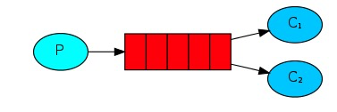
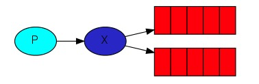
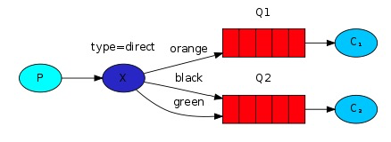
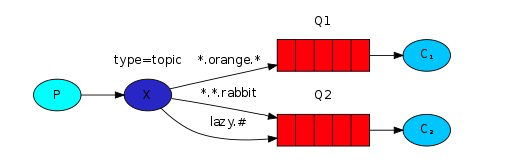

## MQ(message queue)
```
优势:
应用解耦
异步提速
削峰填谷
```
## RabbitMQ简介

### 官网
https://www.rabbitmq.com

### 基础概念
Broker： 接收和分发消息的应用

Virtual host: 虚拟主机，一个broker里可以开设多个vhost，用作不同用户的权限分离

Connection: publisher/consumer和broker之间的TCP连接

Channel:connectiion的逻辑连接；处理每次访问rabbitmq都建立一个connection造成巨大开销。

Exchange: 交换机； 根据分发规则，匹配路由分发消息到queue中。常用类型：direct(point-to-point), topic(publish-subscribe), fanout(multicast)

Queue:队列

Binding: exchage和queue建立的虚拟连接。

Publisher: 消息生产者

Consumer: 消息消费者


## 安装rabbitMQ以及扩展

### 安装rabbitMQ

docker方式:

management版本的有可视化管理面板
```
docker run -it --name rabbitmq -p 5672:5672 -p 15672:15672 rabbitmq:3-management

管理页面：127.0.0.1:15672

初始用户/密码：guest/guest
```

其他方式: 

```
brew install rabbitmq-c
or
yum install rabbitmq-c
or 
github自行源码cmake安装
```

### 安装php的amqp扩展

```
wget http://pecl.php.net/get/amqp-1.10.2.tgz
``` 

解压后进入目录:

```
解压:
tar -zxvf amqp-1.10.2.tgz

进入目录后执行: 
phpize

安装amqp需要librabbitmq依赖,需要指定rabbitmq的安装目录, 我这里的目录是brew安装后的目录, 不是mac的可以通过下载rabbit-c后cmake安装:

下载地址: https://github.com/alanxz/rabbitmq-c/archive/master.zip
安装请参考: https://blog.csdn.net/weixin_33726313/article/details/91963653

./configure --with-php-config=/Applications/MAMP/bin/php/php7.4.2/bin/php-config -with-amqp --with-librabbitmq-dir=/usr/local/Cellar/rabbitmq-c/0.9.0

make && make install
```

php.ini中引入扩展:

```
extension=amqp.so
```

### 安装php-amqplib/php-amqplib

```
composer require php-amqplib/php-amqplib
```

## rabbitmqctl命令的使用

> https://www.rabbitmq.com/rabbitmqctl.8.html

## RabbitMQ使用

### 简单的使用

```
说明: 最简单的处理方式, 发送者发送消息到队列, 消费者连接队列消费(这里使用使用默认的exchange)
```


消息生产者: publisher.php

```
//引入auoload
require_once __DIR__ . '/../../vendor/autoload.php';
use PhpAmqpLib\Connection\AMQPStreamConnection;
use PhpAmqpLib\Message\AMQPMessage;

//连接
$connection = new AMQPStreamConnection('10.8.7.15', 5672, 'admin', 'admin');

//创建管道
$channel = $connection->channel();

//声明一个队列
$queue_name = 'hello';
$channel->queue_declare($queue_name);

//设置消息并发送队列
$msg = new AMQPMessage('hello world');
$channel->basic_publish($msg, '', $queue_name);

//关闭通道和连接
$channel->close();
$connection->close();
```

消息消费者: consumer.php

```
//加载autoload
require_once __DIR__ . '/../../vendor/autoload.php';
use PhpAmqpLib\Connection\AMQPStreamConnection;

//连接
$connection = new AMQPStreamConnection('10.8.7.15', 5672, 'admin', 'admin');

//创建管道
$channel = $connection->channel();

//声明一个队列
$queue_name = 'hello';
$channel->queue_declare($queue_name);

//定义回调
$callback = function ($msg) {
    echo 'received:' . $msg->body;
};

//消费队列
$channel->basic_consume($queue_name, '', false, true, false, false, $callback);

//监听回调并执行回调程序
while ($channel->is_consuming()) {
    $channel->wait();
}
```

执行:
```
启动消费者(ctrl+C 断开): 
php consumer.php

发送队列:
php publisher.php
```

### work queues(工作队列)

说明: 发送者发送队列后多个消费者来分配处理任务



循环调度: 运行多个consumer, publisher发送多个队列后, RabbitMQ会按顺序依次派发任务给consumer;


消息确认: 为了确保消息永不丢失，RabbitMQ支持消息确认。消费者发送回一个确认（acknowledgement）以告知RabbitMQ已经接收，处理了特定的消息，并且RabbitMQ可以自由删除它;

注意: rabbitmq无法释放任何未确认的消息,会导致rabbitmq消耗越来越多的内存,这时可以使用rabbitmqctl打印messages_unacknowledged

```
sudo rabbitmqctl list_queues name messages_ready messages_unacknowledged
```

消息持久化: RabbitMQ退出或崩溃时，除非您告诉它，否则它将忘记队列和消息。确保消息不会丢失需要做两件事：我们需要将队列和消息都标记为持久.(注: 对已经存在的队列不生效)

公平派遣: rabbitmq它只是盲目地将每第n条消息发送给第n个consumer,并不会查看消费者的未确认消息数.这样有时会导致有的consumer很忙碌,而有的又很闲; 我们可以通过basic_qos来控制;比如在处理并确认上一条消息之前，不要将新消息发送给consumer;


消息生产者: publisher.php
```
//引入auoload
require_once __DIR__ . '/../../vendor/autoload.php';
use PhpAmqpLib\Connection\AMQPStreamConnection;
use PhpAmqpLib\Message\AMQPMessage;

//接收参数组合成字符串
$data = implode('', array_splice($argv, 1)) ?? 'default!';
$data = !empty($data) ? $data : 'default!';

//连接
$connection = new AMQPStreamConnection('10.8.7.15', 5672, 'admin', 'admin');

//创建管道
$channel = $connection->channel();

//声明一个队列
$queue_name = 'task2';
//durable参数(第三个): 设置为true时标记为持久,rabbitmq重启后将依然存在
$channel->queue_declare($queue_name, false, true);

//设置消息并发送队列(delivery_mode: 设置消息持久性)
$msg = new AMQPMessage($data, ['delivery_mode' => AMQPMessage::DELIVERY_MODE_PERSISTENT]);
$channel->basic_publish($msg, '', $queue_name);

//关闭通道和连接
$channel->close();
$connection->close();
```

消息消费者: consumer.php
```
//加载autoload
require_once __DIR__ . '/../../vendor/autoload.php';
use PhpAmqpLib\Connection\AMQPStreamConnection;

//连接
$connection = new AMQPStreamConnection('10.8.7.15', 5672, 'admin', 'admin');

//创建管道
$channel = $connection->channel();

//声明一个队列
$queue_name = 'task2';
$channel->queue_declare($queue_name, false, true);

//定义回调
$callback = function ($msg) {
    echo 'received:' . $msg->body, "\n";
    //模拟程序执行时间
    sleep(5);
    //告诉rabbitmq该消息已经处理
    $msg->delivery_info['channel']->basic_ack($msg->delivery_info['delivery_tag']);
};

//上一个消息未处理完时,不再接收新的消息
$channel->basic_qos(null, 1, null);
//消费队列(no_ack=false时(第四个),启用消息确认)
$channel->basic_consume($queue_name, '', false, false, false, false, $callback);

//监听回调并执行回调程序
while ($channel->is_consuming()) {
    $channel->wait();
}

//关闭通道和连接
$channel->close();
$connection->close();
```

### publish/subcribe



exchange types(交换类型)
```
direct: 默认; 与队列中routing key进行精准匹配

topic: 主题模式, 下面有使用方法

headers: 与direct的模式不同，不是使用routingkey去做绑定。而是通过消息headers的键值对匹配

fanout: 将接收到的所有消息广播到它知道的所有队列中
```

消息生产者: publisher
```
//引入auoload
require_once __DIR__ . '/../../vendor/autoload.php';
use PhpAmqpLib\Connection\AMQPStreamConnection;
use PhpAmqpLib\Message\AMQPMessage;

//连接
$connection = new AMQPStreamConnection('10.8.7.15', 5672, 'admin', 'admin');

//创建管道
$channel = $connection->channel();

//声明交换机
$exchang_name = 'logs2';
$channel->exchange_declare($exchang_name, 'fanout', false, false, false);


//声明一个队列
$queue_name = 'task6';
$channel->queue_declare($queue_name);

//设置消息并发送队列
$msg = new AMQPMessage('hello world');
$channel->basic_publish($msg, $exchang_name, $queue_name);

//关闭通道和连接
$channel->close();
$connection->close();
```

消息消费者: consumer
```
//加载autoload
require_once __DIR__ . '/../../vendor/autoload.php';
use PhpAmqpLib\Connection\AMQPStreamConnection;

//连接
$connection = new AMQPStreamConnection('10.8.7.15', 5672, 'admin', 'admin');

//创建管道
$channel = $connection->channel();

//声明交换机
$exchang_name = 'logs2';
$channel->exchange_declare($exchang_name, 'fanout', false, false, false);

//声明一个队列, 队列名称随机
list($queue_name) = $channel->queue_declare("");

//绑定队列和交换机
$channel->queue_bind($queue_name, $exchang_name);

//定义回调
$callback = function ($msg) {
    echo 'received:' . $msg->body, "\n";
};

//消费队列
$channel->basic_consume($queue_name, '', false, true, false, false, $callback);

//监听回调并执行回调程序
while ($channel->is_consuming()) {
    $channel->wait();
}

//关闭通道和连接
$channel->close();
$connection->close();
```

记录日志
```
php sub_consumer.php>logs_from_rabbit.log
```

### routing

说明: 队列和routing绑定后,不在绑定范围内的将不再处理



消息产生者: 
```
//引入auoload
require_once __DIR__ . '/../../vendor/autoload.php';
use PhpAmqpLib\Connection\AMQPStreamConnection;
use PhpAmqpLib\Message\AMQPMessage;

//接收参数组合成字符串
$routing_key = $argv[1];    //获取提示信息
//将第三个参数组合成字符串
$data = implode('', array_splice($argv, 2));
$data = !empty($data) ? $data : 'default!';

//连接
$connection = new AMQPStreamConnection('10.8.7.15', 5672, 'admin', 'admin');

//创建管道
$channel = $connection->channel();

//声明交换机
$exchange_name = 'logs_record';
$channel->exchange_declare($exchange_name, 'direct');

//设置消息并发送队列
$msg = new AMQPMessage($data);
$channel->basic_publish($msg, $exchange_name, $routing_key);

//关闭通道和连接
$channel->close();
$connection->close();
```

消息消费者:
```
//加载autoload
require_once __DIR__ . '/../../vendor/autoload.php';
use PhpAmqpLib\Connection\AMQPStreamConnection;


//连接
$connection = new AMQPStreamConnection('10.8.7.15', 5672, 'admin', 'admin');

//创建管道
$channel = $connection->channel();

//声明交换机
$exchange_name = 'logs_record';
$channel->exchange_declare($exchange_name, 'direct');

//声明一个队列
list($queue_name) = $channel->queue_declare("");

//绑定队列,交换机,routing
$params = array_slice($argv, 1);
foreach ($params as $param) {
    $channel->queue_bind($queue_name, $exchange_name, $param);
}

//定义回调
$callback = function ($msg) {
    echo 'received:' . $msg->delivery_info['routing_key'] . ':' . $msg->body, "\n";
};

//消费队列
$channel->basic_consume($queue_name, '', false, false, false, false, $callback);

//监听回调并执行回调程序
while ($channel->is_consuming()) {
    $channel->wait();
}

//关闭通道和连接
$channel->close();
$connection->close();
```

### topics



说明:代码和上面的类似.交换机类型换成`topic`,案例如下
```
接收所有日志：
php receive_logs_topic.php “＃”

要从设施“ kern ”接收所有日志：
php receive_logs_topic.php “ kern.*”

或者，如果您只想听听“关键”日志：
php receive_logs_topic.php “ *.critical”

您可以创建多个绑定：
php receive_logs_topic.php “ kern.*”  “*.critical”

并发出带有路由键“ kern.critical ”类型的日志：
php emit_log_topic.php "kern.critical" "A critical kernel error"
```

## laravel结合RabbitMQ

> 参考: https://blog.csdn.net/weixin_44600422/article/details/106317870

## FAQ

### 报错: 已经安装了amqp还是报Class 'PhpAmqplib\Connection\AMQPLazyConnection' not found

```
1: 检查php是否安装了amqp扩展

2: 在使用时一定要先引入自动加载的文件: 如下
require __DIR__.'/../vendor/autoload.php';
```

### 报错: The connection timed out after 3 sec while awaiting incoming data 

原因: 由于我使用的是默认的用户guest登录, 而该用户不允许远程登录;

解决: 
```
# 进入docker(非docker运行的忽略此步骤)
docker exec -ti rabbitmq /bin/bash

# 增加用户
rabbitmqctl add_user admin admin

# 设置tag(类似用户组)
rabbitmqctl set_user_tags admin administrator

# 设置权限
rabbitmqctl set_permissions -p / admin ".*" ".*" ".*"
```

### 报错: make的时候报/usr/bin/ld: cannot find -lrabbitmq错误

原因: 找不到库文件librabbitmq.so

解决: 参考https://www.cnblogs.com/chenhaoyu/p/13925905.html
```
1: 找到扩展的位置
find / -name librabbitmq.so

2: 将库文件所在的路径加入到 /etc/ld.so.conf 尾部，并使之生效
echo '/disk2/temp/rabbitmq-c-master/build/librabbitmq/' >> /etc/ld.so.conf

3: 刷新配置文件使之生效
ldconfig

4: 修改环境变量，加入库的文件路径
export LIBRARY_PATH=/disk2/temp/rabbitmq-c-master/build/librabbitmq/:$LIBRARY_PATH

查看是否已经添加: export -p

5: 将上述 export 命令加入到配置文件 ~/.bashrc，使之永久生效。
echo 'LIBRARY_PATH=/disk2/temp/rabbitmq-c-master/build/librabbitmq/:$LIBRARY_PATH' >> ~/.bashrc

6: 刷新配置
source ~/.bashrc
```

<!-- ## 防止消息丢失 -->

<!-- ### 消息持久化 -->

<!-- ### 消息应答机制 -->

<!-- ### 事务 -->

<!-- 死信队列 -->


