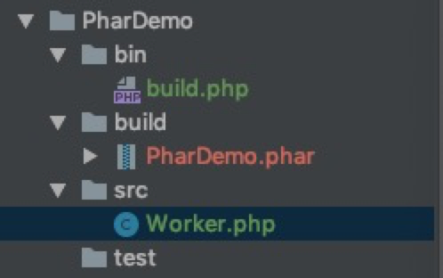

```
迭代器，生成器
ArrayAccess的使用场景
封装一个协程框架
zval
php phar
```


## Phar打包

### 开启配置

> 默认phar扩展是只读模式，需要在php.ini中手动配置
> 注意：无法使用`ini_set()`修改

```ini
[Phar]
; http://php.net/phar.readonly
;phar.readonly = On
phar.readonly = Off
```

### 打包

> 先看一下目录结构



```php
/**
 * phar打包程序
 */

//开启错误提示
ini_set("display_errors","On");
error_reporting(E_ALL);

//设置路径
$src = "../src/";
$build = "../build/";
$filename = 'PharDemo.phar';

//创建phar对象
$phar = new Phar($build . $filename, FilesystemIterator::CURRENT_AS_FILEINFO | FilesystemIterator::KEY_AS_FILENAME, $filename);

//设置需要构建的文件目录归档
$phar->buildFromDirectory($src);

//压缩当前归档的目录中所有文件
$phar->compressFiles(\Phar::GZ);

//setStub: 创建stub文件，stub文件用来告诉Phar在被加载时干什么
//createDefaultStub: 创建默认stub
$phar->setStub($phar->createDefaultStub());
```