## DHCP协议

> 动态主机配置协议 (DHCP，Dynamic Host Configuration Protocol)

1. 客户机/服务器模型
2. 租约默认为8天
3. 当租约过半时，客户机需要向DHCP服务器申请续租;
4. 当租约超过87.5%时，如果仍然没有和当初提供IP的DHCP服务器联系上,则开始联系其他的DHCP服务器
5. 固定分配、动态分配和自动分配(手动分配)。
6. 169.254.X.X 和 0.0.0.0： 当没有分配的IP时，DHCP会分配无效的ip

## DNS协议

> 域名系统 (DNS，Domain Name System)

方式一：

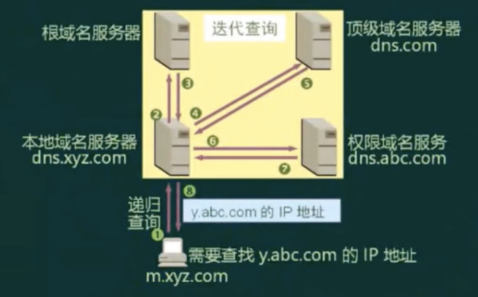

主机向本地域名服务器的查询采用递归查询。

本地域名服务器向根域名服务器的查询通常采用迭代查询。

- 递归查询:服务器必需回答目标IP与域名的映射关系
- 迭代查询:服务器收到一次迭代查询回复一次结果，这个结果不一定是目标IP与域名的映射关系，也可以是其它DNS服务器的地址。

> 注： 返回的是否是正确答案； 如果是线索则是迭代；如果是正确答案则是递归；

方式二：

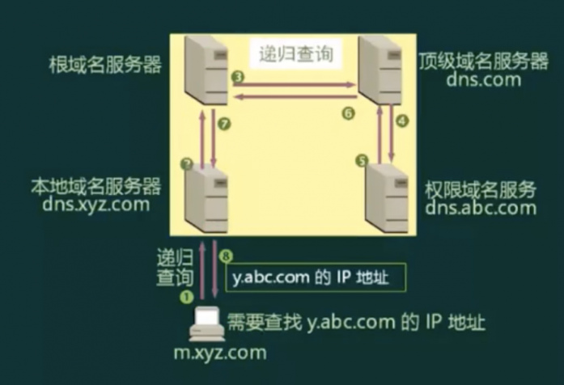

- 主机向本地域名服务器的查询采用递归查询。
- 此处，本地域名服务器向根域名服务器的查询采用递归查询
- 根域名服务器负担重，效率低，故较少采用。

## 网络规划与设计

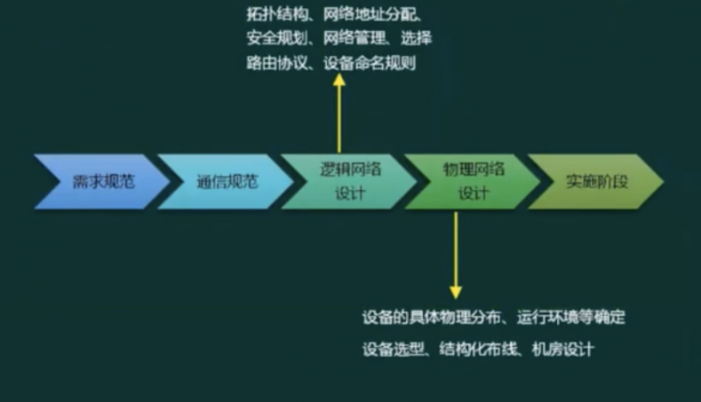

### 需求分析

网络规划原则
- 实用性原则
- 开放性原则
- 先进性原则

网络设计任务
- 确定网络总体目标
- 确定总体设计原则
- 通信子网设计
- 资源子网设计
- 设备选型
- 网络操作系统与服务器资源设备
- 网络安全设计

网络实施原则
- 可靠性原则
- 安全性原则
- 高效性原则
- 可扩展性原则

网络实施步骤
- 工程实施计划
- 网络设备到货验收
- 设备安装
- 系统测试
- 系统试运行
- 用户培训
- 系统转换

### 逻辑网络设计

利用需求分析和现有网络体系分析的结果来设计逻辑网络结构，最后得到一份逻辑网络设计文档，输出内容包括以下几点:
- 逻辑网络设计图
- IP地址方案
- 安全方案
- 招聘和培训网络员工的具体说明
- 对软硬件、服务、员工和培训的费用初步估计

### 物理网络设计

物理网络设计是对逻辑网络设计的物理实现，通过对设备的具体物理分布、运行环境等确定，确保网络的物理连接符合逻辑连接的要求。输出如下内容:
- 网络物理结构图和布线方案
- 设备和部件的详细列表清单
- 软硬件和安装费用的估算
- 安装日程表，详细说明服务的时间以及期限
- 安装后的测试计划
- 用户的培训计划

### 分层设计

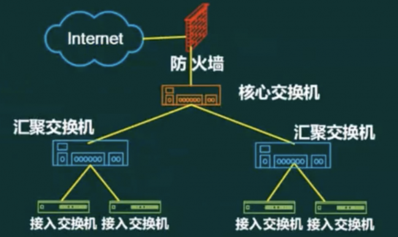

- 接入层 : 用户接入、计费管理、MAC地址认证、收集用户信息
- 汇聚层 : 网络访问策略控制、数据包处理、过滤、寻址
- 核心层 : 高速数据交换，常用几余机制

层次化网络设计应该遵循一些简单的原则，这些原则可以保证设计出来的网络更加具有层次的特性:
- 在设计时，设计者应该尽量控制层次化的程度，一般情况下，由核心层、汇聚层、接入层三个层次就足够了，过多的层次会导致整体网络性能的下降，并且会提高网络的延迟，但是方便网络故障排查和文档编写。
- 在接入层应当保持对网络结构的严格控制，接入层的用户总是为了获得更大的外部网络访问带宽，而随意申请其他的渠道访问外部网络是不允许的。
- 为了保证网络的层次性，不能在设计中随意加入额外连接，额外连接是指打破层次性，在不相邻层次间的连接，这些连接会导致网络中的各种问题，例如缺之汇聚层的访问控制和数据报过滤等
- 在进行设计时，应当首先设计接入层，根据流量负载、流量和行为的分析，对上层进行更精细的容量规划，再依次完成各上层的设计。
- 除去接入层的其他层次，应尽量采用模块化方式每个层次由多个模块或者设备集合构成，每个模块间的边界应非常清晰。

### 网络接入技术

有线接入:
- 公用交换电话网络(PSTIN)
- 数字数据网 (DDN)
- 综合业务数字网 (ISDN)
- 非对称数字用户线路(ADSL)
- 同轴光纤技术(HFC)

无线接入:
- IEEE 80211(WiFi)
- IEEE 80215(蓝牙Bluetooth)
- 红外(IrDA)
- WAPI

3G/4G/5G:
- WCDMA
- CDMA2000
- TD-SCDMA
- TD-LTE和FDD-LTE
- WirelessMAN-Advanced(802.16m)WiMAX

### 协议和标准

- 公用交换电话网络(PSTN，Public Switched Telephone Network)
- 数字数据网 (DDN，Data Direct Networks)
- 综合业务数字网 (ISDN)
- 非对称数字用户线路 (ADSL，Integrated Services Digital Network)
- 同轴光纤技术 (HFC，Hybrid Fiber Coaxial)
- 无线局域网鉴别和保密基础结构 (WAPI，Wireless LAN Authentication andPrivacy Infrastructure)
- 码分多址(CDMA，Code Division Multiple Access)
- 宽带码分多址(WCDMA，Wideband Code Division Multiple Access)
- 时分同步码分多址 (TD-SCDMA，Time Division-Synchronous Code DivisionMultiple Access)
- 长期演进技术(LET，Long Term Evolution)
- 时分双工 (TDD，Time-division duplex)
- 频分双工 (FDD，Frequency-division duplex)

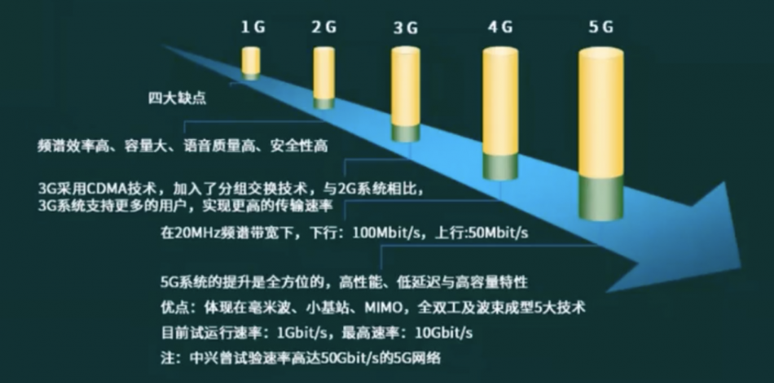

## 网络存储技术

### 分类

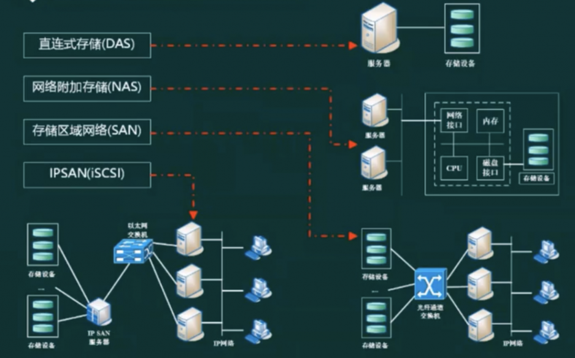

- 直连式存储(DAS，Direct-Attached Storage)
  - 存储设备通过电缆(通常是SCSI接口电缆)直接连接服务器
  - I/O请求直接发送到存储设备
  - 依赖于服务器，其本身是硬件的堆叠，不带有任何存储操作系统
  - 不能提供跨平台文件共享功能，各系统平台下文件需分别存储
- 网络附加存储(NAS，Network-Attached Storage)
  - 存储系统不再通过I/O总线附属于某个特定的服务器或客户机，而是直接通过网络接口与网络直接相连，由用户通过网络来访问
  - NAS设备有自己的OS
  - 大大降低了存储设备的成本
  - 存储信息都是采用RAID方式进行管理，从而有效的保护了数据
- 存储区域网络(SAN，Storage Area Network)
  - 通过专用高速网将一个或多个网络存储设备和服务器连接起来的专用存储系统
  - 主要采取数据块的方式进行数据和信息的存储，目前主要使用于以太网和光纤通道两类环境中
- Internet小型计算机系统接口 (isCsl，Internet Small Computer System Interface)

### Raid

> 磁盘阵列 (RAID，Redundant Arrays of Independent Disk)

- Raid0(条块化): 性能最高，并行处理，无几余，损坏无法恢复
- Raid1(镜像结构): 可用性，可修复性好，仅有50%利用率
- Raid0+1(Raid10): Raid0与Raid1长处的结合，高效也可靠
- Raid3(奇偶校验并行传送) : N+1模式，有固定的校验盘，坏一个盘可恢复
- Raid5(分布式奇偶校验的独立磁盘): N+1模式，无固定的校验盘，坏一个盘可恢复
- Raid6(两种存储的奇偶校验): N+2模式，无固定的校验盘，坏两个盘可恢复

#### Raid0和Raid1

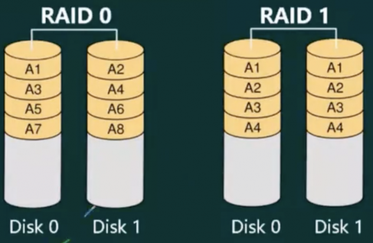

- RAID0磁盘利用率100%，访问速度
- 最快RAID1磁盘利用率为50%,具备纠错功能
- 现在企业采用RAIDO与RAID1结合的方式比较多

#### Raid5

是一种把多块硬盘组合成一个逻辑磁盘的技术，它可以提供冗余，提高可靠性，并允许在磁盘故障时仍然可以正常工作

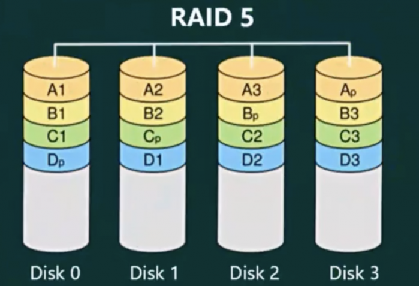

RAID5磁盘利用率 (n-1) /n，具备容错功能

RAID5容量计算方式是：单块磁盘容量*(磁盘个数-1)

## IPv6

IPv6是设计用于替代现行版本IP协议 (IPv4) 的下一代IP协议
- (1)IPv6地址长度为128位，地址空间增大了2^96倍;
- (2)灵活的IP报文头部格式。使用一系列固定格式的扩展头部取代了IPV4中可变长度的选项字段。IPv6中选项部分的出现方式也有所变化，使路由器可以简单路过选项而不做任何处理，加快了报文处理速度;
- (3)IPv6简化了报文头部格式，字段只有8个，加快报文转发，提高了吞吐量;
- (4)提高安全性。身份认证和隐私权是IPv6的关键特性;
- (5)支持更多的服务类型
- (6)允许协议继续演变，增加新的功能，使之适应未来技术的发展

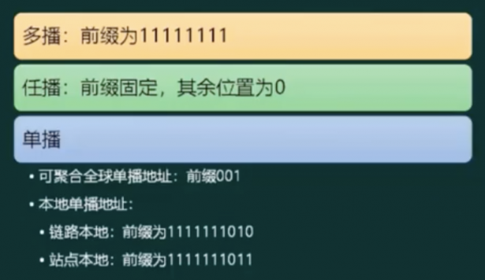

- 单播地址(Unicast): 用于单个接口的标识符
- 任播地址(Anycast): 泛播地址。一组接口的标识符，IPv4 广播地址
- 组播地址(Multicast): IPv6中的组播在功能上与IPv4中的组播类似
 

IPv6地址由8个16进制字段构成。例如:20010d68:85a3:0000:1319:8a2e0370:7344

IPV6地址的省写，上面的IP地址等价于:20010d68:85a3:1319:8a2e:0370:7344

遵守这些规则，如果因为省略而出现了两个以上的冒号，则可以压缩为一个,但这种零压缩在地址中只能出现一次。因此:

- 2001:0DB8:0000:0000:0000:0000:1428:57ab

- 2001:0DB8:0:0:0:0:1428:57ab

- 2001:0DB8:1428:57ab

以上都是合法的地址，并且它们是等价的。同时前导的零可以省略，因此: `2001:0DB8:02de::0e13`等价于`2001:DB8:2de::e13`

减写规则：
- 高位0可省略
- 一段全为0则记为一个0
- 多段0直接省略为`::`, 只能用一次

IPv4/IPv6过渡技术有:
- (1) 双协议栈技术: 双技术通过节点对IPV4和IPv6双协议栈的支持，从而支持两种业务的共存。
- (2) 隧道技术，随道技术通过在IPV4网络中部署隧道，实现在IPV4网络上对IPV6业务的承载，保证业务的共存和过渡。隧道技术包括: 6to4隧道; 6over4隧道: ISATAP隧道
- (3) NAT-PT技术: NAT-PT便用网关设备连接IPV6和IPV4网络，当IPV4和IPV6节点与相访问时，NAT-PT网关实现两种协议的转换翻译和地址的映射。

## 综合布线系统

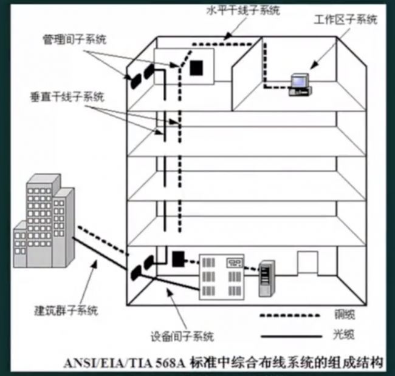

## 物联网

### 物联网的概念与分层

物联网 (The Internet of Things) 是实现物物相连的互联网络，其内涵包含两个方面: 
- 第一：物联网的核心和基础仍然是互联网，是在互联网基础上延伸和扩展的网络
- 第二：其用户端延伸和扩展到了任何物体与物体之间，使其进行信息交换和通信

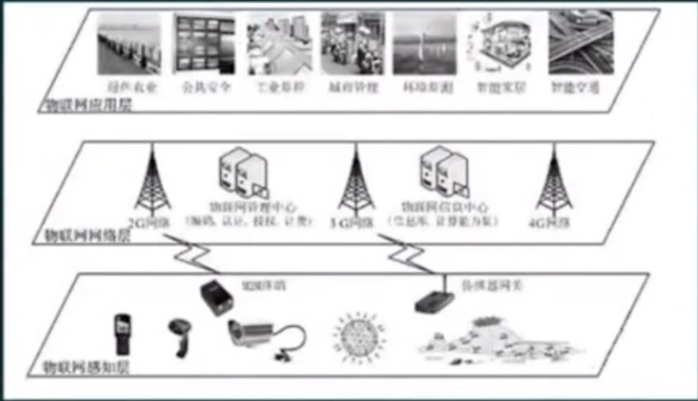

- 感知层: 识别物体、采集信息。如: 二维码、RFID、摄像头、传感器 (温度、湿度)
- 网络层: 传递信息和处理信息。通信网与互联网的融合网络、网络管理中心、信息中心和智能处理中心等
- 应用层: 解决信息处理和人机交互的问题

### 物联网关键技术(RFID)

射频识别技术(Radio Frequency ldentification，RFID) ，又称电子标签，是一种通信技术，可通过无线电讯号识别特定目标并读写相关数据，而无需识别系统与特定目标之间建立机械或光学接触。该技术是物联网的一项核心技术，很多物联网应用都离不开它

RFID的基本组成部分通常包括: 标签、阅读器、天线

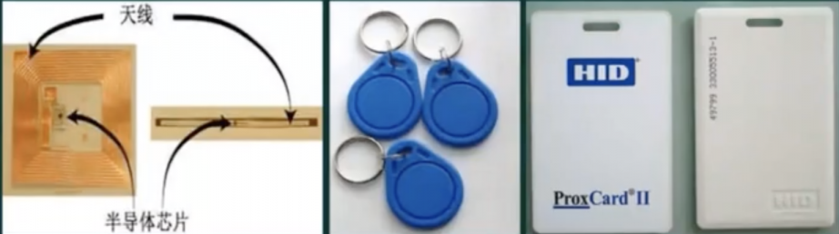

### 物联网关键技术(二维码)

二维码： 是用某种特定的几何图形按一定规律在平面 (二维方向上)分布的黑白相间的图形记录数据符号信息的。在代码编制上巧妙地利用构成计算机内部逻辑基础的"0"、"1"比特流的概念，使用若干个与二进制相对应的几何形体来表示文字数值信息，通过图象输入设备或光电扫描设备自动识读以实现信息自动处理

二维条码中，常用的码制有: Data Matrix，Vericode，PDF417,Ultracode,Code 49,Code 16K

- 若采用扩展的字母数字压缩格式，可容纳1850个字符
- 若采用二进制/ASCII格式，可容纳1108个字节
- 若采用数字压缩格式，可容纳2710个数字

## 云计算的概念与特点

云计算是一种基于互联网的计算方式，通过这种方式，共享的软硬件资源和信息可以按需提供给计算机和其他设备。云其实是网络、互联网的一种比喻说法。云计算的核心思想，是将大量用网络连接的计算资源统一管理和调度，构成一个计算资源池向用户按需服务。提供资源的网络被称为“云”狭义云计算指IT基础设施的交付和使用模式，指通过网络以按需、易扩展的方式获得所需资源;广义云计算指服务的交付和使用模式，指通过网络以按需、易扩展的方式获得所需服务。这种服务可以是IT和软件、互联网相关，也可是其他服务

特点:
- 集合了大量计算机，规模达到成干上万
- 多种软硬件技术相结合
- 对客户端设备的要求低
- 规模化效应

软件即服务 (Saas，Software-as-a-Service)

平台即服务 (Paas，Platform-As-A-Service)

基础设施即服务 (laas，Infrastructure-As-A-Service)

