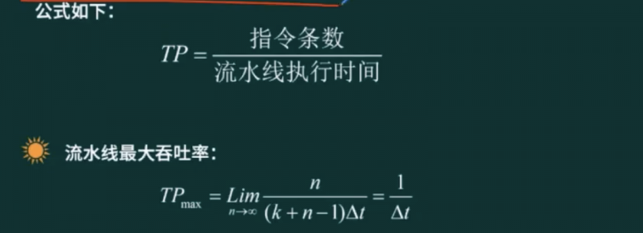

## 计算机体系结构分类

### Flynn分类

1966 年，Michael．J．Flynn 提出根据指令流、数据流的多倍性特征对计算机系统进行分类（通常称为 Flynn 分类法），有关定义如下。
- （1）指令流：指机器执行的指令序列；
- （2）数据流：指由指令流调用的数据序列，包括输入数据和中间结果，但不包括输出数据

|体系结构类型|结构|关键特性|代表|
|-|-|-|-|
|单指令流单数据流SISD(Single instruction,Single data)|控制部分: 一个 处理器:一个 主存模块:一个 |-|单处理器系统|
|单指令流多数据流SIMD(Single instruction.multiple data)|控制部分: 一个 处理器:多个 主存模块:多个 |各处理器以异步的形式执行同一条指令|并行处理机 阵列处理机 超级向量处理机|
|多指令流单数据流MISD(multiple instructionSingle data)|控制部分: 多个 处理器:一个 主存模块:多个 |被证明不可能至少是不实际|目前没有，有文献称流水线计算机为此类|
|多指令流多数据流MIMD(multiple instructionmultiple data)|控制部分: 多个 处理器:多个 主存模块:多个 |能够实现<b>作业、任务、指令</b>等各级全面并行|多处理机系统 多计算机|

## CISC与RISC 

- 复杂指令集计算机(CISCComplex Instruction Set Computers)
- 精简指令集计算机(RISCReduced Instruction Set Computers)

|指令系统类型|指令|寻址方式|实现方式|其它|
|-|-|-|-|-|
|CISC (复杂)|数量多，使用频率差别大可变长格式|支持多种|微程序控制技术(微码)|研制周期长|
|RISC (精简)|数量少，使用频率接近，定长格式，大部分为单周期指令，操作寄存器，只有Load/Store操作内存|支持方式少|增加了通用寄存器，硬布线逻辑控制为主;适合采用流水线|优化编译，有效支持高级语言|

## 冯·诺依曼结构和哈佛结构

### 冯·诺依曼结构

冯·诺依曼结构也称普林斯顿结构，是一种将程序指令存储器和数据存储器合并在-起的存储器结构。

特点:
- 一般用于PC处理器，如13，15，17处理器
- 指令与数据存储器合并在一起
- 指令与数据都通过相同的数据总线传输

### 哈佛结构
哈佛结构是一种将程序指令存储和数据存储分开的存储器结构。哈佛结构是一种并行体系结构，它的主要特点是将程序和数据存储在不同的存储空间中，即程序存储器和数据存储器是两个独立的存储器，每个存储器独立编址、独立访问。

特点:
- 一般用于嵌入式系统处理器 (DSP: 数字信号处理 (DSP，Digital Signal Processing))
- 指令与数据分开存储，可以并行读取，有较高数据的吞吐率
- 有4条总线: 指令和数据的数据总线与地址总线

## 层次化存储结构

> 理论性依据： 局部性原理

## Cache

### 概念

- Cache的功能:提高CPU数据输入输出的速率，突破冯·诺依曼瓶颈，即CPU与存储系统间数据传送带宽限制。
- 在计算机的存储系统体系中，Cache是访问速度最快的层次(除寄存器以外)。
- 使用Cache改善系统性能的依据是程序的局部性原理。

如果以h代表对Cache的访问命中率，t1表示Cache的周期时间，t2表示主存储器周期时间，以读操作为例，使用“Cache+主存储器”的系统的平均周期为t3;，则:

> t3 = h * t1 + (1-h) * t2

其中，(1-h) 又称为失效率 (未命中率)

## 局部性原理

- 时间局部性: 指程序中的某条指令一旦执行，不久以后该指令可能再次执行，典型原因是由于程序中存在着大量的循环操作。
- 空间局部性: 指一旦程序访问了某个存储单元，不久以后，其附近的存储单元也将被访问，即程序在一段时间内所访问的地址可能集中在一定的范围内，其典型情况是程序顺序执行。

> 工作集理论: 工作集是进程运行时被频繁访问的页面集合

## 主存

### 分类

随机存取存储器(RAM, Random Access Memory)
- DRAM (Dynamic RAM，动态RAM) -SDRAM
- SRAM(Static RAM，静态)

只读存储器(ROM, Read-Only Memory)
- MROM(Mask ROM，掩模式ROM)
- PROM (Programmable ROM，一次可编程 ROM)
- EPROM (Erasable PROM，可擦除的 PROM)
- 闪速存储器 (flash memory，闪存)

### 编址

编址：存储器是由一个个存储单元构成的，为了对存储器进行有效的管理，就需要对各个存储单元编上号，即给每个但愿赋予一个地址码，这叫编址。经编址后，存储器在逻辑上便形成一个线性地址空间。 

> 寻址：存取数据时，必须先给出地址码，再由硬件电路译码找到数据所在地址，这叫寻址。

内存编址方法在计算机系统中，存储器中每个单元的位数是相同且固定的，称为存储器编址单位

> 存储单元个数： 最大地址 - 最小地址 + 1

不同的计算机，存储器编址的方式不同，主要有字编址和字节编址。

内存一般以字节（8 位）为单位，或者以字为单位（字的长度可大可小，例如 16 位或者 32 位等，在这类试题中，一般会给出字的大小）。

例如，内存地址从 AC000H 到 C7FFFH，则共有  C7FFFFH-AC000H=1BFFFH 个地址单元（转换为十进制后，为 112KB）。如果该内存地址按字（16bit）编址，则共有 112KB * 16 位。假设该内存由 28 片存储器芯片构成，已知构成此内存的芯片每片有 16KB 个存储单元，则该芯片每个存储单元存储（112KB * 16）/（28 * 16KB）=4 位

## 磁盘结构与参数

>  存取时间 = 寻道时间+等待时间(平均定位时间+转动延迟)用的时间。

> 注意:寻道时间是指磁头移动到磁道所需的时间;等待时间为等待读写的扇区转到磁头下方所

- 平均存取时间(Average Access Time)，是指磁头找到指定数据的平均时间
  > 平均存取时间是指磁头找到指定数据的平均时间，通常它是硬盘平均寻道时间和平均潜伏时间(等待时间)之和。平均存取时间最能代表硬盘找到某一数据所用的时间，数值越小越好。
- 平均访问时间三平均寻道时间+平均等待时间

单缓冲区: 在发送进程与接收进程之间只有一个缓冲区（每个时刻只能有一个进程访问它）

## 磁盘调度

### 移臂调度算法(FCFS)

先来先服务FCFS(First-Come, First SERved)

### 最短寻道时间优先SSTF

最短寻道时间优先SSTF(Shortest Seek Time First), 也可以叫做电梯算法 

## 流水线

### 概念

- 相关参数计算: 流水线执行时间计算、流水线吞吐率、流水线加速比、流水线效率
- 流水线是指在程序执行时多条指令重叠进行操作的一种准并行处理实现技术。各种部件同时处理是针对不同指令而言的，它们可同时为多条指令的不同部分进行工作，以提高各部件的利用率和指令的平均执行速度

### 流水线计算

流水线建立时间: 第一条指令执行完成之后，流水线就固定下来了，我们把第一个指令执行完成时间叫做流水线的建立时间

### 超标量流水线

### 流水线吞吐率计算

流水线的吞吐率 (Though Putrate，TP) 是指在单位时间内流水线所完成的任务数量或输出的结果数量。

计算流水线吞吐率的最基本的公式如下： 

 

### 流水线加速比计算

完成同样一批任务，不使用流水线所用的时间与使用流水线所用的时间之比称为流水线的加速比。计算流水线加速比的基本公式如下：

>  S = 不使用流水线执行时间 / 使用流水线执行时间

## 总线

一条总线同一时刻仅允许一个设备发送，但允许多个设备接收。

> 所以总线是半双工模式。

总线的分类：
- 数据总线 (Data Bus，DB) : 在CPU与RAM之间来回传送需要处理或是需要储存的数据。
- 地址总线 (Address Bus，AB) : 用来指定在RAM (Random Access之中储存的数据的地址。Memory)
- 控制总线 (Control Bus，CB) : 将微处理器控制单元 (Control Unit) 的信号，传送到周边设备.

## 嵌入式系统开发设计

### 芯片

1. DSP: DSP芯片，也称数字信号处理器，是一种特别适合于进行数字信号处理运算的微处理器，其主要应用是实时快速地实现各种数字信号处理算法。
2. SoC: System on Chip，简称Soc，也即片上系统。从狭义角度讲，它是信息系统核心的芯片集成是将系统关键部件集成在一块芯片上;从广义角度讲，SoC是一个微小型系统，如果说中央处理器 (CPU) 是大脑，那么SoC就是包括大脑、心脏、眼睛和手的系统。
3. MPU: 微机中的中央处理器 (CPU) 称为微处理器 (MPU)，是构成微机的核心部件，也可以说是微机的心脏。它起到控制整个微型计算机工作的作用，产生控制信号对相应的部件进行控制，并执行相应的操作。
4. MCU: 微控制单元(Microcontroller Unit; MCU)，又称单片微型计算机(Single ChipMicrocomputer)或者单片机，是把中央处理器(CentralProcess Unit; CPU)的频率与规格做适当缩减，并将内存(memory)、计数器(Timer)、USB、A/D转换、UART、PLC、DMA等周边接口，甚至LCD驱动电路都整合在单一芯片上，形成芯片级的计算机，为不同的应用场合做不同组合控制。

### 交叉开发环境

 

## 嵌入式系统的初始化过程

> 片级初始化 一> 板级初始化 一> 系统初始化

- 片级初始化: 完成<b>嵌入式微处理器的初始化</b>，包括设置嵌入式微处理器的核心寄存器和控制寄存器、嵌入式微处理器核心工作模式和嵌入式微处理器的局部总线模式等。片级初始化把嵌入式微处理器从上电时的默认状态逐步设置成系统所要求的工作状态。这是一个纯硬件的初始化过程。
- 板级初始化: 完成嵌入式微处理器以外的<b>其他硬件设备的初始化</b>。另外，还需设置某些软件的数据结构和参数，为随后的系统级初始化和应用程序的运行建立硬件和软件环境。这是一个同时包含软硬件两部分在内的初始化过程。
- 系统初始化: 该初始化过程<b>以软件初始化为主</b>，主要进行操作系统的初始化。BSP将对嵌入式微处理器的控制权转交给嵌入式操作系统，由操作系统完成余下的初始化操作，包含加载和初始化与硬件无关的设备驱动程序，建立系统内存区，加载并初始化其他系统软件模块，如网络系统、文件系统等。最后，操作系统创建应用程序环境，并将控制权交给应用程序的入口。

## 校验码

### 奇偶校验

奇偶校验码的编码方法是: 由若干位有效信息 (如一个字节) ，再加上一个二进制位 (校验位) 组成校验码。

- 奇校验: 整个校验码(有效信息位和校验位) 中“1”的个数为奇数奇校验: 整个校验码
- 偶校验: 整个校验码(有效信息位和校验位) 中“1”的个数为偶数。偶校验: 整个校验码

> 奇偶校验，可检查1位的错误，不可纠错。

### 循环校验码CRC

> 循环冗余校验(Cyclic Redundancy Check): CRC校验，可见错，不可纠错

CRC的编码方法是: 在k位信息码之后拼接r位校验码。应用CRC码的关键是如何从k位信息位简便地得到r位校验位 (编码) ，以及如何从k+r位信息码判断是否出错。

循环冗余校验码编码规律如下:
- 把待编码的N位有效信息表示为多项式M(X);
- 把M(X)左移K位，得到M(X)XX，这样空出了K位，以便拼装K位余数(即校验位);
- 选取一个K+1位的产生多项式G(X)，对M(X)XXK做模2除;
- 把左移K位以后的有效信息与余数R(X)做模2加减，拼接为CRC码，此时的CRC码共有N+K位。

把接收到的CRC码用约定的生成多项式G(X)去除，如果正确，则余数为0; 如果某一位出错，则余数不为0。不同的位数出错其余数不同，余数和出错位序号之间有惟一的对应关系。

#### 模2除法

 

#### 练习

 

已知：信息位，生成多项式

计算过程：
1. 根据生成多项式求对应的系数用来做除数
2. 生成多项式最高次幂作为余数的个数
3. 利用模2除求出余数
4. 最终结果是信息为拼接上余数; 上题结果：101111100

### 海明校验码

> 海明校验，可检错，也可纠错

海明校验码的原理是: 在有效信息位中加入几个校验位形成海明码使码距比较均匀地拉大，并把海明码的每个二进制位分配到几个奇偶校验组中。当某一位出错后，就会引起有关的几个校验位的值发生变化，这不但可以发现错误，还能指出错误的位置，为自动纠错提供了依据.

公式：

 

海明校验是交叉校验的：

 

## 系统配置与性能评价

### 性能指标

 

### 阿姆达尔(Amdahl)解决方案

 

## 性能评价方法

- 时钟频率法: 以时钟频率高低衡量速度。
- 指令执行速度法: 表示机器运算速度的单位是MIPS.
- 等效指令速度法 ( Gibson mix，吉普森混合法): 通过各类指令在程序中所占的比例 ($W_i$) 进行计算得到的。<b>特点: 考虑指令比例不同的问题</b>
- 数据处理速率法 (PDR，Processing Data Rate ): PDR值的方法来衡量机器性能，PDR值越大，机器性能越好。PDR = L/R <b>特点: 考虑CPU+存储</b>
- 综合理论性能法 (CTP ，Composite Theoretical Performance ) : CTP用MTOPS (Million Theoretical Operations Per Second，每秒百万次理论运算)表示。CTP的估算方法是，首先算出处理部件每个计算单元的有效计算率，再按不同字长加以调整，得出该计算单元的理论性能，所有组成该处理部件的计算单元的理论性能之和即为CTP
- <b>基准程序法: 把应用程序中用得最多、最频繁的那部分核心程序作为评估计算机系统性能的标准程序，称为基准测试程序 (benchmark)。基准程序法是目前一致承认的测试系统性能的较好方法.</b>

> 真实的程序 -> 核心程序 -> 小型基准程序 -> 合成基准程序

- <b>Dhrystone基准程序: 它是一个综合性的整数基准测试程序，是为了测试编译器和CPU处理整数指令和控制功能的有效性，人为地选择一些典型指令综合起来形成的测试程序</b>
- <b>Linpack基准程序: 它是国际上最流行的用于测试高性能计算机系统浮点性能的测试。</b>
- <b>Whetstone基准程序: 它是用Fortran语言编写的综合性测试程序，主要由执行浮点运算、功能调用数组变址、条件转移和超越函数的程序组成。</b>
- SPEC基准程序一种是测试计算机完成单项任务有多快，称为速度测试;另一种是测试计算机在一定时间内能完成多少项任务，称为吞吐率测试。
- TPC基准程序: TPC (Transaction Processing Council，事务处理委员会) 基准程序用以评测计算机在事务处理、数据库处理、企业管理与决策支持系统等方面的性能。该基准程序的评测结果用每秒完成的事务处理数TPC来表示。
  - TPC-A基准程序规范用于评价在OLTP环境下的数据库和硬件的性能;
  - TPC-B测试的是不包括网络的纯事务处理量，用于模拟企业计算环境;
  - TPC-C测试的是联机订货系统:
  - TPC-D、TPC-H和TPC-R测试的都是决策支持系统，其中TPC-R允许有附加的优化选项
  - TPC-E测试的是大型企业信息服务系统。
  - TPC-W是基于Web 应用的基准程序，用来测试一些通过Internet进行市场服务和销售的商业行为，所以TPC-W可以看作是一个服务器的测试标准
