## 三层模式

### 两层映射

> 数据库管理员(DBA, Database Administrator)

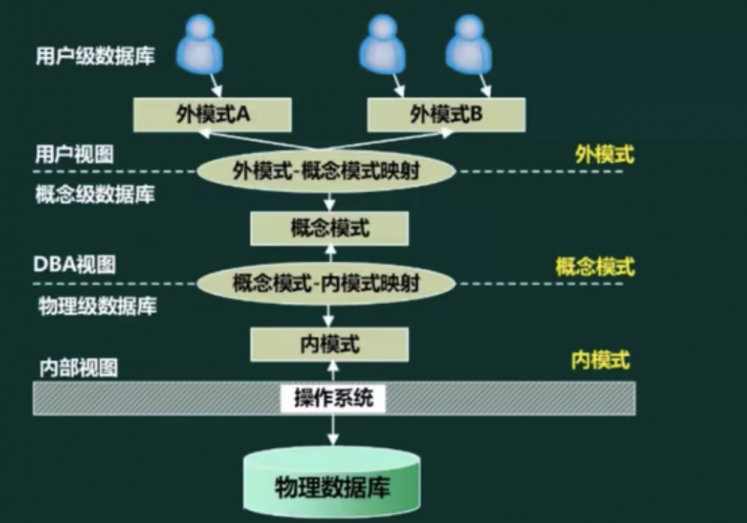

> 概念模式：基本表； 内模式：物理模式、存储模式;

### 视图

数据库视图: 它一个虚拟表 (逻辑上的表) ，其内容由查询定义 (仅保存SQL查询语句)同真实的表一样，视图包含一系列带有名称的列和行数据。但是，视图并没有真正存储这些数据，而是通过查询原始表动态生成所需要的数据。

视图的优点:
1. 视图能简化用户操作
2. 视图使用户能以多种角度看待同一数据
3. 视图对重构数据库提供了一定程度的逻辑独立性
4. 视图可以对机密数据提供安全保护

> 视图缺点： 查询后再展示，效率比较低

物化视图: 它不是传统意义上虚拟视图，是实体化视图，其本身会存储数据。同时当原始表中的数据更新时，物化视图也会更新。

## 数据库设计过程

> 数据库管理系统(DBMS, Database Management System)

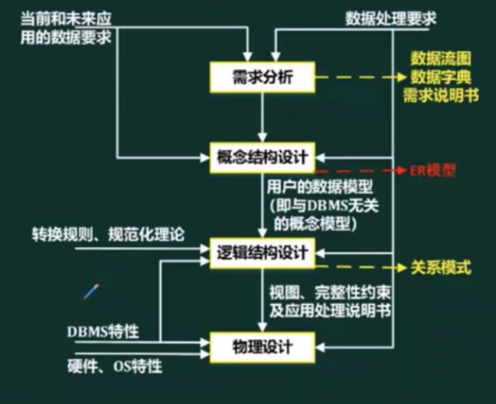

## E-R模型

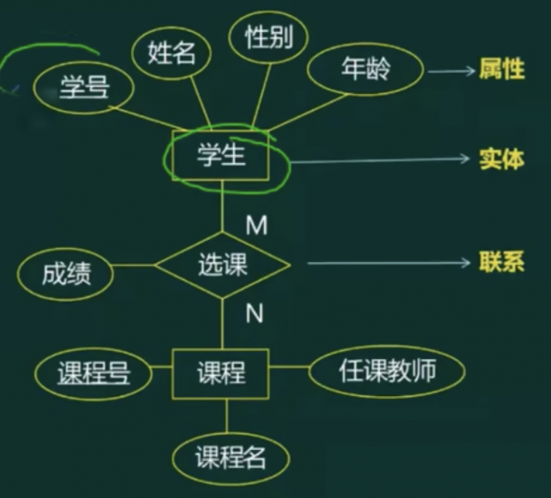

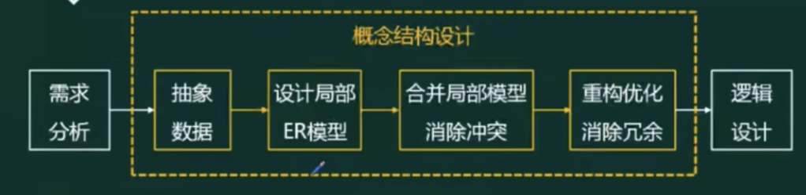

集成的方法
- 多个局部E-R图一次集成
- 逐步集成，用累加的方式一次集成两个局部E-R。

集成产生的冲突及解决办法
- 属性冲突: 包括属性域冲突和属性取值冲突
- 命名冲突: 包括同名异义和异名同义。
- 结构冲突: 包括同一对象在不同应用中具有不同的抽象，以及同一实体在不同局部E-R图中所包含的属性个数和属性排列次序不完全相同。

E-R模型转换为关系模型应遵循的相关原则
- 一个实体型转换为一个关系模式
- 1:1联系可以转换为一个关系模式，也可以与任意一端实体的关系模式合并
- 1: n联系可以转换为一个关系模式，也可以与n端实体的关系模式合并
- m: n联系必须单独转成一个关系模式
- 三个以上实体间的一个多元联系

## 关系代数

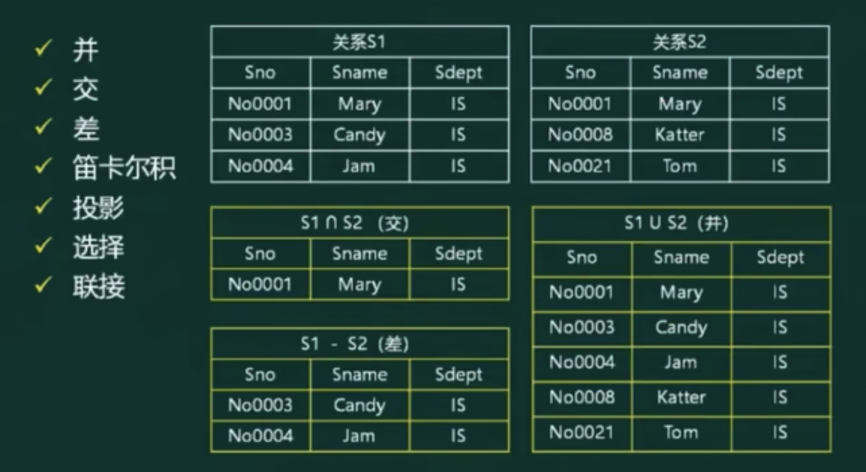

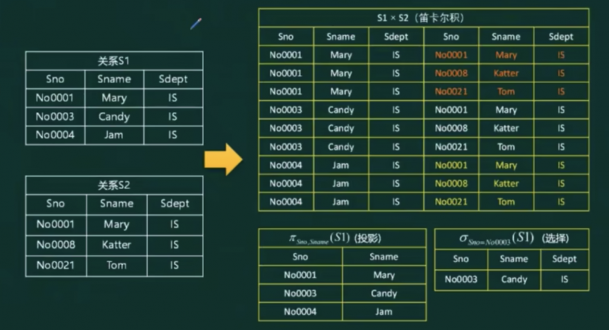

自然连接：

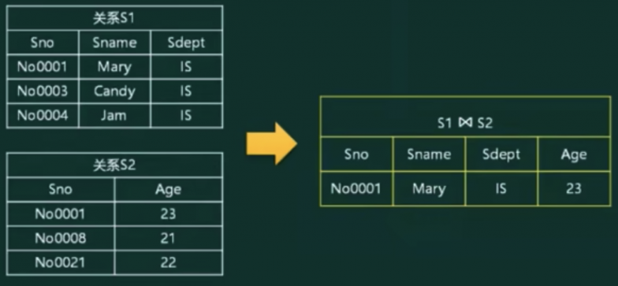

> 等价形式的笛卡尔积： 先选择在投影

## 规范化理论

把一个低一级的关系模型分解为高一级关系模型的过程，称为关系模型的规范化。关系模型分解必须遵守两个准则。
- （1）无损连接性：信息不失真（不增减信息）。
- （2）函数依赖保持性：不破坏属性间存在的依赖关系。

> 非规范化的关系模式，可能存在的问题包括: 数据几余、更新异常、插入异常、删除异常。

### 函数依赖

设R(U)是属性U上的一个关系模式，X和Y是U的子集，r为R的任一关系，如果对于r中的任意两个元组u，v，只要有u[X]=v[X]，就有u[Y]=v[Y]，则称X函数决定Y,或称Y函数依赖于X，记为X一>Y.

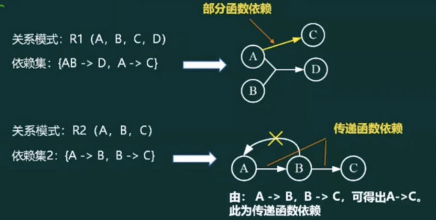

关系 R<U，F>中的一个属性或一组属性 K，如果给定一个 K 则唯一决定 U 中的一个元组，也就是 U 函数完全依赖于 K，就称 K 为 R 的码。一个关系可能有多个码，选中其中一个作为主码。

包含在任一码中的属性称为主属性，不包含在任何码中的属性称为非主属性。

关系 R 中的属性或属性组 X 不是 R 的码，但 X 是另一个关系模型的码，称 X 是 R 的外码

### 键

主键: 是唯一标识元组的属性集合

候选键：唯一标识元组，且无冗余

候选键包含的属性
- 主属性
- 其他属性
- 非主属性

外键：其他关系的主键

### 求候选键

- 将关系模式的函数依赖关系用“有向图”的方式表示
- 找入度为0的属性，并以该属性集合为起点，尝试遍历有向图，若能正常遍历图中所有结点，则该属性集即为关系模式的候选键µ
- 若入度为0的属性集不能遍历图中所有结点，则需要尝试性的将一些中间结点(既有入度，也有出度的结点) 并入入度为0的属性集中，直至该集合能遍历所有结点，集合为候选键

> 入度：箭头指向的方向； 出度：箭头流出的方向;

### 范式

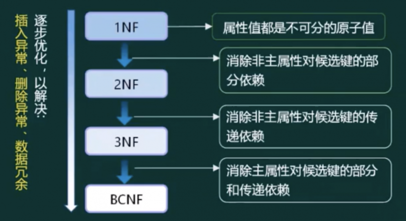

- 第一范式(1NF) : 属性值都是不可拆分的原子值
- 第二范式(2NF) : 当且仅当实体E是第一范式 (1NF) ，且每一个非主属性完全依赖主键(不存在部分依赖)时，则称实体E是第二范式
- 第三范式(3NF) : 当且仅当实体E是第二范式 (2NF) ，且E中没有非主属性传递依赖于码时，则称实体E是第三范式。
- BC范式(BCNF) : 设R是一个关系模式，F是它的依赖集，R属于BCNF当且仅当其F中每个依赖的决定因素必定包含R的某个候选码。

### 无损分解

保持函数依赖分解
- 设数据库模式p={R1，R2，...，Rk)是关系模式R的一个分解，F是R上的函数依赖集，p中每个模式Ri上的FD集是Fi。如果(F1，F2，...，Fk)与F是等价的(即相互逻辑蕴涵)，那么称分解p保持FD

无损分解：什么是有损，什么又是无损?
- 有损:不能还原
- 无损:可以还原

> 无损联接分解: 指将一个关系模式分解成若干个关系模式后，通过自然联接和投影等运算仍能还原到原来的关系模式

> 表格法（p61:数据库系统-3处有详细说明） 

Amstrong 公理体系：

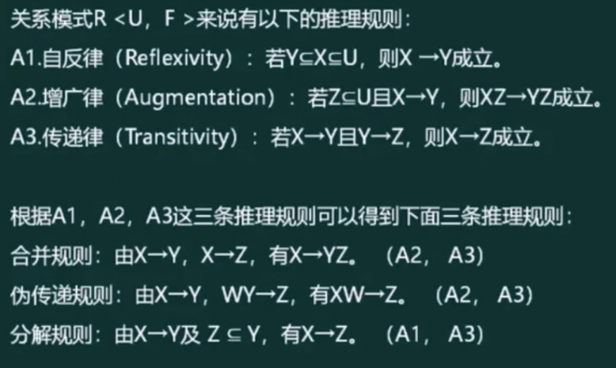

## 反规范化

由于规范化会使表不断的拆分，从而导致数据表过多。这样虽然减少了数据几余，提高了增、删、改的速度 但会增加查询的工作量。系统需要进行多次连接才能进行查询操作，使得系统的效率大大的下降

技术手段
- 增加派生性冗余列
- 增加冗余列
- 重新组表
- 分割表
  - 水平分割
  - 垂直分割

## 并发控制

事务(ACID)
- 原子性
- 一致性
- 隔离性
- 持续性

> 并发产生的问题 -> 封锁协议 -> 死锁

并发产生的问题
- 丢失更新
- 不可重复读问题
- “脏”数据的读出

解决方案： 封锁协议
- S封锁（共享锁，读锁）
- X封锁（写锁，排他锁，独占锁）
- 一级封锁协议：事务T在修改数据R之前必须先对其加X锁，直到事务结束才释放。<b>可防止丢失修改</b>
- 二级封锁协议：一级封锁协议加上事务T在读取数据R之前先对其加S锁，<b>读完后即可释放S锁。可防止丢失修改，还可防止读“脏”数据</b>
- 三级封锁协议：一级封锁协议加上事务T在读取数据R之前先对其加S锁，<b>直到事务结束才释放。可防止丢失修改、防止读“脏”数据与防止数据重复读</b>
- 两段锁协议：可串行化的。可能发生死锁

## 数据库完整性约束

- 实体完整性约束
  - 主键，唯一且非空

- 参照完整性约束
  - 外键，其他关系的主键，或者为空

- 用户自定义完整性约束
  - CHECK

- 触发器

## 数据库安全性

|措施|说明|
|-|-|
|用户标识和鉴定|最外层的安全保护措施，可以使用用户帐户、口令及随机数检验等方式|
|存取控制|对用户进行授权，包括操作类型 (如查找、插入、删除、修改等动作)和数据对象 (主要是数据范围) 的权限|
|密码存储和传输|对远程终端信息用密码传输|
|视图的保护|对视图进行授权|
|审计|使用一个专用文件或数据库，自动将用户对数据库的所有操作记录下来|

## 数据备份

- 冷备份也称为静态备份，是将数据库正常关闭，在停止状态下，将数据库的文件全部备份 (复制) 下来
- 热备份也称为动态备份，是利用备份软件，在数据库正常运行的状态下，将数据库中的数据文件备份出来

|备份方式\优缺点|优点|缺点|
|-|-|-|
|冷备份|非常快速的备份方法(只需复制文件); 容易归档(简单复制即可); 容易恢复到某个时间点上(只需将文件再复制回去); 能与归档方法相结合，做数据库“最佳状态的恢复 ; 低度维护，高度安全|单独使用时，只能提供到某一时间点上的恢复;在实施备份的全过程中，数据库必须要作备份而不能做其他工作;若磁盘空间有限只能复制到磁带等其他外部存储设备上，速度会很慢;不能按表或按用户恢复|
|热备份|可在表空间或数据库文件级备份，备份的时间短;备份时数据库仍可使用;可达到秒级恢复(恢复到某一时间点上): 可对几乎所有数据库实体做恢复;恢复是快速的|不能出错，否则后果严重;若热备份不成功所得结果不可用于时间点的恢复; 因难于维护，所以要特别小心，不允许“以失败告终“|

- 完全备份: 备份所有数据
- 差量备份: 仅备份上一次完全备份之后变化的数据
- 增量备份: 备份上一次备份之后变化的数据

> 日志文件: 事务日志是针对数据库改变所做的记录，它可以记录针对数据库的任何操作，并将记录结果保存在独立的文件中

## 数据库故障与恢复

|故障关系|故障原因|解决方法|
|-|-|-|
|事务本身的可预期故障|本身逻辑|在程序中预先设置Rollback语句|
|事务本身的不可预期故障|算术溢出、违反存储保护|由DBMS的恢复子系统通过日志，撤消事务对数据库的修改，回退到事务初始状态|
|系统故障|系统停止运转|通常使用检查点法|
|介质故障|外存被破坏|一般使用日志重做业务(DBA介入)|

## 分布式数据库

### 体系结构

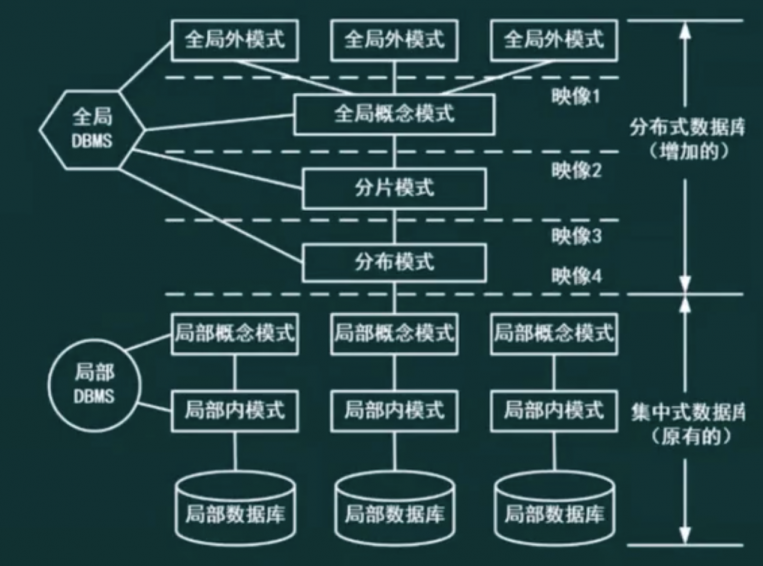

- 全局外模式: 全局外模式是全局应用的用户视1图，是全局概念模式的子集，该层直接与用户 (或应用程序) 交互
- 全局概念模式: 全局概念模式定义分布式数据库中数据的整体逻辑结构，数据就如同根本没有分布一样，可用传统的集中式数据库中所采用的方法进行定义。
- 分片模式: 在某些情况下，需要将一个关系模式分解成为几个数据片，分片模式正是用于完成此项工作的。
- 分布模式: 分布式数据库的本质特性就是数据分布在不同的物理位置。分布模式的主要职责是定义数据片段(即分片模式的处理结果) 的存放节点
- 局部概念模式: 局部概念模式是局部数据库的概念模式。
- 局部内模式: 局部内模式是局部数据库的内模式。

### 各种概念

分布透明性
- 分片透明性: 指用户不必关心数据是如何分片的，它们对数据的操作在全局关系上进行，即关系如何分片对用户是透明的，因此当分片改变时应用程序可以不变
  - 水平分片
  - 垂直分片
  - 混合分片
- 位置透明性: 指用户不必知道所操作的数据放在何处，即数据分配到哪个或哪些站点存储对用户是透明的
- 局部数据模型透明性(逻辑透明): 是最低层次的透明性，该透明性提供数据到局部数据库的映像，即用户不必关心局部DBMS支持哪种数据模型、使用哪种数据操纵语言，数据模型和操纵语言的转换是由系统完成的。 

分布式数据库管理系统 - 组成
- LDBMS - 局部数据库管理系统 (LDBMS，Local Database Management System)
- GDBMS - 全局数据库管理系统 (GDBMS，Global Database Management System)
- 全局数据字典
- 通信管理(CM, Communication Management)

分布式数据库管理系统 - 结构
- 全局控制几种的DDBMS(分布式数据库管理系统 (DDBMS，Distributed Database ManagementSystem))
- 全局控制分散的DDBMS 
- 全局控制部分分散的DDBMS

### 数据表分区

表分区: 就是将一个数据量比较大的表，用某种方法把数据从物理上分成若干个小表来存储从逻辑来看还是一个大表

分区与分表的区别与联系:
- (1)两者都针对数据表将数据做到分布式，提高数据检索的效率，降低数据库的频繁I/O
压力值。
- (2)分表是真正的生成数据表，是将一张大数据量的表分成多个小表实现数据均衡。
- (3)分区并不是生成新的数据表，而是将表的数据均衡分摊到不同的硬盘，系统或是不同服务器存储介质中，实际上还是一张表。

分区的优点:
1. 相对于单个文件系统或是硬盘，分区可以存储更多的数据
2. 数据管理比较方便，比如要清理或废弃某年的数据，就可以直接删除该只期的分区数据即可。
3. 精准定位分区查询数据不需要全表扫描查询，大大提高数据检索效率
4. 可跨多个分区磁盘查询来提高查询的吞吐量
5. 在涉及聚合函数查询时，可以很容易进行数据的合并。

分区的策略：
- 范围分区(RANGE): 就是根据数据库表中某一字段的值的范围来划分分区。如: 年份小于2016的分成一个区，其它分成另一个区。
- 散列分区(HASH): 散列分区是根据字段的hash值进行均匀分布，尽可能的实现各分区所散列的数据相等。
- 列表分区(LIST): 列表分区明确指定了根据某字段的某个具体值进行分区，而不是像范围分区那样根据字段的值范围来划分的。如: 长沙、武汉分成一个区，北京一个区

### 二阶段提交

通常，二阶段提交也被称为是一种协议。

所谓的二阶段是指：
- 准备阶段(表决阶段)
  - 事务协调者 (事务管理器) 给每个参与者(资源管理器) 发送Prepare消息，每个参与者要么直接返回失败 (如权限验证失败) ，要么在本地执行事务，写本地的redo和undo日志，但不提交，到达一种万事俱备，只欠东风的状态
- 提交阶段(执行阶段)
  - 如果协调者收到了参与者的失败消息或者超时，直接给每个参与者发送回滚 (Rollback) 消息，否则，发送提交 (Commit) 消息; 参与者根据协调者的指令执行提交或者回滚操作，释放所有事务处理过程中使用的锁资源。(注意：必须在最后阶段释放锁资源)

## 联邦数据库

联邦数据库系统 (FDBS，Federated Database System) 是一个彼此协作却又相互独立的成员数据库 (CDBS)的集合，它将成员数据库系统按不同程度进行集成，对该系统整体提供控制和协同操作的软件叫做联邦数据库管理系统 (FDBMS，Federated Database Management System)

联邦数据库特征
- 分布性
- 异构性
- 自治性
- 透明性

联邦数据库分类
- 紧耦合
- 松耦合

## NoSQL

NosQL (Not-only SQL) : 泛指非关系型的数据库

关系数据库的缺陷:“高并发读写的性能低、支撑容量有限、数据库的可扩展性和可用性低建设和运维成本高”

|-|关系数据库模式|NoSQL模式|
|-|-|-|
|并发支持|支持并发、效率低|并发性能高|
|存储与查询|关系表方式存储、SQL查询|海量数据存储、查询效率高|
|扩展方式|向上扩展|向外扩展|
|索引方式|B树、哈希等|键值索引|
|应用领域|面向通用领域|特定应用领域|

|分类|典型应用场景|数据模型|优点|缺点|Examples举例|
|-|-|-|-|-|-|
|键值(key.value)|内容缓存，主要用于处理大量教据的高访问负载也用于一些日志系统等等|Key 指向 Value的健值对，通常用hash table来实现|直找速度快|数据无结构化，通常只被当作字符串或者二进制数据|Redis,Tokyo Cabinet.Tyrant, Voldemort，Oracle BDB|
|列存储数据库|分布式的文件系统|以列读式存储,将同一列教据存在一起|查找速应快，可扩展性强，更容易进行分布式扩展|功能相对局限|HBase, Cassandra，Riak|
|文档型教据库|Web应用(与Key-Value类似，Value是结构化的,不同的是数据库能够了解Value的内容)|Key-Value对应的键值对，Value为结构化数据|数据结构要求不严格，表结构可变,不需些像关系型数据库一样需要预先定义表结构|直询性能不高，而目缺乏统一的直询语法。|CouchDB,MongoDb|
|原形教据库(Graph)|社交网络，推荐系统等专注于构建关系图谱|图结构|利用图结构相关算法。比如最短路径寻址，N度关系查找等|很多时候需要对整个图做计算才能得出需要的信息,而目这种结构不太好做分布式的集群方案。|Neo4J, InfoGrid,Infinite Graph|

## 内存数据库

内存数据库抛弃了磁盘数据管理的传统方式，基于全部数据都在内存中重新设计了体系结构，并且在数据缓存、快速算法、并行操作方面也进行了相应的改进所以数据处理速度比传统数据库的数据处理速度要快很多，一般都在10倍以上。内存数据库的最大特点是其“主拷贝”或“工作版本”常驻内存，即活动事务只与实时内存数据库的内存拷贝打交道.

常见的内存数据库包括: Redis、eXtremeDB、TT、FastDB、SQLite、Microsoft SQL Server Compact、MySQL的MEMORY存储引擎等

## 数据库优化

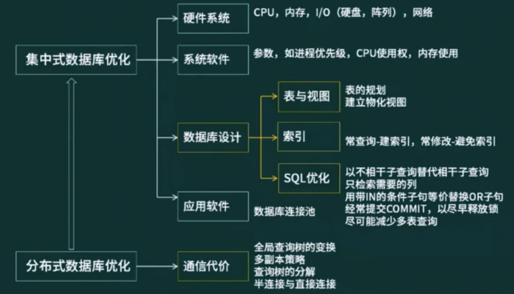

## 大数据

4V
- 数据量(Volume)
- 速度(Velocity)
- 多样性(Variety)
- 值(Value)

|比较维度|传统数据|大数据|
|-|-|-|
|数据量|GB或TB级|PB级或以上|
|数据分析需求|现有数据的分析与检测|深度分析(关联分析、回归分析)|
|硬件平台|高端服务器|集群平台|

大数据处理系统应该具有的重要特征:
- 高度可扩展性
- 高性能
- 高度容错
- 支持异构环境
- 较短的分析延迟
- 易用且开放的接口
- 较低成本
- 向下兼容性

## 题目

### 问题1:请用300字以内的文字，说明什么是数据库建模中的反规范化技术，指出采用反规范化技术能获得哪些益处，可能带来哪些问题。

答：

规范化设计后，数据库设计者希望牺牲部分规范化来提高性能，这种从规范化设计的回退方法称为反规范化技术。

采用反规范化技术的益处: 降低连接操作的需求、降低外码和索引的数目，还可能减少表的数目，能够提高查询效率。

可能带来的问题: 数据的重复存储，浪费了磁盘空间，可能出现数据的完整性问题，为了保障数据的一致性，增加了数据维护的复杂性，会降低修改速度。

### 问题2:请简要叙述常见的反规范化技术有哪些

答：

(1)增加几余列:在多个表中保留相同的列，通过增加数据几余减少或避免查询时的连接操作.

(2)增加派生列: 在表中增加可以由本表或其它表中数据计算生成的列，减少查询时的连接操作并避免计算或使用集合函数

(3)重新组表:如果许多用户需要查看两个表连接出来的结果数据，则把这两个表重新组成一个表来减少连接而提高性能。

(4)水平分割表:根据一列或多列数据的值，把数据放到多个独立的表中，主要用于表数据规模很大表中数据相对独立或数据需要存放到多个介质上时使用。

(5)垂直分割表:对表进行分割，将主键与部分列放到一个表中，主键与其它列放到另一个表中，在查询时减少I/O次数

