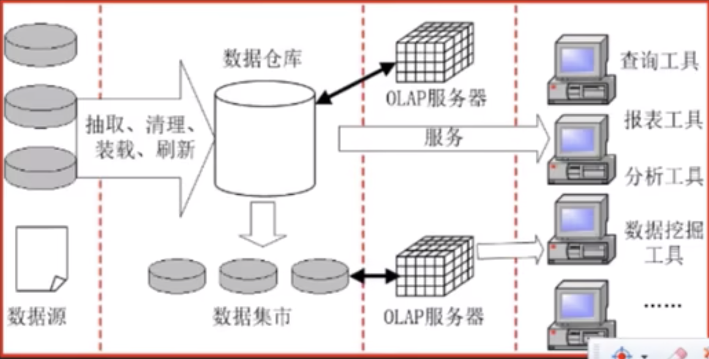
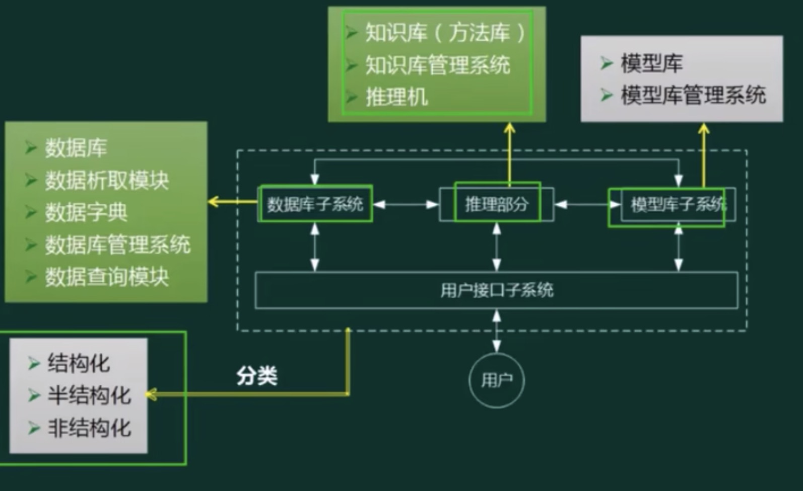

## 企业信息化战略与实施

### 信息与信息化的概念

信息的定义
- 香农: 信息就是不确定性的减少(香农: 人名，信息奠基人)
- 维纳: 信息既不是物质也不是能量，但是信息可以转化为物质或能量(维纳: 人名，控制论创始人)

信息的特点：
- 客观性: 也叫事实性，不符合事实的信息不仅没有价值，还有副作用
- 动态性: 信息随着时间变化
- 层次性: 信息可分为战略级、管理及和操作级
- 传递性: 信息在时间上的传递即是存储；在空间上的传递即是转移或扩散
- 滞后性: 信息是数据加工后的产物，所以相对数据有滞后性
- 扩压型: 信息和实物不同，他可以扩散也可以压缩
- 分享型: 信息可以分享，这个物质不同，并且信息分享具有非零和性

信息化的概念：
- 信息化就是计算机、通信和网络技术的现代化。
- 信息化就是从物质生产占主导地位的社会  向 信息产业占主导地位社会转变的发展过程。
- 信息化就是从工业社会向信息社会演进的过程

### 信息系统生命周期

- 立项阶段：企业全局、形成概念、需求分析
- 开发阶段：
  - 单个系统开发：
    - 总体规划
    - 系统分析
    - 系统设计
    - 系统实施
    - 系统验收
- 运维阶段：通过验收，移交之后
- 消亡阶段：更新改造，功能扩展，报废重建

### 信息系统战略规划

- 企业战略：确定企业未来发展的大方向。是对企业各种战略的统称，其中既包括竞争战略，也包括营销战略、发展战略、品牌战略、融资战略、技术开发战略、人才开发战略、资源开发战略等等。
- 企业信息化战略：为企业战略开发支撑系统。企业信息化战略是指企业为适应激烈的环境变化，通过集成聚合现代信息技术，开发应用信息资源，并能够聚合组织制度以获取未来竞争优势的长远运作机制和体系。

#### 信息系统战略规划方法ISSP

信息系统战略规划方法(Information system strategic planning, ISSP)

从企业战略出发 - 构建信息架构 - 实现战略目标

##### 历经三个阶段

第一阶段： 以数据处理为核心（围绕职能部门需求）

- BSP：企业系统规划法，4个基本步骤：定义管理目标、定义管理功能、定义数据分类和定义信息结构。主要用于大型信息系统的开发。BSP方法的目标是提供一个信息系统规划，用以支持企业短期的和长期的信息需求。
- SST：战略集合转化法
- CSF：关键成功因素法,该方法能够帮助企业找到影响系统成功的关键因素，进行分析以确定企业的信息需求，从而为管理部门控制信息技术及其处理过程提供实施指南。

第二阶段： 以企业内部MIS为核心(围绕企业整体需求)

- 战略数据规划方法SDP  (企业模型建立，主题数据库)
- 信息工程方法IE  （信息战略规划，业务领域分析，系统设计，系统构建）
- 战略栅格法SG :该方法创建一个2×2的矩阵（战略栅格），从战略影响方面标出企业现有的和将来的信息系统组合的特征，也就是它们对企业生存前景的影响。
 

第三阶段：综合考虑企业内外环境以集成为核心，围绕企业战略需求

- 价值链分析法 VCA
- 战略一致性模型 SAM : 可以帮助企业检查企业战略与信息基础架构之间的一致性。SAM把企业战略规划和信息化战略规划的关系划分为内、外两大部分。其中，外部区域是指企业所面临的外部竟争环境，例如，产品或IT市场等；内部区域包括企业组织结构、整体信息架构和业务流程等。模型由企业经营战略、组织与业务流程、信息系统战略、IT基础架构四大领域构成。

### 政府信息化与电子政务

- 政府对政府（G2G）
- 政府对企业（G2B or B2G）
- 政府对公民（G2C or C2G）
- 政府对公务员 （G2E）

### 企业信息化与电子商务

#### 企业信息化

企业信息化过程中有3个重要影响因素：经营战略、业务流程与组织、信息架构。 

#### 企业资源计划（ERP）

- 物料需求计划 MRP     （物料单系统）
- 制造资源计划 MRPII （增加库存、分销等）
- 企业资源计划 ERP  （打通了供应链，把财务、人力资源、销售管理等纳入）

ERP系统是企业资源计划(Enterprise Resource Planning )的简称，是业务流程管理软件。

它是利用由数据库管理系统维护的通用数据库，提供核心业务流程的集成和不断更新的视图。

同时集成了计划，采购，库存，销售，市场，财务和人力资源等领域。

ERP促进所有业务功能之间的信息流动，并管理与外部利益相关者的联系，促进所有业务功能之间的信息流动，提高企业核心竞争力具有显著作用。

#### 客户关系管理(CRM)

CRM客户关系管理系统，是Customer Relationship Management的缩写，是一种管理企业与当前和潜在客户的互动的方法。

帮助企业用于在整个客户生命周期内管理和分析客户交互和数据的实践，提高盈利能力。

同时，CRM系统既是一套管理制度，也是一套软件和技术。

目标是通过提高客户的价值、满意度、赢利性和忠实度来缩减销售周期和销售成本、改善客户服务关系并协助客户保留并推动销售增长

CRM和ERP的区别是什么？

首先，CRM主要目的是以客户关系的建立、发展和维护，而ERP是强调业务目的是为了提高整个盈利业务的生产力。其次两者在关注对象上有区别，erp重点关注是“企业内部资源计划”，CRM更多关注是“市场与客户”。

从主要目的来看，CRM是以客户关系的建立、发展和维护为目标，而ERP则强调业务的增长，主要目的是为了提高整个盈利业务的生产力。从二者的关注对象上来看，ERP重点关注的是“企业内部资源计划”，CRM则更多关注的是“市场与客户”。一个偏内一个偏外，不能说二者谁优谁劣，只能说谁更符合当下市场与企业的切实需求。

例如，CRM系统通常包含的功能有客户关系管理、营销自动化、销售自动化、客户服务、呼叫中心和知识库等，功能更多的是指向市场与客户，用最高的效率对客户关系进行发展和维护；ERP系统经常会使用到的功能有会计、项目管理、人力资源、库存、制造、供应链等，体现在对企业内部进行资源整合和管理。从二者的功能属性上来看，同样是一个偏外一个重内，企业在选择购买软件的时候一定要对自身有全面且清晰的了解。并且，在决定购买软件之前使用是很有必要的。

#### 供应链管理（SCM）

SCM理念：强强联合，整合与优化“三流”，打通企业间“信息孤岛”，严格的数据交换标准

“三流”：
- 信息流
  - 需求信息流：如客户订单，生产计划，采购合同等
  - 供应信息流：如入库单，完工报告，库存记录，可供销售量，提货发运单等
- 资金流
- 物流

#### 商业智能(BI)

商业智能(Business Intelligence, BI)偏解决方案，是解决方案的打包

流程：
- 需求分析
- 数据仓库建模
- 数据抽取
- 建立BI分析报表
- 用户培训和数据模拟测试
- 系统改进和完善

##### 数据仓库

特点：
- 面向主题：数据按主题组织。
- 集成的：消除了源数据中的不一致性，提供整个企业的一致性全局信息。
- 相对稳定的（非易失的）：主要进行查询操作，只有少量的修改和删除操作（或是不删除）。
-  反映历史变化（随着时间变化）：记录了企业从过去某一时刻到当前各个阶段的信息，可对发展历程和未来趋势做定量分析和预测

##### 数据挖掘

方法：
- 决策树（构建树结构进行分析）
- 神经网络（类似统计学中的判别、回归、聚类等功能）
- 遗传算法（三个基本过程：繁殖（选择）、交叉（重组）、变异（突变））
- 关联规则挖掘算法（关联规则是描述数据之间存在关系的规则）

分类：
- 关联分析：挖掘出隐藏在数据间的相互关系。
- 序列模式分析：侧重点是分析数据间的前后米系（因果关系）。
- 分类分析：为每一个记录赋予一个标记再按持记分类。 先赋予标记，在分类；
- 聚类分析：分类分析法的逆过程。 根据已有的特征，将相同的 放在一起

##### OLAP

联机分析处理, 对应数据仓库

##### OLTP

联机事务处理，对应数据库

#### 数据湖

数据湖是一个存储企业的各种各样原始数据的大型仓库，其中数据可供存取，处理，分析及传输

数据湖从企业的多个数据获取原始数据，并且针对不同的目的，同一份原始数据还可能有多重满足特定内部模型格式的数据副本。因此数据湖中被处理的数据可能是任意类型的信息，从结构化数据到完全非结构化数据

|维度|数据仓库|数据湖|
|-|-|-|
|数据|清洗过的数据 结构化的数据|原始数据； 结构化，半结构化的数据|
|模式|数据存储之前定义数据模式 数据集成之前完成大量工作 数据的价值提前明确|数据存储之后定义数据模式 提供敏捷，简单的数据集成 数据的价值尚未明确|
|存取方法|标准SQL接口|应用程序，类SQL程序|
|优势|多数据源集成 干净，安全的数据 转换一次，多次使用|无限扩展性 并行执行 支持编程框架 数据经济|

#### 决策支持系统(DSS)

决策支持系统（Decision Support System，DSS）是辅助决策者通过数据、模型和知识，以人机交互方式进行半结构化或非结构化决策的计算机应用系统。

它是MIS向更高一级发展而产生的先进信息系统。它为决策者提供分析问题、建立模型、模拟决策过程和方案的环境，调用各种信息资源和分析工具，帮助决策者提高决策水平和质量。

但是，DSS不可以代替决策者。DSS基本结构主要由四个部分组成，分别是数据库子系统、模型库子系统、推理部分和用户接口子系统。

决策支持可以分为结构化决策、半结构化决策和非结构化决策。其中，结构化决策是指对某一决策过程的规则进行确定性描述与建模，以适当的算法产生决策方案，并能从多种方案中选择最优解；
非结构化决策的决策过程复杂，不可能用确定的模型和语言描述其决策过程，更无所谓最优解。半结构化和非结构化决策一般用于企业的中、高级管理层。一般来说，决策往往不可能一次完成，而是一个迭代的过程。

#### 业务流程重组（BPR）

BPR是对企业的业务流程进行根本性的再思考和彻底性的再设计，从而获得可以用诸如成本、质量、服务和速度等方面的业绩来衡量的显著性的成就。

#### 业务流程管理（BPM）

BPM是一种以规范化的构造端到端的卓越业务流程为中心，以持续的提高组织业务绩效为目的的系统化方法。

PDCA闭环(戴明环)的管理过程
- 明确业务流程所欲获取的成果
- 开发和计划系统的方法，实现以上成果
- 系统地部署方法，确保全面实施
- 根据对业务的检查和分析以及持续的学习活动，评估和审查所执行的方法。并进一步提出计划和实施改进措施

BPM与BPR管理思想最根本的不同就在于流程管理并不要求对所有的流程进行再造。

构造卓越的业务流程并不是流程再造，而是根据现有流程的具体情况，对流程进行规范化的设计流程管理包含三个层面：规范流程、优化流程和再造流程

### 企业门户

- 企业网站：注重单向信息传递，缺互动。
- 企业信息门户（EIP）：把各种应用系统、数据资源和互联网资源统一集成到企业门户之下。
- 企业知识门户（EKP）：企业网站的基础上增加知识性内容。  WIKI 等
- 企业应用门户（EAP）：实际上是对企业业务流程的集成。它以业务流程和企业应用为核心，把业务流程中功能不同的应用模块通过门户技术集成在一起。
- 企业通用门户：集以上四者于一身

### 企业应用集成(EAI)

集成支持的方式：
- 面向信息的集成：针对信息孤岛问题，实现方法包括:数据复制，数据捆绑和基于接口的信息集成三中方式
- 面向过程的集成：技术层面的过程集成，引入工作流引擎。业务过程逻辑和应用逻辑分离，实现过程建模和数据，功能的分离
- 面向服务的集成：针对大范围内的公共业务过程集成。较好地实现企业间具有松散耦合关系的不同应用间的互操作

企业应用集成：
- 界面集成：把各应用系统的界面集成起来，统一入口，产生“整体”感觉。
- 数据集成：数据集成是应用集成和业务过程集成的基础。把不同来源、格式、特点性质的数据在逻辑上或物理上有机地集中，从而为企业提供全面的数据共享。ETL、数据仓库、联邦数据库都可视为数据集成。 集成点：数据库中间件
- 控制集成（功能集成、应用集成，API集成）：业务逻辑层次集成，可以借助于远程过程调用或远程方法调用、面向消息的中间件等技术。
- 业务流程集成（流程，过程集成，B2B）：进行业务流程集成时，企业必须对各种业务信息的交换进行定义、授权和管理，以便改进操作、减少成本、提高响应速度。
- 消息集成：适用于数据量小、但要求频繁地、立即地、异步地数据交换场合。
- 共享数据库：实时性强、可以频繁交互，数据的交换属于同步方式。
- 文件传输：适用于数据量大、交换频度小、即时性要求低的情况。
  - 应用集成：实现不同系统之间的互操作，使得不同应用系统之间能够实现数据和方法的共享。
  - 过程集成：业务流程的集成使得在不同应用系统中的流程能够无缝连接，实现流程的协调运作和流程信息的充分共享。

集成平台是支持企业集成的支撑环境，包括硬件、软件、软件工具和系统，通过集成各种企业应用软件形成企业集成系统。由于硬件环境和应用软件的多样性，企业信息系统的功能和环境都非常复杂，

因此，为了能够较好地满足企业的应用需求，作为企业集成系统支持环境的集成平台，其基本功能主要有：
- 通信服务：它提供分布环境下透明的同步/异步通信服务功能，使用户和应用程序无需关心具体的操作系统和应用程序所处的网络物理位置，而以透明的函数调用或对象服务方式完成它们所需的通信服务要求。
- 信息集成服务：它为应用提供透明的信息访问服务，通过实现异种数据库系统之间数据的交换、互操作、分布数据据管理和共享信息模型定义（或共享信息数据库的建立），使集成平台上运行的应用、服务或用户端能够以一致的语义和接口实现对数据（数据库、数据文件、应用交互信息）的访问与控制。
- 应用集成服务：它通过高层应用编程接口来实现对相应应用程序的访问，这些高层应用编程接口包含在不同的适配器或代理中，它们被用来连接不同的应用程序。这些接口以函数或对象服务的方式向平台的组件模型提供信息，使用户在无需对原有系统进行修改（不会影响原有系统的功能）的情况下，只要在原有系统的基础上加上相应的访问接口就可以将现有的、用不同的技术实现的系统互联起来、通过为应用提供数据交换和访问操作，使各种不同的系统能够相互协作。
- 二次开发工具：二次开发工具是集成平台提供的一组帮助用户开发特定应用程序（如实现数据转换的适配器或应用封装服务等）的支持工具，其目的是简化用户在企业集成平台实施过程中（特定应用程序接口）的开发工作。
- 平台运行管理工具：它是企业集成平台的运行管理和控制模块，负责企业集成平台系统的静态和动态配置、集成平台应用运行管理和维护、事件管理和出错管理等。通过命名服务、目录服务、平台的动态静态配置，以及其中的关键数据的定期备份等功能来维护整个服务平台的系统配置及稳定运行。

### 电子商务

信息化的三流
- 信息流（核心）
- 资金流
- 物流

电子商务的形式
- 企业对消费者（B2C）
- 企业对企业（B2B）
- 消费者对消费者（C2C）
- 线上对线下（O2O）

## 其他

组织信息化需求通常包括三个层次，即
- 战略需求
- 运作需求
- 用户需求

