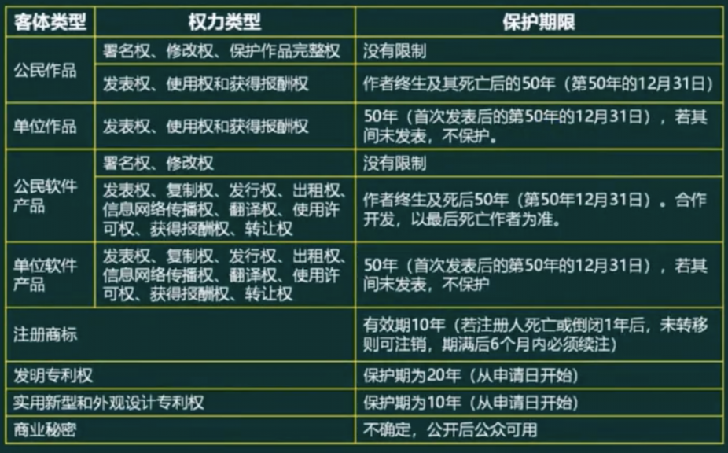
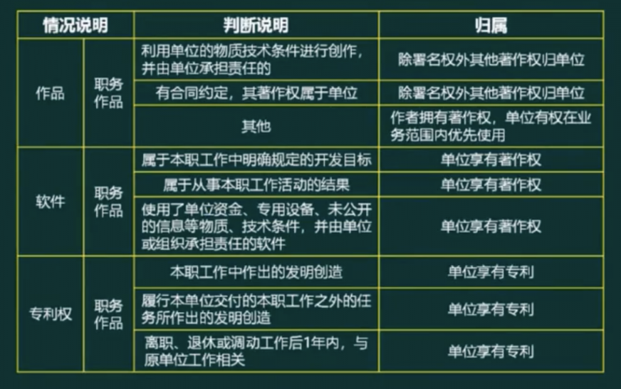
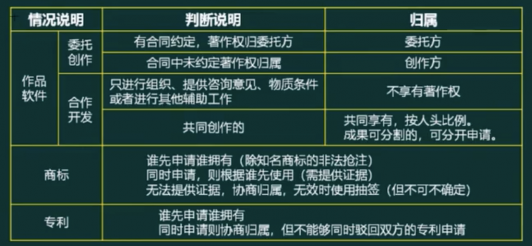

## 知识产权

### 保护范围与对象

|法律法规名称|保护对象及范围|注意事项|
|-|-|-|
|著作权法|著作权 文学、绘画、摄影等作品|1. 不需要申请，作品完成即开始保护 2. 绘画或摄影作品原件出售(赠予)著作权还2归原作者，原件拥有者有: 所有权、展览权。|
|软件著作权法 计算机软件保护条例|软件著作权 软件作品|1. 不需要申请，作品完成即开始保护 2. 登记制度便于举证|
|专利法|专利权|需要申请，专利权有效期是从申请日开始计算|
|商标法|商标权|需要申请，核准之日起商标受保护|
|反不正当竞争法|商业秘密权|1. 商业秘密包括技术与经营两个方面 2. 必须有保密措施才能认定商业秘密|

### 保护期限

### 知识产权人确定

### 侵权判定

中国公民、法人或者其他组织的作品，不论是否发表，都享有著作权。

开发软件所用的思想、处理过程、操作方法或者数学概念不受保护

著作权法不适用于下列情形:
- 法律、法规，国家机关的决议、决定、命令和其他具有立法、行政、司法性质的文件，及其官方正式译文;
- 时事新闻;
- 历法、通用数表、通用表格和公式

|不侵权|侵权|
|-|-|
|个人学习、研究或者欣赏; 适当引用 公开演讲内容 用于教学或科学研究 复制馆藏作品 免费表演他人作品; 室外公共场所艺术品临墓、绘画、摄影、录像将汉语作品译成少数民族语言作品或盲文出版|未经许可，发表他人作品; 未经合作作者许可，将与他人合作创作的作品当作自己单独创作的作品发表的; 未参加创作，在他人作品署名; 歪曲、算改他人作品的 剽窃他人作品的; 使用他人作品，未付报酬 未经出版者许可，使用其出版的图书、期刊的版式设计的。|

## 标准化

### 标准的分类

- 国际标准:ISO、IEC等国际标准化组织
- 国家标准: GB一中国、ANSI-美国、BS一英国、JIS一日本
- 区域标准: 又称为地区标准，如PASC一太平洋地区标准会议、CEN一欧洲标准委员会、ASAC一亚洲标准咨询委员会、ARSO一非洲地区标准化组织
- 行业标准: GJB一中国军用标准、MIT-S一美国军用标准、IEEE一美国电气电子工程师协会
- 地方标准: 国家的地方一级行政机构制订的标准
- 企业标准
- 项目规范

### 标准的编号

- 国际、国外标准代号: 标准代号+专业类号+顺序号+年代号
- 我国国家标准代号: 强制性标准代号为GB、推荐性标准代号为GB/T、指导性标准代号为GB/Z、实物标准代号GSB
- 行业标准代号: 由汉语拼音大写字母组成(如电子行业为SJ)
- 地方标准代号: 由DB加上省级行政区划代码的前两位
- 企业标准代号: 由Q加上企业代号组成