## 进程管理

### 概述

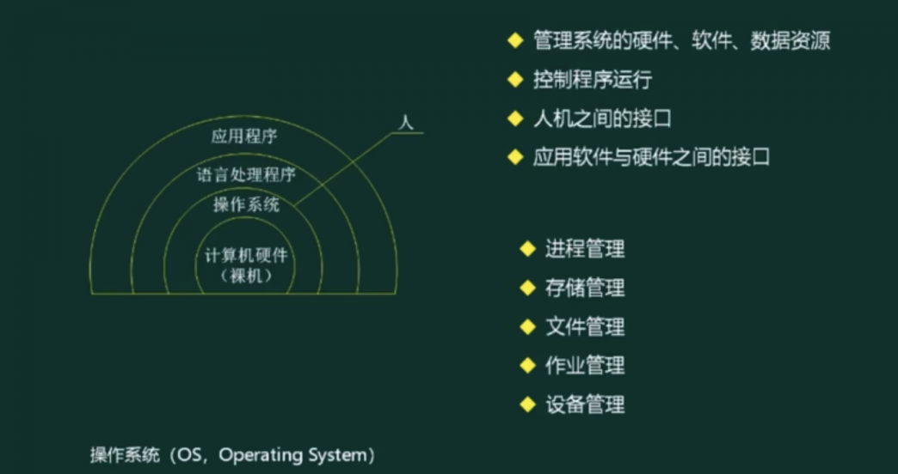

### 进程状态

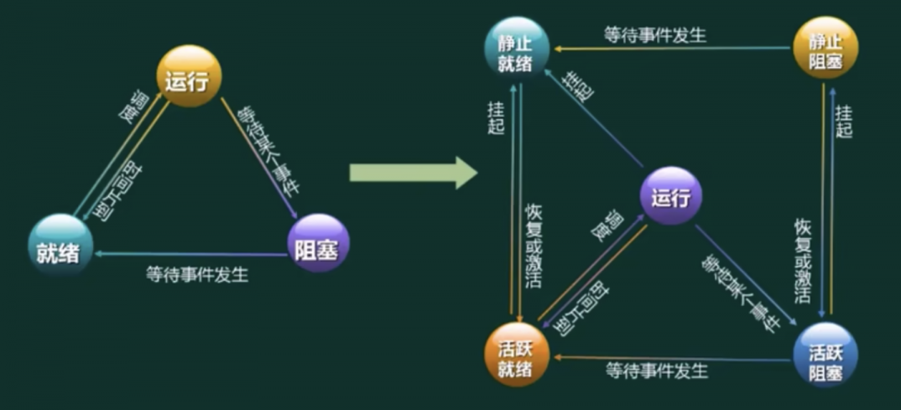

- 左：三态模型
- 右：五态模型

### 前趋图

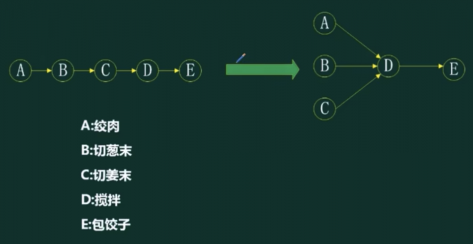

### 进程的同步与互斥

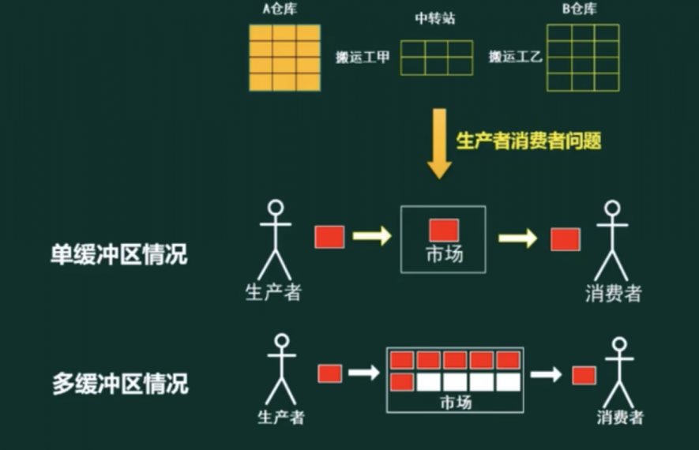

### PV操作

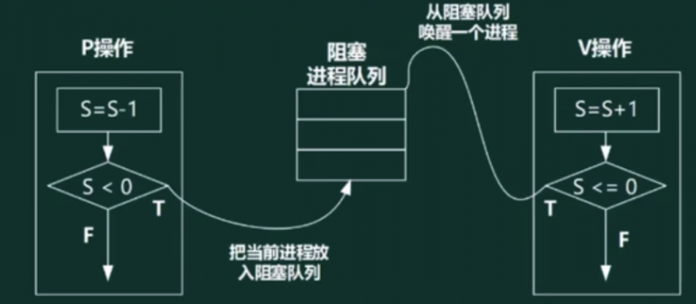

- 临界资源: 诸进程间需要互斥方式对其进行共享的资源，如打印机、磁带机等
- 临界区: 每个进程中访问临界资源的那段代码称为临界区
- 信号量: 是一种特殊的变量(信号量是全局变量)

> 注: P是荷兰语的Passeren，V是荷兰语的Verhoog。

P操作：
1. 申请资源
2. 判断资源是否足够，资源不够把当前进程放入阻塞队列

V操作：
1. 信号量(S)+1，表示释放资源
2. 检查是否有人排队
3. 通知阻塞进程

> 信号量小于0可以表示排队进程数量

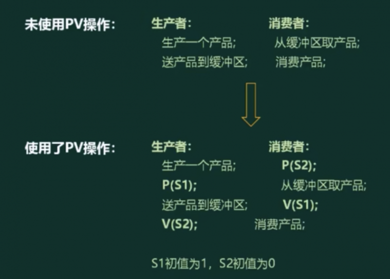

### 死锁问题

> 进程管理是操作系统的核心，但如果设计不当，就会出现死锁的问题。如果一个进程在等待一件不可能发生的事，则进程就死锁了。而如果一个或多个进程产生死锁，就会造成系统死锁

例:系统有3个进程: A、B、C。这3个进程都需要5个系统资源。如果系统至少有多少个资源，则不可能发生死锁。

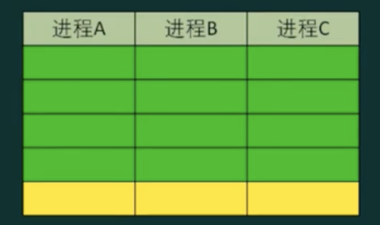

> 答案： 13个； 必须确保其中一个进程分配到5个资源；

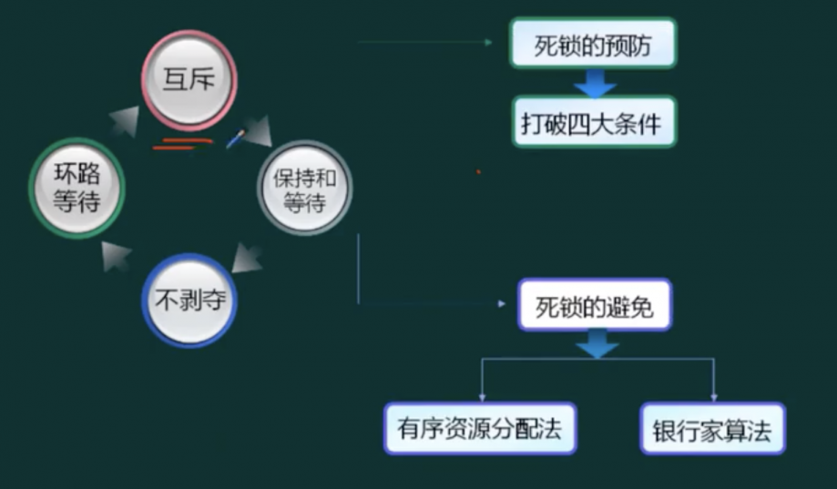

### 银行家算法

银行家算法: 分配资源的原则

- 当一个进程对资源的最大需求量不超过系统中的资源数时可以接纳该进程
- 进程可以分期请求资源，但请求的总数不能超过最大需求量
- 当系统现有的资源不能满足进程尚需资源数时，对进程的请求可以推迟分配，但总能使进程在有限的时间里得到资源

例子：
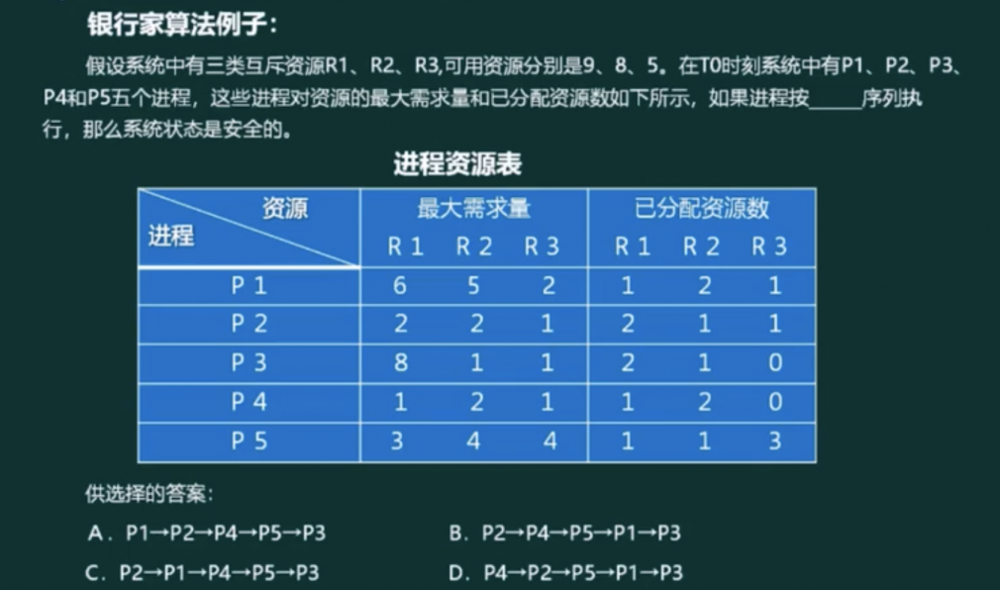

1. 统计已分配资源总数
2. 计算剩余可用资源数
3. 计算所有进程的仍需资源数

> 答案： B

## 存储管理

### 页式存储组织

> 页式存储: 将程序与内存均划分为同样大小的块，以页为单位将程序调入内存

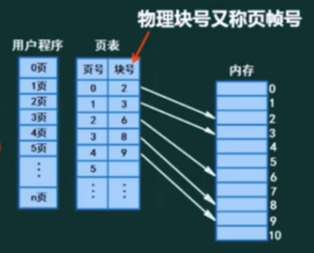

- 高级程序语言使用逻辑地址;
- 运行状态，内存中使用物理地址。

> 逻辑地址=页号+页内地址; 物理地址=页帧号+页内地址

例如，页式存储系统中，每个页的大小为4KB
- 逻辑地址址:10 1100 1101 1110
  > 逻辑地址： 页号 + 页内地址; 这里页的大小是4kb对应`2^12`; 所以上面的`10`是页号对应十进制的2，`1100 1101 1110`是页内地址
- 对应的物理地址为:110 1100 1101 1110
  > 通过逻辑地址转换物理地址： 将页号替换成页帧号；根据上图页表通过逻辑地址的页号`2`找到对应块号(页帧号)`6`, `6`的二进制表示`110`

优点: 利用率高，碎片小，分配及管理简单

缺点: 增加了系统开销，可能产生抖动现象

> 注: 页内偏移量 = 页内地址
 
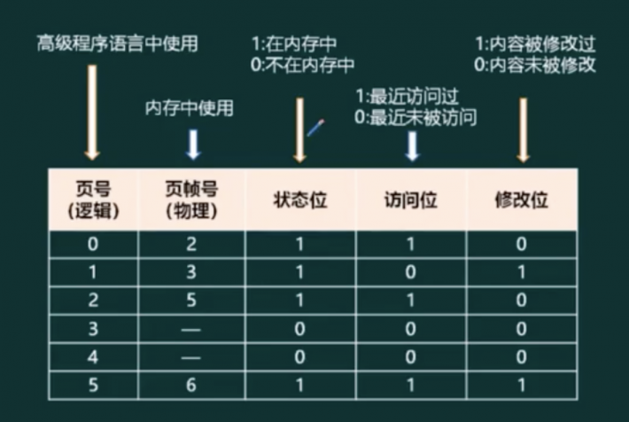

1. 优先淘汰访问位为0
2. 其次考虑修改为0

### 段式存储组织

> 段式存储:按用户作业中的自然段来划分逻辑空间，然后调入内存，段的长度可以不一样

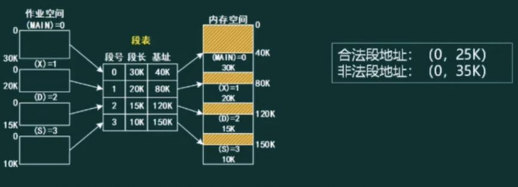

> 逻辑地址：段号 + 段内偏移量

优点: 多道程序共享内存，各段程序修改互不影响

缺点:内存利用率低，内存碎片浪费大

### 段页式存储组织  

> 段页式存储:段式与页式的综合体。先分段，再分页。1个程序有若干个段，每个段中可以有若千页，每个页的大小相同，但每个段的大小不同。

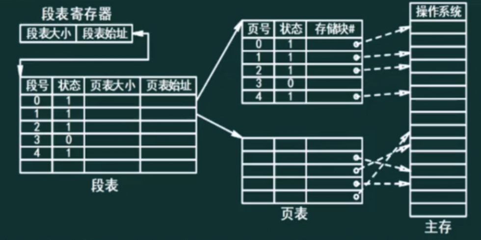

优点: 空间浪费小、存储共享容易、存储保护容易、能动态连接

缺点: 由于管理软件的增加，复杂性和开销也随之增加，需要的硬件以及占用的内容也有所增加，使得执行速度大大下降

### 快表

快表是一块小容量的相联存储器 (Associative Memory) ，由高速缓存器组成，速度快，并且可以从硬件上保证按内容并行查找，一般用来存放当前访问最频繁的少数活动页面的页号。

- 快表: 将页表存于Cache上; 
- 慢表: 将页表存于内存上

## 文件管理

### 索引文件结构

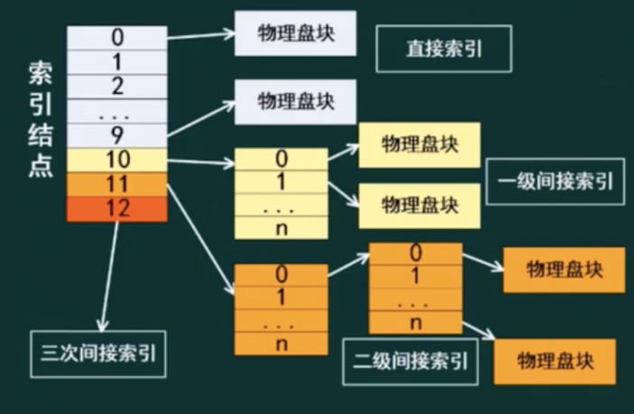

> 索引节点默认是13个(0 - 12)

### 文件和树形结构目录

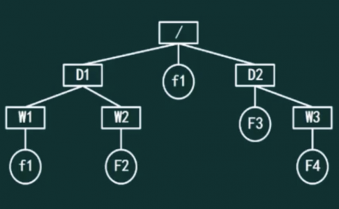

文件属性：
- R 只读文件属性
- A 存档属性
- S 系统文件
- H 隐藏文件

文件名的组成：
- 驱动器号
- 路径
- 主文件名
- 扩展名

绝对路径： 是从盘符开始的路径 

相对路径: 是从当前目录开始的路径

若当前目录为: D1, 要求F2路径， 则: 绝对路径: /D1/W2/F2, 相对路径: W2/F2

### 空闲存储空间的管理

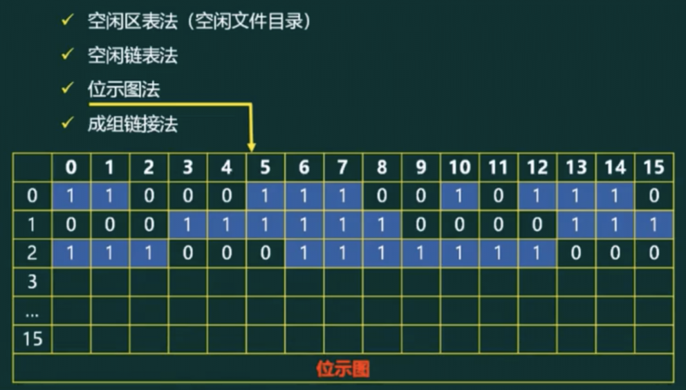

## 设备管理

### 数据传输控制方式

1. 程序控制(查询)方式: 分为无条件传送和程序查询方式两种; 方法简单，硬件开销小，但O能力不高，严重影响CPU的利用率。
2. 程序中断方式: 与程序控制方式相比，中断方式因为CPU无需等待而提高了传输请求的响应速度。如: 键盘
3. DMA方式: 直接存储器访问(DMA, Direct Memory Access)DMA方式是为了在主存与外设之间实现高速、批量数据交换而设置的。DMA方式比程序控制方式与中断方式都高效如:硬盘
4. 通道方式
5. I/O处理机: 输入/输出(I/O, Input/Output)

> 上述内容，按顺序效率越来越高

### 虚设备与SPOOLING技术

> 假脱机

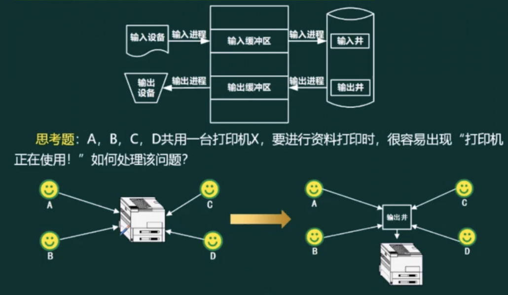

## 微内核操作系统

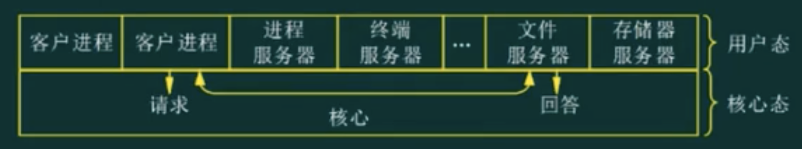

|-|实质|优点|缺点|
|-|-|-|-|
|单体内核|将图形、设备驱动及文件系统等功能全部在内核中实现，运行在内核状态和同一地址空间|减少进程间通信和状态切换的系统开销，获得较高的运行效率|内核庞大，占用资源较多且不易剪裁 系统的稳定性和安全性不好.|
|微内核|只实现基本功能，将图形系统、文件系统、设备驱动及通信功能放在内核之外|内核精练，便于剪裁和移植。系统服务程序运行在用户地址空间，系统的可靠性、稳定性和安全性较高。 可用于分布式系统|用户状态和内核状态需要频繁切换，从而导致系统效率不如单体内核|

## 嵌入式操作系统

1. 嵌入式操作系统特点:
    - (1) 微型化
    - (2) 代码质量高
    - (3) 专业化
    - (4) 实时性强
    - (5) 可裁减、可配置
2. 实时嵌入式操作系统的内核服务有: 异常和中断、计时器、I/O管理。
3. 常见的嵌入式RTOS (实时操作系统, Real-Time OperatingSystem)VxWorks、 RT-Linux、QNX、pSOS.

|比较类型|VxWorks|RT-Linux|
|-|-|-|
|工作方式|操作系统与应用程序处于同一存储空间|操作系统与应用程序处于不同存储空间|
|多任务支持|支持多任务(线程)操作|支持多进程、多线程操作|
|实时性|实时系统|实时系统|
|安全性|任务间无隔离保护|支持进程间隔离保护|
|标准API|支持|支持|

