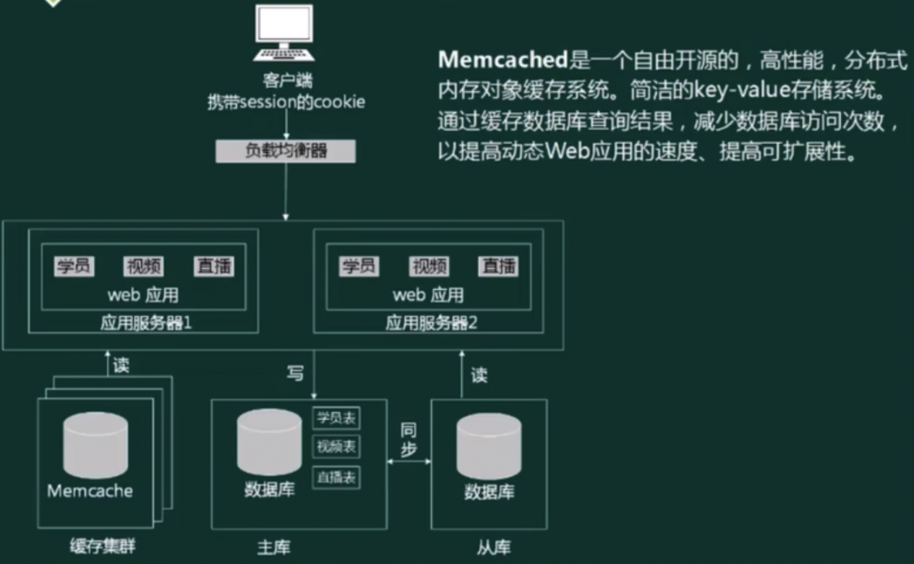

## 软件架构的概念

软件架构风格是描述某一特定应用领域中系统组织方式的惯用模式。架构风格定义一个系统家族，即一个体系结构定义一个词汇表和一组约束。词汇表中包含一些构件和连接件类型，而这组约束指出系统是如何将这些构件和连接件组合起来的。

软件架构为软件系统提供了一个结构、行为和属性的高级抽象，由构成系统的元素的描述、这些元素的相互作用、指导元素集成的模式以及这些模式的约束组成。

软件架构是项目干系人进行交流的手段，明确了对系统实现的约束条件，决定了开发和维护组织的组织结构，制约着系统的质量属性

软件架构使推理和控制的更改更加简单，有助于循序渐进的原型设计，可以作为培训的基础 

软件架构是<b>可传递和可复用的模型</b>，通过研究软件架构可能预测软件的质量 

> 架构设计就是需求分配，即将满足需求的职责分配到组件上

> 体系结构 = 架构

## 软件架构的建模

结构模型：以架构的构件、连接件和其他概念来刻画结构

框架模型：不太侧重描述结构的细节而更侧重于整体的结构

动态模型：系统的“大颗粒”的行为性质

过程模型：构建系统的步骤和过程

功能模型：由一组功能构件按层次组成，下层向上层提供服务

## 架构描述语言（ADL）

ADL是这样一种形式化语言，它在底层语义模型的支持下，为软件系统的概念体系结构建模提供了具体语法和概念框架。基于底层语义的工具为体系结构的表示、分析、演化、细化、设计过程等提供支持。

ADL的三个基本元素
- 构件: 计算或数据存储单元
- 连接件: 用于构件之间交互建模的体系结构构造块及其支配这些交互的规则架- 构配置: 描述体系结构的构件与连接件的连接图

主要的架构描述语言
- Aesop: 支持体系结构风格的应用
- MetaH : 为设计者提供了关于实时电子控制软件系统的设计指导
- C2:支持基于消息传递风格的用户界面系统的描述
- Rapide: 支持体系结构设计的模拟并提供了分析模拟结果的工具
- SADL: 提供了关于体系结构加细的形式化基础
- Unicon : 支持异构的构件和连接类型并提供了关于体系结构的高层编译器
- Wright : 支持体系结构构件之间交互的说明和分析

## 4+1模型

> 详细：[4+1模型](/note/rk/SE?id=uml41视图)

## 软件架构风格

架构设计的一个核心问题是能否达到架构级的软件复用

架构风格反映了领域中众多系统所共有的结构和语义特性，并指导如何将各个构件有效地组织成一个完整的系统

架构风格定义了用于描述系统的术语表和一组指导构建系统的规则

Garlan和Shaw对通用软件架构风格进行了分类，他们将软件架构分为数据流风格、调用/返回风格、独立构件风格、虚拟机风格和仓库风格。
1. 数据流风格：数据流风格包括批处理序列和管道/过滤器两种风格。
2. 调用/返回风格：调用/返回风格包括主程序和子程序、数据抽象和面向对象，以及层次结构。
3. 独立构件风格：独立构件风格包括进程通信和事件驱动的系统。
4. 虚拟机风格：虚拟机风格包括解释器和基于规则的系统。
5. 仓库风格：仓库风格包括数据库系统、黑板系统和超文本系统。
6. 过程控制：闭环控制

### 数据流风格

- 批处理序列: 构件为一系列固定顺序的计算单元，构件之间只通过数据传递交互。每个处理步骤是一个独立的程序，每一步必须在其前一步结束后才能开始，<b>数据必须是完整的以整体的方式传递</b>。
- 管道-过滤器: 每个构件都有一组输入和输出，构件读输入的数据流，经过内部处理，然后产生输出数据流。这个过程通常是通过对输入数据流的变换或计算来完成的，包括通过计算和增加信息以丰富数据、通过浓缩和删除以精简数据、通过改变记录方式以转化数据和递增地转化数据等。这里的构件称为过滤器，连接件就是数据流传输的管道将一个过滤器的输出传到另一个过滤器的输入

> 早期编译器就是采用的这种架构。要一步一步处理的，均可考虑采用此架构风格

### 调用/返回风格

- 主程序/子程序: 单线程控制，把问题划分为若干个处理步骤，构件即为主程序和子程序，子程序通常可合成为模块。过程调用作为交互机制，即充当连接件的角色。调用关系具有层次性，其语义逻辑表现为主程序的正确性取决于它调用的子程序的正确性

- 面向对象: 构件是对象，对象是抽象数据类型的实例。在抽象数据类型中，数据的表示和它们的相应操作被封装起来，对象的行为体现在其接受和请求的动作。连接件即是对象间交互的方式，对象是通过函数和过程的调用来交互的

- 层次结构: 构件组织成一个层次结构，连接件通过决定层间如何交互的协议来定义。每层为上一层提供服务，使用下一层的服务，只能见到与自己邻接的层。通过层次结构，可以将大的问题分解为若干个渐进的小问题逐步解决，可以隐藏问题的复杂度。修改某一层，最多影响其相邻的两层( 通常只能影响上层 )

优点:
1. 这种风格支持基于可增加抽象层的设计，允许将一个复杂问题分解成一个增量步骤序列的实现。
2. 不同的层次处于不同的抽象级别 :越靠近底层，抽象级别越高
越靠近顶层，抽象级别越低
3. 由于每一层最多只影响两层，同时只要给相邻层提供相同的接口，允许每层用不同的方法
实现，同样为软件复用提供了强大的支持。

缺点:
1. 并不是每个系统都可以很容易地划分为分层的模式
2. 很难找到一个合适的、正确的层次抽象方法

#### 层次架构风格

上面已经对层次系统架构风格进行了初步介绍，下面将对几种经典的层次风格进行详细说明

- CS架构：架构是客户端和服务器架构，通过充分利用两端硬件环境的优势，将任务合理分配到Client端和Server端来实现。
- BS架构：架构是浏览器和服务器架构，用户工作界面是通过浏览器来实现，极少部分事务逻辑在前端（Browser）实现，但是主要事务逻辑在服务器端（Server）实现。

##### 两层C/S架构

##### 三层C/S架构

##### 三层B/S架构

- B/S架构缺乏对动态页面的支持能力，没有集成有效的数据库处理功能
- B/S架构的安全性难以控制
- 采用B/S架构的应用系统，在数据查询等响应速度上，要远远低于C/S架构
- B/S架构的数据提交一般以页面为单位，数据的动态交互性不强，不利于OLTP应用

##### MVC架构风格

- Model( 模型)是应用程序中用于处理应用程序数据逻辑的部分。通常模型对象负责在数据库中存取数据。
- View ( 视图)是应用程序中处理数据显示的部分。
- Controller( 控制器)是应用程序中处理用户交互的部分。通常控制器负责从视图读取数据，控制用户输入，并向模型发送数据。

-  J2EE体系结构中:
  - 视图( View ) :JSP
  - 控制 ( Controller ) : Servlet
  - 模型 ( Model ) : Entity Bean、Session Bean

##### MVP架构风格

> TODO

##### 混合架构风格

##### 富互联网应用(RIA)

- RIA结合了C/S架构反应速度快、交互性强的优点，以及B/S架构传播范围广及容易传播的特性
- RIA简化并改进了B/S架构的用户交互
- 数据能够被缓存在客户端，从而可以实现一个比基于HTML的响应速度更快且数据往返于服务器的次数更少的用户界面

### 独立构件风格

- 进程通信
  - 构件是独立的过程，连接件是消息传递。构件通常是命名过程，消息传递的方式可以是点对点、异步或同步方式，以及远程过程(方法 )调用等
- 事件驱动系统( 隐式调用 )
  - 构件不直接调用一个过程，而是触发或广播一个或多个事件。构件中的过程在一个或多个事件中注册，当某个事件被触发时，系统自动调用在这个事件中注册的所有过程。一个事件的触发就导致了另一个模块中的过程调用。这种风格中的构件是匿名的过程，它们之间交互的连接件往往是以过程之间的隐式调用来实现的。主要优点是为软件复用提供了强大的支持，为构件的维护和演化带来了方便;其缺点是构件放弃了对系统计算的控制。

### 虚拟机风格

虚拟机风格的基本思想是人为构建一个运行环境，在这个环境之上，可以解析与运行自定义的一些语言，这样来增加架构的灵活性，虚拟机风格主要包括解释器和规则为中心两种架构风格。

1. 解释器：一个解释器通常包括完成解释工作的解释引擎，一个包含将被解释的代码的存储区，一个记录解释引擎当前工作状态的数据结构，以及一个记录源代码被解释执行进度的数据结构。具有解释器风格的软件中含有一个虚拟机，可以仿真硬件的执行过程和一些关键应用。解释器通常被用来建立一种虚拟机以弥合程序语义与硬件语义之间的差异。其缺点执行效率较低。典型的例子是专家系统。

2. 规则为中心：基于规则的系统包括规则集、规则解释器、规则/数据选择器及工作内存。

### 仓库风格(以数据为中心的风格)

仓库风格中构件分两种：一种是中央数据结构，保存系统的当前状态；另一种是独立构件，对中央数据存储进行操作。

- 数据库系统
- 黑板系统: 包括知识源、黑板和控制三部分。知识源包括若干独立计算的不同单元，提供解决问题的知识。知识源响应黑板的变化，也只修改黑板，黑板是一个全局数据库，包含问题域解空间的全部状态，是知识源相互作用的唯一媒介;知识源响应是通过黑板状态的变化来控制的。黑板系统通常应用在对于解决问题没有确定性算法的软件中( 信号处理、问题规划和编译器优化等 )。
- 超文本系统: 构件以网状链接方式相互连接，用户可以在构件之间进行按照人类的联想思维方式任意跳转到相关构件。超文本是一种非线性的网状信息组织方法，它以结点为基本单位，链作为结点之间的联想式关联。超文本系统通常应用在互联网领域现代集成编译环境一般采用这种架构风格

### 闭环控制架构(过程控制)

### C2风格

## 基于服务的架构(SOA)

### 特点

### SOA的实现方式 - Web Service

### SOA的实现方式 - ESB

### SOA的实现方式 - 服务注册表

- 服务注册:应用开发者( 服务提供者 )向注册表公布服务的功能
- 服务位置: 服务使用者( 服务应用开发者 )，帮助他们查询注册服务，寻找符合自身要求的服务
- 服务绑定:服务使用者利用检索到的服务接口来编写代码，所编写的代码将与注册的服务绑定、调用注册的服务，以及与它们实现互动

### SOA - 关键技术

#### 功能和WSDL

|功能|协议|
|-|-|
|发现服务|UDDI、 DISCO|
|描述服务|WSDL、XML Schema|
|消息格式层|SOAP、REST|
|编码格式层|XML ( DOM , SAX )|
|传输协议层|HTTP、TCP/IP、SMTP等|

> WSDL就是WebService接口对应的WSDL文件，该文件通过xml格式说明如何调用可以看作WebService的接口文档( 使用说明书)

#### SOAP

SOAP，Simple Object Access Protocol，简单对象访问协议，简单的说就是用于访问网络服务的协议;它是基于 XML 的简易协议，可使应用程序在 HTTP之上进行信息交换。

SOAP是一种网络通信协议，用于网络上、不同平台、不同语言的应用程序间的通讯。

> SOAP协议 = HTTP协议 + XML数据格式

#### REST

- HTTP + XML进行基于 Web 通信的技术
- 简单性，缺少严格配置文件
- 只支持几个操作(POST、GET、PUT、DELETE)
- 强调信息本身，称为资源
  - 网络上的所有事物都被抽象为资源
  - 每个资源对应一个唯一的资源标识
  - 通过通用的连接器接口对资源进行操作
  - 对资源的各种操作不会改变资源标识
  - 所有的操作都是无状态的

### 微服务

微服务可以讲是 SOA 的一种，但仔细分析与推敲，我们又能发现他们的一些差异。这
种差异表现在多个方面

微服务顾名思义，就是很小的服务，所以它属于面向服务架构的一种。

微服务架构是一种架构模式，它提倡将单一应用程序划分成一组小的服务，服务之间互相协调、互相配合，为用户提供最终价值。每个服务运行在其独立的进程中，服务与服务间采用轻量级的通信机制与相沟通(通常是基于HTTP协议的RESTful API)。每个服务都围绕着具体业务进行构建，并且能够被独立的部署到生产环境、类生产环境等。另外，应当尽量避免统一的、集中式的服务管理机制，对具体的一个服务而言，应根据业务上下文，选择合适的语言、工具对其进行构建。

- 特点
  - 小,且专注于做一件事情
  - 轻量级的通信机制
  - 松耦合、独立部署

微服务的优势：
- 技术异构性
- 弹性
- 扩展
- 简化部署
- 与组织结构相匹配
- 可组合性
- 对可替代性的优化

微服务面临的挑战
- 分布式系统的复杂度
- 运维成本
- 部署自动化
- DevOps与组织结构
- 服务间依赖测试
- 服务间依赖管理

|微服务|SOA|
|-|-|
|能拆分的就拆分|是整体的，服务能放一起的都放一起|
|纵向业务划分|是水平分多层|
|由单一组织负责|按层级划分不同部门的组织负责|
|细粒度|粗粒度|
|两句话可以解释明白|几百字只相当于SOA的目录|
|独立的子公司|类似大公司里面划分了一些业务单元( BU )|
|组件小|存在较复杂的组件|
|业务逻辑存在于每一个服务中|业务逻辑横跨多个业务领域|
|使用轻量级的通信方式，如HTTP|企业服务产总线(ESB ) 充当了服务之间通信的角色|

|微服务架构实现|SOA实现|
|-|-|
|团队级，自底向上开展实施|企业级，自顶向下开展实施|
|一个系统被拆分成多个服务，粒度细|服务由多个子系统组成，粒度大|
|无集中式总线，松散的服务架构|企业服务总线，集中式的服务架构|
|集成方式简单(HTTP/REST/JSON )|集成方式复杂(ESB/WS/SOAP )|
|服务能独立部署|单块架构系统，相互依赖，部署复杂|

## 模型驱动架构(MDA)

### 概念

MDA(Model Driven Architecture): 起源于分离系统规约和平台实现的思想
- Model: 客观事物的抽象表示
- Architecture: 构成系统的部件、连接件及其约束的规约
- Model-Driven: 使用模型完成软件的分析，设计，构建，部署，维护等各开发活动

<!--  -->

### 主要目标

- 可移植性(Portability)
- 互通性(interoperability)
- 可重用性(Reusability)

### MDA的3种核心模型

## 特定领域软件架构（DSSA）

在特定领域架构中，垂直域关注的是与行业相关的，聚焦于行业特性的内容，而水平域关注的是各行业共性部分的内容

### 基本活动

### 领域分析机制

1. 领域专家: 有经验的用户、从事该领域中系统的需求分析、设计、实现以及项目管理的有经验的软件工程师等.
领域专家的主要任务包括提供关于领域中系统的
需求规约和实现的知识
2. 领域分析人员: 领域分析人员应由具有知识工程背景的有经验的系统分析员来担任
3. 领域设计人员: 领域设计人员应由有经验的软件设计人员来担任。
4. 领域实现人员: 领域实现人员应由有经验的程序设计人员来担任。

### 建立过程

### 三层次模型

## 基于架构的软件设计(ABSD)

基于架构的软件设计(Architecture Based Software Development, ABSD): 把整个基于架构的软件过程划分为架构需求、设计、文档化、复审、实现、演化等 6 个子过程

ABSD方法是一个自顶向下，递归细化的方法，软件系统的体系结构通过该方法得到细化，知道能产生软件构件和类

- ABSD方法是架构驱动，即<b>强调由业务、质量和功能需求的组合驱动架构设计</b>
- 使用ABSD方法，设计活动可以从项目总体功能框架明确就开始，这意味着需求获取和分析还没有完成( 甚至远远没有完成 )，就开始了软件设计
- ABSD方法有三个基础
  - 第一个基础是<b>功能的分解</b>。在功能分解中，ABSD方法使用已有的基于模块的内聚和耦合技术，
  - 第二个基础是通过<b>选择架构风格来实现质量和业务需求</b>;
  - 第三个基础是<b>软件模板的使用</b>。软件模板利用了一些软件系统的结构。
- ABSD方法是递归的，且迭代的每一个步骤都是清晰地定义的。因此，不管设计是否完成，架构总是清晰的，这有助于降低架构设计的随意性。
- 视角与视图: 从不同的视角来检查，所以会有不同的视图。
- <b>用例用来捕获功能需求、特定场景来捕获质量需求</b>

### 基于架构的软件开发方法
 

## 软件架构评估

- 风险点:系统架构风险是指架构设计中潜在的、存在问题的架构决策所带来的隐患
- 敏感点是指为了实现某种特定的质量属性，一个或多个构件所具有的特性
- 权衡点是影响多个质量属性的特性，是多个质量属性的敏感点。

### 质量属性

1. 性能( performance )是指系统的响应能力，即要经过多长时间才能对某个事件做出响应，或者在某段时间内系统所能处理的事件的个数。
  > 代表参数: 响应时间、吞吐量

2. 可用性( availability )是系统能够正常运行的时间比例。经常用两次故障之间的时间长度或在出现故障时系统能够恢复正常的速度来表示
  > 代表参数: 故障间隔时间

3. 安全性( security )是指系统在向合法用户提供服务的同时能够阻止非授权用户使用的企图或拒绝服务的能力。安全性又可划分为机密性、完整性、不可否认性及可控性等特性。
  > 设计策略 : 追踪审计

4. 可修改性( modifiability ) 是指能够快速地以较高的性能价格比对系统进行变更的能力。通常以某些具体的变更为基准，通过考察这些变更的代价衡量可修改性
  > 主要策略: 信息隐藏

5. 可靠性(reliability)是软件系统在应用或系统错误面前，在意外或错误使用的情况下维持软件系统的功能特性的基本能力。主要考虑两个方面: 容错、健壮性。
  > 代表参数:MTTE、MTBF

6. 功能性( functionality ) 是系统所能完成所期望的工作的能力。一项任务的完成需要系统中许多或大多数构件的相互协作。

7. 可变性(changeability ) 是指体系结构经扩充或变更而成为新体系结构的能力。这种新体系结构应该符合预先定义的规则，在某些具体方面不同于原有的体系结构。当要将某个体系结构作为一系列相关产品( 例如，软件产品线》的基础时，可变性是很重要的。

8. 作为系统组成部分的软件不是独立存在的，经常与其他系统或自身环境相互作用。为了支持互操作性(interoperation )，软件体系结构必须为外部视的功能特性和数据结构提供精心设计的软件入口.程序和用其他编程语言编写的软件系统的交互作用就是互操作性的问题，这种互操作性也影响应用的软件体系结构

### 基于场景的方式

- 确定应用领域的功能和软件架构的结构之间的映射
- 设计用于体现待评估质量属性的场景
- 分析软件架构对场景的支持程度

1. 软件架构分析法(SAAM)
2. 架构权衡分析法(ATAM)
3. 成本效益分析法(CBAM)

#### 软件架构分析法(SAAM)

#### 架构权衡分析法(ATAM)

架构权衡分析方法（Architecture Tradeoff Analysis Method）

ATAM : 在SAAM的基础上发展起来的，主要针对性能、实用性、安全性和可修改性，在系统开发之前，对这些质量属性进行评价和折中

- 第一阶段 场景和需求收集
  - 收集场景
  - 收集需求/约束/环境
- 第二阶段 架构视图和场景实现
  - 描述架构视图
  - 实现场景
- 第三阶段 属性模型构造和分析
  - 特定属性分析( 优秀的单一理论 )
- 第四阶段 折中
  - 标志折中
  - 标志敏感度

### 质量效应树

## 软件产品线

### 过程模型 

#### 双生命周期模型

#### SEI模型

### 建立方式

|-|演化方式|革命方式|
|-|-|-|
|基于现有产品|基于现有产品架构设计产品线的架构，经演化现有构件，开发产品线构件|核心资源的开发基于现有产品集的需求和可预测的、将来需求的超集|
|全新产品线|产品线核心资源随产品新成员的需求而演化|开发满足所有预期产品线成员的需求的核心资源|

- 将现有产品演化为产品线
- 用软件产品线替代现有产品集
- 全新软件产品线的演化
- 全新软件产品线的开发

### 组织结构

组织结构类型: 
- 设立独立的核心资源小组
- 不设立独立的核心资源小组
- 动态的组织结构

要成功实施产品线，主要取决于以下因素: 
- 对该领域具备长期和深厚的经验
- 一个用于构建产品的好的核心资源库
- 好的产品线架构
- 好的管理( 软件资源、人员组织、过程 )支持

## 构件与中间件技术

构件的定义: 
- 定义1: 软件构件是一种组装单元，它具有规范的接口规约和显式的语境依赖。软件构件可以被独立地部署并由第三方任意地组装。
- 定义2:构件是某系统中有价值的、几乎独立的并可替换的一个部分，它在良好定义的体系结构语境内满足某清晰的功能。
- 定义3 : 构件是一个独立发布的功能部分，可以通过其接口访问它的服务

|构件的特性|对象的特性|模块的特性|
|-|-|-|
|1. 独立部里单元; 2. 作为第三方的组装单元; 3. 没有(外部的 ) 可见状态|1. 一个实例单元，具有唯一的标志 2. 可能具有状态，此状态外部可见 3. 封装了自己的状态和行为。|结构化开发的产物|

### 概念

构件系统架构特性:

构件系统体系结构由一组平台决策、一组构件框架和构件框架之间的互操作设计组成

构件框架是一种专用的体系结构( 通常围绕一些关键的机制 )，同时，也是一组固定地作用于构件层次机制的策略。

概念框架的互操作设计包括系统体系结构连接的所有框架间的互操作的规则

构件是一组通常需要同时部署的原子构件。构件和原子构件之间的区别在于，大多数原子构件永远都不会被单独部署，尽管它们可以被单独部署

一个原子构件是一个模块和一组资源。

模块是一组类和可能的非面向对象的结构体，比如过程或者函数资源是一个类型化的项的固定集合。

资源这个概念可以包含代码资源，进而包含模块。问题在于除了编译器编译一个模块或包生成的资源外，还可能存在其他的资源。在“纯对象”的方法中，资源是外部化的不可改变的对象一一不可改变是因为构件没有持久化的标志，而且复制不能被区分。

### 构件的复用

构件： 构件又称为组件，是一个自包容、可复用的程序集。首先，构件是一个程序集，或者说是一组程序的集合。这个集合可能会以各种方式体现出来，如源程序或二进制的代码。这个集合整体向外提供统一的访问接口，构件外部只能通过接口来访问构件，而不能直接操作构件的内部。

构件的3个核心特点：
- 独立的部署单元
- 作为第三方的组装单元
- 没有(外部的)可见状态

> 检索与提取构件 -> 理解与评价构件 -> 修改构件 -> 组装构件

#### 检索与提取构件

1. 基于关键字的检索。系统在图形用户界面上将构件库的关键字树形结构直观地展示给用户，复用者通过对树形结构的逐级浏览，寻找需要的关键字并提取相应的构件。
2. 刻面检索法。该方法基于刻面分类法，由三步构成，分别是构造查询、检索构件和对构件进行排序。这种方法的优点是它易于实现相似构件的查找，但复用者在构造查询时比较麻烦。
3. 超文本检索法。复用者首先给出一个或数个关键字，系统在构件的说明文档中进行精确或模糊的语法匹配，匹配成功后，向复用者列出相应的构件说明。这种方法的优点是用户界面友好，但在某些情况下复用者难以在超文本浏览过程中正确选取构
件。

#### 理解与评价构件

1. 要复用构件，准确地理解构件至关重要。特别是对构件修改使用时
2. 为达到目的，必须要求构件的开发过程遵循公共标准。
3. 一般构件库的文档中全面而准确地说明以下内容: 构件的功能与行为、相关的领域知识、可适应性约束条件与例外情形、可以预见的修改部分及修改方法。

#### 修改构件

1. 理想状态是直接复用构件库中现成的构件，但大多数情况下，必须对构件进行或多或少的修改，以应对新需求。
2. 为了减少构件修改的工作量，要求开发人员尽量使构件的功能、行为和接口设计更为抽象化、通用化和参数化。这样，复用者即可通过对实参的选取来调整构件的功能或行为。如果这种调整仍不足以使构件适用于新系统，复用者就必须借助设计信息和文档来修改构件
3. 构件库中若无可修改使用的构件，则按新需求开发构件，并存入构件库

#### 组装构件

1. 基于功能的组装技术。其于功能的组装技术采用子程序调用和参数传递的方式将构件组装起来。它要求库中的构件以子程序/过程/函数的形式出现，并且接口说明必须清晰。当使用这种组装技术进行软件开发时，开发人员首先要对新系统进行功能分解，将系统分解为强内聚、松稠合的功能模块，然后根据各模块的功能需求提取构件，进行适应性修改后，再挂接在上述功能分解框架中
2. 基于数据的组装技术。基于数据的组装技术首先根据当前软件问题的核心数据结构设计出-个框架，然后根据框架中各结点的需求提取构件并进行适应性修改，再将构件逐个分配至框架中的适当位置。此后，构件的组装方式仍然是传统的子程序调用与参数传递。这种组装技术也要求库中构件以子程序形式出现，但它所依赖的软件设计方法不再是功能分解，而是面向数据的设计方法，例如，Jackson系统开发方法。
3. 面向对象的组装技术。由于封装和继承特征，面向对象方法比其他软件开发方法更适合支持软件复用。在面向对象的软件开发方法中，如果从类库中检索出来的基类能够完全满足新系统的需求，则可以直接应用。否则，必须以基类为父类，生成相应的子类，以满足新系统的需求。

### 中间件

> 中间件是一种独立的系统软件或服务程序，可以帮助分布式应用软件在不同的技术之间共享资源

- 负责客户机与服务器之间的连接和通信，以及客户机与应用层之间的高效率通信机制
- 提供应用层不同服务之间的互操作机制，以及应用层与数据库之间的连接和控制机制
- 提供多层架构的应用开发和运行的平台，以及应用开发框架，支持模块化的应用开发
- 屏蔽硬件、操作系统、网络和数据库的差异
- 提供应用的负载均衡和高可用性、安全机制与管理功能，以及交易管理机制，保证交易的一致性
- 提供一组通用的服务去执行不同的功能，避免重复的工作和使应用之间可以协作

#### 优点

采用中间件技术的优点:

1. <b>面向需求</b>。即设计师集中精力于业务逻辑本身.
2. <b>业务的分隔和包容性</b>。应用开发人员可以按照不同的业务进行功能的划分，体现为不同的接口或交互模式。
3. <b>设计与实现隔离</b>。构件对外发生作用或构件间的交互，都是通过接口进行的，构件使用者只需要知道构件的接口，而不必关心其内部实现，这是设计与实现分离的关键。
4. <b>隔离复杂的系统资源</b>。架构很重要的一个功能就是将系统资源与应用构件隔离，这是保证构件可复用甚至“即插即用”的基础，与中间件的意图也是一致的。
5. <b>符合标准的交互模型</b>。中间件则实现了架构的模型，实现了标准的协议
7. <b>软件复用</b>。中间件提供了构件封装、交互规则、与环境的隔离等机制，这些都为软件复用提供了方便的解决方案。
8. <b>提供对应用构件的管理</b>。基于中间件的软件可以方便地进行管理，因为构件总可以通过标识机制进行划分

#### 公共对象请求代理体系结构(Corba)

- 伺服对象( Servant ) : CORBA对象的真正实现，负责完成客户端请求
- 对象适配器( Object Adapter) : 用于屏蔽ORB内核的实现细节，为服务器对象的实现者提供抽象接口，以便他们使用ORB内部的某些功能。
- 对象请求代理(Object Request Broker ) :解释调用并负责查找实现该请求的对象，将参数传给找到的对象，并调用方法返回结果。客户方不需要了解服务对象的位置、通信方式、实现、激活或存储机制。

CORBA体系的主要内容包括以下几部分 :
1. 对象请求代理 ( Object Request Broker，ORB )。负责对象在分布环境中透明地收发请求和响应，它是构建分布对象应用、在异构或同构环境下实现应用间互操作的基础。
2. 对象服务( Object Services )。为使用和实现对象而提供的基本对象集合，这些服务应独立于应用领域。
3. 公共设施( Common Facilitites )。向终端用户提供一组共享服务接口，例如系统管理、组合文档和电子邮件等。
4. 应用接口(ApplicationInterfaces )。由销售商提供的可控制其接口的产品相应于传统的应用层表示，处于参考模型的最高层。
5. 领域接口( DomainInterfaces )。为应用领域服务而提供的接口，如OMG组织为PDM系统制定的规范

## web架构设计

- 从架构来看: MVC，MVP，MVVM，REST，Webservice，微服务，中台。
- 从缓存来看: MemCache，Redis,Squid。
- 从并发分流来看 : 集群( 负载均)、CDN
- 从数据库来看: 主从库( 主从复制 )，内存数据库，反规范化技术，NoSQl，分区( 分表 ) 技术，视图与物化视图
- 从持久化来看: Hibernate，Mybatis。
- 从分布存储来看 : Hadoop，FastDFS，区块链
- 从数据编码看 : XML，JSON。
- 从Web应用服务器来看: Apache，WebSphere，WebLogic，TomcatJBoss , Is.
- 其它: 静态化，有状态与无状态，响应式Web设计。

### 单台机器到数据库与web服务器分离

### 应用服务器集群

### 负载均衡技术

- 基于特定软件的负载均衡( HTTP重定向 ) ( 应用层 )
- 反向代理负载均衡( 应用层 )
- 基于DNS的负载均衡( 传输层 )
- 基于NAT的负载均衡( 传输层)
- 混合型负载均衡

> 静态算法:轮转算法、加权轮转算法、源地址哈希散列算法、目标地址哈希散列算法、随机算法

> 动态算法: 最小连接数算法、加权最小连接数算法、加权百分比算法

- 硬件负载均衡:F5
- 软件负载均衡: LVS、Nginx、HAproxy

#### 应用层负载均衡

1. http重定向。HTTP重定向就是应用层的请求转发。用户的请求其实已经到了HTTP重定向负载均衡服务器，服务器根据算法要求用户重定向，用户收到重定向请求后，再次请求真正的集群。
  > 特点: 实现简单，但性能较差
2. 反向代理服务器。在用户的请求到达反向代理服务器时( 已经到达网站机房 )，由反向代理服务器根据算法转发到具体的服务器。常用的apache，nginx都可以充当反向代理服务器。
  > 特点: 部署简单，但代理服务器可能成为性能的瓶颈

#### 传输层负载均衡

1. DNS域名解析负载均衡。DNS域名解析负载均衡就是在用户请求DNS服务器，获取域名对应的IP地址时，DNS服务器直接给出负载均衡后的服务器IP.
  > 特点:效率比HTTP重定向高，减少维护负载均衡服务器成本。但一个应用服务器故障，不能及时通知DNS，而且DNS负载均衡的控制权在域名服务商那里，网站无法做更多的改善和更强大的管理。
2. 基于NAT的负载均衡。基于NAT的负载均衡将一个外部IP地址映射为多个IP地址,对每次连接请求动态地转换为一个内部节点的地址。
  > 特点:技术较为成熟，一般在网关位置，可以通过硬件实现。像四层交换机一般就采用了这种技术。

### 有状态与无状态

- 无状态服务( stateless service ) 对单次请求的处理，不依赖其他请求，也就是说，处理一次请求所需的全部信息，要么都包含在这个请求里，要么可以从外部获取到(比如说数据库 )，服务器本身不存储任何信息。
- 有状态服务( statefulservice ) 则相反，它会在自身保存一些数据，先后的请求是有关联的。

### 数据库读写分离化

### 用缓存缓解读库的压力

### 缓存技术

- MemCache: Memcache是一个高性能的分布式的内存对象缓存系统，用于动态Web应用以减轻数据库负载。Memcache通过在内存里维护一个统一的巨大的hash表，它能够用来存储各种格式的数据，包括图像、视频、文件以及数据库检索的结果等
- Redis: Redis是一个开源的使用ANSI C语言编写、支持网络、可基于内存亦可持久化的日志型、Key-Value数据库，并提供多种语言的API
- Squid : Squid是一个高性能的代理缓存服务器，Squid支持FTP、gopher、HTTPS和HTTP协议。和一般的代理缓存软件不同，Squid用一个单独的、非模块化的、I/O驱动的进程来处理所有的客户端请求。

### redis与memcache的差异

1. Redis和Memcache都是将数据存放在内存中，都是内存数据库。他们都支持key-value数据类型。同时Memcache还可用于缓存其他东西，例如图片、视频等等，Redis还支持listset、hash等数据结构的存储。
2. Redis支持数据的持久化，可以将内存中的数据保持在磁盘中，重启的时候可以再次加载进行使用。Memcache挂掉之后，数据就没了。
3. 灾难恢复-Memcache挂掉后，数据不可恢复: Redis数据丢失后可以恢复
4. 在Redis中，并不是所有的数据都一直存储在内存中的。这是和Memcache相比一个最大的区别。当物理内存用完时，Redis可以将一些很久没用到的value交换到磁盘
5. Redis在很多方面支持数据库的特性，可以这样说他就是一个数据库系统，而Memcache只是简单地K/V缓存。

> 所以在选择方面如果有持久方面的需求或对数据类型和处理有要求的应该选择Redis; 如果简单的key/value存储应该选择Memcache。

### 缓存雪崩

### 缓存穿透

### 内容分发网络(CDN）

### XML与JSON

#### XML
> 扩展标记语言 (Extensible Markup Language, XML)，用于标记电子文件使其具有结构性的标记语言，可以用来标记数据、定义数据类型，是一种允许用户对自己的标记语言进行定义的源语言。

XML的优点:
- 格式统一，符合标准 :
- 容易与其他系统进行远程交互，数据共享比较方便。

XML的缺点:
- XML文件庞大，文件格式复杂，传输占带宽 ;
- 服务器端和客户端都需要花费大量代码来解析XML，导致服务器端和客户端代码变得异常复杂且不易维护;
- 客户端不同浏览器之间解析XML的方式不一致，需要重复编写很多代码;
- 服务器端和客户端解析XML花费较多的资源和时间。

#### JSON

> JSON(JavaScript object Notation)一种轻量级的数据交换格式，具有良好的可读和便于快速编写的特性。可在不同平台之间进行数据交换。

JSON的优点: 
- 数据格式比较简单，易于读写，格式都是压缩的，占用带宽小;
- 易于解析，客户端JavaScript可以简单的通过eval0进行JSON数据的读取;
- 支持多种语言，包括ActionScript, C，C#，ColdFusion, Java,JavaScript, PerlPHP Python,Ruby等服务器端语言，便于服务器端的解析;
- 因为JSON格式能直接为服务器端代码使用，大大简化了服务器端和客户端的代码开发量，且完成任务不变，并且易于维护。

JSON的缺点: 
- 没有XML格式这么推广的深入人心和喜用广泛，没有XML那么通用性

### web应用服务器

WEB应用服务器可以理解为两层意思:
1. WEB服务器:其职能较为单一，就是把浏览器发过来的Request请求，返回Html页面
2. 应用服务器: 进行业务逻辑的处理

- Apache : Web 服务器，市场占有率达60%左右。它可以运行在几乎所有的Unix、Windows、Linux系统平台上。
- IIs: 早期Web服务器，目前小规模站点仍有应用。
- Tomcat: 开源、运行servlet和JSP Web应用软件的基于Java的Web应用软件容器
- JBOSS:JBOSS是基于J2EE的开放源代码的应用服务器。一般与Tomcat或Jetty绑定使用。
- WebSphere: 一种功能完善、开放的Web应用程序服务器，它是基于Java 的应用环境，用于建立、部署和管理Internet和Intranet Web 应用程序。
- WebLogic: BEA WebLogic Server 是一种多功能、基于标准的web应用服务器，为企业构建自己的应用提供了坚实的基础。
- Jetty : Jetty 是一个开源的servlet容器，它为基于Java的web容器

### 表述性状态传递(REST)

> REST(Representational进行基于Web通信的技术，可以降低开发的复杂性，提高系统的可伸缩性。State Transfer，表述性状态转移)是一种只使用HTTP和XML进行基于Web通信的技术，可以降低开发的复杂性，提高系统的可伸缩性。

REST的5个原则:
- 网络上的所有事物都被抽象为资源
- 每个资源对应一个唯一的资源标识
- 通过通用的连接件接口对资源进行操作
- 对资源的各种操作不会改变资源标识
- 所有的操作都是无状态的

### 响应式web设计

> 响应式WEB设计是一种网络页面设计布局，其理念是:集中创建页面的图片排版大小，可以智能地根据用户行为以及使用的设备环境进行相对应的布局。

方法与策略: 
- 采用流式布局和弹性化设计: 使用相对单位，设定百分比而非具体值的方式设置页面元素的大小。
- 响应式图片: 不仅要同比的缩放图片，还要在小设备上降低图片自身的分辨率

## 中台

中台是一套结合互联网技术和行业特性，将企业核心能力以共享服务形式沉淀形成“大中台、小前台”的组织和业务机制，供企业快速低成本的进行业务创新的企业架构。中台又可以进一步细分，比如业务中台，数据中台，XX中台。本质上，都是对企业通用能力在不同层面的沉淀，并对外能力开放。

中台的践行者: 
Supercell: 芬兰移动游戏巨头，2015年世界游戏前10占5席，员工仅200多人，因使用中台，具有小团队快速开发能力，后被腾讯.86亿美金收购。
阿里:2015年参观Supercell，而后推行中台

业务中台 VS 数据中台:
- 多个电商渠道使用一个下单服务，一个订单接口同时为多个前台系统提供服务
- 多个前台系统，根据一个用户的手机号，获取对应的画像，用户的标签
- 将多个支付通道，抽象建立成一个支付API，暴露给前台业务系统
- 通过一个订单编号，来获取可能的商品推荐清单，从而做到交销售
