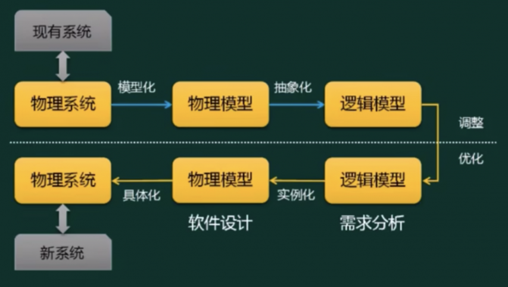

## 软件开发方法

软件开发方法是软件开发的方法学

### 信息系统的开发方法

#### 结构化方法

- 结构化系统分析与设计方法（SSA&D）
  - 基本思想是：用系统的思想，系统工程的方法，按用户至上的原则，结构化、模块化、自顶向下对信息系统进行分析与设计；
  - 严格区分工作阶段，每阶段有任务和结果；强调系统开发过程的整体性和全局性；系统开发过程工程化，文档资料标准化。
  - 自顶向下的开发方式，适用于那些需求明确，但技术难度不大的系统开发
  - 面向数据流的方法

> 结构化方法使用的主要分析设计工具是“程序流程图、数据流程图等”

> 结构化方法要求各个阶段具有严格的界限，一个阶段获得认可后才能进行下一个阶段工作

#### 原型方法
  - 基本思想是：凭借着系统分析人员对用户要求的理解，在软件环境支持下，快速地给出一个实实在在的模型（或称为原型、雏形），然后与用户反复协商修改，最终形成实际系统。
  - 适用于需求不明确的情况。

#### 面向对象的开发方法（OO）
  - 出发点和基本原则是：尽可能模拟人类习惯的思维方式，使开发软件的方法与过程尽可能接近人类认识世界、解决问题的方法与过程；
  - 更好的复用性；关键在于建立一个全面、合理、统一的模型；
  - 分析、设计、实现三个阶段，界限不明确。

#### 面向服务的开发方法 SOA
  - 以粗粒度、松散耦合和标准的服务为基础，加强了系统的可复用性和可演化性
  - SO方法有三个主要的抽象级别：操作、服务、业务流程
  - SOAD分为三个层次：
    - 基础设计层（底层服务构件）
    - 应用结构层（服务之间的接口和服务级协定）
    - 业务组织层（业务流程建模和服务流程编排）
  - 服务建模：分为服务发现、服务规约和服务实现三个阶段

面向服务(Service-Oriented, SO)的开发方法将接口的定义与实现进行解耦，并将跨构件的功能调用暴露出来。该方法有三个主要的抽象级别：
- 最底层的操作代表单个逻辑单元的事物，包含特定的结构化接口，并且返回结构化的响应
- 第二层的服务代表操作的逻辑分组
- 最高层的业务流程则是为了实现特定业务目标而执行的一组长期运行的动作或者活动

SOA系统中服务的构建有两点需要特别注意：
- 是对于服务粒度的控制
- 是对于无状态服务的设计

基于SOA企业集成中的“数据整合--信息服务”：
- 联邦服务(Federation Service): 提供将各种类型的数据聚合的能力，它既支持关系型数据，也支持XML数据、文本数据和内容数据等非关系型数据。同时，所有的数据仍然按照自己本身的方式管理。
- 复制服务(Replication Service): 提供远程数据的本地访问能力，它通过自动的实时复制和数据转换，在本地维护一个数据源的副本。本地数据和数据源在技术实现上可以是独立的。
- 转换服务(Transformation Service): 用于数据源格式到目标格式的转换，可以是批量的或者是基于记录的
- 搜索服务(Search Service): 提供对企业数据的查询和检索服务，既支持数据库等结构化数据，也支持如PDF等非结构化数据

### 软件生命周期

在 GB8566-88（《软件工程国家标准——计算机软件开发规范》）中将软件生命周期划分为 8 个阶段`(书6.1)`：
- [定义]
- 可行性研究与计划
- 需求分析
- 概要设计
- 详细设计
- 实现
- 集成测试
- 确认测试
- 使用和维护

### 软件开发模型
- 瀑布模型：迭代模型/迭代开发方法；适合需求明确的项目
- 演化模型：快速应用开发
- 增量模型：构建组装模型/基于构建的开发方法
- 螺旋模型：统一过程/统一开发方法
- 原型模型：敏捷开发方法
- 喷泉模型：模型驱动的开发方法
- V模型：基于架构的开发方法

#### 瀑布模型

- 瀑布模型是一个特别经典的，老套的周期模型。工序简化，将功能实现和设计分开。便于分工协作。
- 一般情况下将软件开发周期分为计划、需求分析、概要设计、详细设计、编码以及单元测试、测试、运行维护等几个阶段。
- 瀑布模型的周期是环环相扣的。每个周期中交互点都是一个里程碑，上一个周期的结束需要输出本次活动的工作结果，本次的活动的工作结果将会作为下一个周期的输入。这样，当某一个阶段出现了不可控的问题的时候，就会导致返工，返回到上一个阶段，甚至会延迟下一个阶段。自上而下、相互衔接的固定次序

优点:

1. 为项目提供了按阶段划分的检查点。
2. 当前一阶段完成后，您只需要去关注后续阶段。
3. 可在迭代模型中应用瀑布模型。

增量迭代应用于瀑布模型。迭代1解决最大的问题。每次迭代产生一个可运行的版本,同时增加更多的功能。每次迭代必须经过质量和集成测试。

缺点:

1. 在项目各个阶段之间极少有反馈。
2. 只有在项目生命周期的后期才能看到结果。
3. 通过过多的强制完成日期和里程碑来跟踪各个项目阶段。
4. 瀑布模型的突出缺点是不适应用户需求的变化。

#### 演化模型、增量模型(解决用户需求分析困难)

这两个模型属于原型方法

- 演化模型: 是一种渐进式的原型，即它采取原型的设计模式，但不会将其抛弃，而是在此基础上进一步进行设计
- 增量模型: 是一种递增式设计，将产品一步一步进行设计，每完成一步就交由客户审视，这样也可以使得下一步的设计更为明确

#### 螺旋模型

螺旋模型是一种演进式的软件过程模型，结合了原型开发方法的瀑布模型的系统性和可控性特点。他还有两个显著特点：
- 一是采用循环的方式逐步加深系统定义和实现的深度，同时降低风险
- 二是确定一些列里程碑，确保项目开发过程中的相关利益者都支持可行的和令人满意的系统解决方案

- 螺旋模型 尤其重视风险分析阶段，特别适用于庞大并且复杂，非常高风险的项目。
- 通常螺旋模型由四个阶段组成：制定计划、风险分析、实施工程和客户评估。螺旋模型中，发布的第一个模型甚至可能是没有任何产出的，可能仅仅是纸上谈兵的一个目标，但是随着一次次的交付，每一个版本都会朝着固定的目标迈进，最终得到一个更加完善的版本

#### V模型,喷泉模型，RAD模型

##### v模型
测试贯穿于始终的模型

- V模型从整体上看起来，就是一个V字型的结构，由左右两边组成。
- 左边的下划线分别代表了需求分析、概要设计、详细设计、编码。
- 右边的上划线代表了单元测试、集成测试、系统测试与验收测试。
- 看起来V模型就是一个对称的结构，它的重要意义在于，非常明确的表明了测试过程中存在的不同的级别，并且非常清晰的描述了这些测试阶段和开发阶段的对应关系。
 

> 优点：相对于瀑布模型，V模型测试能够尽早的进入到开发阶段。
> 缺点：虽然测试尽早的进入到开发阶段，但是真正进行软件测试是在编码之后，这样忽视了测试对需求分析，系统设计的验证，时间效率上也大打折扣。

##### 喷泉模型

喷泉模型与传统的结构化生存期比较，具有更多的增量和迭代性质，生存期的各个阶段可以相互重叠和多次反复，而且在项目的整个生存期中还可以嵌入子生存期。就像水喷上去又可以落下来，可以落在中间，也可以落在最底部

##### RAD模型

快速应用开发（RAD）模型是一个增量型的软件开发过程模型。强调极短的开发周期。RAD模型是瀑布模型

采用RAD模型的软件通过大量使用可复用构件，采用基于构件的建造方法赢得快速开发。如果需求理解得好且约束了项目的范围，随后是数据建模、过程建模、应用生成、测试及反复。

设计思想：
1. 让用户更主动地参与到系统分析、设计和构造活动中来。
2. 将项目开发组织成一系列重点突出的研讨会，研讨会要让项目投资方、用户、分析员、设计人员和构造人员一同参与。
3. 通过一种迭代的构造方法加速需求分析和设计阶段。
4. 让用户提前看到一个可工作的系统。

### 统一过程(UP/RUP模型)

特点：
- 用例驱动
- 以架构为中心
- 迭代和增量

过程：
- 初始阶段
  - 确定项目范围和边界
  - 识别系统的关键用例
  - 展示系统的候选框架
  - 估计项目费用和时间
  - 评估项目风险
- 细化阶段
  - 分析系统问题领域
  - 建立软件架构基础
  - 淘汰最高风险元素
- 构建阶段
  - 开发剩余构件
  - 构件组装与测试
- 交付阶段
  - 进行β测试
  - 制作发布版本
  - 用户定档定稿
  - 确认新系统
  - 培训和调整产品

核心工作流：
- 业务建模
- 需求
- 分析设计
- 实施
- 测试
- 部署
- 配置与变更管理
- 项目管理
- 环境

### 敏捷方法

基本原则：

- 短平快的会议
- 小型版本发布
- 较少的文档
- 合作为重
- 客户直接参与
- 自动化测试
- 适应性计划调整
- 结对编程
- 测试驱动开发
- 持续集成
- 重构

敏捷开发方法：
- 极限编程（XP）：敏捷开发的典型方法之一，是一种轻量级（敏捷）、高效，低风险、柔性、可预测的、科学的软件开发方法，它由价值观、原则、实践和行为4个部分组成。
  - 其中4大价值观为: 沟通、简单性、反馈和勇气。
- 水晶法（Crystal）：水晶方法体系与XP一样，都有以人为中心的理念，但在实践上有所不同。水晶方法体系考虑到人们一般很难严格遵循一个纪律约束很强的过程，认为每一种不同的项目都需要一套不同的策略、约定和方法论。因此，与XP的高度纪律性不同，水晶方法体系探索了用最少纪律约束而仍能成功的方法，从而在产出效率与易于运作上达到一种平衡。也就是说，虽然水晶系列不如XP那样的产出效率，但会有更多的人能够接受并遵循它。
- 并列争球法（Scrum）：用迭代的方法，其中把每30天一次的迭代称为一个“冲刺”，并按需求的优先级来实现产品。多个自组织和自治小组并行地递增实现产品。协调是通过简短的日常会议来进行的
- 功用驱动开发方法(FDD): 致力于短时的迭代阶段和可见可用的功能，在FDD中一个迭代周期一般是两周。在FDD中程序开发人员分为两类，即首席程序员和”类“程序员。首席程序员是最富有经验的开发人员，他们是项目的协调者、设计者和指导者；”类“程序员则主要做源码编写
- 自适应软件开发（ASD）：ASD的核心是三个非线性的、重迭的开发阶段：猜测，合作与学习。
- 开放式源码：开放源码的方式

五大原则：
- 快速反馈
- 简单性假设
- 逐步修改
- 提倡更改
- 优质工作

### 净室工程

- 净室即无尘、洁净室。也就是一个受控污染级别的环境
- 使用盒结构规约(或形式化方法)进行分析和设计建模，并且强调将正确性验证，而不是测试，作为发现和消除错误的主要机制
- 使用统计的测试来获取认证被交付的软件的可靠性所必须的出错率信息

## 逆向工程

不是软件开发方法，只是作为在开发过程中解决某种问题的技术

### 抽象层次

- 实现级：包括程序的抽象语法树、符号表、过程的设计表示
- 结构级：包括反映程序分量之间相互依赖关系的信息，例如调用图、结构图、程序和数据结构
- 功能级：包括反映程序段功能及程序段之间关系的信息，例如数据和控制流模型
- 领域级：包括反映程序分量或程序诸实体与应用领域概念之间对应关系的信息，例如实体关系模型

### 逆向工程恢复信息的方法

|方法|导出信息|
|-|-|
|用户指导下的搜索与变换方法|实现级、结构级|
|变换式方法|实现级、结构级、功能级|
|基于领域知识的方法|功能级、领域级|
|铅板恢复法|实现级、结构级|

## 需求工程

软件需求是指用户对系统在功能、行为、性能、设计约束等方面的期望。
软件需求是指用户解决问题或达到目标所需的条件或能力，是系统或系统部件要满足合同、标准、规范或其他正式规定文档所需具有的条件或能力，以及反映这些条件或能力的文档说明。

需求开发：
- 需求获取
- 需求分析
- 需求定义
- 需求验证

需求管理
- 变更控制
- 版本控制
- 需求跟踪
- 需求状态跟踪

需求分类
- 技术维度
  - 业务需求
  - 用户需求
  - 系统需求
    - 功能需求
    - 性能需求
    - 设计约束
- 项目管理维度
  - 基本需求
  - 期望需求
  - 兴奋需求

### 需求获取

收集资料
联合讨论会
用户访谈
书面调查
现场观摩
参加业务实践
阅读历史文档
抽样调查

### 需求分析

#### 结构化需求分析(SA)

需求分析是一种软件工程活动，它在系统级软件分配和软件设计间起到桥梁的作用，需求分析使得系统工程师能够刻画出软件的功能和性能，指明软件和其他系统元素的接口，并建立软件必须满足的约束。

需求分析允许系统分析师细化软件的分解，并建立将被软件处理的数据、功能和行为模型。

最后，需求规约为开发者和客户提供了软件开发完成后质量评估的依据。
需求分析为软件设计师提供了可被翻译成数据、架构、界面和过程设计的模型，
需求分析的任务是发现、求精、建模和规约的过程，包括详细地细化由系统工程师建立并在软件项目计划中明确的软件范围，创建所需数据、信息和控制流及操作行为的模型，此外，还要分析可选择的解决方案，并将它们分配到各软件元素中去。
需要注意的是，在需求分析阶段要得到详细的规约是不可能的。客户可能并不能精确地肯定需要什么，开发者可能不能肯定可用什么特定的方法来适当地完成功能和性能。

DFD 数据流图:

数据流图DFD是SA方法中的重要工具，是表达系统内部数据的流动并通过数据流描述系统功能的一种方法。 

DFD还可被认为是一个系统模型，在信息系统开发中，如果采用结构化方法，则一般将DFD作为需求规格说明书的一个组成部分。用例模型描述了一组用例、参与者及它们之间的关系。

通常使用数据字典作为该工具的补充说明。

1. DFD是理解和表达用户需求的工具，是需求分析的手段。由于DFD简明易懂，不需要任何计算机专业知识就可以理解它，因此，系统分析师可以通过DFD与用户进行交流。
2. DFD概括地描述了系统的内部逻辑过程，是需求分析结果的表达工具，也是系统设计的重要参考资料，是系统设计的起点。
3. DFD作为一个存档的文字材料，是进一步修改和充实开发计划的依据。

#### 面向对象的需求分析(OOA)

一些概念：
- 对象
- 类
- 抽象
- 封装
- 继承与泛化
- 多态
- 接口
- 消息
- 组件
- 模式和复用

在系统设计过程中，类可以分为三种类型，分别是实体类、边界类和控制类：
1. 实体类: 实体类的主要职责是存储和管理系统内部的信息，它也可以有行为，甚至很复杂的行为，但这些行为必须与它所代表的实体对象密切相关。实体类映射需求中的每个实体，实体类保存需要存储在永久存储体中的信息，例如，在线教育平台系统可以提取出学员类和课程类，它们都属于实体类。实体类通常都是永久性的，它们所具有的属性和关系是长期需要的，有时甚至在系统的整个生存期都需要。
2. 控制类: 控制类用于描述一个用例所具有的事件流控制行为，控制一个用例中的事件顺序。
例如，用例“身份验证”可以对应于一个控制类“身份验证器”，它提供了与身份验证相关的所有操作。控制类用于对一个或几个用例所特有的控制行为进行建模，控制对象（控制类的实例）通常控制其他对象，因此，它们的行为具有协调性。通常情况下，控制类没有属性，但一定有方法。
3. 边界类: 边界类用于描述外部参与者与系统之间的交互，它位于系统与外界的交接处，包括所有窗体、报表、打印机和扫描仪等硬件的接口，以及与其他系统的接口。
要寻找和定义边界类，可以检查用例模型，每个参与者和用例交互至少要有一个边界类，边界类使参与者能与系统交互。
边界类是一种用于对系统外部环境与其内部运作之间的交互进行建模的类。
常见的边界类有窗口、通信协议、打印机接囗、传感器和终端等。实际上，在系统设计时，产生的报表都可以作为边界类来处理。

### 需求定义

- 用结构化和自然语言编写文本型文档
- 建立图形化横型
- 编写形式化规格说明

严格定义法：
- 所有需求都能够被预先定义
- 开发人员与用户之间能够准确而清晰地交流
- 采用图形/文字可以充分体现最终系统

原型法：
- 并非所有的需求都能在开发前被准确地说明
- 项目参加者之间通常都存在交流上的困难
- 需要实际的、可供用户参与的系统模型
- 有合适的系统开发环境
- 反复是完全需要和值得提倡的，需求一旦确定，就应遵从严格的方法

### 需求跟踪

需求跟踪是指在软件需求管理的过程中定义需求变更流程，分析需求变更影响，控制变化的版本，维护需求变更记录,跟踪每项需求状态。

> 需求跟踪是将单个需求和其他系统元素之间的依赖关系和逻辑联系建立跟踪，这些元素包括各种类型的需求、业务规则、系统架构和构建、源代码、测试用例，以及帮助文件等；

> 需求跟踪一般采用需求跟踪矩阵做跟进工作，跟踪矩阵将从需求源头一直跟进到最终的软件产品

- 确定需求变更控制过程
- 进行需求变更影响分析
- 建立需求基准版本和需求控制版本文档
- 维护需求变更的历史记录
- 跟踪每项需求的状态
  - 状态： 如已推荐的，已通过的，已实施的，或已验证的

## UML

统一建模语言言（Unified Modeling Language，UML）是用于系统的可视化建模语言，它将OMT、OOSE 和 Booch 方法中的建模语言和方法有机地融合在一起，是国际统一的软件建模标准。虽然它源于 OO 软件系统建模领域，但由于其内建了大量扩展机制，也可以应用于更多的领域中，例如工作流程、业务领域等。

UML由构造块、公共机制和规则(架构)三个部分构成

- 构造块：基本的UML建模元素(事物)、关系和图
  - 建模元素(事物)
    - 包括结构事物(类、接口、协作、用例、活动类、组件、节点等)
    - 行为事物(代表时间和空间上动作。包括消息，动作次序，连接)
    - 分组事物(包，构件)
    - 注释事物(UML模型的解释部分。描述、说明、标注模型的元素)
  - 关系: 包括关联关系、依赖关系、泛化关系、实现关系
  - 图
- 规则
  - 范围：给一个名字以特定含义的语境
  - 可见性：怎样使用或看见名字
  - 完整性：事物如何正确、一致地相互练习
  - 执行：运行或模拟动态模型的含义是什么
- 公共机制
  - 规则说明：事物语义的细节描述，它是模型真正的核心
  - 修饰：通过修饰来表达更多信息
  - 公共分类：类与对象、接口与实现
  - 扩展机制：允许添加新的规则

### UML图

静态图(结构图)
- 类图：一组类、接口、协作和它们之间的关系
- 对象图：一组对象及它们之间的关系
- 构件图：一个封装的类和它的接口
- 部署图：软硬件之间的映射
- 制品图：系统的物理结构
- 包图：由模型本身分解而成的组织单元，以及它们之间的依赖关系
- 组合结构图

动态图(行为图)
- 用例图：系统与外部参与者的交互
- 顺序图：强调按时间顺序
- 通信图（协作图）
- 状态图：状态转换变迁
- 活动图：类似程序流程图，并行行为
- 定时图：强调实际时间
- 交互概览图

### UML4+1视图

用例视图（Use Cases View），最初称为场景视图，关注最终用户需求，为整个技术架构的上线文环境.通常用UML用例图和活动图描述。

逻辑视图（Logical view），主要是整个系统的抽象结构表述，关注系统提供最终用户的功能，不涉及具体的编译即输出和部署，通常在UML中用类图，交互图，时序图来表述，类似与我们采用OOA的对象模型。

实现视图(implementation view)，描述软件在开发环境下的静态组织，从程序实现人员的角度透视系统，也叫做开发视图(Development View)。实现视图关注程序包，不仅包括要编写的源程序，还包括可以直接使用的第三方SDK和现成框架、类库，以及开发的系统将运行于其上的系统软件或中间件, 在UML中用组件图，包图来表述。实现视图和逻辑视图之间可能存在一定的映射关系：比如逻辑层一般会映射到多个程序包等。

部署视图(deploymentview), 通常也叫做物理视图（Physical view ），是从系统工程师解读系统，关注软件的物流拓扑结，以及如何部署机器和网络来配合软件系统的可靠性、可伸缩性等要求。部署视图和处理视图的关系：处理视图特别关注目标程序的动态执行情况，而部署视图重视目标程序的静态位置问题；部署视图是综合考虑软件系统和整个IT系统相互影响的架构视图。

处理视图（Process view）(进程视图) 处理视图关注系统动态运行时，主要是进程以及相关的并发、同步、通信等问题。处理视图和开发视图的关系：开发视图一般偏重程序包在编译时期的静态依赖关系，而这些程序运行起来之后会表现为对象、线程、进程，处理视图比较关注的正是这些运行时单元的交互问题，在UML中通常用活动图表述。

### 用例图

用例是一种描述系统需求的方法，使用用例的方法来描述系统需求的过程就是用例建模。在用例图中，主要包括参与者、用例和通信关联三种元素:

- 参与者。参与者（角色、动作者、执行者）是指存在于系统外部并与系统进行交互的任何事物，既可以是使用系统的用户，也可以是其他外部系统和设备等外部实体。

- 用例。用例是在系统中执行的一系列动作，这些动作将生成特定参与者可见的价值结果。也就是说，用例表示系统所提供的服务，它定义了系统是如何被参与者所使用的，它描述的是参与者为了使用系统所提供的某一完整功能而与系统之间发生的一段对话。

- 通信关联。通信关联表示的是参与者和用例之间的关系，或用例与用例之间的关系。箭头表示在这一关系中哪一方是对话的主动发起者，箭头所指方是对话的被动接受者，箭尾所指方是对话的主动发起者。如果不想强调对话中的主动与被动关系，可以使用不带箭头的关联实线。在用例模型中，信息流不是由通信关联来表示的，信息流是默认存在的，并且是双向的，它与箭头所指的方向没有关系。

在OOA方法中，构建用例模型一般需要经历4个阶段，分别是：
- 识别参与者
- 合并需求获得用例
- 细化用例描述
- 调整用例模型

### UML关系

- 包含关系: 其中这个提取出来的公共用例称为抽象用例，而把原始用例称为基本用例或基础用例系: 当可以从两个或两个以上的用例中提取公共行为时，应该使用包含关系来表示它们。
- 扩展关系: 如果一个用例明显地混合了两种或两种以上的不同场景，即根据情况可能发生多种分支，则可以将这个用例分为一个基本用例和一个或多个扩展用例，这样使描述可能更加清断
- 泛化关系:当多个用例共同拥有一种类似的结构和行为的时候，可以将它们的共性抽象成为父用例，其他的用例作为泛化关系中的子用例。在用例的泛化关系中，子用例是父用例的一种特殊形式，子用例继承了父用例所有的结构、行为和关系。

示意图：

### 类图与对象图

- 依赖关系：依赖是两个事物间的语义关系，其中一个事物(独立事物)发生变化会影响另一个事物的语义
- 关联关系：关联是一种结构关系，描述了一组链，链式对象之间的连接，聚合是一种特殊类型的关联，描述整体与部分间的结构关系
- 泛化关系：其实就是继承关系；是一种特殊/一般关系，特殊元素的对象可替代一般元素的对象
- 实现关系：是类元之间的语义关系，其中一个类元指定了另一个类元保证执行的契约

### 顺序图

### 活动图

泳道式活动图：

### 状态图

### 通信图(协作图)

## 软件系统建模

- 结构化建模方法：结构化建模方法是以过程为中心的技术，可用于分析一个现有的系统以及定义新系统的业务需求。结构化建模方法所绘制的模型称为数据流图( DFD )。对于流程较为稳定的系统可考虑结构化建模方法。
- 信息工程建模方法(或数据库建模方法): 信息工程建模方法是一种以数据为中心，但过程敏感的技术，它强调在分析和研究过程需求之前，首先研究和分析数据需求。信息工程建模方法所创建的模型被称为实体联系图( ERD )。主要用于数据建模。
- 面向对象建模方法：面向对象建模方法将“数据”和“过程”集成到被称为“对象”的结构中，消除了数据和过程的人为分离现象。面向对象建模方法所创建的模型被称为对象模型。随着面向对象技术的不断发展和应用，形成了面向对象的建模标准，即UML(统一建模语言 ).UML定义了几种不同类型的模型图，这些模型图以对象的形式共建一个信息系统或应用系统。目前比较常用的建模方法。

## 系统设计

### 界面设计

#### 人机界面设计

- 置于用户控制之下
  - 以不强迫用户进入不必要的或不希望的动作的方式来定义交互方式
  - 提供灵活的交互
  - 允许用户交互可以被中断和撤消
  - 当技能级别增加时可以使交互流水化并允许定制交互
  - 使用户隔离内部技术细节
  - 设计应允许用户和出现在屏幕上的对象直接交互
- 减少用户的记忆负担
  - 减少对短期记忆的要求
  - 建立有意义的缺省
  - 定义直觉性的捷径
  - 界面的视觉布局应该基于真实世界的隐喻
  - 以不断进展的方式揭示信息
- 保持界面的一致性
  - 允许用户将当前任务放入有意义的语境
  - 在应用系列内保持一致性
  - 如过去的交互模型已建立起了用户期望，除非有迫不得已的理由不要改变它

### 结构化设计

### 面向对象设计

#### 基本过程

#### 设计原则

- 单一职责原则 : 设计目的单一的类
- 开放-封闭原则: 对扩展开放，对修改封闭
- 李氏(Liskov)替换原则 : 子类可以替换父类
- 依赖倒置原则:要依赖于抽象，而不是具体实现;针对接口编程，不要针对实现编程
- 接口隔离原则: 使用多个专门的接口比使用单一的总接口要好
- 组合重用原则 : 要尽量使用组合，而不是继承关系达到重用目的
- 迪米特(Demeter)原则(最少知识法则) : 一个对象应当对其他对象有尽可能少的了解

#### 设计模式的概念

- 架构模式: 软件设计中的高层决策，例如C/S结构就属于架构模式，架构模式反映了开发软件系统过程中所作的基本设计决策
- 设计模式: 主要关注软件系统的设计，与具体的实现语言无关
- 惯用法: 是最低层的模式，关注软件系统的设计与实现，实现时通过某种特定的程序设计语言来描述构件与构件之间的关系。每种编程语言都有它自己特定的模式，即语言的惯用法。例如引用-计数就是C++语言中的一种惯用法

#### 设计模式的分类

创建型: 主要用于创建对象，为设计类实例化新对象提供指南

结构型：主要用于处理类或对象的组合，对类如何设计以形成更大的结构提供指南

行为型：主要用于描述类或对象的交互以及职责分配，对类之间交互以及分配责任的方式提供指南

图1：

图2：

#### 模式概念

架构模式：软件设计中的高层决策，例如C/S结构就属于架构模式，架构模式反映了开发软件系统过程中所作的基本设计决策

设计模式：主要关注软件系统的设计，与具体的实现语言无关

惯用法：是最低层的模式，关注软件系统的设计与实现，实现时通过某种特定的程序设计语言来描述构件与构件之间的关系。每种编程语言都有它自己特定的模式，即语言的惯用法。例如引用-计数就是C++语言中的一种惯用法

## 软件测试

### 测试类型

- 尽早、不断的进行测试
- 程序员避免测试自己设计的程序
- 既要选择有效、合理的数据，也要选择无效、不合理的数据
- 修改后应进行回归测试
- 尚未发现的错误数量与该程序已发现错误数成正比

- 动态测试
  - 黑盒测试法
  - 白盒测试法
  - 灰盒测试法
- 静态测试
  - 桌前检查
  - 代码审查
  - 代码走查

### 测试用例设计

- 黑盒测试法
  - 等价类划分
  - 边界值分析
  - 错误推测
  - 因果图
- 白盒测试法
  - 基本路径测试
  - 循环覆盖测试
  - 逻辑覆盖测试
    - 语句覆盖
    - 判断覆盖
    - 条件覆盖
    - 条件判定覆盖
    - 修正的条件判断覆盖
    - 条件组合覆盖
    - 点覆盖
    - 边覆盖
    - 路径覆盖
    
### 阶段测试

- 单元测试: 模块测试、模块功能、性能、接口等
- 集成测试：模块间的接口；其测试的技术依据是软件概要设计文档。
- 确认测试：验证软件与需求的一致性。
  - 内部确认测试
  - Alpha测试
  - Beta测试
  - 验收测试
- 系统测试：真实环境下，验证完整的软件配置项能否和系统正确连接
- 回归测试：测试软件变更之后，变更部分的正确性对变更需求的复合型

### 面向对象的测试

- 算法层/方法层(单元测试): 包括等价类划分测试、组合功能测试( 基于判定表的测试 )、递归函数测试和多态消息测试
- 类层( 模块测试 ):包括不变式边界测试、模态类测试和非模态类测试
- 类树层( 集成测试 ): 包括多态服务测试和展平测试
- 系统层( 系统测试 )

## 软件调试

- 软件调试方法
  - 蛮力法: 主要思想是“通过计算机找错”，低效，耗时
  - 回溯法:从出错处人工沿控制流程往回追踪，直至发现出错的根源。复杂程序由于回溯路径多，难以实施
  - 原因排除法: 主要思想是演绎和归纳，用二分法实现
- 软件调试与测试的区别
  - 测试的目的是找出存在的错误，而调试的目的是定位错误并修改程序以修正错误
  - 调试是测试之后的活动，测试和调试在目标、方法和思路上都有所不同
  - 测试从一个已知的条件开始，使用预先定义的过程，有预知的结果;调试从一个末知的条件开始，结束的过程不可预计
  - 测试过程可以事先设计，进度可以事先确定，调试不能描述过程或持续时间
 
## 系统运行与软件维护

### 系统转换计划 - 遗留系统演化策略

1. 淘汰策略: 遗留系统的技术含量较低，且具有较低的业务价值。对遗留系统的完全淘汰是企业资源的根本浪费系统分析师应该善于“变废为宝”，通过对遗留系统功能的理解和借鉴，可以帮助新系统的设计，降低新系统开发的风险
2. 继承策略: 遗留系统的技术含量较低，已经满足企业运作的功能或性能要求，但具有较高的商业价值，目前企业的业务尚紧密依赖该系统。对这种遗留系统的演化策略为继承。在开发新系统时，需要完全兼容遗留系统的功能模型和数据模型。为了保证业务的连续性，新老系统必须并行运行一段时间，再逐渐切换到新系统上运行。
3. 改造策略: 遗留系统具有较高的业务价值，基本上能够满足企业业务运作和决策支持的需要。这种系统可能建成的时间还很短，对这种遗留系统的演化策略为改造。改造包括系统功能的增强和数据模型的改造两个方面。系统功能的增强是指在原有系统的基础上增加新的应用要求，对遗留系统本身不做改变;数据模型的改造是指将遗留系统的旧的数据模型向新的数据模型的转化。
4. 集成策略: 遗留系统的技术含量较高，但其业务价值较低，可能只完成某个部门( 或子公司》的业务管理、这种系统在各自的局部领域里工作良好，但对于整个企业来说，存在多个这样的系统，不同的系统基于不司的平台、不同的数据模型，形成了一个个信息孤岛，对这种遗留系统的演化策略为集成。

### 系统转换计划 - 新旧系统的转换策略

### 运行与维护

- 正确性维护: 指改正在系统开发阶段已发生而系统测试阶段尚未发现的错误
- 适应性维护: 指使应用软件适应信息技术变化和管理需求变化而进行的修改。企业的外部时长环境和管理需求的不断变化也使得各级管理人员不断提出新的信息需求
- 完善性维护: 扩充功能和改善性能而进行的修改。对已有的软件系统增加一些在系统分析和设计阶段中没有规定的功能与性能特征
- 预防性维护: 为了改进应用软件的可靠性和可维护性，为了适应未来的软硬件环境的变化，应主动增加预防性的新的功能，以使用系统适应各类变化而不被淘汰。如将专用报表功能改成通用报表功能生成功能，以适应将来报表格式的变化。

