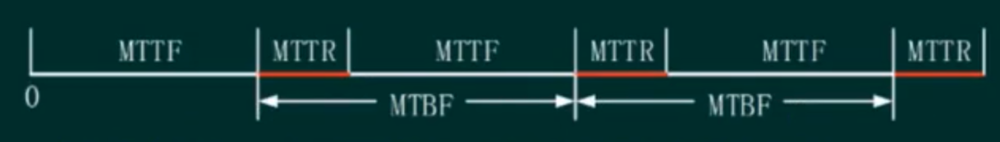
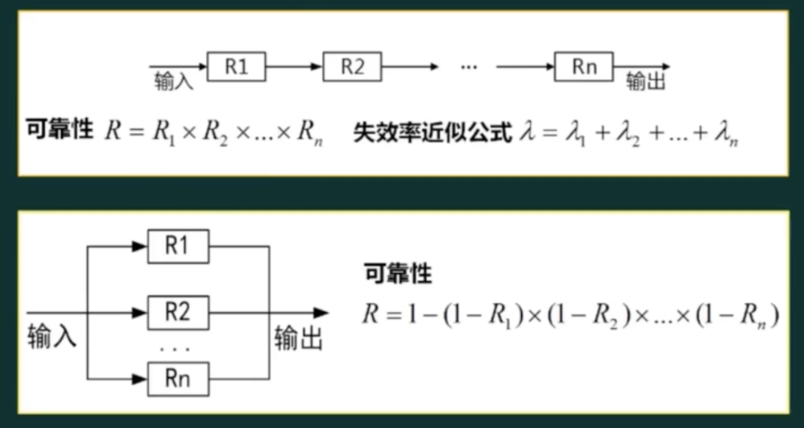
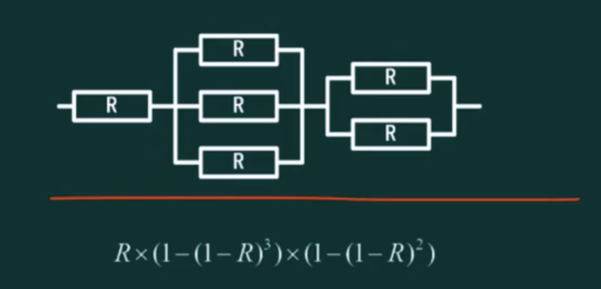
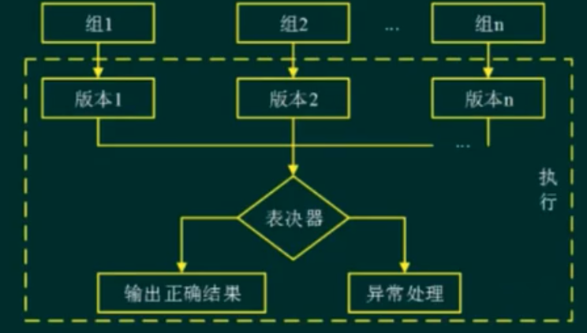
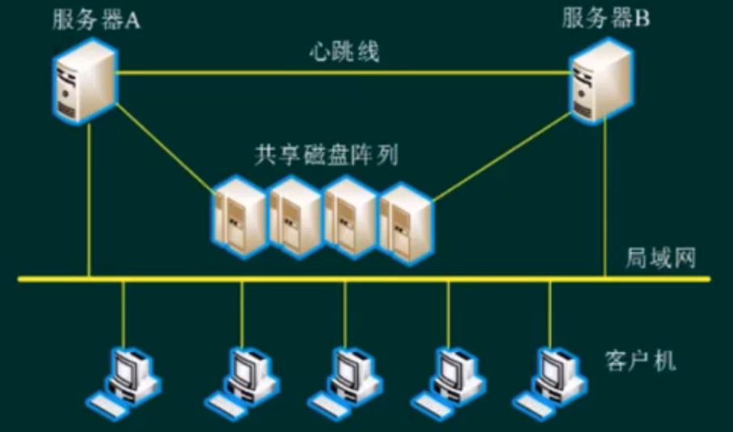

## 可靠性相关概念

- 系统可靠性: 是系统在规定的时间内及规定的环境条件下，完成规定功能的能力，也就是系统无故障运行的概率。

- 系统可用性: 是指在某个给定时间点上系统能够按照需求执行的概率。

软件可靠性 != 硬件可靠性
- 复杂性：软件复杂性比硬件高，大部分失效来自于软件失效。
- 物理退化：硬件失效主要是物理退化所致，软件不存在物理退化。
- 唯一性：软件是唯一的，每个COPY版本都一样，而两个硬件不可能完全一样
- 版本更新周期：硬件较慢，软件较快。

## 可靠性指标

- 平均无故障时间 一(MTTF) MTTF=1/，入为失效率
- 平均故障修复时间 -(MTTR) MTTR=1/，μ为修复率
- 平均故障间隔时间 -(MTBF) MTBF = MTTR + MTTF
- 系统可用性  MTTF/(MTTR+MTTF)x100%

> 在实际应用中，一般MTTR很小，所以通常认为MTBFMTTF.

## 串联系统与并联系统

## 混合系统

先计算并联再计算串联

## 可靠性设计

- 避错技术
- 容错技术
  - N版本程序设计(静态冗余)
  - 恢复块设计(动态冗余)
  - 防卫式程序设计(举例： try{}catch{})
- 检错技术
  - 出错后报警，人工处理，成本较低
- 降低复杂度设计

冗余：
- 结构冗余(硬件冗余、软件冗余)
- 信息冗余(校验码)
- 时间冗余(重复多次进行相同的计算)

### N版本程序设计

- 与通常软件开发过程不同的是，N版本程序设计增加了三个新的阶段:相异成份规范评审、相异性确认、背对背测试
- N版本程序的同步、N版本程序之间的通信、表决算法( 全等表决、非精确表决Cosmetie表决 )、一致比较问题、数据相异性

### 恢复块方法

- 设计时应保证实现主块和后备块之间的独立性，避免相关错误的产生，使主块和备份块之间的共性错误降到最低程度。
- 必须保证验证测试程序的正确性

|-|恢复块方法|N版本程序设计|
|-|-|-|
|硬件运行环境|单机|多机|
|错误检测方法|验证测试程序|表决|
|恢复策略|后向恢复|前向恢复|
|实时性|差|好|

恢复策略的前向恢复和后向恢复：
- 前向恢复:使当前的计算继续下去把系统恢复成连贯的正确状态，弥补当前状态的不连贯情况
- 后向恢复: 系统恢复到前一个正确状态，继续执行

### 防卫式程序设计

- 对于程序中存在的错误和不一致性，通过在程序中包含错误检查代码和错误恢复代码，使得一旦错误发生，程序能撤消错误状态，恢复到一个已知的正确状态中去
- 实现策略: 错误检测、破坏估计、错误恢复

### 双机容错

- 双机热备模式( 主系统、备用系统)
- 双机互备模式( 同时提供不同的服务，心不跳则接管 )
- 双机双工模式( 同时提供相同的服务，集群的一种 )

### 集群技术

高性能主机系统 PK 集群系统
- 可伸缩性
- 高可用性
- 可管理性
- 高性价比
- 高透明性