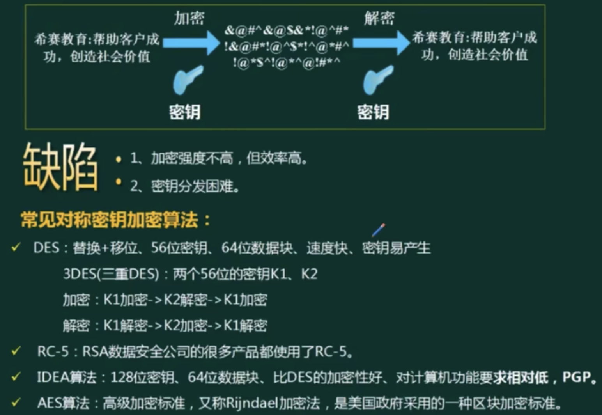
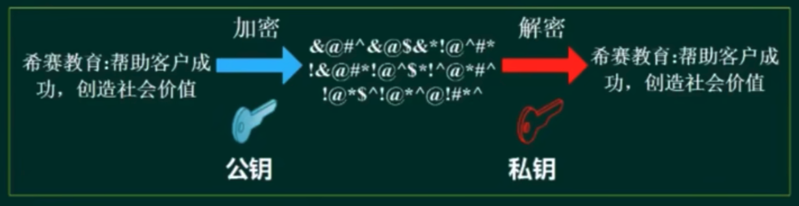
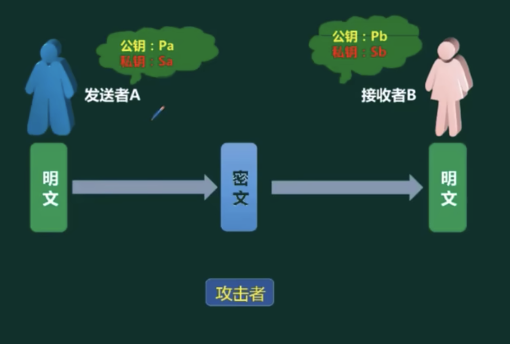
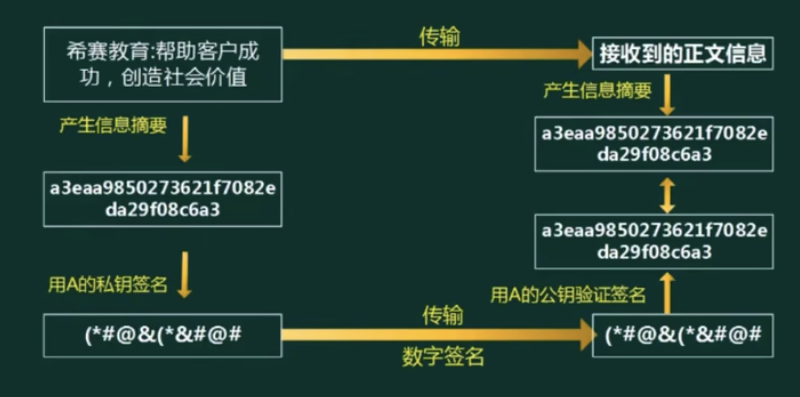
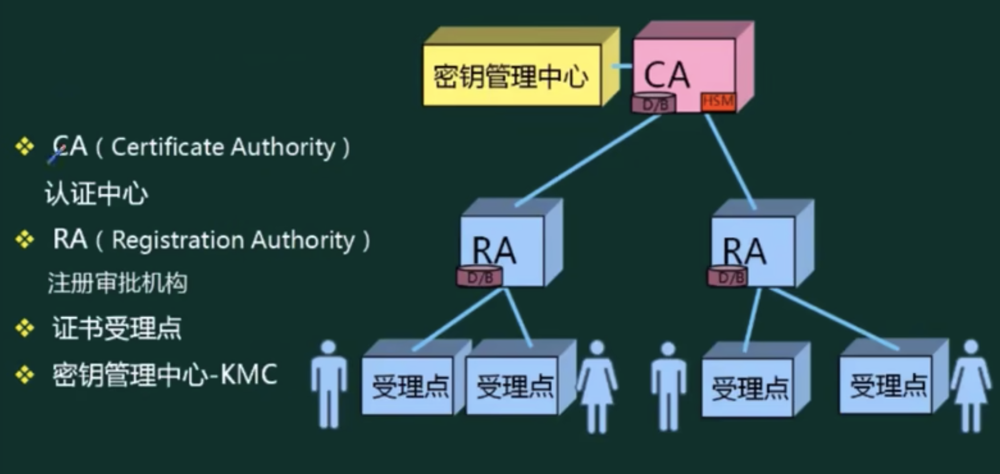
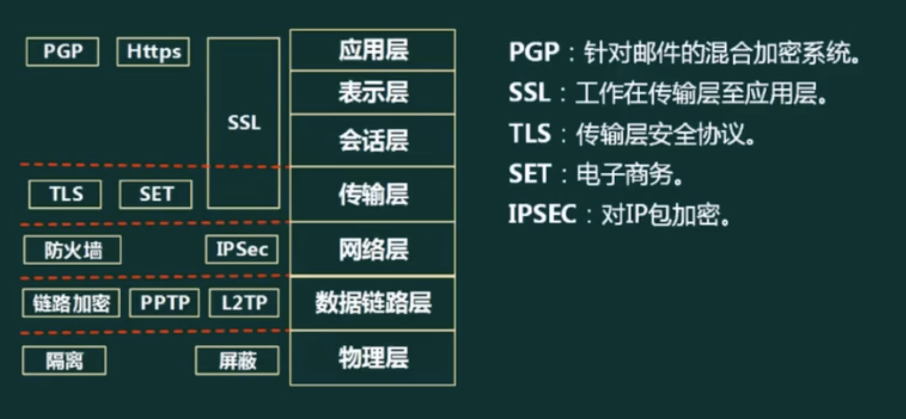
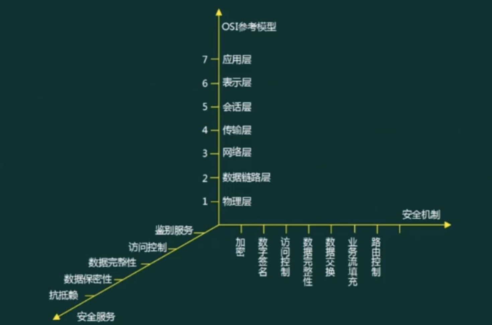
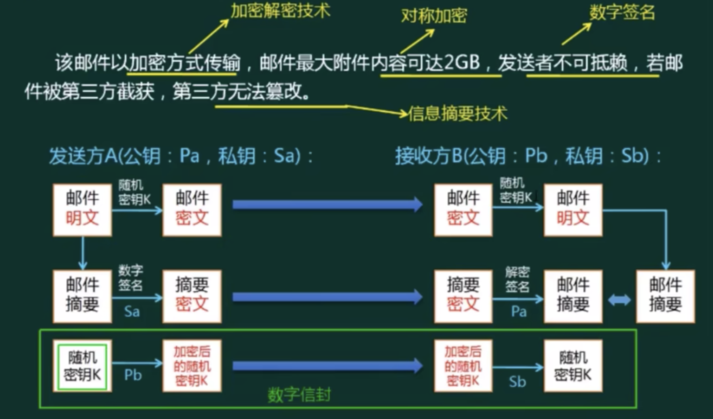

## 对称加密技术

缺陷:
- 加密强度不高，但效率高。
- 密钥分发困难

常见对称密钥加密算法: 
- DES: 替换+移位、56位密钥、64位数据块、速度快、密钥易产生
  - 3DES(三重DES) : 两个56位的空钥K1、K2
  - 加密 : K1加密->K2解->K1加空
  - 解密 : K1解->K2加->K1解究
- RC-5: RSA数据安全公司的很多产品都使用了RC-5。
- IDEA算法:128位密钥、64位数据块、比DES的加密性好、对计算机功能要求相对低，PGP
- AES算法: 高级加密标准，又称- Rijndael加密法，是美国政府采用的一种区块加密标准。

## 非对称加密

常见非对称密钥加密算法: 
- RSA : 2048位(或1024位 )密钥、计算量极大、难破解
- Elgamal: 安全性依赖于计算有限域上离散对数这一难题
- ECC: 圆曲线算法

缺陷: 
- 加密速度慢

## 信息摘要

> 单向散列函数、固定长度的散列值

信息摘要：内容 -> 产生信息摘要 -> a3eaa9850273621f7082eda29f08c6a3

> 常用的消息摘要算法有MD5，SHA等，市场上广泛使用的MD5，SHA算法的散列值分别为128和160位，由于SHA通常采用的密钥长度较长，因此安全性高于MD5。

## 数字签名

## 数字证书内容

- 证书的版本信息;
- 证书的序列号，每个证书都有一个唯一的证书序列号
- 证书所使用的签名算法
- 证书的发行机构名称，命名规则一般采用X.500格式:
- 证书的有效期，现在通用的证书一般采用UTC时间格式，它的计时范围为1950-2049证书所有人的名称，命名规则一般采用X.500格式 ;
- 证书所有人的公开密钥
- 证书发行者对证书的签名

## PKI公钥体系

## 网络安全

### 各个网络层次的安全保障

### 网络威胁与攻击

- 被动攻击:收集信息为主，破坏保密性。
- 主动攻击:主动攻击的类别主要有: 中断( 破坏可用性 )，篡改( 破坏完整性 ，造( 破坏真实性 )。

<table>
  <tr>
    <th>攻击类型</th>
    <th>攻击名称</th>
    <th>描述</th>
  </tr>
  <tr>
    <td rowspan="3">被动攻击</td>
    <td>窃听( 网络监听 )</td>
    <td>用各种可能的合法或非法的手段窃取系统中的信息资源和敏感信息</td>
  </tr>
  <tr>
    <td>业务流分析</td>
    <td>通过对系统进行长期监听，利用统计分析方法对诸如通信频度、通信的信息流向、通信总量的变化等参数进行研究，从而发现有价值的信息和规律。</td>
  </tr>
  <tr>
    <td>非法登录</td>
    <td>有些资料将这种方式归为被动攻击方式</td>
  </tr>
  <tr>
    <td rowspan="5">主动攻击</td>
    <td>假冒身份</td>
    <td>通过欺骗通信系统(或用户)达到非法用户冒充成为合法用户，或者特权小的用户冒充成为特权大的用户的目的。黑客大多是采用假冒进行攻击。</td>
  </tr>
  <tr>
    <td>抵赖</td>
    <td>这是一种来自用户的攻击，比如 : 否认自己曾经发布过的某条消息、伪造份对方来信等。</td>
  </tr>
  <tr>
    <td>旁路控制</td>
    <td>攻击者利用系统的安全缺陷或安全性上的脆弱之处获得非授权的权利或特权</td>
  </tr>
  <tr>
    <td>重放攻击</td>
    <td>所截获的某次合法的通信数据拷贝，出于非法的目的而被重新发送。加时间戳能识别并应对重放攻击。</td>
  </tr>
  <tr>
    <td>拒绝服务( Dos )</td>
    <td>对信息或其它资源的合法访问被无条件地阻止</td>
  </tr>
</table>

## 安全保护等级

计算机信息系统安全保护等级划分准则(GB17859-1999)
- 用户自主保护级: 适用于普通内联网用户
  > 系统被破坏后，对公民、法人和其它组织权益有损害，但不损害国家安全社会秩序和公共利益
- 系统审计保护级: 适用于通过内联网或国际网进行商务活动，需要保密的非重要单位
  > 系统被破坏后，对公民、法人和其它组织权益有严重损害，或损害社会秩序和公共利益，但不损害国家安全。
- 安全标记保护级:适用于地方各级国家机关、金融机构、邮电通信.部门、交通运输、大型工商与信息技术企业、重点工程建设等单位
  > 系统被破坏后，对社会秩序和公共利益造成严重损害或对国家安全造成损害。
- 结构化保护级: 适用于中央级国家机关、广播电视部门、重要物资储备单位、社会应急服务部门、尖端科技企业集团、国家重点科研机构和国防建设等部门
  > 系统被破坏后，对社会秩序和公共利益造成特别严重损害，或对国家安全造成严重损害.
- 访问验证保护级: 适用于国防关键部门和依法需要对计算机信息系统实施特殊隔离的单位
  > 系统被破坏后，对国家安全造成特别严重损害。

|-|公民、法人和其它组织权益|社会秩序和公共利益|国家安全|
|-|-|-|-|
|用户自主保护级|损害|-|-|
|系统审计保护级|严重损害|损害|-|
|安全标记保护级|-|严重损害|损害|
|结构化保护级|-|[特别严重损害]|严重损害|
|访问验证保护级|-|-|特别严重损害|

## 信息安全体系结构

## 综合练习

