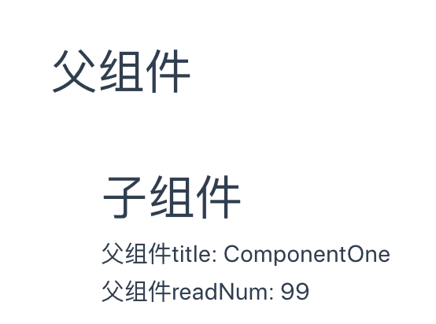
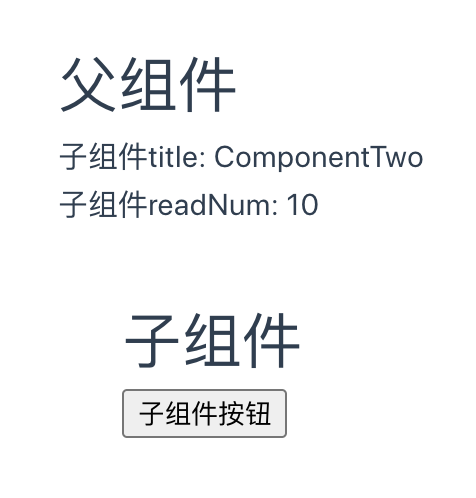
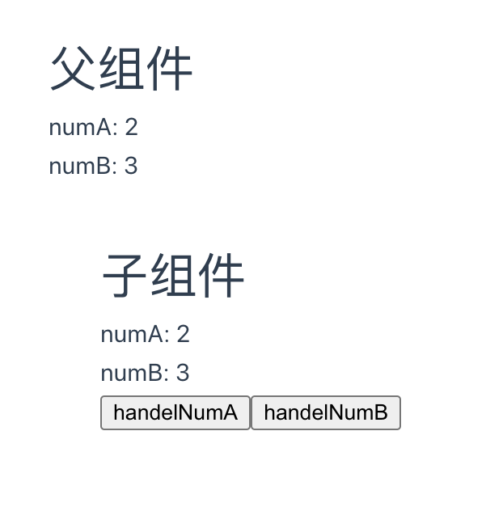
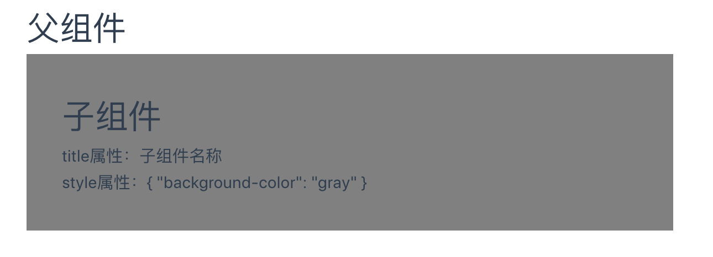
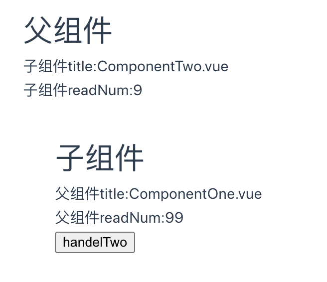
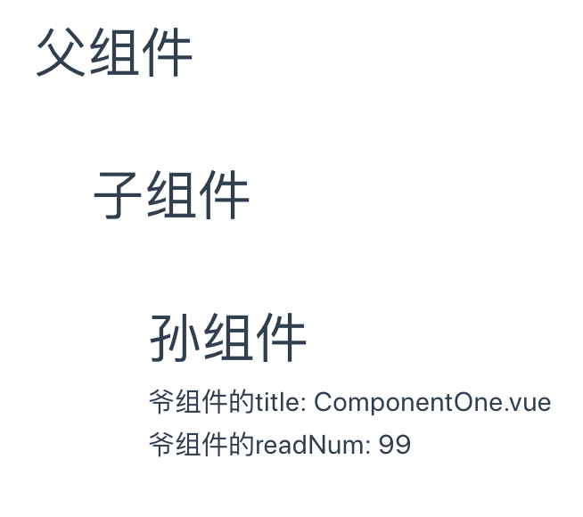
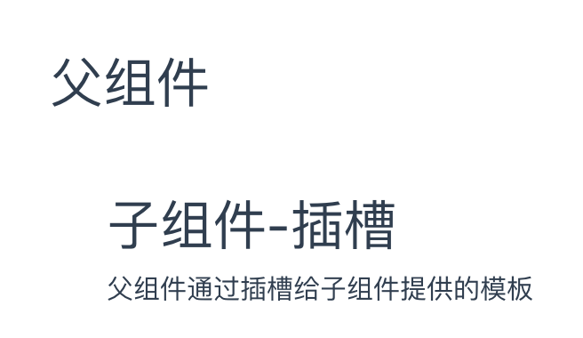
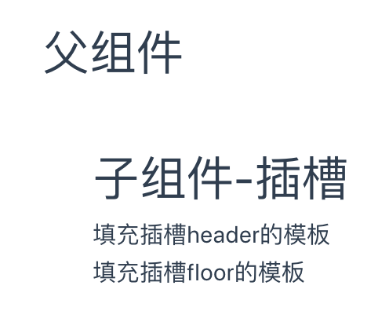
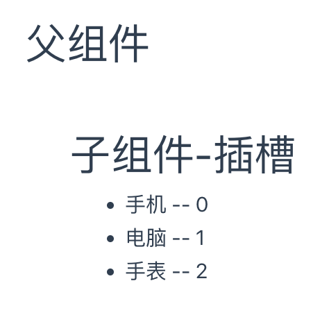

## 模板语法和指令

### 模板插值语法

在`script`标签中声明变量或常量可以直接在`template`中使用，并可以使用运算和操作API

示例：
```vue
<script setup lang="ts">
// 声明字符串类型: content
const content:string = "hello vue3"

//声明number类型: age
const age:number = 18
</script>

<template>
<!-- 文本插值 -->
{{ content }}

<br>

<!-- 条件运算 -->
{{ age < 18 ? "未成年" : "成年" }}

<br>

<!-- 数学运算 -->
{{ age + 1 }}

<br>

<!-- 操作API -->
{{ content.split(' ') }}
</template>

<style scoped>

</style>
```

输出结果：
```
hello vue3
成年
19
[ "hello", "vue3" ]
```

### 指令

- v-text: 用来显示文本
- v-html: 用来展示富文本
- v-if: 条件控制；结合v-else-if、v-else等使用
- v-show: 用来控制元素的显示隐藏
- v-on: 添加事件， 简写`@`
- v-bind: 绑定元素属性attr, 简写`:`
- v-model: 双向绑定
- v-for: 循环遍历
- v-once: 性能优化，只渲染一次
- v-memo: 性能优化，会有缓存

## 响应式基础ref和reactive

### ref

- 在组合式API中，推荐使用`ref()`函数来声明响应式状态
- `ref()`接收参数，并将其包裹在一个带有`.value`属性的`ref`对象中返回
- `ref`会根据初始化的值推导其类型

> `ref()`让我们能创造一种对任意值的 “引用”，并能够在不丢失响应性的前提下传递这些引用。

```js
// 引入ref
import { ref } from 'vue'

// 使用ref()来声明
const content = ref('hello vue3')

//打印结果
console.log(content.value)  //结果为：hello vue3

//修改content值
content.value = "use vue3"

//打印结果
console.log(content.value)  //结果为：use vue3

//值的类型可以是对象
const objRef = ref({age: 18})

console.log(objRef.value)
```

### reactive

- 可以用`reactive()`创建一个响应式对象或数组
- 响应式对象其实是`JavaScript Proxy`，其行为表现与一般对象相似。不同之处在于`Vue`能够跟踪对响应式对象属性的访问与更改操作
- `reactive()`也会隐式地从它的参数中推导类型

```js
// 引入ref
import { reactive } from 'vue'

//声明
const state = reactive({ count: 0 })

//打印
console.log(state.count)
```

局限性：

- 有限的值类型：它只能用于对象类型 (对象、数组和如 Map、Set 这样的集合类型)。它不能持有如 string、number 或 boolean 这样的原始类型。
- 不能替换整个对象：由于 Vue 的响应式跟踪是通过属性访问实现的，因此我们必须始终保持对响应式对象的相同引用。这意味着我们不能轻易地“替换”响应式对象，因为这样的话与第一个引用的响应性连接将丢失
- 对解构操作不友好：当我们将响应式对象的原始类型属性解构为本地变量时，或者将该属性传递给函数时，我们将丢失响应性连接

由于这些限制，我们建议使用`ref()`作为声明响应式状态的主要API。

## 响应式API

- isRef(): 检查某个值是否为`ref`
- unref(): 如果参数是`ref`，则返回内部值，否则返回参数本身。这是`val = isRef(val) ? val.value : val`计算的一个语法糖
- toRef(): 可以将值、refs 或 getters 规范化为 refs；也可以基于响应式对象上的一个属性，创建一个对应的 ref。这样创建的 ref 与其源属性保持同步：改变源属性的值将更新 ref 的值，反之亦然
  ```js
  const state = reactive({
    foo: 1,
    bar: 2
  })

  // 双向 ref，会与源属性同步
  const fooRef = toRef(state, 'foo')

  // 更改该 ref 会更新源属性
  fooRef.value++
  console.log(state.foo) // 2

  // 更改源属性也会更新该 ref
  state.foo++
  console.log(fooRef.value) // 3
  ```

  请注意，这不同于：
  ```js
  const fooRef = ref(state.foo)
  ```
  上面这个 ref 不会和 state.foo 保持同步，因为这个 ref() 接收到的是一个纯数值

  toRef() 这个函数在你想把一个 prop 的 ref 传递给一个组合式函数时会很有用：
  ```js
  <script setup>
  import { toRef } from 'vue'

  const props = defineProps(/* ... */)

  // 将 `props.foo` 转换为 ref，然后传入
  // 一个组合式函数
  useSomeFeature(toRef(props, 'foo'))

  // getter 语法——推荐在 3.3+ 版本使用
  useSomeFeature(toRef(() => props.foo))
  </script>
  ```
- toValue(): 将值、refs 或 getters 规范化为值。这与 unref() 类似，不同的是此函数也会规范化 getter 函数。如果参数是一个 getter，它将会被调用并且返回它的返回值
  ```js
  toValue(1) //       --> 1
  toValue(ref(1)) //  --> 1
  toValue(() => 1) // --> 1
  ```
- toRefs(): 将一个响应式对象转换为一个普通对象，这个普通对象的每个属性都是指向源对象相应属性的 ref。每个单独的 ref 都是使用 toRef() 创建的
  ```js
  const state = reactive({
    foo: 1,
    bar: 2
  })

  const stateAsRefs = toRefs(state)
  /*
  stateAsRefs 的类型：{
    foo: Ref<number>,
    bar: Ref<number>
  }
  */

  // 这个 ref 和源属性已经“链接上了”
  state.foo++
  console.log(stateAsRefs.foo.value) // 2

  stateAsRefs.foo.value++
  console.log(state.foo) // 3
  ```

  当从组合式函数中返回响应式对象时，toRefs 相当有用。使用它，消费者组件可以解构/展开返回的对象而不会失去响应性:
  ```js
  function useFeatureX() {
    const state = reactive({
      foo: 1,
      bar: 2
    })

    // ...基于状态的操作逻辑

    // 在返回时都转为 ref
    return toRefs(state)
  }

  // 可以解构而不会失去响应性
  const { foo, bar } = useFeatureX()
  ```
  toRefs 在调用时只会为源对象上可以枚举的属性创建 ref。如果要为可能还不存在的属性创建 ref，请改用 toRef
- isProxy(): 检查一个对象是否是由 reactive()、readonly()、shallowReactive() 或 shallowReadonly() 创建的代理
- isReactive(): 检查一个对象是否是由 reactive() 或 shallowReactive() 创建的代理。
- isReadonly(): 检查传入的值是否为只读对象。只读对象的属性可以更改，但他们不能通过传入的对象直接赋值。

## 计算属性

`computed` 表示计算属性，通常的作用是用来进行数据处理，方便在末班中简化书写

计算属性可以帮我们将数据转换成需要展示的数据格式，不必在模板中编写大量的表达式进行处理。

示例：
```vue
<script setup>
// 引入computed
import { computed, ref } from 'vue'

const num1 = ref('')
const num2 = ref('')
//使用计算属性，计算num1+num2
const sum = computed(() => {
  return Number(num1.value) + Number(num2.value)
})
</script>

<template>
<input v-model="num1"> + 
<input v-model="num2"> =
<input v-model="sum">
</template>
```

计算属性默认是只读的。当你尝试修改一个计算属性时，你会收到一个运行时警告。只在某些特殊场景中你可能才需要用到“可写”的属性，你可以通过同时提供 getter 和 setter 来创建:
```vue
<script setup>
// 引入computed
import { computed, ref } from 'vue'

const num1 = ref('')
const num2 = ref('')
//使用计算属性，计算num1+num2
const sum = computed({
  get() {
    return Number(num1.value) + Number(num2.value)
  },
  set(value) {
    //计算属性被修改为0时，重置num1和num2
    if (value == 0) {
      num1.value = ''
      num2.value = ''
    }
  }
})
function initNum() {
  //修改计算属性
  sum.value = 0
}
</script>

<template>
<input v-model="num1"> + 
<input v-model="num2"> =
<input v-model="sum">
<button @click="initNum()">初始化</button>
</template>
```

> 注意：computed属性是计算属性，它的值会根据它所依赖的属性动态计算出来，并且计算结果会被缓存起来，只有当依赖的属性发生变化时才会重新计算。因此，computed属性必须是同步的，否则无法保证计算结果的正确性和稳定性

## 事件

> https://cn.vuejs.org/guide/essentials/event-handling.html#event-modifiers

## 监听器

### 概念

在Vue3中，watch特性进行了一些改变和优化。与computed不同，watch通常用于监听数据的变化，并执行一些副作用，例如发送网络请求、更新DOM等。本文将介绍Vue3中watch特性

语法：
```
watch(source, callback, options?)
```

- source: 表示要监听的数据，可以是一个响应式的数据对象，一个计算属性或一个方法的返回值
- callback: 回调函数
- options: 配置选项，例如：immediate、deep、flush

### 监听ref

监听单个ref的值

```vue
<script setup>
//引入
import { ref,watch } from 'vue'

const account = ref('')

//监听account
watch(account, (newVal, oldVal) => {
  console.log(newVal, oldVal)
})
</script>

<template>
账号：<input v-model="account" type="text">
</template>
```

监听多个ref的值

```vue
<script setup>
//引入
import { ref,watch } from 'vue'

const account = ref('')
const password = ref('')

//监听account
watch([account, password], (newVal, oldVal) => {
  console.log(newVal, oldVal)
})
</script>

<template>
账号：<input v-model="account" type="text">
<br>
密码：<input v-model="password" type="password">
</template>
```

### 深度监听

- 如果用ref实现深层次对象的响应式，侦听的时候需要开启深度侦听
- 用reactive实现响应式，开启deep和不开启deep效果是一样的

> 注意：此处监听的新值和旧值相同，主要是因为新旧值引用地址是相同的，此处可采取computed计算属性先实现深拷贝

```vue
<script setup>
//引入
import { reactive,watch,ref,computed } from 'vue'

const obj = reactive({
  form: {
    user: {
      account: ''
    }
  }
})

//注意：此处监听的新值和旧值相同，主要是因为新旧值引用地址是相同的，此处可采取computed计算属性先实现深拷贝
let objCopy = reactive({})
objCopy = computed(() => {
  return JSON.parse(JSON.stringify(obj))
})

//监听account
watch(objCopy, (newVal, oldVal) => {
  console.log(newVal, oldVal)
}, {
  // deep: true  // 深度侦听, 监听ref创建的响应式对象必须开启
})
</script>

<template>
账号：<input v-model="obj.form.user.account" type="text">
</template>
```

> 深度侦听需要遍历被侦听对象中的所有嵌套的属性，当用于大型数据结构时，开销很大。因此请只在必要时才使用它，并且要留意性能。

### 监听reactive响应式对象单一属性

监听reactive响应式对象单一属性，采用回调函数的形式

```vue
<script setup>
//引入
import { reactive,watch } from 'vue'

const obj = reactive({
  form: {
    user: {
      account: ''
    }
  }
})

//监听account
watch(() => obj.form.user.account, (newVal, oldVal) => {
  console.log(newVal, oldVal)
})
</script>

<template>
账号：<input v-model="obj.form.user.account" type="text">
</template>
```

### immediate

watch 默认是懒执行的：仅当数据源变化时，才会执行回调。但在某些场景中，我们希望在创建侦听器时，立即执行一遍回调

```vue
<script setup>
//引入
import { ref,watch } from 'vue'

const account = ref('')

//监听account
watch(account, (newVal, oldVal) => {
  account.value = 'account'
}, {
  immediate: true
})
</script>

<template>
账号：<input v-model="account" type="text">
</template>
```

### watchEffect

它会监听引用数据类型的所有属性，不需要具体到某个属性，一旦运行就会立即监听，组件卸载的时候会停止监听

```vue
<script setup>
import { ref, watchEffect } from 'vue'

const state = ref(0)
const message = ref("")
//页面进入立即触发监听器
watchEffect(() => {
  //凡是写在这里的数据，只要发生改变都会触发这里的代码
  console.log('state:', state.value);
  console.log('message:', message.value);
})
</script>

<template>
<input v-model="state" type="text">
<input v-model="message" type="text">
</template>
```

### flush

flush选项可以用于指定watch的回调函数在何时执行。例如：
- sync：同步模式下执行
- pre：在数据变化之前执行回调函数
- post：在数据变化之后执行回调函数，但是需要等待所有依赖项都更新后才执行

flush默认是pre，主要区别在于侦听器的更新时间，一般会选择使用post 在组件更新后执行。这时候dom都已经更新完成了

```vue
<script setup>
import { ref, watchEffect } from 'vue'

const state = ref(0)
const message = ref("")
//页面进入立即触发监听器
watchEffect(() => {
  let messageEle = document.querySelector('#message_input')
  //当为pre和sync时结果都为null, post时方能拿到dom
  console.log(messageEle) 
}, {
  flush: 'post'
})
</script>

<template>
<input v-model="state" type="text" id="state_input">
<input v-model="message" type="text" id="message_input">
</template>
```

### 停止监听器

```vue
<script setup>
import { ref, watchEffect } from 'vue'

const state = ref(0)
const unwatch = watchEffect(() => {
  console.log(state.value)
}, {
  flush: 'post'
})

//3秒后停止监听
setTimeout(() => {
  unwatch()
}, 3000)

</script>

<template>
<input v-model="state" type="text" id="state_input">
</template>
```

## 组件通信

### porps(父传子)

实现父子组件通信，子组件接收的数据为只读

父组件`ComponentOne`:

```vue
<script setup>
import { reactive } from 'vue'
import ComponentTwo from './ComponentTwo.vue'

const info = reactive({
  title: "ComponentOne",
  readNum: 99
})
</script>

<template>
<div id='app'>
  <h1>父组件</h1>
  <!-- 传递数据给子组件 -->
  <ComponentTwo :title="info.title" :readNum="info.readNum"/>
</div>
</template>
```

子组件`ComponentTwo`:

```vue
<script setup>
import { reactive } from 'vue'
//props:实现父子组件通信，接收的数据为只读
const props = defineProps({
  title: String,
  readNum: Number
})

console.log(props)
</script>

<template>
<div id='app'>
  <h1>子组件</h1>
  <div>父组件title: {{ props.title }}</div>
  <div>父组件readNum: {{ props.readNum }}</div>
</div>
</template>
```

结果：



### emit(子传父)

子组件通过一个事件去触发传值

父组件`ComponentOne`:

```vue
<script setup>
import { ref } from 'vue'
import ComponentTwo from './ComponentTwo.vue'

const title = ref('')
const readNum = ref(0)
//接收子组件发送过来的消息并处理
const eventFn = (info) => {
  title.value = info.title
  readNum.value = info.readNum
}
</script>

<template>
<div id='app'>
  <h1>父组件</h1>
  <div>子组件title: {{ title }}</div>
  <div>子组件readNum: {{ readNum }}</div>
  <!-- 接收 -->
  <ComponentTwo @event="eventFn"/>
</div>
</template>
```

子组件`ComponentTwo`:

```vue
<script setup>
import { reactive } from 'vue'

//子组件信息
const info = reactive({
  title: "ComponentTwo",
  readNum: 10
})

//定义emit
const emit = defineEmits(['event'])
//定义发送信息的操作方法
const handle = () => {
  emit('event', info)
}
</script>

<template>
<div id='app'>
  <h1>子组件</h1>
  <!-- 发送信息给父组件按钮 -->
  <button @click="handle">子组件按钮</button>
</div>
</template>
```

结果：



### v-model(父子组件数据同步)

父组件`ComponentOne`:

```vue
<script setup>
import { ref } from 'vue'
import ComponentTwo from './ComponentTwo.vue'

const numA = ref(0)
const numB = ref(0)
</script>

<template>
<div id='app'>
  <h1>父组件</h1>
  <div>numA: {{ numA }}</div>
  <div>numB: {{ numB }}</div>
  <!-- 就相当于传了两个props 而且相当于给子组件绑了两个自定义事件update:num和update:num1 -->
  <ComponentTwo v-model:numA="numA" v-model:numB="numB"/>
</div>
</template>
```

子组件`ComponentTwo`:

```vue
<script setup>
//props接收
const props = defineProps(['numA', 'numB'])
//定义emit
const emit = defineEmits(['update:numA', 'update:numB'])

const handelNumA = () => {
  emit('update:numA', props.numA+1)
}

const handelNumB = () => {
  emit('update:numB', props.numB+1)
}
</script>

<template>
<div id='app'>
  <h1>子组件</h1>
  <div>numA: {{ numA }}</div>
  <div>numB: {{ numB }}</div>
  <button @click="handelNumA">handelNumA</button>
  <button @click="handelNumB">handelNumB</button>
</div>
</template>
```

结果：



### useAttrs(获取到组件身上的属性和事件)

 vue3框架提供了一个方法useAttrs方法，可以获取到组件身上的属性和事件

父组件`ComponentOne`:

 ```vue
 <script setup>
import { ref } from 'vue'
import ComponentTwo from './ComponentTwo.vue'
</script>

<template>
<div id='app'>
  <h1>父组件</h1>
  <ComponentTwo type="primary" title="子组件名称" style="background-color: gray;" />
</div>
</template>
 ```

 子组件`ComponentTwo`:

 ```vue
 <script setup>
// 引入useAttrs
import { useAttrs } from 'vue'
//获取属性
const attrs = useAttrs()
console.log(attrs)
</script>

<template>
<div id='app'>
  <h1>子组件</h1>
  <div>title属性：{{ attrs.title }}</div>
  <div>style属性：{{ attrs.style }}</div>
</div>
</template>
 ```

结果：



### ref/$parent(父子通信)

- ref：可以获取真实的DOM节点，可以获取子组件实例的VC
- $parent:可以在子组件内部获取到父组件的实例

组件内部的数据对外是关闭的，不能直接访问。需要使用`defineExpose`对外暴露

父组件`ComponentOne`:
```vue
<script setup>
import { ref } from 'vue'
import ComponentTwo from './ComponentTwo.vue'
const info = ref({
  title: 'ComponentOne.vue',
  readNum: 99
})
const twoInfo = ref(null)
//父组件暴露数据
defineExpose({
  info
})
</script>

<template>
<div id='app'>
  <h1>父组件</h1>
  <div>子组件title:{{ twoInfo?.info.title }}</div>
  <div>子组件readNum:{{ twoInfo?.info.readNum }}</div>
  <!-- 父组件通过ref获取子组件数据 -->
  <ComponentTwo ref="twoInfo"/>
</div>
</template>
```

子组件`ComponentTwo`:
```vue
 <script setup>
import { ref } from 'vue'
const info = ref({
  title: 'ComponentTwo.vue',
  readNum: 9
})

//接收并处理获取到父组件信息
const oneTitle = ref()
const oneReadNum = ref()
const handelTwo = ($parent) => {
  oneTitle.value = $parent.info.title
  oneReadNum.value = $parent.info.readNum
}
//子组件暴露数据
defineExpose({
  info
})
</script>

<template>
<div id='app'>
  <h1>子组件</h1>
  <div>父组件title:{{ oneTitle }}</div>
  <div>父组件readNum:{{ oneReadNum }}</div>
  <button @click="handelTwo($parent)">handelTwo</button>
</div>
</template>
 ```

结果：



### provide/inject(隔辈传递)

vue3提供provide(提供)与inject(注入)可以实现隔辈组件传递数据 

- `provide()` 函数接收两个参数。第一个参数被称为注入名，可以是一个字符串或是一个 Symbol。后代组件会用注入名来查找期望注入的值。一个组件可以多次调用 provide()，使用不同的注入名，注入不同的依赖值
- 要注入上层组件提供的数据，需使用 inject() 函数

爷组件`ComponentOne`:
```vue
<script setup>
import { ref,provide } from 'vue'
import ComponentTwo from './ComponentTwo.vue'
const info = ref({
  title: 'ComponentOne.vue',
  readNum: 99
})

//提供
//参数一： 注入名
//参数二： 值
provide('oneInfo', info)
</script>

<template>
<div id='app'>
  <h1>父组件</h1>
  <ComponentTwo/>
</div>
</template>
```

子组件`ComponentTwo`:
```vue
<script setup>
import { ref } from 'vue'
import ComponentThree from './ComponentThree.vue'
</script>

<template>
<div id='app'>
  <h1>子组件</h1>
  <ComponentThree />
</div>
</template>
```

孙组件`ComponentThree`:
```vue
<script setup>
import { ref,inject } from 'vue'

//注入
const oneInfo = inject('oneInfo')
</script>

<template>
<div id='app'>
  <h1>孙组件</h1>
  <div>爷组件的title: {{ oneInfo.title }}</div>
  <div>爷组件的readNum: {{ oneInfo.readNum }}</div>
</div>
</template>
```
结果：



### slot

在某些场景中，我们可能想要为子组件传递一些模板片段，让子组件在它们的组件中渲染这些片段

#### 默认插槽

在外部没有提供任何内容的情况下，可以为插槽指定默认内容

父组件`ComponentOne`:
```vue
<script setup>
import ComponentTwo from './ComponentTwo.vue'
</script>

<template>
<div id='app'>
  <h1>父组件</h1>
  <ComponentTwo>
    <div>父组件通过插槽给子组件提供的模板</div>
  </ComponentTwo>
</div>
</template>
```

子组件`ComponentTwo`:
```vue
<script setup>

</script>

<template>
<div id='app'>
  <h1>子组件-插槽</h1>
  <slot></slot>
</div>
</template>
```

结果：




#### 具名插槽

有时在一个组件中包含多个插槽出口

- v-slot: 用于声明具名插槽或是期望接收 props 的作用域插槽； 缩写`#`


父组件`ComponentOne`:
```vue
<script setup>
import ComponentTwo from './ComponentTwo.vue'
</script>

<template>
<div id='app'>
  <h1>父组件</h1>
  <ComponentTwo>
    <!-- v-slot -->
    <template v-slot:header>
      填充插槽header的模板<br>
    </template>
    <!-- v-slot缩写 -->
    <template #floor>
      填充插槽floor的模板
    </template>
  </ComponentTwo>
</div>
</template>
```

子组件`ComponentTwo`:
```vue
<script setup>

</script>

<template>
<div id='app'>
  <h1>子组件-插槽</h1>
  <slot name="header"></slot>
  <slot name="floor"></slot>
</div>
</template>
```

结果：



#### 作用域插槽

可以传递数据的插槽。子组件可以将数据回传给父组件，父组件可以决定这些回传数据是以何种结构或者外观在子组件内部去展示

父组件`ComponentOne`:
```vue
<script setup>
import {ref} from 'vue'
import ComponentTwo from './ComponentTwo.vue'

const list = ref([
  {id: 1, name: '手机'},
  {id: 2, name: '电脑'},
  {id: 3, name: '手表'},
])
</script>

<template>
<div id='app'>
  <h1>父组件</h1>
  <!-- 通过props传递数据到子组件 -->
  <ComponentTwo :list="list">
    <!-- 解构子组件回传的数据 -->
    <template v-slot="{data, index}">
    {{ data.name }} -- {{ index }}
    </template>
  </ComponentTwo>
</div>
</template>
```

子组件`ComponentTwo`:
```vue
<script setup>
// props接收
defineProps([
  'list'
])
</script>

<template>
<div id='app'>
  <h1>子组件-插槽</h1>
  <ul>
    <li v-for="(item,index) in list" :key="item.id">
      <!-- 回传数据 -->
      <slot :data="item" :index="index"></slot>
    </li>
  </ul>
</div>
</template>
```

结果：



### pinia(任意组件之间通信)

> 详细：[Pinia](/note/vue3.md?id=Pinia)

## Pinia

### 安装

```shell
yarn add pinia
# 或者使用 npm
npm install pinia
```

### 基本使用

在`main.js`中, 创建根存储:

```js
import { createPinia } from 'pinia'
app.use(createPinia())
```

创建`store`, `store`实例相当于一个容器，里面存放的有类似于data，计算属性，方法之类的东西。通过`defineStore()`方法定义

`src/store/user.js`
```js
import { defineStore } from 'pinia'

// useStore 可以是 useUser、useCart 之类的任何东西
// 第一个参数是应用程序中 store 的唯一 id
export const useStore = defineStore('main', {
  // other options...
})
```

使用`store`

```js
import { useStore } from '@/store/user.js'
const store = useStore()
console.log(store)
```

### state

用来存放各种数据变量


`src/store/user.js`
```js
import { defineStore } from 'pinia'

export const useStore = defineStore('main', {
  //用来存放各种变量
  //所有这些属性都将自动推断出它们的类型
  state: () => ({
    name: 'jack',
    age: 18,
    hobby: [
      {id: 1, name: "羽毛球"},
      {id: 2, name: "游戏"},
      {id: 3, name: "音乐"},
    ]
  })
})
```

调用：
```vue
<script setup>
import { useStore } from '@/store/user.js'
const store = useStore()

// 在setup中调用
console.log(store.name)
console.log(store.age)
</script>

<template>
<ul>
  <!-- 在模板中调用 -->
  <li v-for="(item, index) in store.hobby" :key="item.id">
    <div>id: {{ item.id }} -- 爱好：{{ item.name }}</div>
  </li>
</ul>
</template>
```

### getters

getter相当于store的计算属性，即对state中数据加工处理后，进行返回使用

在`getters`中使用`state`数据，可以用`state`或者`this`
```js
getters: {
  //调用state中的数据 (第一个参数就是state  或者 使用this关键字)
  isAdult(state) {
    return state.age < 18 ? "未成年" : "成年"
    //这里的this就是store实例
    // return this.age < 18 ? "未成年" : "成年"
  }
}
```

向`getters`中传递参数
```js
getters: {
  //通过id获取爱好
  getHobbyById(state) {
    return function (id) {
      let item = state.hobby.find(item => item.id === id)
      return item
    }
  }
}
```

调用其他store中的state, 通过引入其他store使用即可，以下的`getters`中`getRole`为示例：

`src/store/user.js`
```js
import { defineStore } from 'pinia'
import useRole from '@/store/role.js'

export const useStore = defineStore('main', {
  //用来存放各种变量
  //所有这些属性都将自动推断出它们的类型
  state: () => ({
    name: 'jack',
    age: 18,
    hobby: [
      {id: 1, name: "羽毛球"},
      {id: 2, name: "游戏"},
      {id: 3, name: "音乐"},
    ]
  }),
  getters: {
    //调用state中的数据 (第一个参数就是state  或者 使用this关键字)
    isAdult(state) {
      return state.age < 18 ? "未成年" : "成年"
      //这里的this就是store实例
      //return this.age < 18 ? "未成年" : "成年"
    },
    //通过id获取爱好
    getHobbyById(state) {
      return function (id) {
        let item = state.hobby.find(item => item.id === id)
        return item
      }
    },
    //调用其他store中的state
    getRole(state) {
      let roleStore = useRole()
      return state.name + '拥有权限:' + roleStore.role
    }
  }
})
```

`src/store/role.js`
```js
import { defineStore } from 'pinia'

const useRole = defineStore('role', {
  //用来存放各种变量
  //所有这些属性都将自动推断出它们的类型
  state: () => ({
    role: "增删改查",
  }),
})

export default useRole
```

调用：
```vue
<script setup>
import { useStore } from '@/store/user.js'
const store = useStore()
//调用state
console.log(store.name)
console.log(store.age)
//调用getters
console.log(store.isAdult)
console.log(store.getHobbyById(1))
console.log(store.getRole)
</script>

<template>
<ul>
  <li v-for="(item, index) in store.hobby" :key="item.id">
    <div>id: {{ item.id }} -- 爱好：{{ item.name }}</div>
  </li>
</ul>
</template>
```

### actions

存放各种方法，也可以在方法中发送异步请求

示例：
```js
import { defineStore } from 'pinia'

export const useStore = defineStore('user1', {
  state: () => ({
    count: 0
  }),
  actions: {
    increment() {
      this.count++
    }
  }
})
```

调用
```vue
<script setup>
import { useStore } from '@/store/user.js'
let store = useStore()
console.log(store.count)
</script>

<template>
<div>
  <div>{{ store.count }}</div>
  <button @click="store.increment">+1</button>
</div>
</template>
```

### 常用API

- storeToRefs: 直接解构出来的state中变量不支持响应式，这里需要借助vue的toRefs 或者 pinia的storeToRefs实现解构后的响应式
- $patch: 修改state中的值时，可以直接修改 或者 调用`$patch`方法，可以同时修改多个对象
- $reset: 调用$reset方法，可以将state中的数据重置为初始化的状态
- $state: `$state`属性设置为新对象来替换 Store 的整个状态 

## 强制使用pnpm包管理器工具

团队开发项目的时候，需要统一包管理器工具,因为不同包管理器工具下载同一个依赖,可能版本不一样,
导致项目出现bug问题,因此包管理器工具需要统一管理！！！
在根目录创建`scritps/preinstall.js`文件，添加下面的内容
```js
if (!/pnpm/.test(process.env.npm_execpath || '')) {
  console.warn(
    `\u001b[33mThis repository must using pnpm as the package manager ` +
    ` for scripts to work properly.\u001b[39m\n`,
  )
  process.exit(1)
}
```

配置命令`package.json`
```json
"scripts": {
    "preinstall": "node ./scripts/preinstall.js"
}
```

> 当我们使用npm或者yarn来安装包的时候，就会报错了。原理就是在install的时候会触发preinstall（npm提供的生命周期钩子）这个文件里面的代码。

<!-- 解惑： -->
<!-- https://blog.csdn.net/Frank_colo/article/details/131051364 -->

<!-- svg的使用和组件封装 -->
<!-- scss -->
<!--  -->